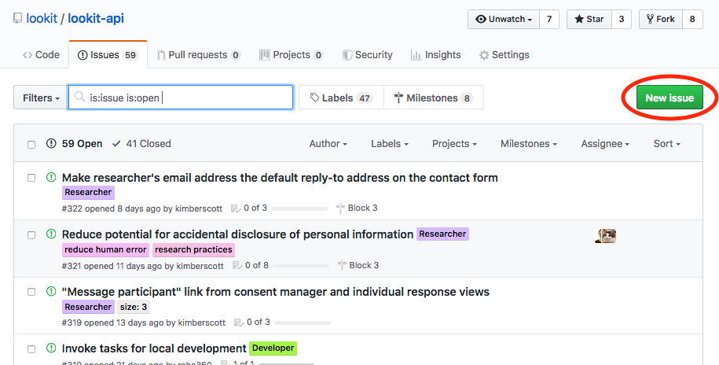
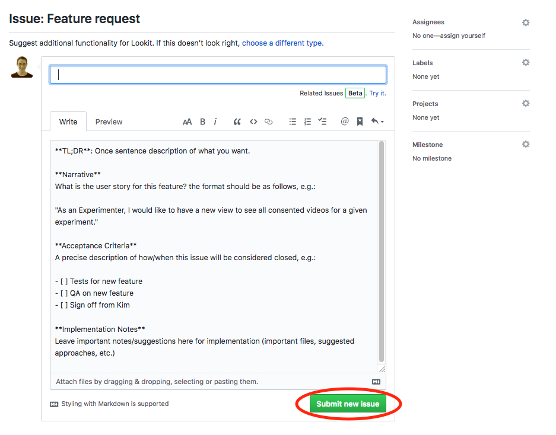

.. _github_issues:

==================================
Using Github issues
==================================

We use Github Issues to plan CHS development. This is a central tool where we keep information about known bugs, planned new features, and what's going to be addressed when.

.. image:: _static/img/tutorial/issues_tab.png
    :alt: See all issues on GitHub

If you report a problem or mention an idea you have to improve CHS through some other channel, we will probably ask that you make a Github issue so we can keep track of your idea and get feedback from any other researchers affected.

To request a feature or report a bug, first search the existing issues to see if your idea is already there.

.. image:: _static/img/tutorial/search_issues.png
    :alt: Search issues on GitHub

Depending on the type of problem you are encountering or idea you have, you will want to check in one of the following repositories or "repos":

- `lookit-api <https://github.com/lookit/lookit-api/issues>`_ is the repo for the CHS site: issues with anything to do with participant login or data, how current and past studies are displayed to participants, how you view data and manage your studies

- `ember-lookit-frameplayer <https://github.com/lookit/ember-lookit-frameplayer/issues>`_ is the repo for the Lookit experiment runner: issues with how particular frames behave, frames you'd find useful, counterbalancing/condition assignment, etc.

- `lookit-jspsych <https://github.com/lookit/lookit-jspsych/issues>`_ is the repo for the jsPsych experiment runner.

- `lookit-docs <https://github.com/lookit/lookit-docs>`_ is the repo for the documentation: anything about the docs you're reading now!

If you find a relevant issue already exists, please comment on it or add a thumbs-up reaction so CHS staff know there's more interest! If not, click the green "New issue" button at the top right.

    
You may need to select an issue type. Choose the type that's closest to what you want to describe - probably "bug report" or "feature request":
    
.. image:: _static/img/tutorial/issue_types.png
    :alt: Select issue type on GitHub

If you had to select an issue type, you'll now have a template to fill in with information. If you're not using a template, try to give a clear one-sentence summary of the problem or requested feature/change, followed by any details needed to reproduce the problem or understand the proposed change. Then click the green "Submit new issue" button to create your issue. 

    
Your issue will now have a number assigned to it and will be listed in the issue list you looked at earlier:

.. image:: _static/img/tutorial/issue.png
    :alt: Issue on GitHub
    
CHS staff may respond to ask for further information, schedule it for future development, and/or wait for community feedback about the idea to gauge demand.
