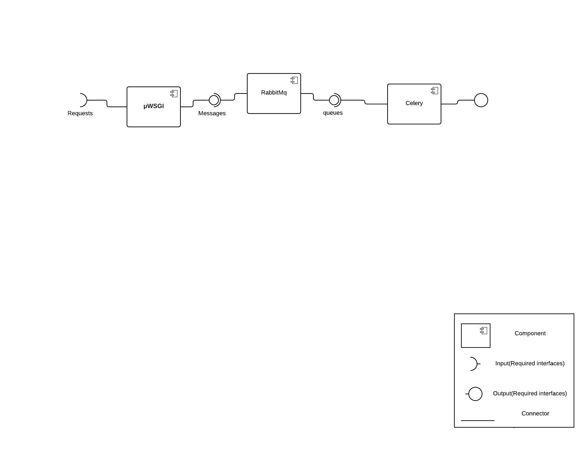
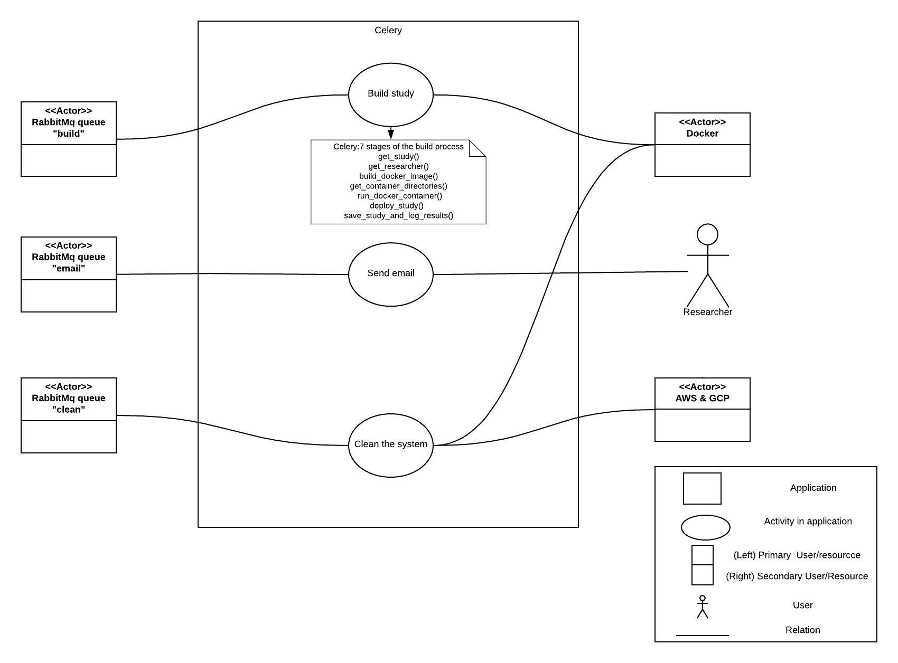
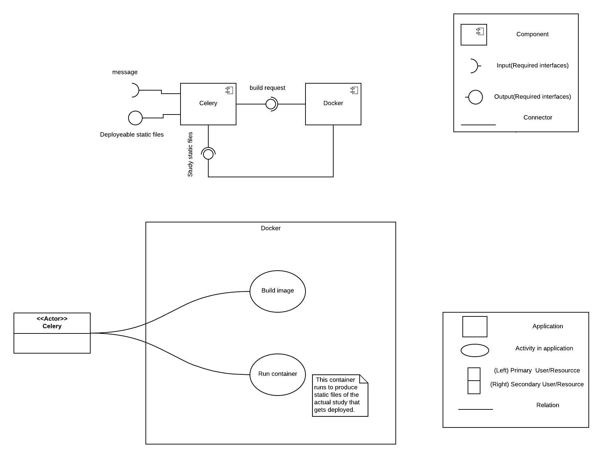
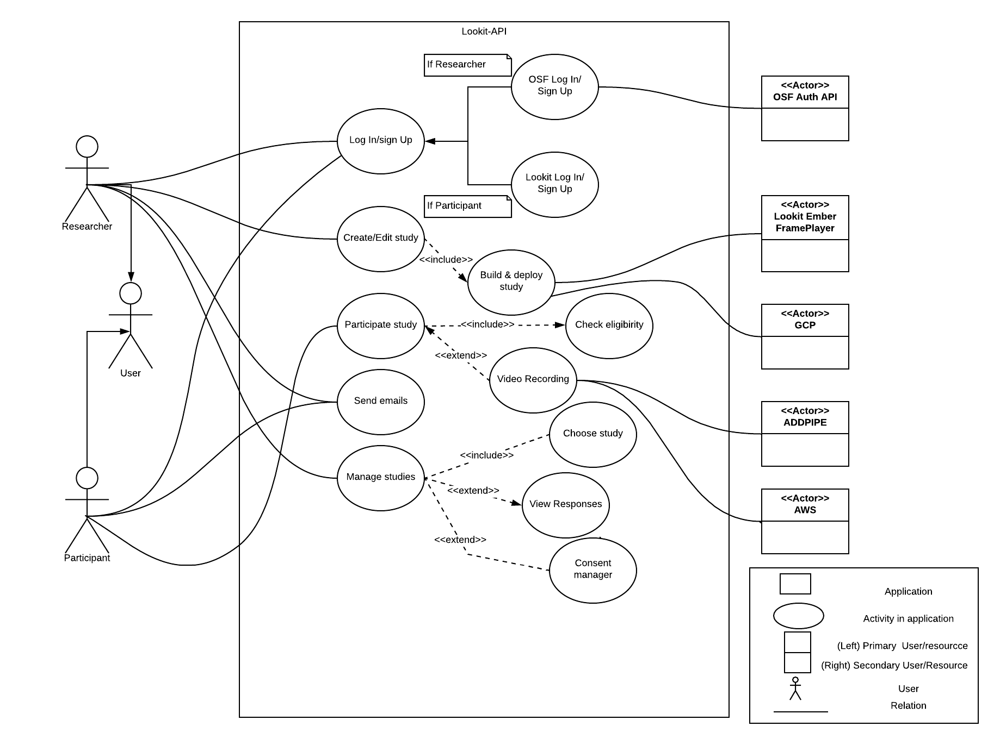

Installation: lookit-api (Django project)
=========================================

``lookit-api`` is the codebase for Experimenter and Lookit, excluding the actual
studies themselves. Any functionality you see as a researcher or a
participant (e.g., signing up, adding a child, editing or deploying a
study, downloading data) is part of the ``lookit-api`` repo. The
Experimenter platform is the part of this project for designing and
administering research studies, meant for researchers. The Lookit
platform is participant-facing, where users can signup and take part in
studies. This project is built using Django and PostgreSQL. (The studies
themselves use Ember.js; see Ember portion of codebase,
`ember-lookit-frameplayer <https://github.com/lookit/ember-lookit-frameplayer>`__.),
It was initially developed by the `Center for Open
Science <https://cos.io/>`__.

If you install only the ``lookit-api`` project locally, you will be able
to edit any functionality that does not require actual study
participation. For instance, you could contribute an improvement to how
studies are displayed to participants or create a new CSV format for
downloading data as a researcher.

   Note: These instructions are for Mac OS. Installing on another OS?
   Please consider documenting the exact steps you take and submitting a
   PR to the lookit-api repo to update the documentation!

Prerequisites
~~~~~~~~~~~~~

-  Make sure you have python 3.6: ``$ python --version`` will check the
   version of your current default python installation. If you don’t
   have this, install from https://www.python.org/.
-  Make sure you have ``pip``. ``$ pip --version``
-  Create a virtual environment using python 3.6

   -  One way to do this:
   -  ``$  pip install virtualenv``
   -  ``$ virtualenv -p python3 envname``, *where ``envname`` is the
      name of your virtual environment.*
   -  ``$ source envname/bin/activate`` *Activates your virtual
      environment*

-  Install postgres

   -  make sure you have brew ``$ brew``
   -  ``$ brew install postgresql``
   -  ``$ brew services start postgres`` *Starts up postgres*
   -  ``$ createdb lookit`` *Creates lookit database*

Installation
~~~~~~~~~~~~

-  ``$ git clone https://github.com/lookit/lookit-api.git``
-  ``$ cd lookit-api``
-  ``$ sh up.sh`` *Installs dependencies and run migrations*
-  ``$ python manage.py createsuperuser`` *Creates superuser locally
   (has all user permissions)*
-  ``$ touch project/settings/local.py`` Create a local settings file.
-  Add DEBUG = True to ``local.py`` and save. This is for local
   development only.
-  ``$ python manage.py runserver`` *Starts up server*

Authentication
~~~~~~~~~~~~~~

OAuth authentication to OSF accounts, used for access to Experimenter,
currently does not work when running locally. You can create a local
participant account and log in using that to view participant-facing
functionality, or log in as your superuser at localhost:8000/admin and
then navigate to Experimenter. As your superuser, you can also use the
Admin app to edit other local users - e.g., to make users researchers vs
participants, in particular organizations, etc.

Handling video
~~~~~~~~~~~~~~

This project includes an incoming webhook handler for an event generated
by the Pipe video recording service when video is transferred to our S3
storage. This requires a webhook key for authentication. It can be
generated via our Pipe account and, for local testing, stored in
project/settings/local.py as ``PIPE_WEBHOOK_KEY``. However, Pipe will
continue to use the handler on the production/staging site unless you
edit the settings to send it somewhere else (e.g., using ngrok to send
to localhost for testing).

Common Issues
~~~~~~~~~~~~~

During the installation phase, when running ``sh up.sh``, you may see
the following:

::

   psql: FATAL:  role "postgres" does not exist

To fix, run something like the following from your home directory:

::

   $../../../usr/local/Cellar/postgresql/9.6.3/bin/createuser -s postgres

If your version of postgres is different than 9.6.3, replace with the
correct version above. Running this command should be a one-time thing.

.. raw:: html

   

You might also have issues with the installation of ``pygraphviz``, with
errors like

::

   running install
   Trying pkg-config
   Package libcgraph was not found in the pkg-config search path.
   Perhaps you should add the directory containing `libcgraph.pc'
   to the PKG_CONFIG_PATH environment variable
   No package 'libcgraph' found

or

::

   pygraphviz/graphviz_wrap.c:2954:10: fatal error: 'graphviz/cgraph.h' file not found
   #include "graphviz/cgraph.h"
          ^
   1 error generated.
   error: command 'clang' failed with exit status 1

To fix, try running something like:

::

   $ brew install graphviz
   $ pip install --install-option="--include-path=/usr/local/include" --install-option="--library-path=/usr/local/lib" pygraphviz

Then run ``sh up.sh again.``

Continued Installation for developers
~~~~~~~~~~~~~~~~~~~~~~~~~~~~~~~~~~~~~
If you want to work on the functionality of Lookit, there are a few more installations steps you need to take. More information
about the following programs can be found in the :ref:`Technical_glossary`

Install Docker
--------------

Follow  `these instructions <https://www.digitalocean.com/community/tutorials/how-to-install-and-use-docker-on-ubuntu-18-04>`_.
Make sure you select the proper OS.

Install Postgres
----------------

**For Linux Users**

Before you get started, update your system with this command:

``sudo apt-get update``

Make sure you have python3 and pip installed:

``sudo apt install python3``

``sudo apt install python-pip``

Now, begin to install Postgres:

``sudo apt-get install PostgreSQL PostgreSQL-contrib``

Run the following command. It will take inside the Postgres world.

``sudo -u postgres psql postgres``

Every command now should start with postgres=#

In the postgres world, run the following commands:

``#\password postgres``

You should be prompted to enter a new password. Don’t type anything, just hit enter twice. This should clear the password.

postgres=# ``create database lookit``

postgres=# ``grant all privileges on database lookit to postgres``

If at this point you still do not have access to the lookit database, run the following commands:

``sudo vi /etc/postgresql/10/main/pg_hba.conf``

``pg_ctl reload``

A long document with # on the leftmost side of almost every line should open up. Scroll to the bottom. There will be a
few lines that don’t start with #. They might be a different color and will start with either local or host. The last word
in each of those lines should be trust. If it is not, switch into editing mode ( hit esc then type i and hit enter ) and
change them to say trust. Then, save the file ( hit esc and then type :x before hitting enter ). You should now have access.

Install RabbitMQ
----------------

**For Linux Users**

First, run the following command:

``sudo apt install rabbitmq-server``

Now that rabbitmq server is installed, create an admin user with the following commands:

``sudo rabbitmqctl add_user admin password``

``sudo rabbitmqctl set_user_tags admin administrator``

``sudo rabbitmqctl set_permissions -p / admin ".*" ".*" ".*"``

Make sure that the server is up and running:

``sudo systemctl stop rabbitmq-server.service``

``sudo systemctl start rabbitmq-server.service``

``sudo systemctl enable rabbitmq-server.service``

If you are having problems creating a user or getting the server running, try the following commands:

``sudo rabbitmq-plugins enable rabbitmq_management``

``sudo chown -R rabbitmq:rabbitmq /var/lib/rabbitmq/``

``sudo rabbitmqadmin declare queue --vhost=/ name=email``

``sudo rabbitmqadmin declare queue --vhost=/ name=builds``

``sudo rabbitmqadmin list queues``

When you run the last command, you should see the following ASCII art: ::

    +--------+----------+
    | name  | messages  |
    +--------+----------+
    | builds|     0     |
    | email |     0	|
    +--------+----------+

Install Ngrok
-------------

**For Linux Users**

To install, run this command:

``sudo snap install ngrok``

To connect to your local host run this command:

``ngrok http “[https://localhost:8000](https://localhost:8000)"``

How Do These Programs Work Together?
~~~~~~~~~~~~~~~~~~~~~~~~~~~~~~~~~~~~~~

The following diagrams illustrate how different parts of the API interact with each other. For more information about
these programs, please reference the :ref:`Technical_glossary`

Every time the user makes a request, the request is sent through μWSGI. For certain requests that take more than a few
seconds (e.g., building study dependencies, sending mail, etc.), the WSGI handler defers the work by kicking off a new
celery task. The payload for this task is mediated by the RabbitMQ service. If the request is short enough, HTTP will
handle the request on its own.

Celery is used to build and relay tasks and make Lookit more efficient. Lengthy requests are mediated by RabbitMQ for celery to
complete on the side. The tasks sent to celery are ones that would ruin the user experience if
they backlogged the HTTPs request cycle. Programs like celery are used to keep the request cycle short.

When you want to build a study, celery sends that request to Docker, which groups individual studies into nice containers
for reproducibility of the experiment functionality and protection from later changes to the code. Docker then sends the
study static files back to celery. After building the study, celery sends deployable static files to Google Cloud.

This is a diagram of all interactions possible with the Lookit API. On the rightmost side are all external resources being
used/
