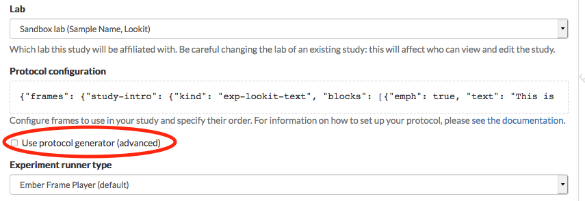
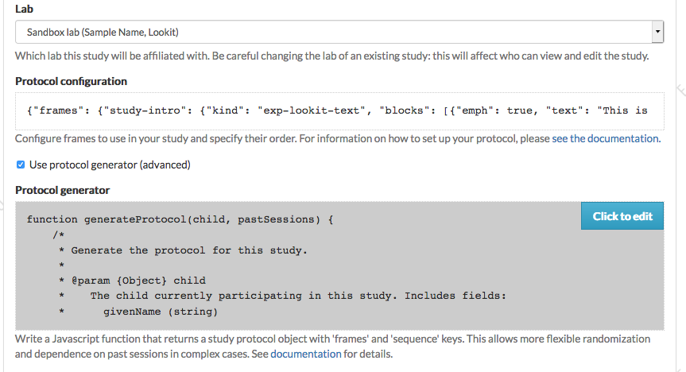
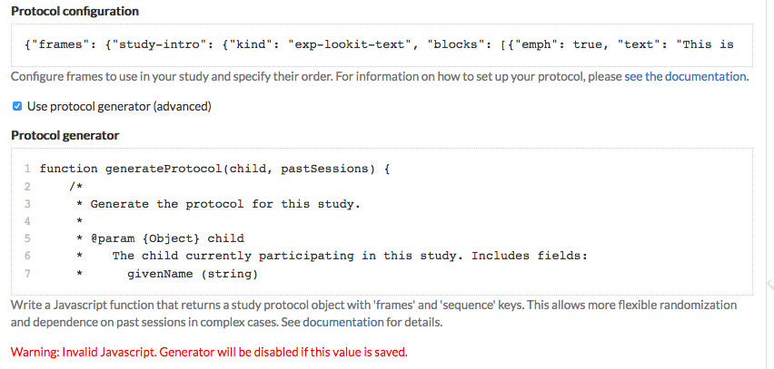
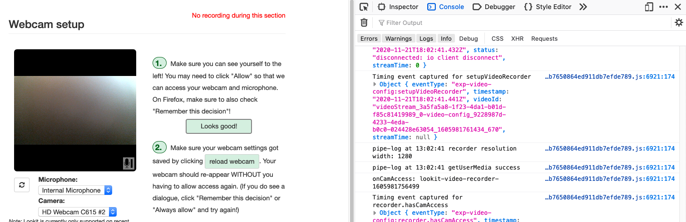

.. _study_protocol:

Protocol specification
===================================

Researchers specify how their Lookit study works by writing a "protocol configuration" for their study. This configuration is written in JSON, which stands for JavaScript Object Notation - this is just a special text format, not code. 

In the configuration, you essentially tell Lookit what sequence of "frames" to use in your study, and set all the options for those frames like what pictures or videos to show and for how long. You can see the available frames in the :ref:`experiment runner docs <elf:index>`.

Experiment structure
--------------------

To define what actually happens in your study, click 'Edit study' from your study detail
page, and scroll down to the 'Protocol configuration' field:

.. image:: _static/img/edit_json.png
    :alt: Build study field on study edit page

Click on this field to bring up the experiment editor view.  Here is where you 
define the structure of your experiment using a JSON document. (Advanced users can choose
to instead provide a :ref:`'protocol generator function'<generators>`, written in Javascript, which *returns* a JSON document to use as the study protocol.)

Studies on Lookit are broken into a set of fundamental units called
**frames**, which can also be thought of as “pages” of the study. A
single experimental trial (e.g. looking time measurement) would
generally be one frame, as are the video consent procedure and exit survey. 
Your study protocol will define a set of ``frames`` and also a ``sequence`` saying the 
order in which to use those frames.

For detailed information about how to specify your study protocol, see the 
:ref:`experiment runner documentation <elf:protocol configuration>`.

.. _add a protocol generator:

How to add a protocol generator function
~~~~~~~~~~~~~~~~~~~~~~~~~~~~~~~~~~~~~~~~~~

Although your study protocol JSON can be configured to handle a wide range of common condition assignment, counterbalancing, and conditional logic schemes, in some cases it may still be more natural to programmatically generate the protocol. For examples and details about how to write a study protocol generator function, see the 
:ref:`experiment runner documentation <elf:generators>`.

On your study edit form, check the "Use protocol generator (advanced)" box to use a protocol generator function in place of your study protocol:

This displays a field where you can edit a protocol generator function. The default generator returns an empty protocol. When you click on this field, you're taken to an editor like the one for the study protocol.

The code you write should define a single function - put any helper functions you need inside.

If your function isn't valid Javascript or doesn't evaluate to a function, you'll see a message that it's invalid, like this:

Your protocol generator will still be saved when you save the study, but the "use protocol generator" box will automatically be unchecked so that your study goes back to relying on the study protocol JSON. If there is an error when the protocol generator actually runs at the start of a session, the experiment runner also falls back to using the study protocol JSON.

How to try out your study as you write it
---------------------------------------------------

When you first create your study, you'll need to click 'Build experiment runner' on your study page and wait 5-10 minutes for your own personal experiment runner to be created. This will "freeze" the version of the experiment runner code used for your study, so that updates to the Lookit experiment runner won't affect how your study works. (You can always update if you want to - see `Updating the frameplayer code <researchers-update-code>`_). You do not need to build the experiment runner again unless you want to update the code it uses.

Once you've built an experiment runner, you can click 'See preview' after saving your study protocol and you will be able to preview your study, exactly as if you were participating with your child. As you write the protocol configuration for your study, you can click 'See preview' again or just refresh the preview window to see how the changes look. 

As you work on a particular frame like a survey, you probably don't want to click through every bit of your study to get to it each time you make a change! You can put the frame of interest at the very start of your study by inserting it at the very start of the 'sequence' you've defined in your protocol. Then when you're satisfied with that frame, just put it back in order. 

Keep your developer tools open!
--------------------------------

Helpful warning and error messages will show up in the web console of your browser's Developer Tools. It's important to have this open while you test things out so you see anything going wrong, and it'll be helpful if you need to figure out why something isn't
working as expected! For example, maybe there's a frame type that isn't defined, or it's trying to load an image that you haven't uploaded yet.

In **Firefox**, open up the web console by clicking the hamburger menu in the top right corner, Web Developer, then Web Console. In **Chrome**, open up the web console by clicking the three vertical dots in the top right corner, More tools, then Developer Tools. You should see something like this:

Finding and using specific frames
------------------------------------

For the most current documentation of individual frames available to
use, please see :ref:`the experiment runner documentation <elf:index>`.

For each frame, you will find an **example** of using it in a JSON
schema; documentation of the **properties** which can be defined in the
schema; a description of the **data** this frame records; and any frame-specific **events** that are recorded and may be included in the eventTimings object sent with the
data.

.. _recording-video:

Recording webcam video
-----------------------

Some frames include functionality to record video from the participant's webcam during some or all of the frame. This will be described in the frame's documentation, including any parameters you can set to turn on/off or otherwise change the behavior of the recording. Recording may start/stop automatically in the background, or the participant may click to start and stop recording or even immediately view their recording. For test trials, the webcam is generally not displayed to the participant while recording, as it would be more interesting than almost all stimuli we could create. 

You also have the option to create multi-frame recordings by starting and stopping recording using the  :ref:`elf:exp-lookit-start-recording` and :ref:`elf:exp-lookit-stop-recording` frames. In between, recording will continue, and all events captured will include the approximate time relative to the start of that video in a `sessionStreamTime`.

.. _typical_study_schema:

.. _debriefing-info:

Example Lookit study outline
------------------------------------------------------------

A typical Lookit study might contain the following frame types:

1.  :ref:`elf:exp-video-config` - This is a standard frame type that almost everyone should just stick at the very start of their study. It requires no customization; we'll maintain troubleshooting directions everyone can share.

2.  :ref:`elf:exp-lookit-video-consent` - A video consent frame. Your study needs to use this frame and it should come before starting the study or doing any other video recording. You need to specify some text fields to use this, regarding study-specific procedures, compensation, etc. These will be inserted into the consent document. If you need to show your IRB exactly what your consent document will look like, enter your text snippets, preview your study, and copy the document (or use the download button to get a PDF). 

3.  :ref:`elf:exp-lookit-text` or :ref:`elf:exp-lookit-instruction-video`. Now we're into optional frames that will vary by study. Most existing studies have started off with either video instructions or a text 'overview' of the study. The shorter this can be, the better - it's the equivalent of "okay, we're ready to get started, we're going to do X, Y, Z!" in the lab. Writing this text, and any instructions, tends to be more time-consuming than researchers expect: in contrast to an in-lab study, you can't easily tune what you say to the individual parent and answer just the questions they bring up. And you don't want to overwhelm them with a wall of text while they try to hold a squirmy baby! **We strongly recommend treating this as a serious writing/design exercise**, and going through a few rounds of 'play-testing' with colleagues/family to make sure everything is as clear and concise as possible. 

4.  :ref:`elf:exp-lookit-stimuli-preview` If you are showing children images/videos and you are going to ask the parents **not** to look at those stimuli, we strongly advise that you provide parents an opportunity to preview all of the stimuli that might be shown so they can decide if they're okay with that. This is both a reasonable courtesy (who knows what unusual phobia a child has, or what image you think is totally innocuous but turns out to offend a particular family for an unanticipated reason) and practical for data quality (parents will be less inclined to peek if they know roughly what's going on).

5.  :ref:`elf:exp-lookit-survey` Perhaps you want to collect some information (here or later on) from the parent that isn't included in the child or demographic data you'll have automatic access to - how much of which languages they speak in the home, motor milestones, whether their child likes Kermit or Oscar better, etc. You can use a survey frame to do that!

6.  :ref:`elf:exp-lookit-instructions` You may want a frame like this to give some final instructions to the parent before your 'test' procedures start! You can show text, videos, audio, show the user's webcam, etc. Make sure you have indicated here or earlier that the family is free to leave at any point and how they can do that. (Ctrl-X, F1, or closing the tab/window but then staying on the page will all bring up a "really exit?" dialog - you don't need to note all methods.) 

7.  :ref:`elf:exp-video-config-quality` Once you're almost ready to start your actual  'test' procedures, you may want to guide the parent through webcam setup optimization, especially if you need the parent and child in a particular position. We provide some default instructions intended for preferential looking but would recommend making your own images/instructions if you can! You can also use the `exp-lookit-webcam-display` frame for   lighter-weight display of the family's webcam so they can check positioning.

8.  [Study-specific frames, e.g. 
    exp-lookit-video, exp-lookit-images-audio; generally, a sequence of these frames
    would be put together with a randomizer. Make sure that if you have the parent turn
    around during the study, you let them know when to turn back around at the end!
    Also consider adding a friendly wrap-up "trial" at the end to give parents a chance
    to see the stimuli with a voiceover walkthrough, actually talk with their child about
    the story, etc.]

9. :ref:`elf:exp-lookit-exit-survey` This is a required frame and should be the last thing  in your study. This is where participants will select a privacy level for their video and indicate whether data can be shared on Databrary. (If you don't have IRB/institutional approval to share on Databrary yet, it's still fine to ask this; worst case you don't share data you had permission to share. Best case it'll smooth the process of asking your IRB retroactively if you want to!) Your participants will also have the option to withdraw video beyond the consent video entirely - this is rare (<1 percent of responses). These video settings are provided at the end, rather than the start, of the study so that parents already know roughly what happened and can better judge how comfortable they are with the video being shared. (E.g., "did my child pick his nose the whole time?")

   The 'debriefing' field of this frame is **very important**! This is a chance to explain the purpose of your study and how the family helped; at this point it's more obvious to the participant that skimming the info is fine if they're not super-interested, so you can elaborate in ways you might have avoided ahead of time in the interest of keeping instructions short. You may want to mention the various conditions kids were assigned to if you didn't before, and try to head off any concerns parents might have about how their child 'did' on the study, especially if there are 'correct' answers that will have been obvious to a parent. It's great if you can link people to a layperson-accessible article on a related topic - e.g., media coverage of one of your previous studies in this research program, a talk on Youtube, a parenting resource. 
    
   If you are compensating participants, restate what the compensation is (and any conditions), and let them know when to expect their payment! E.g.: "To thank you for your participation, we'll be emailing you a $4 Amazon gift card - this should arrive in your inbox within the next week after we confirm your consent video and check that your child is in the age range for this study. (If you don't hear from us by then, feel free to reach out!) If you participate again with another child in the age range, you'll receive one gift card per child."
