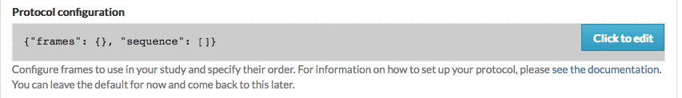

Building your experiment
========================

.. _JSON Overview:

Preliminaries: JSON format
---------------------------

Researchers specify the protocol for a Lookit study by providing a JSON
(JavaScript Object Notation) object on the Experimenter interface, which
is interpreted according to a JSON Schema (http://json-schema.org/)
designed for Lookit studies. A `JSON
schema <http://json-schema.org/examples.html>`__ describes a class of
JSON objects, indicating what type of data to expect and require.

If you are unfamiliar with the JSON format, you may want to spend a
couple minutes reading the introduction here: http://www.json.org/.

No programming is required to design a study: JSON is a simple,
human-readable text format for describing data (see
http://www.json.org/). A JSON object is an unordered set of key – value
pairs, with the following rules

- The object itself is enclosed in curly braces.
- Keys are unique strings enclosed in double quotes.
- A key and value are separated by a colon.
- Key-value pairs are separated by commas.

A JSON value can be any of the following: a string (enclosed in double
quotes), a number, a JSON object (as described above), an array (an
ordered list of JSON values, separated by commas and enclosed by square
brackets), true, false, or null. There are no requirements for specific
formatting of a JSON document (any whitespace not part of a string is
ignored). Here is an example JSON object to illustrate these principles:

.. code:: json

   {
       "name": "Jane",
       "age": 43,
       "favoritefoods": [
           "eggplant",
           "apple",
           "lima beans"
       ],
       "allergies": {
           "peanut": "mild",
           "shellfish": "severe"
       }
   }

The keys are the strings ``name``, ``age``, ``favoritefoods``, and
``allergies``. Favorite foods are stored as an array, or ordered list;
allergies are stored as a JSON object mapping food names to severity of
reaction. The same object could also be written as follows, in a
different order and with none of the formatting:
\`\ ``{"age": 43, "allergies": {"peanut": "mild", "shellfish": "severe"}, "name": "Jane", "favoritefoods": ["eggplant", "apple", lima beans"]}``

A helpful resource to check your JSON Schema for simple errors like
missing or extra commas, unmatched braces, etc. is
`jsonlint <http://jsonlint.com/>`_.

Experiment structure
--------------------

To define what actually happens in your study, click 'Edit study' from your study detail
page, and scroll down to the 'Build study - add JSON' field:



Click on this field to bring up the experiment editor view.  Here is where you 
define the structure of your experiment using a JSON document.

Studies on Lookit are broken into a set of fundamental units called
**frames**, which can also be thought of as “pages” of the study. A
single experimental trial (e.g. looking time measurement) would
generally be one frame, as are the video consent procedure and exit survey. 
Your JSON must have two keys: ``frames`` and
``sequence``. The ``frames`` value defines the frames used in this
study: it must be a JSON object mapping frame nicknames (any unique
strings chosen by the researcher) to frame objects (defined next). The
``sequence`` value must be an ordered list of the frames to use in this
study; values in this list must be frame nicknames from the “frames”
value. 

Here is the JSON for a very minimal Lookit study:

.. code:: json

   {
       "frames": {
           "my-consent-frame": {
               "kind": "exp-video-consent",
               "prompt": "I agree to participate",
               "blocks": [
                   {
                       "title": "About the study",
                       "text": "This isn’t a real study."
                   }
               ]
           },
           "my-exit-survey": {
               "kind": "exp-lookit-exit-survey",
               "debriefing": {
                    "title": "Thank you!",
                    "text": "You participated."
               }
           }
       },
       "sequence": [
           "my-consent-frame",
           "my-exit-survey"
       ]
   }

This JSON specifies a Lookit study with two frames, consent and an exit
survey. Note that the frame nicknames ``my-consent-frame`` and
``my-exit-survey`` that are defined in ``frames`` are also used in the
``sequence``. Frames may be specified but not used in ``sequence``.
Here’s the object associated with the ``my-exit-survey`` frame:

.. code:: json

   {
               "kind": "exp-lookit-exit-survey",
               "debriefing": {
                    "title": "Thank you!",
                    "text": "You participated."
               }
    }

Within each frame object, a ``kind`` must be specified. This determines
the frame type that will be used. Additional data may be included in the
frame object to customize the behavior of the frame, for instance to
specify instruction text or the stimuli to use for a test trial. The
keys that may (or must) be included in a frame object are determined by
the frame type; each frame definition includes a JSON Schema describing
the expected data to be passed. Multiple frames of the same kind may be
included in a study – for instance, test trials using different stimuli.

The separation of frame definitions and sequence allows researchers to
easily and flexibly edit and test study protocols – for instance, the
order of frames may be altered or a particular frame removed for testing
purposes without altering any frame definitions.


Developing your study: how to try it out as you go
---------------------------------------------------

When you first create your study, you'll need to click 'Build preview dependencies' on the study edit page and wait 5-10 minutes for your own special study environment to be created. This will "freeze" the code used for your study so that continuing development and changes to the experiment frame code won't affect how your study works. (You can always update if you want to - see `Editing study type <researchers-using-platform.html#editing-study-type>`_). You do not need to build preview dependencies again unless you want to update the study type.

Once you've built preview dependencies once, you can click 'See preview' after saving your study JSON and you will be taken to a preview version of your study so that you can see what it looks like to a participant! As you write the JSON document for your study, you can click 'See preview' again or just refresh the preview window to see how the changes look. 

If something isn't working as expected, you can try opening up the Javascript console in your web browser (Chrome: three vertical dots -> More tools -> Developer tools; Firefox: hamburger menu -> Web Developer -> Web Console) to see if there is an error message that makes sense - e.g., a frame type that isn't defined, or an attempt to load an image that doesn't exist.

As you work on a particular frame like a survey, you probably don't want to click through every bit of your study to get to it each time you make a change! You can put the frame of interest at the very start of your study by inserting it at the very start of the 'sequence' you've defined in your JSON. Then when you're satisfied with that frame, just put it back in order. 


Finding and using specific frames
---------------------------------

For the most current documentation of individual frames available to
use, please see `the frame documentation <https://lookit.github.io/ember-lookit-frameplayer/>`_.

For each frame, you will find an **example** of using it in a JSON
schema; documentation of the **properties** which can be defined in the
schema; and, under Methods / serializeContent, a description of the
**data** this frame records. Any frame-specific **events** that are
recorded and may be included in the eventTimings object sent with the
data are also described.


.. _typical_study_schema:

A Lookit study schema: general principles and instructions
------------------------------------------------------------

A typical Lookit study might contain the following frame types:

1.  `exp-video-config <https://lookit.github.io/ember-lookit-frameplayer/classes/ExpVideoConfig.html>`_ - This is a standard frame type that almost everyone should just stick at the very start of their study. It requires no customization; we'll maintain troubleshooting directions everyone can share.
2.  `exp-lookit-video-consent <https://lookit.github.io/ember-lookit-frameplayer/classes/ExpLookitVideoConsent.html>`_ - A video consent frame. Your study needs to use this frame and it should come right after video configuration, before getting into the rest of the study. You need to specify some text fields to use this, regarding study-specific procedures, compensation, etc. These will be inserted into the consent document. If you need to show your IRB exactly what your consent document will look like, enter your text snippets, preview your study, and copy the document (or use the download button to get a PDF). 
3.  `exp-lookit-text <https://lookit.github.io/ember-lookit-frameplayer/classes/ExpLookitText.html>`_ Now we're into optional frames that will vary by study. Most existing studies have started off with a text 'overview' of the study using a frame like this. The shorter this can be, the better - it's the equivalent of "okay, we're ready to get started, we're going to do X, Y, Z!" in the lab. Writing this text, and any instructions, tends to be more time-consuming than researchers expect: in contrast to an in-lab study, you can't easily tune what you say to the individual parent and answer just the questions they bring up. And you don't want to overwhelm them with a wall of text while they try to hold a squirmy baby! **We strongly recommend treating this as a serious writing/design exercise**, and going through a few rounds of 'play-testing' with colleagues/family to make sure everything is as clear and concise as possible. 
4.  `exp-lookit-preview-explanation <https://lookit.github.io/ember-lookit-frameplayer/classes/ExpLookitPreviewExplanation.html>`_ If you are showing children images/videos and you are going to ask the parents **not** to look at those stimuli, we strongly advise that you provide parents an opportunity to preview all of the stimuli that might be shown so they can decide if they're okay with that. This is both a reasonable courtesy (who knows what unusual phobia a child has, or what image you think is totally innocuous but turns out to offend a particular family for an unanticipated reason) and practical for data quality (parents will be less inclined to peek if they know roughly what's going on). If you want to show a preview, you'll use an "explanation" frame like this offering the parent an option to preview stimuli, followed immediately by...
5.  `exp-video-preview <https://lookit.github.io/ember-lookit-frameplayer/classes/ExpVideoPreview.html>`_ - the actual video preview frame where you specify a list of videos/images and their captions. 
6.  `exp-lookit-survey <https://lookit.github.io/ember-lookit-frameplayer/classes/ExpLookitSurvey.html>`_ Perhaps you want to collect some information (here or later on) from the parent that isn't included in the child or demographic data you'll have automatic access to - how much of which languages they speak in the home, motor milestones, whether their child likes Kermit or Oscar better, etc. You can use a survey frame to do that!
7.  `exp-video-config-quality <https://lookit.github.io/ember-lookit-frameplayer/classes/ExpVideoConfigQuality.html>`_ Once you're almost ready to start your actual 'test' procedures, you may want to guide the parent through webcam setup optimization, especially if you need the parent and child in a particular position. We provide some default instructions intended for preferential looking but would recommend making your own images/instructions if you can - ours aren't great.
8.  `exp-lookit-instructions <https://lookit.github.io/ember-lookit-frameplayer/classes/ExpLookitInstructions.html>`_ Instead or in addition, you may want a frame like this to give some final instructions to the parent before your 'test' procedures start! You can show text, videos, audio, show the user's webcam, etc. Make sure you have indicated here or earlier that the family is free to leave at any point and how they can do that. (Ctrl-X, F1, or closing the tab/window but then staying on the page will all bring up a "really exit?" dialog - you don't need to note all methods.) 
9.  [Study-specific frames, e.g. 
    exp-lookit-story-page, exp-lookit-preferential-looking,
    exp-lookit-dialogue-page; generally, a sequence of these frames
    would be put together with a randomizer]
.. _debriefing_info:
10. `exp-lookit-exit-survey <https://lookit.github.io/ember-lookit-frameplayer/classes/ExpLookitExitSurvey.html>`_ This is a required frame and should be the last thing in your study. This is where participants will select a privacy level for their video and indicate whether data can be shared on Databrary. (If you don't have IRB/institutional approval to share on Databrary yet, it's still fine to ask this; worst case you don't share data you had permission to share. Best case it'll smooth the process of asking your IRB retroactively if you want to!) Your participants will also have the option to withdraw video beyond the consent video entirely - this is rare (<1 percent of responses). These video settings are provided at the end, rather than the start, of the study so that parents already know roughly what happened and can better judge how comfortable they are with the video being shared. (E.g., "did my child pick his nose the whole time?")

    The 'debriefing' field of this frame is **very important**! This is a chance to explain the purpose of your study and how the family helped; at this point it's more obvious to the participant that skimming the info is fine if they're not super-interested, so you can elaborate in ways you might have avoided ahead of time in the interest of keeping instructions short. You may want to mention the various conditions kids were assigned to if you didn't before, and try to head off any concerns parents might have about how their child 'did' on the study, especially if there are 'correct' answers that will have been obvious to a parent. It's great if you can link people to a layperson-accessible article on a related topic - e.g., media coverage of one of your previous studies in this research program, a talk on Youtube, a parenting resource. 
    
    If you are compensating participants, restate what the compensation is (and any conditions), and let them know when to expect their payment! E.g.: "To thank you for your participation, we'll be emailing you a $4 Amazon gift card - this should arrive in your inbox within the next week after we confirm your consent video and check that your child is in the age range for this study. (If you don't hear from us by then, feel free to reach out!) If you participate again with another child in the age range, you'll receive one gift card per child."


Recording webcam video
-----------------------

Some frames include functionality to record video from the participant's webcam during some or all of the frame. This will be described in the frame's documentation, including any parameters you can set to turn on/off or otherwise change the behavior of the recording. Recording may start/stop automatically in the background, or the participant may click to start and stop recording or even immediately view their recording. For test trials, the webcam is generally not displayed to the participant while recording, as it would be more interesting than almost all stimuli we could create. 

You also have the option to start or stop a multi-frame or 'session-level' recording on **any** frame, by using the `startSessionRecording <https://lookit.github.io/ember-lookit-frameplayer/classes/Exp-frame-base.html#property_startSessionRecording>`_  and `endSessionRecording <https://lookit.github.io/ember-lookit-frameplayer/classes/Exp-frame-base.html#property_endSessionRecording>`_ parameters. The recording will start at the beginning of the frame with startSessionRecording set to true, and end at the end of the frame with endSessionRecording set to true. In between, recording will continue, and all events captured will include the name of the video and the approximate time relative to the start of that video.

Frame groups
-----------------

Sometimes it may be convenient to group several frames together. To do this, set the frame ``"kind"`` to ``"group"``. You will also need to provide a ``"frameList"`` which is a list of frames that go in this group. You can optionally provide a ``"commonFrameProperties"`` object which provides default parameter-value pairs to add to each frame in the list (any parameters additionally defined in the ``frameList`` will take precedence). As with other frames, ``"parameters"`` can be defined on the frame group to allow substitution of values. 

Here is an example of a frame group that just contains two text frames:

.. code:: json

    "testFrameGroup": {
        "kind": "group",
        "frameList": [
            {
                "id": "first-test-trial",
                "blocks": [
                    {
                        text: "Hello and welcome to the study"
                    }
                ]
            },
            {
                "id": "second-test-trial",
                "blocks": [
                    {
                        text: "Some more info"
                    }
                ]
            }
        ],
        "commonFrameProperties": {
            "kind":  "exp-lookit-text"
        }
    }


Defining frame parameters
---------------------------

Rather than inserting actual values for frame properties such as stimulus image locations, you may want sometimes want to use a variable the way you would in a programming language - for instance, so that you can show the same cat picture throughout a group of frames, without having to replace it in ten separate places if you decide to use a different one.
You can accomplish this (and more, including selecting randomly from or cycling through lists of values) by setting the ``"parameters"`` property on any frame (including frame groups and randomizers). For details, see the `exp-frame-base documentation <https://lookit.github.io/ember-lookit-frameplayer/classes/Exp-frame-base.html#property_parameters>`_.

.. _random_parameter_set:

Randomizer frames
-----------------

Generally, you’ll want to show slightly different versions of the study
to different participants: perhaps you have a few different conditions,
and/or need to counterbalance the order of trials or left/right position
of stimuli. To do this, you’ll use a special frame called a
**randomizer** to select an appropriate sequence of frames for a
particular trial. A randomizer frame is automatically expanded to a list
of frames, so that for instance you can specify your 12 looking-time
trials all at once. 

See `here <https://lookit.github.io/ember-lookit-frameplayer/modules/randomizers.html>`_ for complete documentation of available randomizers.

To use a randomizer frame, set the frame ``"kind"`` to ``"choice"`` and
``"sampler"`` to the appropriate type of randomizer. We will focus here
on the most commonly-used and general randomizer type, called
`random-parameter-set <https://lookit.github.io/ember-lookit-frameplayer/classes/randomParameterSet.html>`_.

To select this randomizer, you need to define a frame that has the
appropriate ``"kind"`` and ``"sampler"``:

::

   {
       ...
       "frames": {
           ...
           "test-trials": {
               "sampler": "random-parameter-set",
               "kind": "choice",
               ...
           }
       }
   }

In addition, there are three special properties you need to define to
use ``random-parameter-set``: ``frameList``, ``commonFrameProperties``,
and ``parameterSets``.

**``frameList``** is just what it sounds like: a list of all the frames
that should be generated by this randomizer. Each frame is a JSON object
just like you would use in the overall schema, with two differences:

-  You can define default properties, to share across all of the frames
   generated by this randomizer, in the JSON object
   ``commonFrameProperties`` instead, as a convenience.

You can use placeholder strings for any of the properties in the frame;
they will be replaced based on the values in the selected
``parameterSet``.

**``parameterSets``** is a list of mappings from placeholder strings to
actual values. When a participant starts your study, one of these sets
will be randomly selected, and any parameter values in the ``frameList``
(including ``commonFrameProperties``) that match any of the keys in this
parameter set will be replaced.

Let’s walk through an example of using this randomizer. Suppose we start
with the following JSON document describing a study that includes
instructions, an experimental manipulation asking participants to think
about how delicious broccoli is, and an exit survey:

.. code:: json

   {
       "frames": {
          "instructions": {
              "id": "text-1",
              "blocks": [
                  {
                      "text": "Some introductory text about this study."
                  },
                  {
                      "text": "Here's what's going to happen! You're going to think about how tasty broccoli is."
                  }
              ],
              "showPreviousButton": false,
              "kind": "exp-lookit-text"
          },
          "manipulation": {
              "id": "text-2",
              "blocks": [
                  {
                      "text": "Think about how delicious broccoli is."
                  },
                  {
                      "text": "It is so tasty!"
                  }
              ],
              "showPreviousButton": true,
              "kind": "exp-lookit-text"
          },
          "exit-survey": {
               "debriefing": {
                   "text": "Thank you for participating in this study! ",
                   "title": "Thank you!"
               },
               "id": "exit-survey",
               "kind": "exp-lookit-exit-survey"
           }
       },
       "sequence": [
           "instructions",
           "manipulation",
           "exit-survey"
       ]
   }

But what we really want to do is have some kids think about how tasty
broccoli is, and others think about how yucky it is! We can use a
``random-parameter-set`` frame to replace both text frames:

.. code:: json

   {
       "frames": {
           "instruct-and-manip": {
               "sampler": "random-parameter-set",
               "kind": "choice",
               "id": "instruct-and-manip",
               "frameList": [
                   {
                      "blocks": [
                          {
                              "text": "Some introductory text about this study."
                          },
                          {
                              "text": "INTROTEXT"
                          }
                      ],
                      "showPreviousButton": false
                   },
                   {
                      "blocks": [
                          {
                              "text": "MANIP-TEXT-1"
                          },
                          {
                              "text": "MANIP-TEXT-2"
                          }
                      ],
                      "showPreviousButton": true
                  }
               ],
               "commonFrameProperties": {
                   "kind": "exp-lookit-text"
               },
               "parameterSets": [
                   {
                       "INTROTEXT": "Here's what's going to happen! You're going to think about how tasty broccoli is.",
                       "MANIP-TEXT-1": "Think about how delicious broccoli is.",
                       "MANIP-TEXT-2": "It is so tasty!"
                   },
                   {
                       "INTROTEXT": "Here's what's going to happen! You're going to think about how disgusting broccoli is.",
                       "MANIP-TEXT-1": "Think about how disgusting broccoli is.",
                       "MANIP-TEXT-2": "It is so yucky!"
                   }
               ]
           },
          "exit-survey": {
               "debriefing": {
                   "text": "Thank you for participating in this study! ",
                   "title": "Thank you!"
               },
               "id": "exit-survey",
               "kind": "exp-lookit-exit-survey"
           }
       },
       "sequence": [
           "instruct-and-manip",
           "exit-survey"
       ]
   }

Notice that since both of the frames in the ``frameList`` were of the
same kind, we could define the kind in ``commonFrameProperties``. We no
longer define ``id`` values for the frames, as they will be
automatically identified as ``instruct-and-manip-1`` and
``instruct-and-manip-2``.

When the “instruct-and-manip” randomizer is evaluated, the Lookit
experiment player will start with the frameList and add the key-value
pairs in commonFrameProperties to each frame (not overwriting existing
pairs):

.. code:: javascript

   [
       {
           "kind": "exp-lookit-text",
           "blocks": [
               {
                   "text": "Some introductory text about this study."
               },
               {
                   "text": "INTROTEXT"
               }
           ],
           "showPreviousButton": false
       },
       {
           "kind": "exp-lookit-text",
           "blocks": [
               {
                   "text": "MANIP-TEXT-1"
               },
               {
                   "text": "MANIP-TEXT-2"
               }
           ],
           "showPreviousButton": true
       }
   ]

Next, one of the two objects in ``parameterSets`` is selected randomly.
(By default, parameter sets are weighted equally, but
``parameterSetWeights`` can be provided as an optional key in the
``random-parameter-set`` frame. If provided, ``parameterSetWeights``
should be an array of relative weights for the parameter sets,
corresponding to the order they are listed. For instance, if we wanted
75% of participants to think about how tasty broccoli is, we could set
``parameterSetWeights`` to [3, 1]. This allows uneven condition
assignment where needed to optimize power, as well as allowing
researchers to stop testing conditions that already have enough
participants as data collection proceeds.)

Suppose that in this case the second parameter set is selected:

.. code:: json

    {
    "INTROTEXT": "Here's what's going to happen! You're going to think about how disgusting broccoli is.",
    "MANIP-TEXT-1": "Think about how disgusting broccoli is.",
    "MANIP-TEXT-2": "It is so yucky!"
    }

Now we return to the list of frames, and wherever any value matches one
of the keys in the ``parameterSet`` (even if that value is nested in
another object), it is replaced by the corresponding value from the
``parameterSet``, yielding the following final list of frames:

::

   [
       {
           "kind": "exp-lookit-text",
           "blocks": [
               {
                   "text": "Some introductory text about this study."
               },
               {
                   "text": "Here's what's going to happen! You're going to think about how disgusting broccoli is."
               }
           ],
           "showPreviousButton": false
       },
       {
           "kind": "exp-lookit-text",
           "blocks": [
               {
                   "text": "Think about how disgusting broccoli is."
               },
               {
                   "text": "It is so yucky!"
               }
           ],
           "showPreviousButton": true
       }
   ]

Nested randomizers
~~~~~~~~~~~~~~~~~~

In more complex experimental designs, the frames created by a randomizer
may themselves be randomizers! This nesting allows more modular
specification: for instance, a study might have ten test trials, each of
which consists of three phases. The “outer” randomizer could then
generate a frameList of ten randomizer frames, each of which would be
resolved in turn into three frames. Below is a simplified example with
only two test trials, each of which has three phases:

Here’s an example. Notice that ``"kind": "choice"``,
``"sampler": "random-parameter-set"``, ``"frameList": ...``, and
``commonFrameProperties`` are ``commonFrameProperties`` of the outer
frame ``nested-trials``. That means that every “frame” we’ll create as
part of ``nested-trials`` will itself be a random-parameter-set
generated list with the same frame sequence, although we’ll be
substituting in different parameter values. (This doesn’t have to be the
case - we could show different types of frames in the list - but in the
simplest case where you’re using randomParameterSet just to group
similar repeated frame sequences, this is probably what you’d do.) The
only thing that differs across the two (outer-level) **trials** is the
``parameterSet`` used, and we list only one parameter set for each
trial, to describe (deterministically) how the outer-level
``parameterSet`` values should be applied to each particular frame.

.. code:: json

   {
         "sampler": "random-parameter-set",
         "frameList": [
           {
             "parameterSets": [
                {
                  "NTRIAL": 1,
              "PHASE1STIM": "T1P1",
              "PHASE2STIM": "T1P2",
              "PHASE3STIM": "T1P3"
                }
             ]
           },
           {
             "parameterSets": [
                {
                  "NTRIAL": 2,
              "PHASE1STIM": "T2P1",
              "PHASE2STIM": "T2P2",
              "PHASE3STIM": "T2P3"
                }
             ]
           }
         ],
         "parameterSets": [
           {
               "T1P1": "mouse",
               "T1P2": "rat",
               "T1P3": "chipmunk",
               "T2P1": "horse",
               "T2P2": "goat",
               "T2P3": "cow"
           },
           {
               "T1P1": "guppy",
               "T1P2": "tadpole",
               "T1P3": "goldfish",
               "T2P1": "whale",
               "T2P2": "manatee",
               "T2P3": "shark"
           }

         ],
         "commonFrameProperties": {
            "sampler": "random-parameter-set",
            "frameList": [
                   {
                       "nPhase": 1,
                   "animal": "PHASE1STIM"
                   },
                   {
                       "nPhase": 2,
                   "animal": "PHASE2STIM"
                   },
                   {
                       "nPhase": 3,
                   "animal": "PHASE3STIM"
                   }
            ],
            "commonFrameProperties": {
              "nTrial": "NTRIAL",
              "kind": "question-about-animals-frame"
            }
         }
   }

To evaluate this experiment frame, the Lookit experiment player starts
with the list of frames in the outer ``frameList``, adding the key:value
pairs in the outer ``commonFrameProperties`` to each frame, which yields
the following list of frames:

::

   [
           {
           "parameterSets": [
                   {
                       "NTRIAL": 1,
                   "PHASE1STIM": "T1P1",
                   "PHASE2STIM": "T1P2",
                   "PHASE3STIM": "T1P3"
                }
             ],
           "sampler": "random-parameter-set",
           "frameList": [
               {
                   "nPhase": 1,
               "animal": "PHASE1STIM"
               },
               {
                   "nPhase": 2,
               "animal": "PHASE2STIM"
               },
               {
                   "nPhase": 3,
               "animal": "PHASE3STIM"
               }
           ],
           "commonFrameProperties": {
               "nTrial": "NTRIAL",
               "kind": "question-about-animals-frame"
           }
           },
           {
               "parameterSets": [
                   {
                       "NTRIAL": 2,
                   "PHASE1STIM": "T2P1",
                   "PHASE2STIM": "T2P2",
                   "PHASE3STIM": "T2P3"
                   }
               ],
           "sampler": "random-parameter-set",
           "frameList": [
               {
                   "nPhase": 1,
               "animal": "PHASE1STIM"
               },
               {
                   "nPhase": 2,
               "animal": "PHASE2STIM"
               },
               {
                   "nPhase": 3,
               "animal": "PHASE3STIM"
               }
           ],
           "commonFrameProperties": {
               "nTrial": "NTRIAL",
               "kind": "question-about-animals-frame"
           }
       }
   ]

One of the two (outer) ``parameterSets`` is then selected randomly;
suppose the second one (aquatic instead of land animals) is selected.
Now any substitutions are made based on the keys in this parameterSet.
The first frame in the sequence is now:

.. code:: json

       {
           "parameterSets": [
                   {
                       "NTRIAL": 1,
                   "PHASE1STIM": "guppy",
                   "PHASE2STIM": "tadpole",
                   "PHASE3STIM": "goldfish"
                }
             ],
           "sampler": "random-parameter-set",
           "frameList": [
               {
                   "nPhase": 1,
               "animal": "PHASE1STIM"
               },
               {
                   "nPhase": 2,
               "animal": "PHASE2STIM"
               },
               {
                   "nPhase": 3,
               "animal": "PHASE3STIM"
               }
           ],
           "commonFrameProperties": {
               "nTrial": "NTRIAL",
               "kind": "question-about-animals-frame"
           }
       }

Next, each frame is expanded since it is in turn another randomizer (due
to ``"sampler": "random-parameter-set"``). The frame above, representing
Trial 1, will be turned into three frames. First, again, we start with
the ``frameList``, and merge the ``commonFrameProperties`` into each
frame:

::

    [
       {
           "nPhase": 1,
           "animal": "PHASE1STIM",
           "nTrial": "NTRIAL",
               "kind": "question-about-animals-frame"
       },
       {
           "nPhase": 2,
           "animal": "PHASE2STIM",
           "nTrial": "NTRIAL",
               "kind": "question-about-animals-frame"
       },
       {
           "nPhase": 3,
           "animal": "PHASE3STIM",
           "nTrial": "NTRIAL",
               "kind": "question-about-animals-frame"
       }
   ]

Finally, a parameter set is selected from ``parameterSets``. Only one
parameter set is defined for this trial, which is deliberate; it simply
selects the correct stimuli for this trial. Substituting in the values
from the parameter set yields the following list of frames:

::

   [
       {
           "nPhase": 1,
           "animal": "guppy",
           "nTrial": 1,
               "kind": "question-about-animals-frame"
       },
       {
           "nPhase": 2,
           "animal": "tadpole",
           "nTrial": 1,
               "kind": "question-about-animals-frame"
       },
       {
           "nPhase": 3,
           "animal": "goldfish",
           "nTrial": 1,
               "kind": "question-about-animals-frame"
       }
   ]

The ``random-parameter-set`` randomizer is expected to be general enough
to capture most experimental designs that researchers put on Lookit, but
additional more specific randomizers will also be designed to provide
simpler syntax for common use cases.


Conditional logic
-----------------

In some cases, what happens next in your study will need to depend on what has happened so far, what happened during previous sessions of the study, and/or information about the participant. For instance, perhaps you want to move on from a training segment after the participant answers three questions in a row correctly, or you want to start with an eligibility survey and only route people to the rest of the study if they meet detailed criteria. Or maybe you just want to personalize instructions or stimuli with the child's name and gender! All Lookit frames allow you to provide either or both of the following properties to flexibly specify conditional behavior:

1. `generateProperties <https://lookit.github.io/ember-lookit-frameplayer/classes/ExpFrameBase.html#property_generateProperties>`_: Provide a function that takes ``expData``, ``sequence``, ``child``, ``pastSessions``, and ``conditions`` objects, and returns an object representing any additional properties that should be used by this frame - e.g., the frame type, text blocks, whether to do recording, etc. (In principle a ``generateProperties`` function could conditionally assign ``selectNextFrame``, although we do not know of a use case where this is necessary.)

2. `selectNextFrame <https://lookit.github.io/ember-lookit-frameplayer/classes/ExpFrameBase.html#property_selectNextFrame>`_: Provide a function that takes ``frames``, ``frameIndex``, ``expData``, ``sequence``, ``child``, and ``pastSessions`` and returns that frame index to go to when using the 'next' action on this frame. For instance, this allows you to skip to the end of the study (or a frame of a particular type) if the child has gotten several questions correct.

Each of these properties is specified as a string, which must define a Javascript function of the specified arguments. ``generateProperties`` is called when the frame is initialized, and ``selectNextFrame`` is called upon proceeding to the next frame. 

Formal documentation for these properties is linked above. However, in practice, if you want to add some conditional behavior and are wondering e.g. how to get the child's first name or birthday, or how to determine what condition the child is in, it may be easiest to get started by adding a dummy function like the following to the frame in question:

.. code:: json

        "generateProperties": "function(expData, sequence, child, pastSessions, conditions) {console.log(expData); console.log(sequence); console.log(child); console.log(pastSessions); console.log(conditions); return {};}" 
        
        "selectNextFrame": "function(frames, frameIndex, frameData, expData, sequence, child, pastSessions) {console.log(frames); console.log(frameIndex); console.log(frameData); console.log(expData); console.log(sequence); console.log(child); console.log(pastSessions); return (frameIndex + 1);}" 
        
These functions just log each of the arguments they're given the Javascript console; there you can take a look and play around with how you'd access and manipulate the properties you need. The ``generateProperties`` function above just return an empty object, not assigning any properties. The ``selectNextFrame`` function just returns ``frameIndex + 1``, i.e. says the next frame should be the one after this one, not changing the frame's regular behavior.

Although you'll need to enter these properties as single-line strings in the Lookit study editor, they are obviously not very readable that way! You can go from a single-line string back to something readable using a Javascript 'beautifier' like `this <https://beautifier.io/>`_ - you may want to do that to better understand the examples below. When you are writing your own functions, you can write them on multiple lines in your text editor and then either strip out the line breaks using your text editor or one of many online tools like `this <https://lingojam.com/TexttoOneLine>`_.


Example: eligibility survey
~~~~~~~~~~~~~~~~~~~~~~~~~~~~~~~

Here is an example of a situation where you might want to determine the sequence of frames in a study and/or behavior of those frames based on data collected earlier in the study. Suppose you want to start off with a survey to determine eligibility, using criteria that go beyond what is available in Lookit child/demographic surveys and usable for automatic eligibility detection. (Perhaps your study is very involved or won't make sense to people who don't meet criteria, so you don't want to just have everyone participate and filter the data afterwards.)

A similar approach would be appropriate if you wanted to customize the behavior of the study based on user input - e.g., using the child's favorite color for stimuli, let the family choose which game they want to play this time, or let the family choose whether to 'actually' participate (and have video recorded) or just see a demo.

This example has three top-level frames: an eligibility survey, a study procedure (which depends on eligibility as determined from the survey), and an exit survey (with debriefing text that depends on eligibility too). 

.. code:: json

        {
            "frames": {
                "exit-survey": {
                    "kind": "exp-lookit-exit-survey",
                    "generateProperties": "function(expData, sequence, child, pastSessions) {var eligible = expData['1-study-procedure']['generatedProperties']['ELIGIBLE']; if (eligible) { return { 'debriefing': {                 'text': 'In this study, we were looking at why babies love cats. Your child actually participated. A real debriefing would be more detailed.', 'title': 'Thank you!' } }; } else { return { 'debriefing': {                 'text': 'In this study, we would have looked at why your child loved cats. Your child did not actually participate though. A real debriefing would make more sense.', 'title': 'Thank you!' } }; }}"
                },
                "eligibility-survey": {
                    "kind": "exp-lookit-survey",
                    "formSchema": {
                        "schema": {
                            "type": "object",
                            "title": "Eligibility survey",
                            "properties": {
                                "nCats": {
                                    "type": "integer",
                                    "title": "How many cats do you have?",
                                    "maximum": 200,
                                    "minimum": 0,
                                    "required": true
                                },
                                "loveCats": {
                                    "enum": [
                                        "yes",
                                        "no"
                                    ],
                                    "type": "string",
                                    "title": "Does your baby love cats?",
                                    "required": true
                                }
                            }
                        },
                        "options": {
                            "fields": {
                                "nCats": {
                                    "numericEntry": true
                                },
                                "loveCats": {
                                    "type": "radio",
                                    "message": "Please answer this question.",
                                    "validator": "required-field"
                                }
                            }
                        }
                    },
                    "nextButtonText": "Continue"
                },
                "study-procedure": {
                    "kind": "exp-frame-select",
                    "frameOptions": [
                        {
                            "kind": "exp-frame-select",
                            "frameOptions": [
                                {
                                    "kind": "exp-lookit-text",
                                    "blocks": [
                                        {
                                            "emph": true,
                                            "text": "Let's start the study!"
                                        },
                                        {
                                            "text": "Some info about cats..."
                                        }
                                    ]
                                },
                                {
                                    "kind": "exp-lookit-text",
                                    "blocks": [
                                        {
                                            "emph": true,
                                            "text": "Cats are great"
                                        },
                                        {
                                            "text": "We are measuring how much your child loves cats now. Beep boop!"
                                        }
                                    ]
                                }
                            ]
                        },
                        {
                            "kind": "exp-lookit-text",
                            "blocks": [{
                                    "emph": true,
                                    "text": "Your child is not eligible for this study"
                                },
                                {
                                    "text": "Either you do not have any cats or your child does not love cats."
                                }
                            ]
                        }
                    ],
                    "generateProperties": "function(expData, sequence, child, pastSessions) {var formData = expData['0-eligibility-survey'].formData; if (formData.nCats >= 1 && formData.loveCats == 'yes') { console.log('eligible'); return { 'whichFrames': 0, 'ELIGIBLE': true } } else { console.log('ineligible'); return { 'whichFrames': 1,  'ELIGIBLE': false } } }"
                }
            },
            "sequence": [
                "eligibility-survey",
                "study-procedure",
                "exit-survey"
            ]
        }
        
Here's how it works:

1. The study procedure is set up as `an exp-frame-select frame <https://lookit.github.io/ember-lookit-frameplayer/classes/ExpFrameSelect.html>`_, and we decide on-the-spot which of the two ``frameOptions`` to use based on the data in the survey by providing a ``generateProperties`` function that returns a value for ``whichFrames``. The function ``generateProperties`` is called when we get to the ``study-procedure`` frame, and the key-value pairs it returns get added to the other parameters for this frame (like ``kind`` and ``frameOptions``). In this case, it checks to see whether the survey says the family has at least one cat *and* the child loves cats; in that case, the child is eligible to participate. 

   Additionally, the object ``generateProperties`` returns is stored under the key ``generatedProperties`` in expData for this frame, so that we can use the output later. That's why we also include either ``'ELIGIBLE': true`` or ``'ELIGIBLE': false`` - that way we can reuse this determination later on in another ``generateProperties`` function.
   
2. If the child isn't eligible, the ``study-procedure`` frame just resolves to a single ``exp-lookit-text`` frame, at index 1 of ``frameOptions``. If the child is eligible, the ``study-procedure`` frame resolves to a second ``exp-frame-select`` frame, which just serves to bundle up a few text frames. We don't provide ``whichFrames``, so all of the ``frameOptions`` listed will be shown in order. (We could also have set this up without a nested ``exp-frame-select`` frame, e.g. by putting all three ``exp-lookit-text`` frames in the outer ``frameOptions`` and saying that if the child is eligible, use ``whichFrames = [0, 1]``, and if not, ``whichFrames = 2``.)

3. After the study procedure is done, everyone goes to an exit survey. The ``generateProperties`` function of the exit survey returns different debriefing text based on the stored ``ELIGIBLE`` value we defined earlier. 

Note that the data stored in ``expData``` will include frame data for the ``exp-frame-select`` frames, even though these are not actually displayed as frames separate from the contents they resolve to. For a child who is eligible, the keys in ``expData`` will be:

- ``0-eligibility-survey``
- ``1-study-procedure`` (the outer ``exp-frame-select`` frame)
- ``1-study-procedure-0`` (the inner ``exp-frame-select`` frame)
- ``1-study-procedure-0-0`` (the first ``exp-lookit-text`` frame)
- ``1-study-procedure-0-1`` (the second ``exp-lookit-text`` frame)


Example: waiting for successful training
~~~~~~~~~~~~~~~~~~~~~~~~~~~~~~~~~~~~~~~~~

Sometimes, you might want to skip ahead to the next section of an experiment once certain
criteria are met. For instance:

- you might have a study where questions get harder and harder over time, and you just want to keep asking until the child gets N wrong in a row
- you might want to have a "training" section that allows the family to practice until they're ready
- you might want to make one section of a study optional, and skip over it if the parent opts to (or if it's not applicable to them)

Here's an example study where we wait for the child to get two "training" questions right, then proceed to a "test" question:

.. code:: json

        {
            "frames": {
                "exit-survey": {
                    "kind": "exp-lookit-exit-survey",
                    "debriefing": {
                        "title": "Thank you!",
                        "text": "Thank you for participating in this study"
                    }
                },
                "training-question-block": {
                    "kind": "exp-frame-select",
                    "frameOptions": [
                        {}, {}, {}, {}, {}, {}, {}, {}, {}, {}
                    ],
                    "commonFrameProperties": {
                        "kind": "exp-lookit-survey",
                        "generateProperties": "  function(expData, sequence, child, pastSessions) {                var n = Math.floor(Math.random() * Math.floor(20));                var m = Math.floor(Math.random() * Math.floor(20));                return {                    'formSchema': {                        'schema': {                            'type': 'object',                            'title': 'Math practice question',                            'properties': {                                'add': {                                    'enum': [                                       'low',                                        'correct',                                        'high'                                    ],    'title': 'What is ' + n + ' plus ' + m + '?',                                    'required': true                                }                            }                        },                        'options': {                            'fields': {                                'add': {                                    'type': 'radio',   'optionLabels': [n + m - 1, n + m, n + m + 1],                                 'message': 'Please answer this question.',                                    'validator': 'required-field'}}}}}}",
                        "selectNextFrame": "function(frames, frameIndex, frameData, expData, sequence, child, pastSessions) {    var testFrame = 0; for (var iFrame = 0; iFrame < frames.length; iFrame++) {if (frames[iFrame]['id'].indexOf('test-question') != -1) {testFrame = iFrame; break;}} if ((sequence.length >= 3) && (expData[sequence[sequence.length - 2]]['formData']['add'] == 'correct' ) && (expData[sequence[sequence.length - 1]]['formData']['add'] == 'correct')){     return testFrame;    }    else {        return frameIndex + 1;    }}"
                    }
                },
                "test-question": {
                    "kind": "exp-lookit-survey",
                    "generateProperties": "  function(expData, sequence, child, pastSessions) {                var n = Math.floor(Math.random() * Math.floor(20));                var m = Math.floor(Math.random() * Math.floor(20));                return {                    'formSchema': {                        'schema': {                            'type': 'object',                            'title': 'Math test question',                            'properties': {                                'subtract': {                                    'enum': [                                       'low',                                        'correct',                                        'high'                                    ],    'title': 'What is ' + n + ' minus ' + m + '?',                                    'required': true                                }                            }                        },                        'options': {                            'fields': {                                'subtract': {                                    'type': 'radio',   'optionLabels': [n - m - 1, n - m, n - m + 1],                                 'message': 'Please answer this question.',                                    'validator': 'required-field'}}}}}}"
                }
            },
            "sequence": [
                "training-question-block",
                "test-question",
                "exit-survey"
            ]
        }
        
        
There are three sections in the study: a block of up to 10 training questions, a single test question, and an exit survey. We use an ``exp-frame-select`` frame to quickly create ten identical training question frames, by putting all of the frame properties into ``commonFrameProperties``. We use ``generateProperties`` not to do anything contingent on the child or study data, but just to programmatically generate the questions - this way we can choose random numbers for each question. Finally, we add a ``selectNextFrame`` function to the training questions. Let's take a closer look at that function:

.. code:: js

        function(frames, frameIndex, frameData, expData, sequence, child, pastSessions) {
            // First, find the index of the test frame in case we need to go there
            var testFrame = 0;
            for (var iFrame = 0; iFrame < frames.length; iFrame++) {
                if (frames[iFrame]['id'].indexOf('test-question') != -1) {
                    testFrame = iFrame;
                    break;
                }
            }
            // If the last two questions were answered correctly, go to test
            if ((sequence.length >= 3) && (expData[sequence[sequence.length - 2]]['formData']['add'] == 'correct') && (expData[sequence[sequence.length - 1]]['formData']['add'] == 'correct')) {
                return testFrame;
            } else {
            // Otherwise, just go to the next frame
                return frameIndex + 1;
            }
        }

We first use the list of ``frames`` to identify the index of the test question. (In this case we could safely assume it's the second-to-last frame, too. But in a more complex experiment, we might want to find it like this.)

Then we check whether (a) there are already at least 3 frames including this one in the ``sequence`` (two practice questions plus the initial ``exp-frame-select`` frame) and (b) the last two questions including this one were answered correctly. If so, we skip right to the test question!

Example: personalized story
~~~~~~~~~~~~~~~~~~~~~~~~~~~~~~

One of the objects you have access to in your ``generateProperties`` function is the ``child``. This allows you to use child data in selecting stimuli, instructions, or procedures. A simple use case would be personalizing a story (or instructions) using the child's name and gender. Here's an example:

.. code:: json

        {
            "frames": {
                "personalized-story": {
                    "kind": "exp-lookit-text",
                    "generateProperties": "function(expData, sequence, child, pastSessions, conditions) {var childName = child.get('givenName'); var genderedChild; if (child.get('gender') == 'f') {    genderedChild = 'girl';} else if (child.get('gender') == 'm') {    genderedChild = 'boy';} else {genderedChild = 'kiddo';} var line1 = 'Once upon a time, there was a little ' + genderedChild + ' named ' + childName + '.'; var line2 = childName + ' loved to draw.'; return {'blocks': [{'text': line1}, {'text': line2}]};}"
                }
            },
            "sequence": [
                "personalized-story"
            ]
        }


Example: debriefing text that depends on experimental condition
~~~~~~~~~~~~~~~~~~~~~~~~~~~~~~~~~~~~~~~~~~~~~~~~~~~~~~~~~~~~~~~~~

One fairly common and straightforward use case for customizing frames based on data from the experiment is that you might like to debrief parents at the end of the study based on the experimental condition their child was in, just like you would in the lab. 

Here's an example where we have an experimental "procedure" that depends on condition assignment in a ``random-parameter-set`` frame, and mention the condition in the debriefing text:

.. code:: json

        {
            "frames": {
                "exit-survey": {
                    "kind": "exp-lookit-exit-survey",
                    "debriefing": {
                        "title": "Thank you!",
                        "text": "Thank you for participating in this study. Your child was in the "
                    },
                    "generateProperties": "function(expData, sequence, child, pastSessions, conditions) {if (conditions['1-study-procedure']['conditionNum'] == 0) {return {'debriefing': {'title': 'Thank you!', 'text': 'Your child was in the cats condition.'}};} else  {return {'debriefing': {'title': 'Thank you!', 'text': 'Your child was in the dogs condition.'}};} }"
                },
                "study-procedure": {
                    "sampler": "random-parameter-set",
                    "kind": "choice",
                    "frameList": [
                        {
                            "kind": "exp-lookit-text",
                            "blocks": [
                                {
                                    "text": "PROCEDURE_TEXT",
                                    "title": "PROCEDURE_TITLE"
                                }
                            ]
                        }
                    ],
                    "parameterSets": [
                        {
                            "PROCEDURE_TEXT": "All about cats",
                            "PROCEDURE_TITLE": "Cats say meow!"
                        },
                        {
                            "PROCEDURE_TEXT": "All about dogs",
                            "PROCEDURE_TITLE": "Dogs say woof!"
                        }
                    ]
                }
            },
            "sequence": [
                "study-procedure",
                "exit-survey"
            ]
        }
        
Your debriefing information could also take into account other factors - for instance, if you were conducting a give-N task, you could actually give an automatic estimate of the child's knower-level or show a chart of their responses! As an exercise, try personalizing the debriefing text to use the child's name.