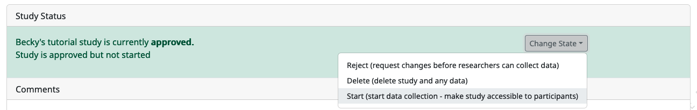
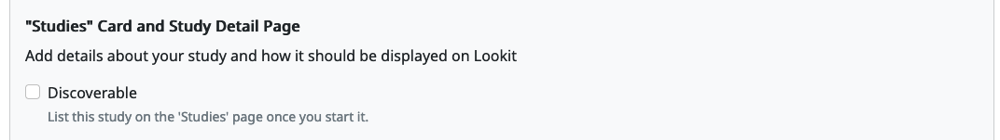
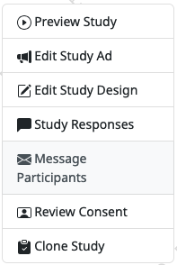
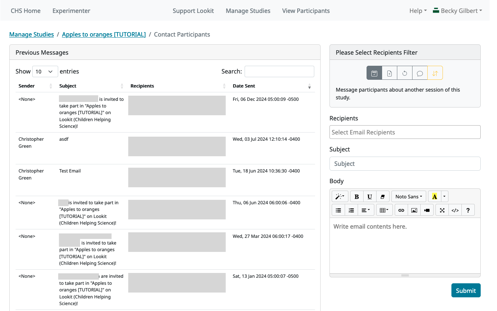
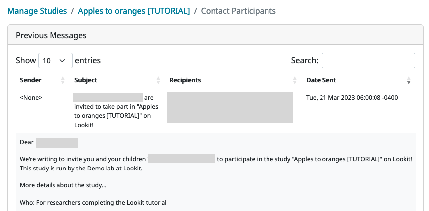
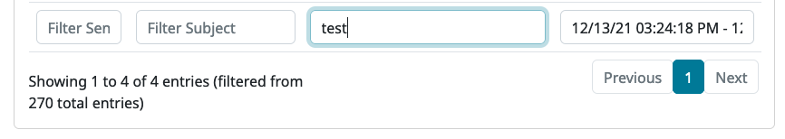
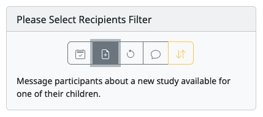
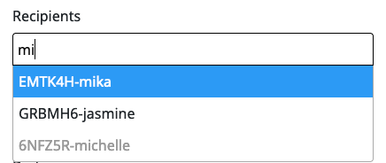
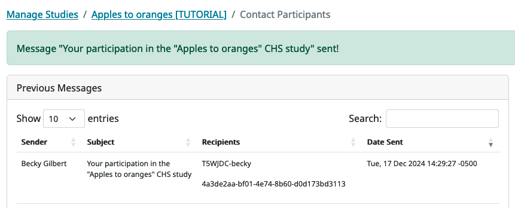

Day-to-day study operation
==============================

Starting, stopping, and advertising your study
------------------------------------------------------

Once your study has been approved to start data collection, you can change whether your study is **active** (accepting new responses) and whether it is **discoverable** (advertised to CHS families).

Active vs. paused
~~~~~~~~~~~~~~~~~~

You can start and stop data collection independently and whenever you
want. On your study detail page, in the "Study Status" box, go to “Change state” -> “Start” (active) or “Pause.”

When your study is **active**, families can participate using the direct link shown on your study page. If the study is also discoverable (see next section), changing its state to "active" means that it will be listed on the CHS "studies" page and advertised by email to eligible families.

When your study is **paused**, families can't access the study even if they have the direct link. If families follow a direct link to your study and it is paused, they will see a message `like this <https://childrenhelpingscience.com/studies/c7001e3a-cfc5-4054-a8e0-0f5e520950ab/>`__.

.. _change_discoverability:

Discoverable vs. non-discoverable
~~~~~~~~~~~~~~~~~~~~~~~~~~~~~~~~~~

You can also independently switch your study between discoverable and non-discoverable. On the study detail page, go to "Edit Study Ad" and find the section called "'Studies' Card and Study Detail Page". You can check or un-check the "Discoverable" box at any time, and then save the changes. Your study will not need re-approval if you are only changing the :ref:`discoverability <discoverability>`.

When your study is **discoverable** and active, it is:

- Listed on the CHS "studies" page: https://childrenhelpingscience.com/studies.
- Advertised to eligible families via announcement emails that include a direct link to the study, sent each day around 4am (USA Eastern Time).
- Accessible using the direct link.

When your study is **non-discoverable** and active, it is:

- Not listed on the CHS "studies" page: https://childrenhelpingscience.com/studies.
- Not advertised by announcement emails.
- Still accessible using the direct link!

You would make your study non-discoverable if you wanted to recruit your own specific participants - e.g., only people who participated in a prior study session, or families in a database for research about a rare disorder.

We also recommend making studies non-discoverable to do some initial piloting - once your study is approved, you can make it active but non-discoverable, and recruit a few participants yourself to try it out. (This is also a good way to get a feel for your recruitment options and how effective they are!)

.. _announcement_emails:

Announcement emails
~~~~~~~~~~~~~~~~~~~~

Announcement emails are sent out to families with eligible children to let them know about new studies on CHS:

- Emails are only sent about studies that are **discoverable** and **active**.
- Emails are only sent to families whose email preference specifies that they want to hear about new studies.
- Up to 50 families with at least one eligible child are notified about each study each day. Eligibility is determined each day, so depending on your eligibility criteria you will have a day to a few weeks of sending out 50 emails/day, then a trickle of kids aging in or registering.
- Families are only notified about a study one time per child. (Emails are bundled together if they have multiple eligible children - "There's a new study for John and Jane!", but they might get a second email if another child ages in.)
- Emails are currently sent around 4am Eastern Time.

The limit of 50 is currently hard-coded. If you want to limit how many announcement emails are sent further, you can send out just one day of announcements at a time by making your study discoverable overnight, then making it non-discoverable again. Families who got a direct link in an announcement email will be able to participate in your study, but no more announcements will be sent unless you make the study discoverable again.

Making changes to your study
----------------------------------------

If you make changes to your study - updating the fields in the
study details, the Lookit experiment runner version, etc. - your study will be
automatically “rejected” and will require review by CHS staff again
before you can make it active. This is quick but does still require manual
action on our part. In general these are reviewed the same business day as submitted, often within
an hour, but this is subject to whether staff is working / in a meeting / etc. Feel free to
contact us ahead of time to coordinate a time if you need immediate turnaround.

There are a few exceptions to changes triggering review, including changes to the age range and formatting of the study protocol configuration, which are listed when you save changes to a study.

Monitoring data as it comes in
----------------------------------------

We strongly recommend reviewing consent videos and looking through data
at least twice a week to make sure you become aware of any issues
participants are having in a timely manner. (E.g., you want to know if
people are confused by your directions, if there’s any weird bug with a
new version of Firefox, etc.!)

Missing consent videos
-------------------------

If you come across a record that's missing a consent video, please (a) try refreshing the page to make sure it doesn't show up and then (b) notify CHS staff, including the response UUID. If you're using a version of the Lookit experiment runner prior to 2.2.2 / 1.4.1 (see `releases <https://github.com/lookit/ember-lookit-frameplayer/releases>`) then this is probably an instance of `this bug <https://github.com/lookit/lookit-api/issues/598>`__. We can
fix particular instances for you but recommend updating following the instructions in `this Slack post <https://lookit-mit.slack.com/archives/CDV2ULHC5/p1608305924056900>`__.

.. _contacting_participants:

Contacting participants
-----------------------------

If your study provides compensation, then you will likely need to contact participants through the CHS messaging system to provide it. There are other reasons why you may want to contact participants, e.g. to let them know it's time to complete another session of a longitudinal study, to confirm their consent to participate, to ask for clarification about a problem they reported, or to announce that the results of your study have been published!

You can contact participants in a particular study by going to your study detail page, then clicking the "Message Participants" button in the right-hand menu.

    
That will take you to your study's "Contact Participants" page, where you can see previous emails that have been sent and compose new messages.

(Names and IDs have been obscured in the image above for privacy reasons.)

Previous messages
~~~~~~~~~~~~~~~~~~

In the "Previous Messages" section, you can see all of the messages that have been sent out about this study. This includes both the :ref:`announcment emails <announcement_emails>` that were automatically sent by CHS (if your study is active and discoverable), and any messages that have been sent from researchers. Each row contains the following information about a particular message:

- **Sender**: If the message was an announcment email then the "Sender" will be "None", otherwise the Sender is the name of the researcher who sent the message.
- **Subject**: The subject line for the email.
- **Recipients**: This contains (1) the participant's "slug", which is a short identifier that combines their hashed ID and nickname, and (2) their UUID (global ID).
- **Date sent**

.. admonition:: Where are the email addresses?

   You may notice that although you can message participants, you can only see their CHS names/IDs and not their actual email addresses. Obscuring email addresses is deliberate: it allows us to programmatically enforce participants' email selections (so that they don't receive email types they don't want), protects against accidental disclosure, and ensures you have a central record of all communication. Again, this is a matter of sharing a reputation! We apologize for the inconvenience this causes in implementing some custom workflows, and can discuss providing email permissions with individual labs if necessary. 

You can click on a row in the "Previous Messages" table to see the full message body.

You can also filter the "Previous Messages" table using the search/filter boxes at the bottom. 

.. _sending-a-message:

Sending a message
~~~~~~~~~~~~~~~~~~

The CHS platform allows you to send messages to parents who have participated (or tried to participate) in your study. To send a new message, you first need to select a message type in the section called "Please Select Recipients Filter". This is because participants have different email preferences, and selecting the message type allows the system to filter out participants who do not wish to receive that category of email. This section has a row with five buttons that correspond to the email types that participants can opt in/out of receiving. 

The message types are listed below. You can also click on each of the five buttons to see a description underneath. 

1. Message participants about **another session of this study**.
2. Message participants about a **new study** available for one of their children.
3. Message participants an **update about this study** (e.g. results are published). 
4. Message participants with **questions about their response** (e.g. confirming consent or following up on a technical problem). 
5. **Transactional** email, which is ONLY for **providing compensation** or completing other "transactions", such as providing information that they requested.

After selecting the appropriate message type, specify the recipient(s) by searching for the **Parent name** or **Parent ID**. The Parent ID is a hashed, study-specific ID (not to be confused with parent global/UUID, child IDs, or response IDs!). This ID can be found in the "Response Details" section of the :ref:`Individual Responses page <individual_responses>`, and in the response data JSON file ("participant": "hashed_id") or CSV summary file ("participant__hashed_id").

You may find that some participants are listed in the "Recipients" but their names are grayed-out and cannot be selected (see the image above for an example). If the participant is grayed-out, then they have opted out of the type of message you are sending. The only message type that can be sent to any participant is the "transactional" type, which must ONLY be used for providing compensation or completing other "transactions".

The "Recipients" field will only allow you to add parents who have tried to participate in this study (i.e. clicked the "Participate" button). If you search for a parent name or ID in the "Recipients" box and see "No results found", then this means that either there is a typo in your search text or that parent has not participated.

Once you have added all recipients to your message, write your email "subject" and "body" text and then hit the "Submit" button to send it. You should see a confirmation message about your email having been sent, and it should appear as a new row at the top of the table in the "Previous Messages" section.

.. admonition:: Email delivery delays
  
  Messages are typically sent out immediately, but our messaging system can occasionally get backed up. When that happens, it may take a few hours before the email is *actually* sent, even though it will immediately appear under "Previous Messages". Please allow 24 hours for email delivery, and contact us on the Slack tech_support channel if you experience longer delays or other messaging problems!

.. _compensation:

Compensating participants
----------------------------------------

If you are compensating participants, in most cases you will :ref:`send them a message <sending-a-message>` through the CHS messaging interface to give them gift
cards, using the user IDs you can see in the consent manager and/or the
response data. If your institution requires direct compensation or requires 
the collection of email addresses for other compliance reasons, you can add
an additional survey page to your study to ask for the participant's email,
as long as it is clear that that information will only be used to send payment. 

Participant compensation should never depend on the child's behavior -
*even if the child fusses out and/or the data is unusable*. In general,
this means we try to pay anyone who submits a valid consent video.
Payment for the parent's/child's time is ethical; accidentally paying
the parent to take extraordinary measures to get their child to sit
through the study because they think that's necessary to get paid is not.
The exception to this guideline is that if someone tries the study
but only gets a very short way in (maybe only consent), then comes back
and does the study again, you would generally pay them just once - even
if you might have erred on the side of caution and paid them even for
the first attempt.

.. admonition:: Spam users and fraud on CHS
  
  Very rarely, you may have people take your study who are not operating in
  good faith - the most egregious example is someone attempting to participate
  without a child present, but we have also seen cases where the same person 
  makes several accounts to get paid multiple times, or where people lie about
  their location or child's age to make themselves 'eligible' for studies. 

  **Every member of your research team** who is involved in compensating families
  for participation must be aware of this issue and the steps that researchers
  are expected to take to avoid this.  Because CHS is a shared platform 
  with a shared reputation and shared participant pool, it is **everyone's** 
  responsibility to avoid paying the small number of people to try to take
  advantage of this resouce to the detriment of our research goals. 

  See :ref:`this page <spam_prevention>` for information on procedures
  related to discouraging scammer participants on Children Helping Science. 

You are free to put limits on how many times / how often people can
participate and be compensated, and to require that the child be, say,
in the age range for the study in order to participate. Basically, stuff
the parent can know before they get started is fair game. (But be
careful and err on the side of payment if there is any discrepancy
between your listed age range - e.g. “for three-year-olds” - and the
:ref:`min/max ages used for automatic warnings <min_max_ages>`.)
If a parent participates with a child well outside the age range, you
might want to email them to thank them for participating, let them know
it's fine to check out the study and you hope they found it interesting
but since this is for x-month-olds you won't be able to use their data
or provide compensation.

Rarely, adults without children may check out a study and even make a
consent recording. We tell our students not to do this but you never
know :) To avoid feeling obligated to pay them (which would probably be
surprising to them too) you're welcome to state in your compensation
info that the child needs to be visible in the consent video. (You don't
actually have to enforce that for people who get the kid later, which is
reasonable - but this way if someone ONLY submits the consent video and
doesn't have a child present, you don't have to pay them.)

Allowing families to participate again
----------------------------------------

Sometimes parents may contact you to see if they can try your study
again because they had a technical problem or their child wasn’t
interested the first time. Whether you can use the data may depend on
the particular circumstances and your study design, but on a technical
level it’s fine - you can let the parent know they may see a warning
about not being eligibile, but that they can safely ignore it.

.. _confirm_consent:

Confirming consent
----------------------------------------

You will need to review consent videos using the :ref:`Consent Manager <coding-consent>` tool
and determine whether each one represents clear informed consent.
Only after confirming consent do you receive full access to the data
collected during the session.

If you come across a video where you think a parent meant to consent to
participate, but you do not have an adequate recording, you can :ref:`send a message <sending-a-message>` to
the participant to ask for confirmation. See the ‘informed consent
guidelines’ in the `Terms of Use <https://childrenhelpingscience.com/termsofuse/>`__
for guidance. Here is an example of an email we have sent to confirm
consent:

   Thanks so much for participating in the CHS study “Your baby the
   physicist” with your child! We really appreciate your time - and
   you’re one of our first participants, so we’re extra excited :)

   Unfortunately, we don’t have a video recording of you saying you
   agree to participate - we suspect it may not have been clear that you
   needed to read that out loud. If it’s okay for us to view your videos
   and use the data, could you respond with “Yes, I am this child’s
   parent or legal guardian and we both agreed to participate in this
   study”? Thanks again, and I’m very sorry for the extra hassle!

   If you did NOT mean to consent to participate in the study, no action
   is required. You can ignore this email and we will not use your data.

Sending child-related data to families
----------------------------------------

Parents are able to review their study video in the CHS interface. If
you would like to send them additional information related to their
participation, please try to do so using the “Message Participants”
interface. That interface supports html but does not allow attachments.
If you need to share files with the families, please share a link to the
file. For example, Dropbox Business allows file-sharing links to be
password-protected with an expiration date.

If a parent requests video deleted, or you need to delete video for any other reason
-------------------------------------------------------------------------------------

Please contact CHS staff and we will delete the video(s). You'll need to provide the 
response UUID.

If a parent invokes GDPR specifically in their request, again please
contact CHS (complying is straightforward but we’ll notify OGC).
