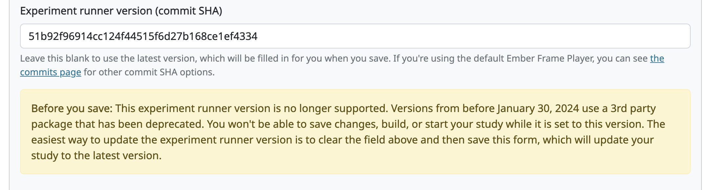
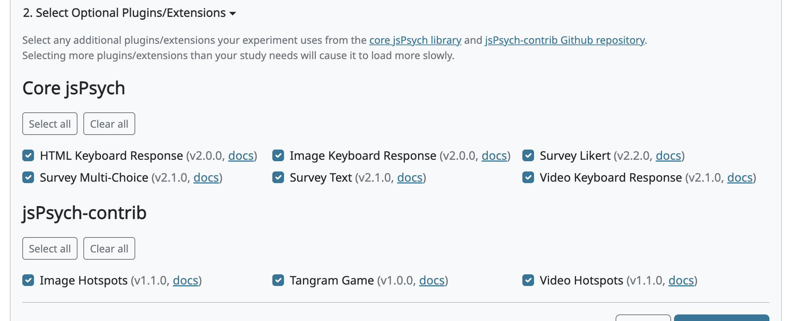

.. _study_design:

##################################
Setting the study design
##################################

After you've created a study of a specific type, you can set the value of some additional fields that are specific to that study type and define the behavior of your study. See each study type below to see the design fields for that type.

***************************
Lookit (Ember Frameplayer)
***************************

Study protocol configuration
=============================

This needs to be a valid JSON block describing the different frames (pages) of your study, and the sequence. This can be left blank at the time you initially create your study. For detailed information about specifying your study protocol, see `Building an Experiment`_.

Experiment runner code URL and version
==========================================

The "Experiment runner code URL" is a link to the `Ember Frame Player <https://github.com/lookit/ember-lookit-frameplayer>`_ code that will run your study.  It's an ember app that can talk to our API. All the frames in the experiment are defined in Ember, and there is an exp-player component that can cycle through these frames.  You should leave this link as is, unless you have forked the Ember Frame Player Github repository (for instance, to create custom frame types) and want to use your fork instead.

The "Experiment runner version (commit SHA)" is a Github commit SHA that refers to a specific version of the Ember Frame Player that you want to use. This field is available in case you need to roll back to a previous version, for instance if an update to the Ember Frame Player caused a problem for your experiment.

.. _efp-update-latest-version:

**Updating to the latest version.** Typically when you create a new study, you will want to leave this field blank. When you save the study design form with a blank version, the system looks up the most recent version of the experiment runner, fills that commit SHA in for you, and "pins" your study to it. Pinning means your study keeps using exactly that version even if a newer one is released later, so that updates can't change how your study works without your knowledge. To update an existing study to the latest version at any time, just clear the "Experiment runner version (commit SHA)" field and save the form again — the system will fill in and pin the newest version. (You will need to rebuild your experiment runner after updating and saving.)

.. warning::

   **Older experiment runner versions are no longer supported.** Experiment runner versions from before **January 30, 2024** rely on a deprecated third-party video service (`Pipe <https://addpipe.com/>`__) and no longer function reliably. If your study is set to one of these older versions, you will **not** be able to save changes to the study design, or build, submit, or start the study, until you update the version. You can leave such a study as-is for record keeping, but to collect data you'll need to move to a supported version. The easiest way to update is to clear the "Experiment runner version (commit SHA)" field and save the form, which pins your study to the latest version (see ":ref:`Updating the Lookit experiment runner <updating-frameplayer-code>`"). If you try to save an unsupported version, you'll see an error message explaining that it is out of date.

   The warning shown on the Edit Study Design page when a study is set to an unsupported experiment runner version.

******************
jsPsych
******************

jsPsych Experiment Code
=============================

This is where you enter your jsPsych experiment code. This is the JavaScript code used to generate a jsPsych study, not the surrounding HTML. Please see our :ref:`CHS jsPsych documentation <jspsych-intro>` and :ref:`tutorial <jspsych-tutorial-first-study>` for more information about what jsPsych plugins and versions are automatically loaded for you to use, and how to load stimuli files.

jsPsych Options (plugins/extensions)
=====================================

Studies built with jsPsych rely on an underlying "core" jsPsych package plus a set of plugins/extensions. CHS always loads the core jsPsych package along with the most commonly-used plugins/extensions, and you can choose to add others that your study needs.

The **jsPsych Options** area of this page has two expandable sections:

#. **See Automatically-Loaded Plugins/Extensions** — a read-only list of the packages that are always available to your study (the core jsPsych library, the auto-loaded plugins, and the CHS packages). You don't need to do anything here.
#. **Select Optional Plugins/Extensions** — checkboxes for the additional plugins/extensions you can add, with "Select all" and "Clear all" buttons. In general you want to include as few as possible, because each one increases your study's loading time.

   The "Select Optional Plugins/Extensions" section, where you check the optional plugins/extensions your study needs.

If you aren't sure which plugins/extensions you'll need yet, you can leave these options alone for now and update them later. For the full list of what's automatically loaded and what's available to add — including version numbers and documentation links — see ":ref:`jsPsych packages <jspsych-packages>`". If there's a plugin/extension you want that isn't listed, let us know on Slack or at support@childrenhelpingscience.org.

.. note::

   jsPsych studies created before this feature was added automatically have all available plugins/extensions selected, so they continue to work exactly as before.

.. _`Building an Experiment`: researchers-create-experiment.html

******************
External studies
******************

.. _study-url:

Study URL 
=============================

The link that families should be redirected to when they click the "Participate now" button on a study detail page. For unscheduled/unmoderated studies, this will be the study itself (e.g. a Qualtrics survey). For moderated studies, it should be a link to a scheduling system (e.g. Calendly). 

When the family clicks the "Participate now" button for external studies, the link will automatically include two pieces of information as URL query parameters: the hashed child ID ('child') and the response ID ('response'). This will allow you to automatically capture and record this information on the study/scheduling page, so that you can link the study responses and child's CHS account without having to ask the family to enter additional information. For example, if your Study URL is "\https://example.com", then the family will be directed to a link that has this format:

  \https://example.com/?child=SG7JLN&response=d5c8f502-6588-46c8-84fa-a9657a44fe47

It is up to the researcher to capture and record the "child" and "response" URL query parameter values on the external website. Many online experiment/survey tools have documentation on how to do this (e.g. `Qualtrics <https://www.qualtrics.com/support/survey-platform/survey-module/survey-flow/standard-elements/passing-information-through-query-strings/#PassingInformationIntoASurvey>`_). You can include your own URL query parameters in your Study URL and they will be retained along with the CHS parameters.

Scheduling Platform
=============================

Choose from a set of options to help us understand how researchers schedule participants for moderated/scheduled studies, and to build tools for common study types.

Study Platform
=============================

Choose from a set of study platforms to help us understand & build tools for common study types.

