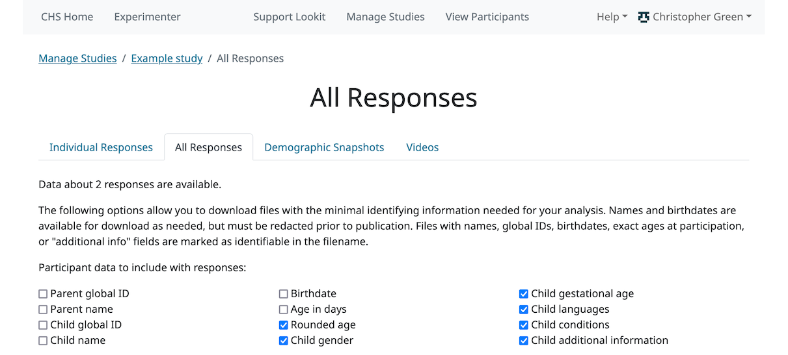

Downloading data
==============================

What data can I access?
-----------------------------------

You can access:

- response data from responses for which you have confirmed consent in the Consent Manager

- account, demographic, and child data associated with those responses. (You will see these accounts under 'Manage Participants' as well; if some siblings but not others have participated in one of your studies and you have confirmed consent, you will only see the siblings who have participated.)

- video clips associated with those responses (consent videos plus any video collected during the session), unless the participant withdrew video during the exit survey.

.. admonition:: How does it work when participants withdraw video?
   
   If the participant selected the 'withdraw video' option in an exit-survey frame at the end of the study, all video except for the consent video is unavailable (and will be deleted from Lookit servers as well in 7 days). You will still be able to see the consent video in the consent manager. The fact that video has been withdrawn is included in the response data.
   
   There is a potential rare edge case where you access video while the participant is still doing the study, and then they withdraw, so you should still verify that none of your participants have withdrawn video.

Viewing all study videos
----------------------------------------
To view all video responses to your study from sessions with confirmed consent, click 'View Responses' from the study detail page and then click 'Videos'. 
You can filter on video name.

.. image:: _static/img/attachments.png
    :alt: View all study videos

The format of the video names is `videoStream_{study_uuid}_{order-frame_name}_{response_uuid}_{timestamp}_{randomDigits}.mp4`

You can match up the videos with their corresponding sessions using the `response_uuid` segment, and determine which frame each came from using the `order-frame_name` segment (e.g., `0-video-consent` or `5-alternation-trial`). 

Videos can be downloaded individually here or from the 'Individual Responses' view.  You also have the option of bulk downloading all consent videos for your study, or bulk downloading all responses. The bulk download will take place asynchronously, so once the videos have been downloaded and put in a zip file, you will get an email telling you this is done.

What sorts of data (besides video) are collected during a study?
-----------------------------------------------------------------

A response record is created each time a participant
starts the study. It includes a timestamp, 
condition assignment, the sequence of frames the participant actually
saw, and frame-specific information for each frame. 

Each frame type may save different data, e.g. form responses or videos played; frames that record webcam video include the video filename(s). The data captured by a
particular frame are listed in the frame documentation under "Data collected."

Additionally, event data is captured for each frame
and included under an eventTimings key within the frame data JSON,
minimally including a timestamped event when the user proceeds to the
next frame. These events are listed under "Events" in the frame documentation.

Hashed and global IDs
------------------------

Overview
~~~~~~~~~

There are "global IDs" you can download for **account**, **child**, and **demographic snapshot** data. You only need them if you need to link participants across studies, either for longitudinal analysis or financial accounting. You may not publish them. Usually, you can just use the regular hashed ID fields which are six-character strings.

Why two different IDs?
~~~~~~~~~~~~~~~~~~~~~~~

Lookit participants may take part in studies from a variety of labs. This means that if researchers directly use the unique database identifiers ("global IDs") for accounts, children, and demographic data snapshots, different labs will be using the same identifiers for the same children. That's important to allow collaboration in cases where you have IRB approval to combine data from different studies, but it also means that if you and another lab both published those global IDs, someone else could come along and link data from a participant who did both studies. Usually this would be ok, but in some cases information that wasn't sensitive on its own in either study could be combined to produce more sensitive or identifying information. So we provide "hashed IDs" which are study-specific and can be published.

What if we do need to link participants across studies and want to publish the data?
~~~~~~~~~~~~~~~~~~~~~~~~~~~~~~~~~~~~~~~~~~~~~~~~~~~~~~~~~~~~~~~~~~~~~~~~~~~~~~~~~~~~~

There are two options: 

1) You can generate your own random unique IDs and replace the global IDs with those in your published data files. 

2) You can publish a table of mappings from the hashed ID in one study to the hashed ID in the other, e.g. a CSV file with Study_1_ID, Study_2_ID, etc. headers.

If you do this and come up with scripts that help with the workflow, please share them to help your fellow researchers! You can also file a Github feature request on the lookit-api repo; we will likely offer a convenient download for option 2 once there is demand.

What are the regular IDs?
~~~~~~~~~~~~~~~~~~~~~~~~~~

The regular hashed IDs are six-character strings (like `6RYE3U`) that uniquely identify an account, child, or demographic snapshot **within a particular study**. The same child will always have the same hashed ID within a particular Lookit study, but that child would have a different hashed ID in a different study, even one you were running.

These hashed IDs are shown in the consent manager, individual responses, all responses, and email participant views, and may be called simply IDs.

Technical details: The hashed IDs are created by combining the global ID, your study UUID, and a random "salt" associated with your study, running that through a SHA256 hash algorithm, and converting the first 30 bits to a base-32 string representation. Based on `"birthday paradox" calculations <https://en.wikipedia.org/wiki/Birthday_attack>`_, we would expect about a 0.1% chance of collisions with 1500 records. A salt is used in addition to the study UUID because the study UUID is easily publicly accessible (e.g. in your study URL) to make it harder to use lookup tables. This procedure would make it quite hard to match IDs across studies. It is meant as a strong deterrent but, given the consequences and the existence of other unavoidable methods for linking responses across studies (e.g., looking at video), it is not a level of security that would be appropriate for, say, hashing passwords.

.. _Response download options:

Viewing all study responses
------------------------------
To view all of the responses to a study with confirmed consent, click 'View Responses' from the study detail page and then click 'All Responses.' You must have permission to view this study's responses, which means you must have a Study admin, researcher, or analysis role. (If you can view preview responses, you will be able to access this same page, but only preview data will be included.)

.. image:: _static/img/all_responses.png
    :alt: View all responses
    
Responses only show up in this view once you have confirmed that the participant provided informed consent to participate using the Consent Manager.

.. admonition:: Preview data is included in all responses!
   
   Previewing a study is designed to work *exactly* the same way as participating, including saving data that you can see with other responses. This is intended to support researchers in preparing data analysis workflows and ensuring that data are formatted as expected before starting data collection. But you'll need to either (a) filter out responses where is_preview is True, or (b) use the "Delete all preview data" button to remove preview responses prior to data download.

Choosing what participant information to include
~~~~~~~~~~~~~~~~~~~~~~~~~~~~~~~~~~~~~~~~~~~~~~~~~~~~~~~

To limit the potential for accidental disclosure of identifying information about your participants, it is best to limit what you even download to what you actually need. The checkboxes at the top allow you to decide what potentially-identifying information to include in the response data files. This also aids in developing a straightforward workflow for publishing your raw data, since you will need to avoid publishing names, birthdates (or information that can be used to calculate a birthdate), and global IDs.

.. admonition:: What can and can't I publish?

    The main items you need to avoid publishing are global IDs, birthdates, names, and demographic survey responses if they can be linked to video also published. For convenience, we note specific fields that must be redacted for publication in the CSV data dictionaries. However, if any of this is unfamiliar, please review the Lookit `Terms and Conditions <https://lookit.mit.edu/termsofuse>`_!

On the left are options for downloading information about the age of the participant. You can choose to download actual birthdates, exact ages in days, and/or a rounded age. The rounded age is rounded to the nearest 10 days for children under 365 days and to the nearest 30 days after that. 

On the right are options for other participant data to download - name, gender, etc. Again, it's best to only download what you actually need! You can also choose to download a separate child data file so that your response data has only the child ID in it.

The response overview data dictionary has detailed explanations of each of these optional fields.

Data download formats
~~~~~~~~~~~~~~~~~~~~~~~~~~

There are several formats available to download your data:

The raw data is available in **JSON** format; this is a structured, human-readable text format where you will be able to see how data is nested (e.g., a form response within a form within a frame). However, it may require more processing to use in your data analysis workflow (for instance to load it into R). 

For convenience, several options are provided for downloading data in CSV (comma separated value) format. CSV data can be easily examined in your spreadsheet editor of choice (like Excel) and loaded into programs like R for analysis.

The **response overview** file provides high-level information about each response and the participating child, with one row per response (a "wide" format). Not everything is included here, because there can be a lot of data per response (e.g., events collected each time the participant clicks something). You can download a data dictionary along with the response overview; this file provides information about how to interpret each column of the data file. When you publish your data, it is always a good idea to include a data dictionary, so this gives you a head start!

The **response frame data** file(s) provide all the data that was collected throughout the session. This is provided as a ZIP archive with one file per response. This data is in a "long" format, where there are few columns and each row represents a single piece of information. So each response will be associated with many rows. You can download a data dictionary for the frame data, too! Because the exact types of data collected will vary across studies based on what frames you use, what questions are in your forms, and so on, you will need to fill in some of the data dictionary to explain what the various fields mean. Some of the data dictionary is filled out for you, and there are placeholders for the study-specific explanations you'll need to add.

The **child data** files provide information about each child associated with at least one study response. There is one row per child, and all of the data from that child's sign-up is available: birthdate, gender, gestational age at birth, languages, conditions, etc. A data dictionary is available. This file is the only one not affected by the selections you make about which potentially-identifying information to include: it will always have names, birthdates, etc. The idea is that if you need that information, you can keep it separate from the response data which you might share more broadly.

Frame IDs
~~~~~~~~~~~~~~

Each frame in a response is identified by an ID, which you will see in both the video filenames and the data downloads. This is generally based on what you called the frame in your protocol's "sequence." When the study starts, your protocol is parsed to create an ordered list of frames, for instance expanding out any groups and randomizers. The frame IDs you will see in the data (response__sequence.0, response__sequence.1, etc. in the response overview CSV; "sequence" in the JSON; ``frame_id`` in the frame data CSV) start with the index of the frame, starting from 0. For instance, if you started off with frames 

.. code::

    video-config
    video-consent
    test-trial
    exit-survey
    
then you would see frame IDs

.. code::

    0-video-config
    1-video-consent
    2-test-trial
    3-exit-survey
    
These numbers are preserved if someone skips around in the study (due to e.g. selectNextFrame sending to a different frame than the next one, or skipping to the exit survey). E.g. if the participant skipped to the exit survey right after consent, you might see a sequence

.. code::

    0-video-config
    1-video-consent
    3-exit-survey
    
If the participant repeats a frame (e.g. by navigating using a "previous" button, selectNextFrame sending them back, or repeating a frame after pausing) then the sequence will show the actual order they saw frames in, with ``-repeat-N`` added after repeated frames as needed. For example, if the participant paused the test trial twice and started from the beginning each time, you would see:

.. code::

    0-video-config
    1-video-consent
    2-test-trial
    2-test-trial-repeat-1
    2-test-trial-repeat-2
    3-exit-survey

Viewing individual study responses
-----------------------------------

To inspect single responses to your study, navigate to your study and click 'View Responses,' then 'Individual responses'. You must have permission to view this study's responses, which means you must have a Study admin, researcher, or analysis role. (If you can view preview responses, you will be able to access this same page, but only preview data will be included.)

Responses only show up in this view once you have confirmed that the participant provided informed consent to participate using the Consent Manager. Both preview and real responses will show up here (depending on your permissions), but preview responses are marked with a "P" and say "PREVIEW" in the background of the row. 

On the left, you have a list responses to your study, with the child ID, response ID, the study's completion status, and the date they started the study. When you click on a response, the data from that response is shown on the right. You can 
download the data from that response in one of several formats: JSON (JavaScript Object Notation, a structured text format); a CSV summary (a "wide format" overview with basic information about the participant and response, such as condition assignment); or CSV frame data (a "long format" detailed list of data collected in each frame during this response, complementary to the CSV summary).

.. image:: _static/img/responses.png
    :alt: View responses

Beneath the CSV/JSON response data are any individual videos that are linked to that participant's response. 

.. _leaving_feedback:

Leaving feedback
~~~~~~~~~~~~~~~~~~~~

On the "Individual Responses" page, you can leave feedback to participants. A lot of the motivation and reward families get from participating in research in person is the social interaction and knowledge that a real human appreciates their time and thinks their kid is super interesting. Feedback is essentially meant to approximate that from an online lab! Typically you might include a quick thanks-again, confirmation that everything worked ok (e.g., everything worked great, we can clearly see him looking right and left), some friendly personalized comment about the child/parent, and a response to any questions parents left in the exit survey. Families can see their feedback by going to Studies -> Past studies, but it is not emailed to them, so don't use this for anything where you really need to reach them (e.g., this is not a good way to send a gift card code!). 

Structure of JSON response data
-----------------------------------

The data saved when a subject participates in a study varies based on how that experiment is defined. Let’s start by looking at an example of the data you can download about a single response. (The ``eventTimings`` objects have been shortened to show just a single event.)

.. code:: json

    {
        "response": {
            "id": 1190,
            "uuid": "d96b3ba5-6806-4c09-86e2-77456163eb5a",
            "date_created": "2023-11-16 23:48:40.427194+00:00",
            "completed": true,
            "withdrawn": false,
            "eligibility": [
                "Ineligible_CriteriaExpression",
                "Ineligible_Participation"
            ],
            "parent_feedback": null,
            "birthdate_difference": 731,
            "video_privacy": "private",
            "databrary": "no",
            "is_preview": false,
            "sequence": [
                "0-video-config",
                "1-video-consent",
                "2-instructions",
                "3-mood-survey",
                "4-pref-phys-videos",
                "5-exit-survey"
            ],
            "conditions": {
                "4-pref-phys-videos": {
                    "showStay": 18,
                    "startType": 21
                }
            }
        },
        "consent": {
            "ruling": "accepted",
            "arbiter": "Becky  Gilbert",
            "time": "2023-11-16 23:51",
            "comment": null
        },
        "study": {
            "uuid": "0f620873-2847-4eeb-9854-df7898934c17"
        },
        "participant": {
                "global_id": "",
                "hashed_id": "6RYEUF",
                "nickname": ""
        },
        "child": {
            "global_id": "",
            "hashed_id": "ccNdL6",
            "name": "",
            "birthday": "",
            "age_in_days": "",
            "age_rounded": "960",
            "gender": "f",
            "language_list": "en egy",
            "condition_list": "autism_spectrum_disorder multiple_birth",
            "age_at_birth": "40 or more weeks",
            "additional_information": ""
        },
        "exp_data": {
            "3-mood-survey": {
                "active": "4",
                "rested": "1",
                "healthy": "2",
                "eventTimings": [
                    {
                        "eventType": "exp-mood-questionnaire:nextFrame",
                        "timestamp": "2018-07-06T23:56:06.459Z"
                    }
                ]
            },
            "0-video-config": {
                "eventTimings": [
                    {
                        "eventType": "exp-video-config:recorderReady",
                        "timestamp": "2018-07-06T23:54:59.548Z",
                        "streamTime": null
                    }
                ]
            },
            "2-instructions": {
                "eventTimings": [
                    {
                        "eventType": "exp-physics-intro:nextFrame",
                        "timestamp": "2018-07-06T23:55:53.530Z"
                    }
                ]
            },
            "1-video-consent": {
                "videoId": "videoStream_0f620873-2847-4eeb-9854-df7898934c17_1-video-consent_d96b3ba5-6806-4c09-86e2-77456163eb5a_1530921346557_292",
                "videoList": [
                    "videoStream_0f620873-2847-4eeb-9854-df7898934c17_1-video-consent_d96b3ba5-6806-4c09-86e2-77456163eb5a_1530921346557_292"
                ],
                "eventTimings": [
                    {
                        "eventType": "exp-video-consent:recorderReady",
                        "timestamp": "2018-07-06T23:55:46.558Z",
                        "streamTime": 0
                    }
                ]
            },
            "5-exit-survey": {
                "feedback": "",
                "birthDate": "2018-07-03T04:00:00.000Z",
                "useOfMedia": "private",
                "withdrawal": false,
                "eventTimings": [
                    {
                        "eventType": "exp-exit-survey:nextFrame",
                        "timestamp": "2018-07-06T23:57:02.201Z"
                    }
                ],
                "databraryShare": "no"
            },
            "4-pref-phys-videos": {
                "videoId": "videoStream_0f620873-2847-4eeb-9854-df7898934c17_4-pref-phys-videos_d96b3ba5-6806-4c09-86e2-77456163eb5a_1530921371545_923",
                "videoList": [
                    "videoStream_0f620873-2847-4eeb-9854-df7898934c17_4-pref-phys-videos_d96b3ba5-6806-4c09-86e2-77456163eb5a_1530921371545_923"
                ],
                "videosShown": [
                    "https://s3.amazonaws.com/lookitcontents/exp-physics-final/stimuli/stay/webm/sbs_stay_near_mostly-on_book_c2_green_NN.webm",
                    "https://s3.amazonaws.com/lookitcontents/exp-physics-final/stimuli/stay/webm/sbs_stay_mostly-on_near_book_c2_green_NN.webm"
                ],
                "eventTimings": [
                    {
                        "eventType": "exp-video-physics:recorderReady",
                        "timestamp": "2018-07-06T23:56:11.549Z",
                        "streamTime": 0
                    }
                ]
            }
        }
    }

There are six top-level keys in this data: ``response``, ``consent``, ``study``, ``participant``, ``child``, and ``exp_data``. 

The ``study``, ``participant``, and ``child`` information should be fairly self-explanatory: which study does this response pertain to, which family account created the response, and which child was participating. (The child key ``age_at_birth`` refers to gestational age in weeks at birth.) You can find more detail about all of these fields by looking at the CSV data dictionaries available under All Responses; they are "flattened" for the CSV so that the "global_id" field under "child" becomes "child_global_id", for instance.

The ``response`` data contains information concerning this particular session: when it happened, what condition the child was assigned to, the parents' responses from the exit survey, whether the session was completed, etc. The response properties are described below:

-  **id**: short unique ID for the response
-  **uuid**: long unique ID for the response (should be used as primary identifier)
-  **date_created**: timestamp for when the response was created (i.e. when the session began)
-  **completed**: A ``true``/ ``false`` flag indicating whether or not the participant submitted the last frame of the study. Note that this may not line up with your notion of whether the participant completed the study, in two ways: first, ``completed`` will be ``true`` even if the participant leaves early, as long as they submit the exit survey which they skip to when pressing F1. Second, ``completed`` will be ``false`` if they don’t submit that exit survey, even if they completed all of the important experimental parts of the study.
-  **withdrawn**: A ``true``/ ``false`` flag indicating whether or not the participant withdrew permission for viewing/use of study video (beyond consent video). If ``true``, the video repsonses will not be available and must not be used.
-  **eligibility**: List of eligibility codes, separated by spaces. Can be either ``Eligible`` or one or more of: ``Ineligible_TooYoung``/ ``Ineligible_TooOld``, ``Ineligible_CriteriaExpression``, ``Ineligible_Participation``. These eligibility categories are meant to help researchers determine whether the child was eligibile for the study *at the time that they started the study session*. If this list contains one or more of the 'Ineligible' categories, then the family would've seen some red eligibility warning text on the page when they began the study session.
-  **parent_feedback**: Freeform parent feedback entered into the exit survey, if any. This field may incidentally contain identifying or sensitive information depending on what parents say, so it should be scrubbed or omitted from published data.
-  **birthdate_difference**: Difference in days between birthdate entered in exit survey, if any, and birthdate of registered child participating. Positive values mean that the birthdate from the exit survey is LATER. Blank if no birthdate available from the exit survey.
-  **video_privacy**: Privacy level for videos selected during the exit survey, if the parent completed the exit survey. Possible levels are ``private`` (only people listed on your IRB protocol can view), ``scientific`` (can share for scientific/educational purposes), and ``public`` (can also share for publicity). In no cases may videos be shared for commercial purposes. If this is missing (e.g., family stopped just after the consent form and did not complete the exit survey), you must treat the video as ``private``.
-  **databrary**: Whether the parent agreed to share video data on Databrary - ``yes`` or ``no``. If missing, you must treat the video as if ``no`` were selected. If ``yes``, the video privacy selections also apply to authorized Databrary users.
-  **is_preview**: A ``true``/ ``false`` flag indicating whether or not this response was generated by a researcher previewing the experiment. Preview data should not be used in any actual analyses.
-  **sequence**: A list containing the sequence of **frames** the subject actually saw (after running randomization, etc.). If the participant ended the study early, then this list will not contain all the frames in the study. The frame names follow the pattern ``<order>-<frame.id>``, where ``<order>`` is the order in the overall sequence where this **frame** appeared, and ``<frame.id>`` is the identifier of the frame as defined in the ‘frames’ property of the experiment structure.
-  **conditions**: An object containing information about conditions to which the subject was assigned in any frames that do randomization (choice frames). Keys are in the format ``<order>-<frame.id>`` corresponds with the ``<order>`` from the ‘sequence’ of the *original* experiment structure, and the ``<frame.id>`` again corresponds with the identifier of the frame as defined in the ‘frames’ property of the experiment structure. Data will be stored in conditions for the *first* frame created by a randomizer (top-level only for now, i.e. not from nested randomizers). Values are objects containing mappings from condition names to their values for this session. The data stored by a particular randomizer can be found under ``data collected`` in the :ref:`experiment runner docs <elf:randomization>`

The ``consent`` key contains information 

-  **ruling**: Most recent consent video ruling: one of ``accepted`` (consent has been reviewed and judged to indidate informed consent), ``rejected`` (consent has been reviewed and judged not to indicate informed consent -- e.g., video missing or parent did not read statement), or ``pending`` (no current judgement, e.g. has not been reviewed yet or waiting on parent email response')
-  **arbiter**: Name associated with researcher account that made the most recent consent ruling
-  **time**: Timestamp of most recent consent ruling, format e.g. 2019-12-09 20:40
-  **comment**: Comment associated with most recent consent ruling (may be used to track e.g. any cases where consent was confirmed by email)

The ``exp_data`` is a JSON object containing the data collected by each **frame** in the study. More on this below...

   
.. _Interpreting session data:

Interpreting ``exp_data``
-----------------------------------

Here’s an example of data collected during a session (note: not all
fields are shown):

.. code:: json

   {
       "sequence": [
           "0-intro-video",
           "1-survey",
           "2-exit-survey"
       ],
       "conditions": {
           "1-survey": {
               "parameterSet": {
                   "QUESTION1": "What is your favorite color?",
                   "QUESTION2": "What is your favorite number?"
               },
               "conditionNum": 0
           }
       },
       "exp_data": {
           "0-intro-video": {
               "eventTimings": [{
                   "eventType": "nextFrame",
                   "timestamp": "2016-03-23T16:28:20.753Z"
               }]
           },
           "1-survey": {
               "formData": {
                   "name": "Sam",
                   "favPie": "pecan"
               },
               "eventTimings": [{
                   "eventType": "nextFrame",
                   "timestamp": "2016-03-23T16:28:26.925Z"
               }]
           },
           "2-exit-survey": {
               "formData": {
                   "thoughts": "Great!",
                   "wouldParticipateAgain": "Yes"
               },
               "eventTimings": [{
                   "eventType": "nextFrame",
                   "timestamp": "2016-03-23T16:28:32.339Z"
               }]
           }
       }
   }

``exp_data`` is an object with three keys that correspond with the frame
names from ‘sequence’. Each of the associated values has an
``eventTimings`` property. This is a place to collect user-interaction
events during an experiment, and by default contains the ‘nextFrame’
event which records when the user progressed to the next **frame** in
the ‘sequence’. You can see which events a particular frame records by
looking at the "Events" section in its :ref:`frame documentation <elf:index>`.
Events recorded by a frame that does video recording will include
additional information, for instance to indicate when relative to the
video stream this event happened.

The other properties besides ‘eventTimings’ are dependent on the
**frame** type. You can see which other properties a particular frame
type records by looking at the "Data collected" section of its documentation.

Viewing demographics of study participants
-------------------------------------------
To view the demographics of participants that have responded to your study and have confirmed consent, click 'View Responses' from the study detail page and then click 'Demographic Snapshots.' You must have permission to view this study's responses, which means you must have a Study admin, researcher, or analysis role. (If you can view preview responses, you will be able to access this same page, but only preview data will be included.)

This list of demographic snapshots is generated by looping through all the responses to your study, and displaying the demographics of the associated participant.  If a participant has responded multiple times, the demographics will appear multiple times.  Demographic data is versioned, so the demographics associated with each
response will be the demographics that were current at the time the participant responded to the study.  

Similar to the "All responses" download options, you can choose whether to include participant global IDs in the data download. If you don't need them, we recommend omitting them to avoid potential for accidental disclosure.

You can download the demographics in JSON or CSV format. A CSV data dictionary is available for interpretation of the headers in the CSV file.

.. image:: _static/img/demographics.png
    :alt: View all study demographics