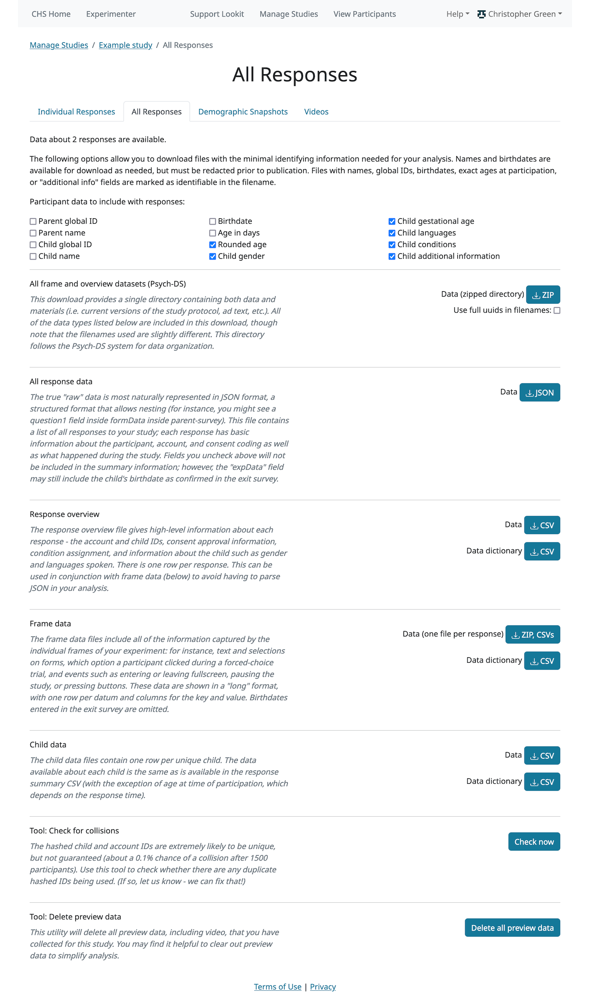
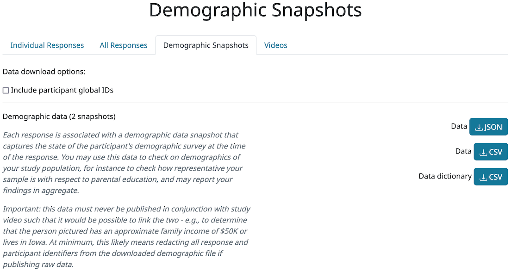

Study data
==============================

What data can I access?
-----------------------------------

You can access:
- response data from responses for which you have confirmed consent in the Consent Manager
- account, demographic, and child data associated with those responses. You will see these accounts under 'Manage Participants'; if some siblings but not others have participated in one of your studies and you have confirmed consent, you will only see the siblings who have participated.

Accessing experiment data
-----------------------------------

A researcher with edit permissions for a particular study can download
response data in JSON or CSV format via the Experimenter interface. (It is also possible
to download response data programmatically using the API.)

A response record in a Postgres database is created each time a participant
starts the study, and includes a timestamp, account information,
condition assignment, the sequence of frames the participant actually
saw, and frame-specific information for each frame (included in an
‘expData’ structure which is a JSON object with keys corresponding to
frame nicknames as defined in the study definition JSON). 

Each frame type may save different data, e.g. form responses or videos played; frames that record webcam video include the video filename(s). The data captured by a
particular frame are listed in the frame documentation at
http://lookit.github.io/ember-lookit-frameplayer, under ‘Methods’ >
‘serializeContent’. 

Additionally, event data is captured for each frame
and included under an eventTimings key within the frame data JSON,
minimally including a timestamped event when the user proceeds to the
next frame. These events are listed under ‘Events’ in the frame documentation.

Viewing individual study responses
-----------------------------------

To inspect single responses to your study, navigate to your study and click 'View Responses,' then 'Individual responses'. You must have permission to view this study's responses, which means you must be an Organization Admin, Organization Read, or belong to the Study Admin or Study Read groups.

Responses only show up in this view once you have confirmed that the participant provided informed consent to participate using the Consent Manager. 

On the left, you have a list of participants that have responded to your study, with the response id, the study's completion status, and the date it was modified. When you click on a response, the data from that response is shown on the right.  You can 
download the data from that response in one of several formats: JSON (JavaScript Object Notation, a structured text format); a CSV summary (a "wide format" overview with basic information about the participant and response, such as condition assignment); or CSV frame data (a "long format" detailed list of data collected in each frame during this response, complementary to the CSV summary).

Beneath the CSV/JSON response data are any individual videos that are linked to that participant's response. Exception: if the participant selected the 'withdraw video' option in an exit-survey frame at the end of the study, all video except for the consent video is unavailable (and will be deleted from Lookit servers as well in 7 days). 

.. admonition:: Withdrawn video
    There is a potential rare edge case where you access video while the participant is still doing the study, and then they withdraw, so you should still verify that none of your participants have withdrawn video.

On the "Individual Responses" page, you can leave feedback to participants. A lot of the motivation and reward families get from participating in research in person is the social interaction and knowledge that a real human appreciates their time and thinks their kid is super interesting. Feedback is essentially meant to approximate that from an online lab! Typically you might include a quick thanks-again, confirmation that everything worked ok (e.g., everything worked great, we can clearly see him looking right and left), some friendly personalized comment about the child/parent, and a response to any questions parents left in the exit survey. Families can see their feedback by going to Studies -> Past studies, but it is not emailed to them, so don't use this for anything where you really need to reach them (e.g., this is not a good way to send a gift card code!). 

.. image:: _static/img/responses.png
    :alt: View responses

.. _Response download options:

Viewing all study responses
------------------------------
To view all of the responses to a study with confirmed consent, click 'View Responses' from the study detail page and then click 'All Responses.' You must have permission to view this study's responses, which means you must be an Organization Admin, Organization Read, or belong to the Study Admin or Study Read groups.

There are several formats available to download your data. The raw data is available as a  JSON download; this is a structured, human-readable text format where you will be able to see how data is nested (e.g., a form response within a form within a frame). However, it may require more processing to use in your data analysis workflow (for instance to load it into R). 

For convenience, several options are provided for downloading data in CSV (comma separated value) format. CSV data can be easily examined in your spreadsheet editor of choice (like Excel) and loaded into programs like R for analysis.

The response overview file provides high-level information about each response and the participating child, with one row per response (a "wide" format). Not everything is included here, because there can be a lot of data per response (e.g., events collected each time the participant clicks something). You can download a data dictionary along with the response overview; this file provides information about how to interpret each column of the data file. When you publish your data, it is always a good idea to include a data dictionary, so this gives you a head start!

The response frame data file(s) provide all the data that was collected throughout the session. You can choose to download a single data file with ALL the frame data, or a ZIP archive with one file per response - whatever will be easier for you to use! This data is in a "long" format, where there are few columns and each row represents a single piece of information. So each response will be associated with many rows. You can download a data dictionary for the frame data, too! Because the exact types of data collected will vary across studies based on what frames you use, what questions are in your forms, and so on, you will need to fill in some of the data dictionary to explain what the various fields mean. But some of it is filled out for you, and there are placeholders for the explanations you'll need to add.

Structure of JSON session data
-----------------------------------

The data saved when a subject participates in a study varies based on
how that experiment is defined. For concreteness, let’s start by looking
at an example of the data you can download about a single session. (The
``eventTimings`` objects have been shortened to show just a single
event.)

.. code:: json

   {
       "response": {
           "id": 1190,
           "uuid": "d96b3ba5-6806-4c09-86e2-77456163eb5a",
           "sequence": [
               "0-video-config",
               "1-video-consent",
               "2-instructions",
               "3-mood-survey",
               "4-pref-phys-videos",
               "5-exit-survey"
           ],
           "conditions": {
               "4-pref-phys-videos": {
                   "showStay": 18,
                   "startType": 21
               }
           },
           "exp_data": {
               "3-mood-survey": {
                   "active": "4",
                   "rested": "1",
                   "healthy": "2",
                   "eventTimings": [
                       {
                           "eventType": "exp-mood-questionnaire:nextFrame",
                           "timestamp": "2018-07-06T23:56:06.459Z"
                       }
                   ]
               },
               "0-video-config": {
                   "eventTimings": [
                       {
                           "pipeId": "",
                           "videoId": "videoStream_0f620873-2847-4eeb-9854-df7898934c17_0-video-config_d96b3ba5-6806-4c09-86e2-77456163eb5a_1530921299537_405",
                           "eventType": "exp-video-config:recorderReady",
                           "timestamp": "2018-07-06T23:54:59.548Z",
                           "streamTime": null
                       }
                   ]
               },
               "2-instructions": {
                   "eventTimings": [
                       {
                           "eventType": "exp-physics-intro:nextFrame",
                           "timestamp": "2018-07-06T23:55:53.530Z"
                       }
                   ]
               },
               "1-video-consent": {
                   "videoId": "videoStream_0f620873-2847-4eeb-9854-df7898934c17_1-video-consent_d96b3ba5-6806-4c09-86e2-77456163eb5a_1530921346557_292",
                   "videoList": [
                       "videoStream_0f620873-2847-4eeb-9854-df7898934c17_1-video-consent_d96b3ba5-6806-4c09-86e2-77456163eb5a_1530921346557_292"
                   ],
                   "eventTimings": [
                       {
                           "pipeId": "",
                           "videoId": "videoStream_0f620873-2847-4eeb-9854-df7898934c17_1-video-consent_d96b3ba5-6806-4c09-86e2-77456163eb5a_1530921346557_292",
                           "eventType": "exp-video-consent:recorderReady",
                           "timestamp": "2018-07-06T23:55:46.558Z",
                           "streamTime": 0
                       }
                   ]
               },
               "5-exit-survey": {
                   "feedback": "",
                   "birthDate": "2018-07-03T04:00:00.000Z",
                   "useOfMedia": "private",
                   "withdrawal": false,
                   "eventTimings": [
                       {
                           "eventType": "exp-exit-survey:nextFrame",
                           "timestamp": "2018-07-06T23:57:02.201Z"
                       }
                   ],
                   "databraryShare": "no"
               },
               "4-pref-phys-videos": {
                   "videoId": "videoStream_0f620873-2847-4eeb-9854-df7898934c17_4-pref-phys-videos_d96b3ba5-6806-4c09-86e2-77456163eb5a_1530921371545_923",
                   "videoList": [
                       "videoStream_0f620873-2847-4eeb-9854-df7898934c17_4-pref-phys-videos_d96b3ba5-6806-4c09-86e2-77456163eb5a_1530921371545_923"
                   ],
                   "videosShown": [
                       "https://s3.amazonaws.com/lookitcontents/exp-physics-final/stimuli/stay/webm/sbs_stay_near_mostly-on_book_c2_green_NN.webm",
                       "https://s3.amazonaws.com/lookitcontents/exp-physics-final/stimuli/stay/webm/sbs_stay_mostly-on_near_book_c2_green_NN.webm"
                   ],
                   "eventTimings": [
                       {
                           "pipeId": "",
                           "videoId": "videoStream_0f620873-2847-4eeb-9854-df7898934c17_4-pref-phys-videos_d96b3ba5-6806-4c09-86e2-77456163eb5a_1530921371545_923",
                           "eventType": "exp-video-physics:recorderReady",
                           "timestamp": "2018-07-06T23:56:11.549Z",
                           "streamTime": 0
                       }
                   ]
               }
           },
           "global_event_timings": [],
           "completed": true
       },
       "study": {
           "id": 12,
           "uuid": "0f620873-2847-4eeb-9854-df7898934c17"
       },
       "participant": {
           "id": 3047,
           "uuid": "31692a6c-df1e-47e1-8ad0-e2780d095c05",
           "nickname": "Kim"
       },
       "child": {
           "id": 3749,
           "uuid": "470a0d33-77ee-4dd5-a64e-ec7231f23913",
           "name": "ExperimenterChild",
           "birthday": "2018-02-05",
           "gender": "f",
           "age_at_birth": "30",
           "additional_information": "Test child"
       }
   }

There are four top-level keys in this data: ``response``, ``study``,
``participant``, and ``child``. Study, participant, and child
information should be fairly self-explanatory: which study does this
response pertain to, which family account created the response, and
which child was participating. (The child key ``age_at_birth`` refers to
gestational age in weeks at birth.) The ``response`` data contains
information concerning this particular session: when it happened, what
condition the child was assigned to, events that happened as the family
proceeded through the study, etc. The response properties are described
below:

-  *id*: short unique ID for the response
-  *uuid*: long unique ID for the response (should be used as primary
   identifier)
-  *sequence*: The sequence of **frames** the subject actually saw
   (after running randomization, etc.). Does not include frames skipped
   if they left early. The frame names follow the pattern
   ``<order>-<frame.id>``, where ``<order>`` is the order in the
   overall sequence where this **frame** appeared, and ``<frame.id>`` is
   the identifier of the frame as defined in the ‘frames’ property of
   the experiment structure.
-  *conditions*: An object containing information about conditions to
   which the subject was assigned in any frames that do randomization
   (choice frames). Keys are in the format ``<order>-<frame.id>``
   corresponds with the ``<order>`` from the ‘sequence’ of the
   *original* experiment structure, and the ``<frame.id>`` again
   corresponds with the identifier of the frame as defined in the
   ‘frames’ property of the experiment structure. Data will be stored in
   conditions for the *first* frame created by a randomizer (top-level
   only for now, i.e. not from nested randomizers). Values are objects
   containing mappings from condition names to their values for this
   session. The data stored by a particular randomizer can be found
   under ``methods: conditions`` in the `randomizer
   documentation <http://lookit.github.io/ember-lookit-frameplayer/modules/randomizers.html>`__
-  *global_event_timings*: A list of events recorded during the study,
   not tied to a particular frame. Currently used for recording early
   exit from the study; an example value is:

.. code:: js

   [
               {
                   "exitType": "manualInterrupt",
                   "eventType": "exitEarly",
                   "timestamp": "2018-07-06T23:56:55.282Z",
                   "lastPageSeen": 10
               }
   ]

-  *completed*: A true/false flag indicating whether or not the
   participant submitted the last frame of the study. Note that this may
   not line up with your notion of whether the participant completed the
   study, in two ways: first, ``completed`` will be true even if the
   participant leaves early, as long as they submit the exit survey
   which they skip to when pressing F1. Second, ``completed`` will be
   false if they don’t submit that exit survey, even if they completed
   all of the important experimental parts of the study.
-  *exp_data*: A JSON object containing the data collected by each
   **frame** in the study. More on this below...

Interpreting ``exp_data``
-----------------------------------

Here’s an example of data collected during a session (note: not all
fields are shown):

.. code:: json

   {
       "sequence": [
           "0-intro-video",
           "1-survey",
           "2-exit-survey"
       ],
       "conditions": {
           "1-survey": {
               "parameterSet": {
                   "QUESTION1": "What is your favorite color?",
                   "QUESTION2": "What is your favorite number?"
               },
               "conditionNum": 0
           }
       },
       "exp_data": {
           "0-intro-video": {
               "eventTimings": [{
                   "eventType": "nextFrame",
                   "timestamp": "2016-03-23T16:28:20.753Z"
               }]
           },
           "1-survey": {
               "formData": {
                   "name": "Sam",
                   "favPie": "pecan"
               },
               "eventTimings": [{
                   "eventType": "nextFrame",
                   "timestamp": "2016-03-23T16:28:26.925Z"
               }]
           },
           "2-exit-survey": {
               "formData": {
                   "thoughts": "Great!",
                   "wouldParticipateAgain": "Yes"
               },
               "eventTimings": [{
                   "eventType": "nextFrame",
                   "timestamp": "2016-03-23T16:28:32.339Z"
               }]
           }
       }
   }

``exp_data`` is an object with three keys that correspond with the frame
names from ‘sequence’. Each of the associated values has an
``eventTimings`` property. This is a place to collect user-interaction
events during an experiment, and by default contains the ‘nextFrame’
event which records when the user progressed to the next **frame** in
the ‘sequence’. You can see which events a particular frame records by
looking at the ‘Events’ tab in its `frame
documentation <http://lookit.github.io/ember-lookit-frameplayer/modules/frames.html>`__.
Events recorded by a frame that does video recording will include
additional information, for instance to indicate when relative to the
video stream this event happened.

The other properties besides ‘eventTimings’ are dependent on the
**frame** type. You can see which other properties a particular frame
type records by looking at the parameters of the ``serializeContent``
method under the ‘Methods’ tab in its `frame
documentation <http://lookit.github.io/ember-lookit-frameplayer/modules/frames.html>`__.

Viewing demographics of study participants
-------------------------------------------
To view the demographics of participants that have responded to your study and have confirmed consent, click 'View Responses' from the study detail page and then click 'Demographic Snapshots.' You must have permission to view this study's responses, which means you must be an Organization Admin, Organization Read, or belong to the Study Admin or Study Read groups.

This list is generated by looping through all the responses to your study, and displaying the demographics of the associated participant.  If a participant has responded multiple times, the demographics will appear multiple times.  Demographic data was versioned, so the demographics associated with each
response will be the demographics that were current at the time the participant responded to the study.  You can download the demographics in JSON or CSV format.

Viewing all study videos
----------------------------------------
To view all video responses to your study from sessions with confirmed consent,click 'View Responses' from the study detail page and then click 'Videos.'.
You can filter on video name. The format of the video names is `videoStream_{study_uuid}_{order-frame_name}_{response_uuid}_{timestamp}_{randomDigits}.mp4`

Videos can be downloaded individually.  You also have the option of bulk downloading all consent videos for your study, or bulk downloading all responses.
The bulk download will take place asynchronously, so once the videos have been downloaded and put in a zip file, you will get an email telling you this is done.

.. image:: _static/img/attachments.png
    :alt: View all study videos

.. _Interpreting session data: