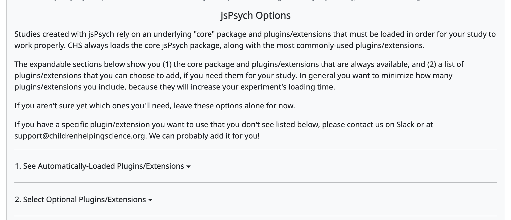

.. _jspsych-intro:

====================================
jsPsych studies on CHS
====================================

`jsPsych <https://www.jspsych.org/latest/>`__ is an open source library for creating a wide range of behavioral experiments that run in a web browser. It consists of a core library and "plugins". Plugins are the components that make up the experiment. Each plugin lets you define different kinds of events (e.g. presenting an image or text) and it collects different kinds of data (e.g. responses and response times). The jsPsych library also supports a wide range of features that are commonly used in behavioral experiments, like looping over sets of trials, randomizing, sampling, and conditional behavior.

To get a feel for how to build a jsPsych experiment, you can check out the jsPsych `Hello World tutorial <https://www.jspsych.org/v8/tutorials/hello-world/>`__ and `RT task tutorial <https://www.jspsych.org/v8/tutorials/rt-task/>`__. We also have our own :ref:`CHS jsPsych Hello World tutorial <jspsych-tutorial-first-study>`, which demonstrates the CHS-specific features (:ref:`detailed in this section <chs-jspsych-packages>`) that we've added for jsPsych studies running on the CHS platform.

To learn more about jsPsych features, some other great places to start are the jsPsych documentation about `timelines <https://www.jspsych.org/v8/overview/timeline/>`__ and `dynamic parameters <https://www.jspsych.org/v8/overview/dynamic-parameters/>`__.

.. _jspsych-packages:

jsPsych packages
==============================

To run a jsPsych study, the CHS experiment runner needs to load the core jsPsych library along with the plugins and extensions that your experiment uses. CHS always loads the core jsPsych library and a set of the most commonly-used plugins/extensions, so these are available to every jsPsych study with no setup on your part. A larger set of optional plugins/extensions is also available, and you choose which of these to add for your study.

.. _jspsych-select-packages:

Selecting plugins/extensions for your study
--------------------------------------------

You choose which optional plugins/extensions to load on the "Edit Study Design" page for your study (see :ref:`Setting the study design <study_design>`). In the **jsPsych Options** area of that page, you'll find two expandable sections:

#. **See Automatically-Loaded Plugins/Extensions** — a read-only list of the packages that are always available to your study (the core jsPsych library, the auto-loaded plugins, and the CHS packages). You don't need to do anything here.
#. **Select Optional Plugins/Extensions** — a set of checkboxes for the additional plugins/extensions you can add if your experiment needs them.

.. admonition:: Only select the plugins/extensions you need

   Every plugin/extension you add has to be downloaded when a participant loads your study, so selecting more than your study needs will make it load more slowly. If you aren't sure yet which ones you'll need, you can leave these options alone for now and come back to update them later. If you have a plugin/extension you'd like to use that isn't listed, let us know on Slack or at support@childrenhelpingscience.org — we can probably add it for you!

.. admonition:: Note for older jsPsych studies

   jsPsych studies created before this feature was added automatically have **all** available plugins/extensions selected, so they continue to work exactly as before. You can edit your study design and clear any you don't need to speed up loading.

.. _jspsych-autoload-packages:

Always-available packages
--------------------------

CHS always loads the following standard jsPsych packages for every jsPsych study, so they are available to use without being selected. The versions loaded by CHS are shown below, along with links to documentation and change logs (version history). (The custom CHS packages that are always loaded are listed :ref:`further down <chs-jspsych-packages>`.)

.. rst-class:: jspsych-plugins-extensions

- `Core jsPsych library <https://www.jspsych.org/v8/>`__

  - v8.0.3 (`see changelog <https://github.com/jspsych/jsPsych/blob/main/packages/jspsych/CHANGELOG.md>`__)

- `Fullscreen plugin <https://www.jspsych.org/latest/plugins/fullscreen/>`__

  - v2.1.0 (`see changelog <https://github.com/jspsych/jsPsych/blob/main/packages/plugin-fullscreen/CHANGELOG.md>`__)
  - ``jsPsychFullscreen``

- `HTML button response plugin <https://www.jspsych.org/v8/plugins/html-button-response>`__

  - v2.0.0 (`see changelog <https://github.com/jspsych/jsPsych/blob/main/packages/plugin-html-button-response/CHANGELOG.md>`__)
  - ``jsPsychHtmlButtonResponse``

- `Image button response plugin <https://www.jspsych.org/v8/plugins/image-button-response/>`__

  - v2.0.0 (`see changelog <https://github.com/jspsych/jsPsych/blob/main/packages/plugin-image-button-response/CHANGELOG.md>`__)
  - ``jsPsychImageButtonResponse``

- `Preload plugin <https://www.jspsych.org/v8/plugins/preload/>`__

  - v2.0.0  (`see changelog <https://github.com/jspsych/jsPsych/blob/main/packages/plugin-preload/CHANGELOG.md>`__)
  - ``jsPsychPreload``

- `Video button response plugin <https://www.jspsych.org/v8/plugins/video-button-response/>`__

  - v2.0.0 (`see changelog <https://github.com/jspsych/jsPsych/blob/main/packages/plugin-video-button-response/CHANGELOG.md>`__)
  - ``jsPsychVideoButtonResponse``

.. _jspsych-optional-packages:

Optional plugins/extensions
----------------------------

The following standard jsPsych packages are available to add on the "Edit Study Design" page (see ":ref:`Selecting plugins/extensions for your study <jspsych-select-packages>`" above). Select only the ones your study needs.

From the standard jsPsych library:

.. rst-class:: jspsych-plugins-extensions

- `HTML keyboard response plugin <https://www.jspsych.org/v8/plugins/html-keyboard-response/>`__

  - v2.0.0 (`see changelog <https://github.com/jspsych/jsPsych/blob/main/packages/plugin-html-keyboard-response/CHANGELOG.md>`__)
  - ``jsPsychHtmlKeyboardResponse``

- `Image keyboard response plugin <https://www.jspsych.org/v8/plugins/image-keyboard-response/>`__

  - v2.0.0 (`see changelog <https://github.com/jspsych/jsPsych/blob/main/packages/plugin-image-keyboard-response/CHANGELOG.md>`__)
  - ``jsPsychImageKeyboardResponse``

- `Instructions plugin <https://www.jspsych.org/v8/plugins/instructions/>`__

  - v2.1.0 (`see changelog <https://github.com/jspsych/jsPsych/blob/main/packages/plugin-instructions/CHANGELOG.md>`__)
  - ``jsPsychInstructions``

- `Survey Likert plugin <https://www.jspsych.org/latest/plugins/survey-likert/>`__

  - v2.2.0 (`see changelog <https://github.com/jspsych/jsPsych/blob/main/packages/plugin-survey-likert/CHANGELOG.md>`__)
  - ``jsPsychSurveyLikert``

- `Survey multi-choice plugin <https://www.jspsych.org/latest/plugins/survey-multi-choice/>`__

  - v2.1.0 (`see changelog <https://github.com/jspsych/jsPsych/blob/main/packages/plugin-survey-multi-choice/CHANGELOG.md>`__)
  - ``jsPsychSurveyMultiChoice``

- `Survey text plugin <https://www.jspsych.org/latest/plugins/survey-text/>`__

  - v2.1.0 (`see changelog <https://github.com/jspsych/jsPsych/blob/main/packages/plugin-survey-text/CHANGELOG.md>`__)
  - ``jsPsychSurveyText``

- `Video keyboard response plugin <https://www.jspsych.org/latest/plugins/video-keyboard-response/>`__

  - v2.1.0 (`see changelog <https://github.com/jspsych/jsPsych/blob/main/packages/plugin-video-keyboard-response/CHANGELOG.md>`__)
  - ``jsPsychVideoKeyboardResponse``

We also welcome community-developed jsPsych plugins/extensions from the `jsPsych-contrib Github repository <https://github.com/jspsych/jspsych-contrib>`__. The following jsPsych-contrib packages are available to add:

.. rst-class:: jspsych-plugins-extensions

- `Image hotspots plugin <https://github.com/jspsych/jspsych-contrib/blob/main/packages/plugin-image-hotspots/docs/plugin-image-hotspots.md>`__

  - v1.1.0 (`see changelog <https://github.com/jspsych/jspsych-contrib/blob/main/packages/plugin-image-hotspots/CHANGELOG.md>`__)
  - ``jsPsychImageHotspots``

- `Tangram game plugin <https://github.com/jspsych/jspsych-contrib/blob/main/packages/plugin-tangram-game/docs/plugin-tangram-game.md>`__

  - v1.0.0 (`see changelog <https://github.com/jspsych/jspsych-contrib/blob/main/packages/plugin-tangram-game/CHANGELOG.md>`__)
  - ``jsPsychTangram``

- `Video hotspots plugin <https://github.com/jspsych/jspsych-contrib/blob/main/packages/plugin-video-hotspots/docs/plugin-video-hotspots.md>`__

  - v1.1.0 (`see changelog <https://github.com/jspsych/jspsych-contrib/blob/main/packages/plugin-video-hotspots/CHANGELOG.md>`__)
  - ``jsPsychVideoHotspots``

.. admonition:: Need something else?

   If there are any specific jsPsych plugins/extensions that your experiment needs, please let us know! If you have a custom plugin/extension you want to use, please submit it to jspsych-contrib for review and publishing on NPM, and then we can add it to CHS. The best way to request access to a standard jsPsych package is by creating a ``lookit-api`` `Github issue <https://github.com/lookit/lookit-api/issues>`__, but you can also let us know on Slack.

.. _chs-jspsych-packages:

Custom CHS jsPsych packages
==================================================

In addition to the jsPsych packages listed above, the CHS jsPsych experiment runner also automatically loads some custom packages. These custom plugins/extensions were designed to "fill in the gaps" in the sort of functionality that CHS researchers typically need for child development studies. This functionality includes: standardized webcam/mic configuration steps, video-recorded consent, trial/session recording, and standardized exit surveys. Like the always-available standard jsPsych packages, these custom CHS packages are loaded for every jsPsych study and don't need to be selected.

The custom CHS-jsPsych packages/versions are listed below, along with links to documentation and change logs (version history). The `CHS jsPsych documentation <https://lookit.readthedocs.io/projects/chs-jspsych/en/latest/>`__ contains more information about all of the parameters available in the CHS-jsPsych plugins/extensions.

**CHS Record package**

Current version: 9.0.0 (`see changelog <https://github.com/lookit/lookit-jspsych/blob/main/packages/record/CHANGELOG.md>`__)

.. rst-class:: jspsych-plugins-extensions

- `Start session recording plugin <https://lookit.readthedocs.io/projects/chs-jspsych/en/latest/record/#session-recording>`__

  - ``chsRecord.StartRecordPlugin``

- `Stop session recording plugin <https://lookit.readthedocs.io/projects/chs-jspsych/en/latest/record/#session-recording>`__

  - ``chsRecord.StopRecordPlugin``

- `Trial recording extension <https://lookit.readthedocs.io/projects/chs-jspsych/en/latest/record/#trial-recording-extension>`__

  - ``chsRecord.TrialRecordExtension``

- `Video assent plugin <https://lookit.readthedocs.io/projects/chs-jspsych/en/latest/record/#video-assent-plugin>`__

  - ``chsRecord.VideoAssentPlugin``

- `Video config plugin <https://lookit.readthedocs.io/projects/chs-jspsych/en/latest/record/#video-configuration-plugin>`__

  - ``chsRecord.VideoConfigPlugin``

- `Video consent plugin <https://lookit.readthedocs.io/projects/chs-jspsych/en/latest/record/#video-consent-plugin>`__

  - ``chsRecord.VideoConsentPlugin``

**CHS Surveys package**

Current version: v9.0.0 (`see changelog <https://github.com/lookit/lookit-jspsych/blob/main/packages/surveys/CHANGELOG.md>`__)

.. rst-class:: jspsych-plugins-extensions

- `Consent survey plugin <https://lookit.readthedocs.io/projects/chs-jspsych/en/latest/surveys/#consent-survey>`__

  - ``chsSurveys.ConsentSurveyPlugin``

- `Exit survey plugin <https://lookit.readthedocs.io/projects/chs-jspsych/en/latest/surveys/#exit-survey>`__

  - ``chsSurveys.ExitSurveyPlugin``

.. _chs-jspsych-translations:

Translations
--------------------------

All of these plugins/extensions support the automatic translation of hard-coded text through a ``locale`` parameter.

.. admonition:: Need something else?

    Do you need any types of trials (Lookit EFP "frames") or features that are not listed here, and are not available through the standard jsPsych library? Let us know! The best way to request a custom (CHS-specific) jsPsych plugin/extension or feature is by creating a ``lookit-jspsych`` `Github issue <https://github.com/lookit/lookit-jspsych/issues>`__, but you can also let us know on Slack.
