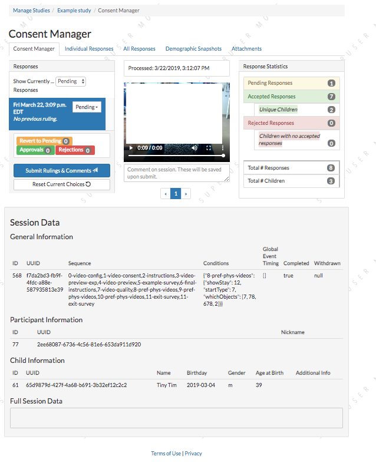

##################################
Consent manager
##################################

===========
Overview
===========

At the start of a Lookit study, the parent is asked to provide a verbal statement of informed consent. Unlike in the lab (or at least to a greater extent), it is technically possible for you to end up collecting data from a parent who did NOT consent to participate - e.g., someone idly clicking through who may not understand that this is a research study to do with a child. 

For this reason it is critical that you confirm informed consent before using any data from a response! This is baked into the Lookit experimenter interface: you actually do not receive access to responses, or to the associated child, account, or demographic data, until you confirm consent using the consent manager. 

Responses submitted on Lookit start out with a consent status of 'Pending.' Then a researcher working on this study can either 'approve' or 'reject' the consent video.  

==============================
Managing consent rulings
==============================

From your study detail page, click 'View Responses' and you will be taken to the 'Consent manager' view. 

    
At the left, you will see a list of responses. By default the responses with 'Pending' consent status are displayed; you can use the dropdown menu to show 'Accepted' or 'Rejected' consent videos instead. 

-----------------------
Making consent rulings
-----------------------

When you click on a response, any consent videos from that response are shown to the right. (It is possible, although rare, for there to be multiple consent videos associated with a single response; this will become more common when some researchers are collecting both parental consent and child assent, which would be judged together.) A minimal summary of the data is shown below so that you can see whether the child is in the age range for the study and how far the family got. Unless this response already has already been accepted, you will NOT see 'Full Session Data' shown, because this could include more sensitive information.

Watch the video, and decide whether it shows informed consent. You can choose to 'Accept' or 'Reject' a response, and can enter a comment if desired to keep track of any additional information. You can enter a comment without changing the consent ruling (e.g., to say "Emailed this family to confirm consent"). In general, you should 'accept' consent only when the consent video shows an adult reading the consent statement audibly (or signing in ASL), but see the `Terms of Use <https://lookit.mit.edu/termsofuse/>`_ for details (for instance, you may be able to contact a family to confirm consent by email in some cases). 

Repeat for each consent video. When you are done for now, click 'Submit Rulings and Comments' to save your judgments. These changes will immediately be reflected in the number of responses available in the 'individual responses' and 'all responses' views, as well as with respect to demographic and participant data you have access to.

Consent rulings can be changed after an initial ruling is made; for instance, you can use the dropdown menu to display 'Accepted' responses and either 'Reject' or 'Revert to pending.' 

The most recent consent ruling, the time of that ruling, any comment, and the name of the researcher who made the ruling, will be included in the JSON/CSV data for this response.

--------------------
Response statistics
--------------------

A summary of responses is shown to the right of the consent manager, providing some very basic information about the non-consented responses that may be useful for publication of results. You can see how many responses are still pending consent confirmation; how many accepted responses there are (from how many unique children); and how many responses were rejected (from how many unique children who did not also have some response accepted).

--------------------
Withdrawn responses
--------------------

If a parent chooses to withdraw video data at the end of the study, that will be noted in the list item for the response (before the comment it will say 'Withdrawn' and the response will be crossed out). All video data beyond consent will be inaccessible to researchers, and it will be deleted automatically from Lookit servers after seven days. 

However, you are still able to make a consent ruling about the consent video; this will still impact access to the remaining non-video response data as well as associated child, demographic, and account data. 
