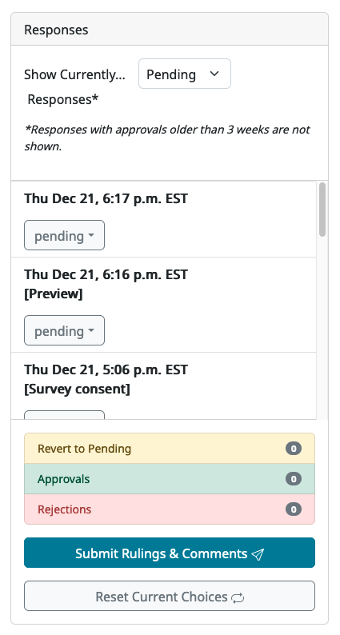
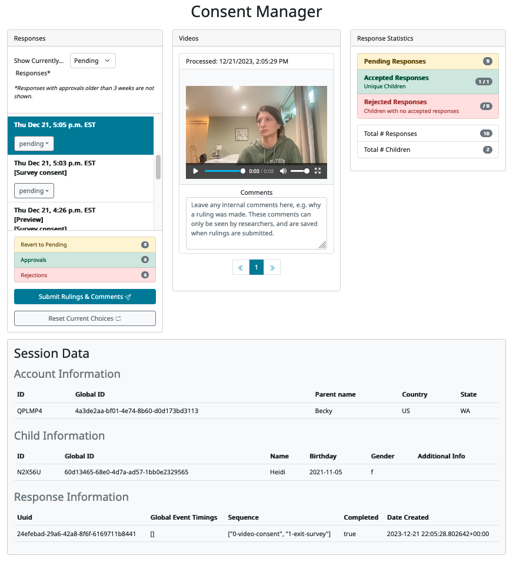
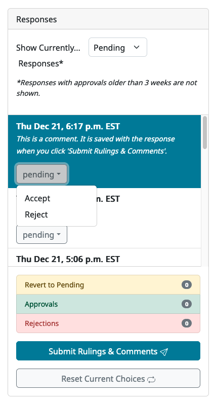
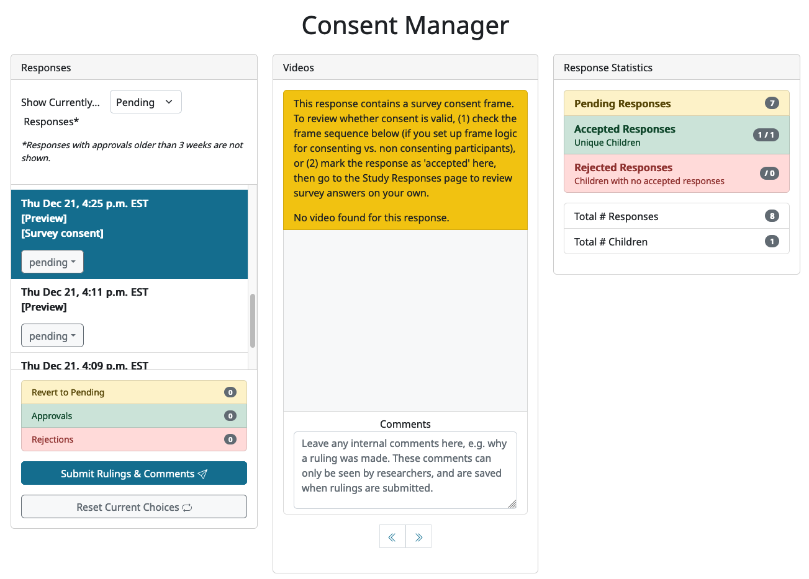

##################################
Coding consent
##################################

===========
Overview
===========

At the start of a Lookit study, the parent is asked to provide a verbal statement of informed consent. Unlike in the lab (or at least to a greater extent), it is technically possible for you to end up collecting data from a parent who did NOT consent to participate - e.g., someone idly clicking through who may not understand that this is a research study to do with a child. 

For this reason it is critical that you confirm informed consent before using any data from a response! This is baked into the Lookit experimenter interface: you actually do not receive access to responses, or to the associated child, account, or demographic data, until you confirm consent using the consent manager. 

Responses to your Lookit study will first appear in your study's 'Consent Manager' page, and they start out with a consent status of 'Pending'. Then a researcher working on this study can either 'Approve' or 'Reject' the consent video. Responses with approved consent become available to the researcher through the study's 'Study Responses' page.

==============================
Managing consent rulings
==============================

From your study detail page, click 'Review Consent' and you will be taken to the 'Consent Manager' view.

.. image:: _static/img/consent_manager.png
    :alt: Consent manager image
    
On the left, you will see a list of responses. By default the responses with 'Pending' consent status are displayed; you can use the dropdown menu at the top of this section to show 'Accepted' or 'Rejected' consent videos instead. Note that you may need to use the scroll bar on the right side of the list to see all of the responses listed.

If you are previewing your study and have included a consent form, then the preview response will be displayed here too with "[Preview]" under the timestamp. If you are using a survey-consent frame in your study, then that will also be flagged in the response with "[Survey consent]".

-----------------------
Making consent rulings
-----------------------

When you click on any response in the list to the left, more information about that response will become visible on the page. First, any consent videos from that response are shown in the 'Videos' column, along with a comment box below where you can leave *internal* comments about the consent video(s) and reasons for your ruling. Second, a minimal summary of the response information is shown in the 'Session Data' area at the bottom of the page. This allows you to see certain bits of information that might be relevant to your ruling, such as whether the child is in the age range for the study, which trials they completed during the session, whether they completed the study (i.e. their response includes an exit-survey frame) and other IDs/demographics that are useful for reporting potential spam participants.

.. tip::
   It is possible, although rare, for there to be multiple consent videos associated with a single response. This would occur, for instance, when researchers are collecting both parental consent and child assent videos, which would be judged together. In these cases, you will see more than one number inside the arrow buttons below the video, and you can use the buttons to navigate across all consent videos for that session. Even with multiple videos, there will only be one comment allowed per session (since the comment box is intended for notes about the overall decision, rather than notes on individual videos).

For each response session in your list, you should watch the video and decide whether it shows informed consent. You can choose to 'Accept' or 'Reject' a response by changing the value in that response's dropdown box. You can also add a comment about that response or consent decision, if desired, to keep track of any additional information. You can enter a comment without changing the consent ruling (e.g., to say "Emailed this family to confirm consent"). In general, you should 'accept' consent only when the consent video shows an adult reading the consent statement audibly (or signing in ASL), but see the `Terms of Use <https://lookit.mit.edu/termsofuse/>`_ for details (for instance, you may be able to contact a family to confirm consent by email in some cases).

Repeat this process for each response session in your list. Any responses that you leave as 'pending' will be available on this page for you to come back to later. When you are done for now, click 'Submit Rulings and Comments' at the bottom of your response list to save your rulings and comments. Any comments you have added will appear inside the relevant response in the response list. Any changes to your 'accepted' responses will be immediately be reflected in the number of responses available on your 'Study Responses' page, as well as with respect to the demographic and participant data you have access to.

Consent rulings can be changed after an initial ruling is made; for instance, you can use the dropdown menu to display 'Accepted' responses and either 'Reject' or 'Revert to pending.'

The most recent consent ruling, the time of that ruling, any comment, and the name of the researcher who made the ruling, will be included in the JSON/CSV data for this response.

----------------------------------------------
Managing responses that use survey consent
----------------------------------------------

In general, all studies on CHS should use the video recordings for consent. However there may be studies that collect consent through survey-style questions - for instance, in rare cases when, for legal reasons, it is not possible to collect video consent. In internal Lookit studies, this is done using the ``survey-consent`` frame. 

When a study uses survey questions for consent, researchers are still responsible for verifying that the family has actually consented by checking their answers to the consent question(s). On the Consent Manager page, any sessions in the response list that contain a ``survey-consent`` frame will be flagged with "[Survey consent]". When such a response is selected, a warning message will also appear at the top of the Video area. Depending on the study, there may or may not also be a consent video associated with the response session; if so then it will appear in the Video area, otherwise there will another warning message saying "No video found for this response".

Responses that contain survey consent trials present a tricky case for the CHS data management workflow, because the consent information is only available from within the response data, but researchers should not have access to that data unless consent has been verified. (We do not pull the consent questions/answers out of the response and present them in the Consent Manager, in the way that we do with consent videos, though this may be something we can add in the future.) For this reason, there are some best practices that we ask researchers to follow to make it as easy as possible to tell whether a family has consented using survey questions, and to make sure that researchers aren't inadvertently accessing un-consented data. You should set up your study in one of the following ways:

* **Make it impossible to move on from the consent survey page if the participant has not consented.** This means using the survey consent form's validation tools to produce an error when a participant tries to move on from the survey-consent trial without agreeing to the terms of the study.

Or:

* **Make the study sequence conditional based on responses to the consent questions.** This might mean that participants who do not consent are sent to a separate 'no-consent' trial, which shows a message like 'The study has ended because you indicated that you do not wish to participate. Thank you for your interest!'.

With both of the above approaches, when you select a response in the Consent Manager, you should be able to tell whether the participant has consented by looking at the trials listed in their Session Info 'Sequence'. If the participant was able to move past the consent survey questions and onto your study, then they must have agreed to all of the consent questions. Therefore you can 'accept' the consent for that response.

If for some reason these approaches don't work for your study, you can always accept the consent for responses that contain survey consent questions, then *check actual consent responses in the data* and change the consent ruling if necessary.

-----------------------------------
Consenting and 'fake participants'
-----------------------------------

Occasionally, people make a CHS account (or multiple accounts!!) in order to try and collect payments without participating in good faith. In addition to the video itself, the account information shown below the video is designed to be helpful in evaluating and reporting potential fake participants.

For information on dealing with this, please see our page on :ref:`spam prevention<spam_prevention>`. 

--------------------
Response statistics
--------------------

A summary of responses is shown to the right of the consent manager, providing some very basic information about the non-consented responses that may be useful for publication of results. You can see how many responses are still pending consent confirmation; how many accepted responses there are (from how many unique children); and how many responses were rejected (from how many unique children who did not also have some response accepted).

--------------------
Withdrawn responses
--------------------

If a parent chooses to withdraw video data at the end of the study, that will be noted in the list item for the response (before the comment it will say 'Withdrawn' and the response will be crossed out). All video data beyond consent will be inaccessible to researchers, and it will be deleted automatically from Lookit servers after seven days. 

However, you are still able to make a consent ruling about the consent video; this will still impact access to the remaining non-video response data as well as associated child, demographic, and account data. 

--------------------------------
Where are my preview responses?
--------------------------------

When you preview a study, data is saved to the server the same way as when you participate. However, this data is only available for you to see if you complete at least a consent frame. 

When you're working on a study, you may often be trying out pieces of the study without going through the consent process every time. Once you want to take a look at the data collected, just make sure you include a consent frame. 