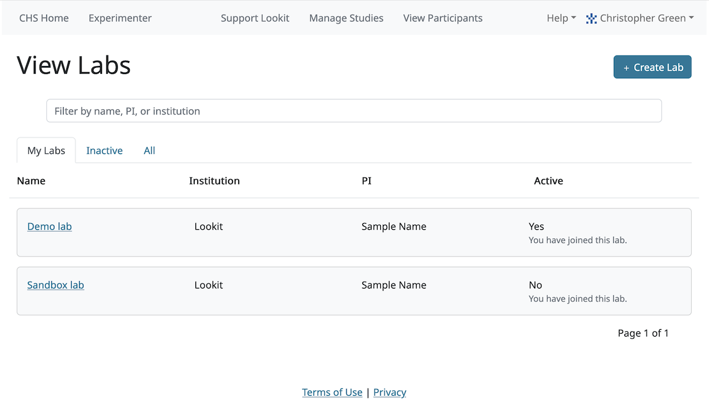

.. _labs:

########################################################
Labs on Lookit 
########################################################

Each study on Lookit is associated with a lab. Some basic information about each lab is
stored on Lookit, like the lab's name, a contact email, and whether the lab has been
approved to use Lookit to collect data. In the future, this information will be used to 
create a display page where participants can learn more about your lab, but for now, it is 
only visible to researchers.

Researcher accounts on Lookit can be affiliated with any number of labs. Only a researcher who 
is part of a lab can be granted permissions to studies that lab is running. Researchers 
can also be granted some permissions for the lab as a whole: for instance, to edit the lab
description, manage membership, or see all studies the lab is running.

--------------------------------------------------------
The Sandbox and Demo labs
--------------------------------------------------------

There are two "special" labs that everyone on Lookit is added to automatically. When you log into Lookit for the first time, if you click on "Manage Labs," you should see something like this:

You are added as a "Guest" in the **Sandbox lab.** This means you can create new studies associated with the Sandbox lab, and you can be given permissions to other studies associated with the Sandbox lab. However, you can't change the lab or see all the studies it is running. If you're working through the tutorial or trying out Lookit to see how it works, you can work on studies in the Sandbox lab and not have to create your own lab.

You are added with "View" permissions in the **Demo lab.** This means you can see and preview all of the studies in the Demo lab, but not create any new studies in this lab. We keep some example studies in the Demo lab so that everyone can see them. You can clone any of the Demo lab studies into the Sandbox lab or your own lab so you can edit a copy.

--------------------------------------------------------
Creating a new lab
--------------------------------------------------------

From the "Manage Labs" page, click the green "Create Lab" button. This will take you to a form where you can enter the information about your lab. When you click "Submit," the lab will be created, with you as an admin, and Lookit staff will be notified of the new lab. You will be able to see your new lab in your list of labs.

--------------------------------------------------------
Approval to test
--------------------------------------------------------

Once Lookit staff receive a signed institutional agreement for your lab to use Lookit, and 
at least one of your lab members has completed the Terms of Use quiz, your lab will be 
changed to "approved to test." Lab admins will be notified by email when the lab is approved to test. You can also see whether a lab is currently approved to test by clicking on it in the list of labs to view more details:

    
Before a lab is approved to test, you can add and manage lab members and create studies associated with the lab; you just won't be able to submit or start those studies yet. 

Individual studies will still require review - the lab being approved to test is not blanket approval for all studies you might run.

--------------------------------------------------------
Joining an existing lab
--------------------------------------------------------

If your lab is already on Lookit, you can find it and join it. Go to "Manage Labs" and click the "All" tab. Then you can search by name, PI name, or institution to find the lab. Click "request to join" next to the lab you would like to join. (You can also click on the lab to get more details first!)

    
The lab admins will receive an email notifying them of your request, and you will be emailed when they add you.

.. _lab_permissions:

--------------------------------------------------------
Adding lab members and managing permissions
--------------------------------------------------------

Researchers have to request to join your lab; you don't add them directly. As a lab admin, you will receive emails when new researchers request to join your lab. You can also set researchers' permission levels. There are three roles you can assign researchers to:

Guest
    Can create new studies associated with this lab, and can be given permissions to specific studies associated with this lab

Lab member
    Guest-level permissions, plus: can `READ_STUDY_DETAILS`, `READ_STUDY_PREVIEW_DATA`, and `CODE_STUDY_PREVIEW_CONSENT` for every study associated with this lab. For details of these permissions, see :ref:`the section on study permissions<study_permissions>`; essentially this lets a lab member view all the studies associated with a lab, but not edit those studies, change their status, or view any human subjects data unless they have study-specific permissions.

Admin
    Lab member permissions, plus: can edit lab metadata (name, contact email, etc.), can manage lab researchers (add/remove people, change perms among these three groups); and `WRITE_STUDY_DETAILS`, `CHANGE_STUDY_STATUS`, and `MANAGE_STUDY_RESEARCHERS` for every study associated with this lab. Again, this does not grant access to any human subjects data without study-specific permissions, but it does allow a lab admin to manage who has what access to which studies, edit study protocols and descriptions, and start and stop data collection.

Whether to make most lab members "guests" vs. "full members" is just a matter of whether you want a more communal workspace where everyone can see all the studies, or a more private workspace where people have to be invited to collaborate on particular studies. You might choose to make everyone in your lab a "lab member," but occasionally add an outside collaborator who's just helping with a single study as a guest.

By design, there is no way to give anyone access to participant data for all studies in your lab. You have to give them permission to individual studies. 

--------------------------------------------------------
Lab's custom URL
--------------------------------------------------------

Each lab has its own page on Lookit. Families can visit your lab page to find all of the active studies run by your lab. To find the current custom URL for your lab, go to "Manage Labs" and select your lab. You will find the link to the lab's page under "Custom URL".

To change your lab's URL, click "Edit lab" in the top right of your lab's information page. Update the "Custom URL" to suit your lab's preferences.  

--------------------------------------------------------
Order lab's studies
--------------------------------------------------------

At your lab's custom URL there will be a list of your lab's experiments.  To update the order of the studies, change the "Lab Page Priority" value under each study's edit page.  