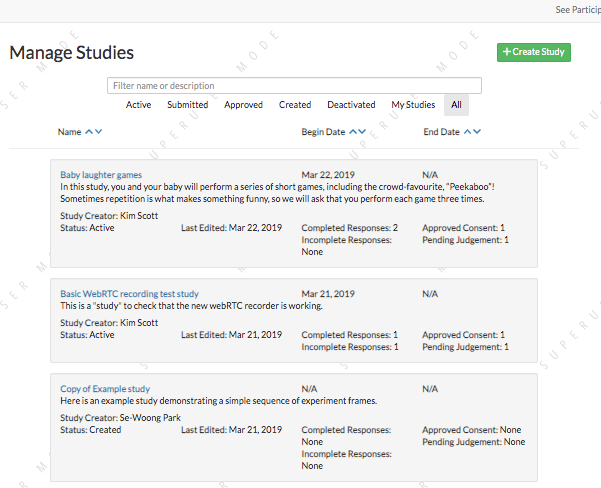
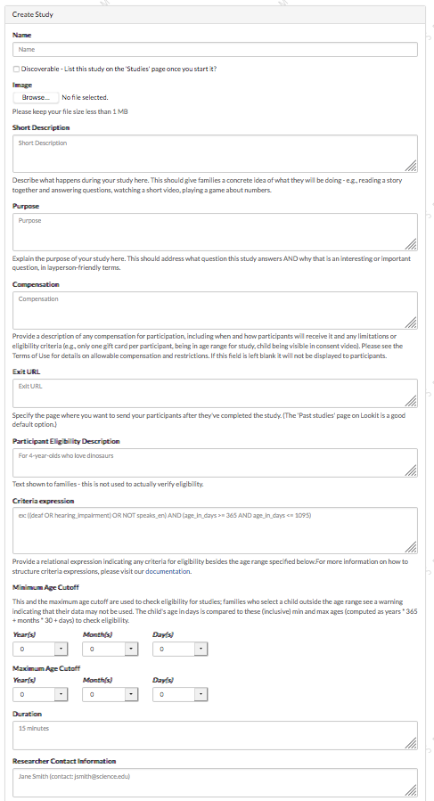
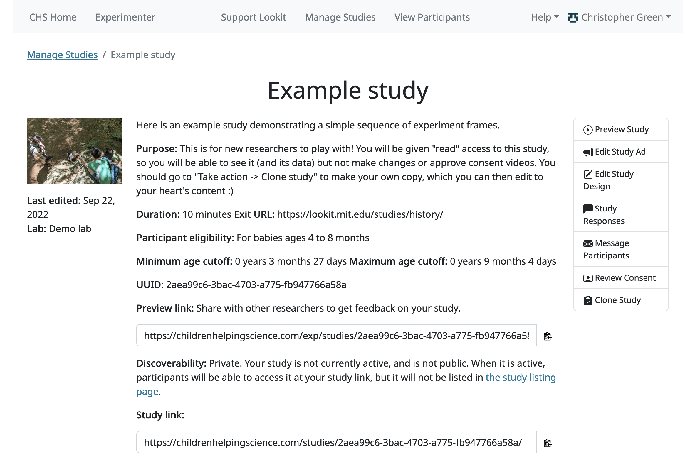
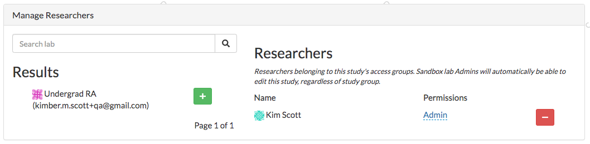
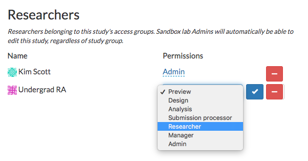
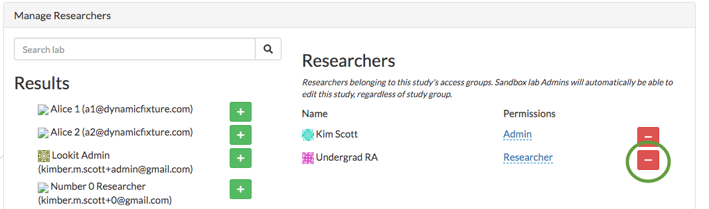
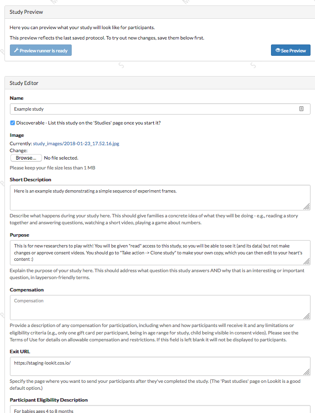

##################################
Managing Studies
##################################

--------------------
Viewing study list
--------------------
To view all studies, navigate to /exp/studies/. (We will use this short format to indicate relative paths starting with the Lookit site you are using - e.g., https://lookit.mit.edu/exp/studies/ or https://staging-lookit.mit.edu/exp/studies/).  A researcher must have been added to an organization to view this page.  From there, the researcher can only see studies they have permission to view.  Org admins and org reads can see all studies that belong to their organization.  If the user is a basic researcher, they can only view studies which they have created or to which they have been explicitly added.

You can filter studies by name or by keywords in the description. Additionally, you can sort on various study states like "Created" or "Submitted", or filter on your own studies by selecting "My Studies". You can also sort on study name, study end date, and study begin date.

--------------------
Creating a study
--------------------
To create a study, navigate to /exp/studies/create/. You'll need to provide values for the fields as described in `Setting study fields`_.

--------------------
Study detail page
--------------------
To view a single study, click on it from the study list.  A researcher must have permission to view this study specifically.  Org admins and org reads can view all studies in their organization.  A basic researcher can only view this study if they have been
explicitly added as a study admin or study read. At the top, you see many of the study details that you entered when you created the study.  The UUID is also displayed; this is your study's unique identifier and is used in the direct link to the study. 

At the top right, you have options to edit the study, view responses, email participants, or clone the study. Cloning will create a copy of the study but add the logged in user as the creator. The clone will be moved back into "Created" status (e.g., if the current study is actively collecting data, the cloned study will not be - it will need to be approved before it can be started). Study logs of when the study changed state are at the bottom of the page.

The only things that can be edited from this page are the study status and researcher list.  The current study status is displayed, as well as a dropdown with the available states.  Only users that have permission to edit the study state can make these changes, meaning organization admins, or study admins.  The available states where you can move the study depend on what state is next in the sequence, as well as your current level of permissions.  For example, if a study's current state is "Created", that study
can only be "Submitted" for review, or "Archived", which removes the study from display.  Comments can only be left on the study if it is being rejected.  Only organization admins can approve or reject a study.

--------------
Study status
--------------

New studies must be submitted and approved by Lookit before they can be started. Once approved, researchers with study admin permissions can independently start/pause data collection at will; however, if any changes are made to the study it will be automatically rejected and will require re-approval. The study approval process is intended to give Lookit staff an opportunity to check that studies comply with the Terms of Use and to provide support if necessary. Researchers will receive email notifications when their study is approved or rejected.

The possible study states are:

    - *created*: Study has been initially created, but has not been submitted for approval
    - *submitted*: Study is submitted and awaiting approval by an organization admin
    - *approved*: Study has been approved by an organization admin to run on Lookit, but is not yet active
    - *rejected*: The study has been rejected by an organization admin.  The study should be edited before resubmitting.
    - *active*: Study is active and can be collecting data. If the study is also marked "Discoverable", the study will show up on Lookit's study list.
    - *paused*: Study is not actively collecting data or visible on Lookit
    - *deactivated*: Study is done collecting data
    - *archived*: Study has been archived and removed from search
    
---------------------------------
Adding researchers to your study
---------------------------------
Halfway down the study detail page, you can see the researchers that have study admin or study read permissions to your study. In the search box, you can look for an existing Lookit researcher (this must be someone who has already been added to your organization). 

Click the green plus to add them to your study.  They are given study read permissions by default; this allows them to see all study details and participant data and to approve consent videos, but not to change study details, change study status (e.g. start/stop data collection), or add other researchers. 

If the researcher you are adding happens to also be an organization admin, they will have admin permissions on your study. These researchers that are also org admins are denoted by an asterisk, followed by the <name of your organization>-Admin.

.. image:: _static/img/adding_researchers2.png
    :alt: Adding researcher to study

------------------------------------------
Editing researcher permissions on a study
------------------------------------------
To edit a researcher, select read or admin permissions in the dropdown beside the researcher name and click the checkmark.  This will automatically give the researcher read or admin permissions.  There must be at least one study admin at all times.

---------------------------------
Deleting researcher permissions
---------------------------------
To remove a researcher from a study, click the red minus button beside the researcher's name.  This will automatically remove the user's study admin or study read permissions. There must be at least one study admin at all times, so it's possible that you won't be able to remove a researcher.

--------------------
Study edit page
--------------------
On the study edit page, you can update much of the metadata about the study. You can only view this page if you have permission to edit this particular study, meaning org admins or study admins. At the top of the page, you can edit fields like Name, and Description.  See Creating a Study for more details.

To edit fields, change the information and click Save Changes in the middle of the page.  If your study has already been approved, then the save button will be red.  Otherwise it will be green. If your study has already been approved, then editing key details will automatically put the study in a rejected state.  You must resubmit your
study and get it approved again by an organization admin to run the study on the Lookit platform.

At the bottom of the edit study page, you can make edits to your study's structure (the frames, or pages, in your experiment), and the sequence of those frames.  You can also make advanced edits to the commits we are using to build your study.

--------------------------------------
Editing study protocol configuration
--------------------------------------
For more information about how to specify what happens during your study, see `Building an Experiment`_.

To edit a study's protocol, click 'Edit study' from the study detail page. You must be a study admin or org admin to view this page. From this 'study edit' page, you can edit the study's protocol configuration and the experiment runner type. The study protocol configuration specifies the frames (or pages) of your experiment, and also specifies the order they go in.

To edit the protocol configuration, click on the JSON block.  A JSON editor will appear.  Click on "Beautify" in the top right corner for better readability. Note that any invalid JSON will be shown via a little red X at the left of the relevant line! Once you are happy with your changes click 'Close'.  Then hit "Save Changes" in the bottom right corner.
If your study has already been approved, then clicking "Save Changes" will automatically reject the study. You will have to resubmit it for an organization admin to reapprove.

.. image:: _static/img/json_editor.png
    :alt: Edit JSON

To preview your study, click "See Preview". (You will need to build an experiment runner first if you haven't yet, or if you've changed the version you're using.)

--------------------------------
Editing experiment runner type
--------------------------------
To edit the type of experiment runner used by your study, click 'Edit study' from the study detail page and scroll down to the bottom of the page.

The experiment runner is the application you're using to enable participants to take a study. Right now, we just have one option, the `Ember Frame Player <https://github.com/lookit/ember-lookit-frameplayer>`_.  It's an ember app that can talk to our API. All the frames in the experiment are defined in ember-lookit-frameplayer, and the exp-player component can cycle through these frames.

**If you don't want any customization and want to use the existing player and frames, just select the defaults.** These are advanced options! 

What does each field mean?

    - The ``Experiment runner code URL`` is the GitHub repository where the frames and the player are stored.  This is the default player_repo_url: https://github.com/lookit/ember-lookit-frameplayer.  Advanced users may want to define their own custom frames for use with Lookit studies beyond those provided in the core library. (For more information about how to do this, see https://lookit.readthedocs.io/en/develop/developing-frames.html.) To use your own frame definitions, set ``Experiment runner code URL`` to your own fork of the ember-lookit-frameplayer repo (e.g., https://github.com/yourname/ember-lookit-frameplayer instead of https://github.com/lookit/ember-lookit-frameplayer).

    - The ``Experiment runner version (commit SHA)`` is the specific version, or commit, of the experiment runner repository to use. Every time a change is made to the GitHub repository, it is assigned a unique identifier or "commit SHA." If you don't specify a version, then when you go to build your experiment runner, it will be use the most recent commit in the master branch and this field will get filled in. This way, your study will continue to use exactly the same experiment player unless you deliberately choose to update - just in case any changes affect how your study works. If you do specify a version, some information about that version will be displayed to confirm, and you can click "Check for updates" at any time to view what has changed.

**Important:** Whenever you update the code versions you are using, you will need to re-build your re-build your experiment runner before you can preview or run your study. This build process creates your very own runner application using exactly the code you selected, so that your study will continue to run as you designed it. You only need to re-build these when you have changed the code URL or version - not when you update your study protocol configuration or other data like the age range.

.. _`Building an Experiment`: researchers-create-experiment.html

.. _`Experiment data`: researchers-experiment-data.html

.. _`Setup for custom frame development`: frame-dev-setup.html

.. _`Setting study fields`: researchers-set-study-fields.html