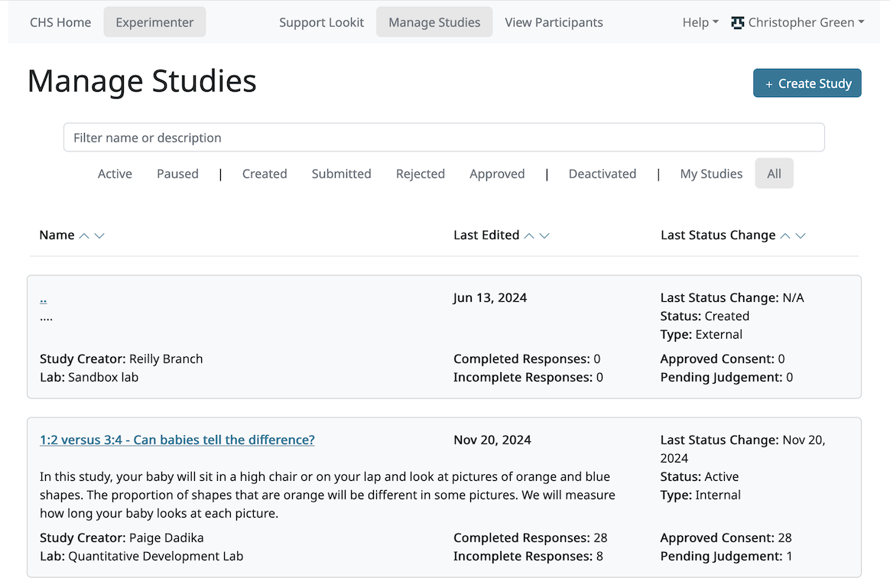
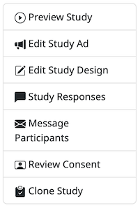
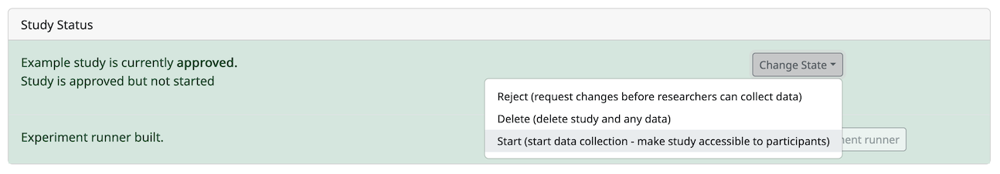

##################################
Managing studies
##################################

===================
Viewing study list
===================
To view all studies, navigate to /exp/studies/. (We will use this short format to indicate relative paths starting with the CHS site you are using - e.g., https://childrenhelpingscience.com/exp/studies/ or https://babieshelpingscience.com/exp/studies/).  From there, the researcher can only see studies they have permission to view.  Lab members and admins can see all studies that belong to their lab.  Otherwise, researchers can only view studies which they have created or to which they have been explicitly added.

You can filter studies by name or by keywords in the description. Additionally, you can sort on various study states like "Created" or "Submitted", or filter on your own studies by selecting "My Studies". You can also sort on study name, study end date, and study begin date.

===================
Creating a study
===================
To create a study, click the green "Create Study" button on the study list page or navigate to /exp/studies/create/. You'll need to provide values for the fields as described in `Setting study fields`_.

.. image:: _static/img/create_study.png
    :alt: Creating a study
    
===================
Cloning a study
===================
To clone a study, click the "Clone Study" button on an existing study detail page. In order to see this button, you will need to have permission to create studies in at least one lab - in general everyone has been added to the Sandbox lab, so even if you are not part of another lab, you will be able to clone studies you can see.    

Cloning creates a copy of the study but adds the logged in user as the creator and puts it in a lab where the user is able to create studies. No data is copied along with the study. The clone will be moved back into "Created" status (e.g., if the current study is actively collecting data, the cloned study will not be - it will need to be approved before it can be started). 

===================
Study detail page
===================
To view a single study, click on it from the study list.  A researcher must have permission to view this study specifically.  Lab admins and lab members can view all studies in their lab.  Other researchers can only view this study if they have been
explicitly added to the study. At the top, you see many of the study details that you entered when you created the study.  The UUID is also displayed; this is your study's unique identifier and is used in the direct link to the study. 

At the top right, you will see a set of buttons. Which actions are available depends on your permissions for this specific study. Here is the full set of options:

But if you have a study preview role, for example, you will only see some of these:

On this page, you can also view and edit study status, view and manage researchers who have access to the study. Study logs of when the study changed state are at the bottom of the page.

.. image:: _static/img/study_detail.png
    :alt: Viewing studies

.. _study status:

============================================================================
Study status: submitting your study and managing data collection
============================================================================

On the study detail page, you can see the current status of a study. For users with permissions to change the study state there is also a dropdown with the available actions (start/pause data collection, submit for approval, etc.) as shown below. The available states where you can move the study depend on what state is next in the sequence, as well as your current level of permissions.  For example, if a study's current state is "Created", that study can only be "Submitted" for review, or "Archived", which removes the study from display. Only CHS admins can approve or reject a study.

New studies must be submitted and approved by CHS before they can be started. The :ref:`study approval process <study_approval>` is intended to give CHS staff an opportunity to check that studies comply with the Terms of Use and to provide support if necessary.

When you submit a study for approval, you will be asked to provide some information to help with the review process - indicating any changes since last approval if you are re-submitting a previously approved study, and indicating anything that requires special review if you are submitting for the first time.

Researchers will receive email notifications when their study is approved or when changes are requested.

Once your study is approved, it is not automatically live and collecting data. Researchers with appropriate permissions can independently start/pause data collection at will; however, if any changes are made to the study it will be automatically rejected and will require re-approval. 

Studies can only be submitted for approval once the associated Lab is approved to test on CHS. If your Lab is not yet approved, for instance if you are using the Sandbox lab to try CHS out, you will see a message like this:

    
The Lab is approved to test once it has a signed access agreement and someone from the group has completed the terms of use quiz. This is update manually but generally within a day of completing those steps; please contact us if you think your lab is incorrectly not approved to test yet.

Study state reference list
---------------------------

The possible study states are:

:created: Study has been initially created, but has not been submitted for approval
:submitted: Study is submitted and awaiting approval by a CHS admin
:approved: Study has been approved by a CHS admin to run on CHS, but is not yet active
:rejected: Changes have been requested by a CHS admin before the study can be approved.  The study should be edited before resubmitting.
:active: Study is active and collecting data; participants can access it at the study link. If the study is also marked "Discoverable", the study will show up on CHS's study list.
:paused: Study is not actively collecting data or visible on CHS; participants cannot access it.
:deactivated: Study is done collecting data
:archived: Study has been archived and removed from search

===============================================
Starting and stopping data collection
===============================================

Starting and pausing data collection can be done instantly at any time after your study is approved, using the same dropdown menu as for submitting your study.

What does "starting" your study do? It allows your study to collect (non-preview) responses. Your study might also be advertised to potential participants, depending on its :ref:`discoverability <discoverability>` setting. You can :ref:`change the study discoverability <change_discoverability>` at any time, without needing re-approval.

If your study is set as **non-discoverable**, starting the study will allow anyone to participate via a direct link. The study link is shown on your study detail page in the experimenter interface. You are then responsible for distributing this link to participants. This setting is useful for studies intended for a very specific population, for instance, an online follow-up to an in-person study. You can email the direct link to families, without worrying about screening out other families on CHS.

If your study is set as **discoverable** (one of the checkboxes on the "Edit study ad" page), starting the study will also add your study to those displayed at `<https://childrenhelpingscience.com/studies/>`_, and anyone (including you) will be able to participate in it from there. It will also add your study to the list of those advertised to eligibile participants through our :ref:`announcement emails <announcement_emails>`.

===============================================
Study ad page
===============================================

On the study ad page, you can update much of the metadata about the study. You can only view this page if you have permission to view the study details, meaning that you have been given a role specifically on this study OR you are a lab member. If you do not have permission to write study details, you will not be able to make any changes from this page. For more detail about the fields you can view and edit on this page, see "Setting study details."

To edit fields, change the information and click Save Changes in the middle of the page.  If your study has already been approved, then editing key details will automatically put the study in a rejected state.  You must resubmit your
study and get it approved again by a CHS admin to run the study on the CHS platform.

.. image:: _static/img/study_edit.png
    :alt: Editing studies

===============================================
Study design page
===============================================

On the study design page, you can make edits to your study's structure. For internal Lookit and jsPsych studies, this will include things like: the frames/trials in your experiment, and the sequence of those frames/trials. With Lookit studies, you can also make advanced edits to the commits we are using to build your study. For external studies, this is where you can edit your study link.

Lookit studies
--------------------------------------

Protocol configuration
^^^^^^^^^^^^^^^^^^^^^^^^^^^^^^^^^

For more information about how to specify what happens during your study, see `Building an Experiment`_. The study protocol configuration specifies the frames (or pages) of your experiment, and also specifies the order they go in.

To edit a study's protocol, click 'Edit Study Design' from the study detail page. You will only be able to make actual changes from this page if you are a lab admin, or have a study admin, design, or manager role.

Click on the JSON block. A JSON editor will appear.  Click on "Beautify" in the top right corner for better readability. Note that any invalid JSON will be shown via a little red X at the left of the relevant line! 

Once you are happy with your changes click 'Close'.  Then hit "Save Changes" in the bottom right corner.
If your study has already been approved, then clicking "Save Changes" will automatically reject the study. You will have to resubmit it for a CHS admin to reapprove.

.. image:: _static/img/json_editor.png
    :alt: Edit JSON

To preview your study, click "See Preview". (You will need to build an experiment runner first if you haven't yet, or if you've changed the version you're using.)

Experiment runner options
^^^^^^^^^^^^^^^^^^^^^^^^^^^^^^^^^

**If you don't want any customization and want to use the most up-to-date version of the Lookit Ember Frameplayer and frames, just select the defaults.** These are advanced options!

What does each field mean?

    - The ``Experiment runner code URL`` is the GitHub repository where the frames and the player are stored.  This is the default ``player_repo_url``: https://github.com/lookit/ember-lookit-frameplayer.  Advanced users may want to define their own custom frames for use with Lookit studies beyond those provided in the core library. (For more information about how to do this, see https://lookit.readthedocs.io/en/develop/developing-frames.html.) To use your own frame definitions, set ``Experiment runner code URL`` to your own fork of the ember-lookit-frameplayer repo (e.g., https://github.com/yourname/ember-lookit-frameplayer instead of https://github.com/lookit/ember-lookit-frameplayer).

    - The ``Experiment runner version (commit SHA)`` is the specific version, or commit, of the experiment runner repository to use. Every time a change is made to the GitHub repository, it is assigned a unique identifier or "commit SHA." If you don't specify a version, then when you go to build your experiment runner, it will be use the most recent commit in the master branch and this field will get filled in. This way, your study will continue to use exactly the same experiment player unless you deliberately choose to update - just in case any changes affect how your study works. If you do specify a version, some information about that version will be displayed to confirm, and you can click "Check for updates" at any time to view what has changed.

**Important:** Whenever you update the code versions you are using, you will need to re-build your re-build your experiment runner before you can preview or run your study. This build process creates your very own runner application using exactly the code you selected, so that your study will continue to run as you designed it. You only need to re-build these when you have changed the code URL or version - not when you update your study protocol configuration or other data like the age range.

jsPsych studies
----------------------------------

For jsPsych studies, the "Edit Study Design" page allows you to edit the JavaScript code that defines your experiment. See the :ref:`jsPsych tutorial <jspsych-tutorial-first-study>` for a demonstration of how to use the "jsPsych Experiment Code" box.

Unlike the Lookit Ember Frameplayer experiment runner, with jsPsych studies there is no "experiment build" step, and there are no configuration options for selecting different jsPsych packages/versions. After adding/editing your jsPsych experiment code in this JavaScript editor, you can run through your study immediately.

External studies
----------------------------------

For external studies, the "Edit Study Design" page allows you to edit the following details about your study:

- Whether your study is scheduled (i.e. one-on-one appointments with a researcher) or unmoderated (i.e. participants use a link to take a study on their own).
- The study URL. This is where the participant will be directed when they click "Participate now!" or "Schedule a time to participate".
- Information about the study scheduling and/or hosting platform that you're using.

.. _`Building an Experiment`: researchers-create-experiment.html

.. _`Experiment data`: researchers-experiment-data.html

.. _`Setup for custom frame development`: frame-dev-setup.html

.. _`Setting study fields`: researchers-set-study-fields.html