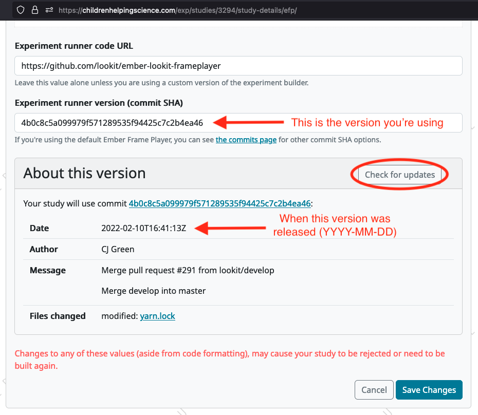

.. _runner-releases:

#############################################
Lookit experiment runner updates
#############################################

The Lookit experiment runner is regularly updated in order to add new features and fix bugs. While you can find the details of all changes in the `experiment runner Github repository <https://github.com/lookit/ember-lookit-frameplayer/commits/master>`__, sometimes the changes don't have much impact on researchers, or the descriptions on Github are written from a software development perspective. For this reason, we've added this page to highlight any changes that might be of particular interest to researchers, and to explain the changes from the standpoint of the impact on researchers.

.. contents:: Notes on select releases:
   :depth: 1
   :local:
   :backlinks: none

----

[DATE]: New Recording System
----------------------------

Commit SHA: [COMMIT SHA]

Github pull request: https://github.com/lookit/ember-lookit-frameplayer/pull/349

The latest version of the Lookit experiment runner switched from using a third-party service (called `'Pipe' <https://addpipe.com/>`__) for participant video recordings to our new 'in-house' system. Our reasons for removing Lookit's dependence on the external Pipe service are: 

* Removing unnecessary third-party access to private and sensitive research data, thereby also reducing the changes of data leaks and improper data use/access.
* Lowering the website's running costs. Pipe usage accounts for a large proportion of CHS/Lookit's expenses, and these costs grow with increasing use of the website.
* Preventing problems caused by unexpected updates to Pipe that we have no control over.

.. admonition:: All studies will eventually need to switch!

   The old Pipe system will be discontinued in the future (exact timing of this is still TBD). For the time being, we are running the new and old systems in parallel. This is to allow ongoing studies to continue to use the Pipe system for the remainder of their data collection, and to allow a fallback option in case of unforeseen problems with the new system. But we strongly recommend that you :ref:`update your experiment runner <recortdrtc-how-to-switch>` to use the new system so that you can test your experiment before the support for Pipe ends!

.. _recortdrtc-check-system:

.. rubric:: Checking which recording system your study is using

The easiest way to check is to go to the Study Details page for your study, find the “About this version” section, and look for the commit SHA and date (see screenshot below). If your version date is before [DATE], then your experiment is using the old Pipe system. If your version date is on or after [DATE], then your experiment is using the new system.

You can also click the “Check for updates” button (see screenshot above) to see what changes, if any, have been made to the experiment runner since the version that your experiment is currently using.

By default, newly-created experiments will use our new recording system. However, with any new or existing study, you can change the experiment runner version at any time (see the section ":ref:`Switching an existing experiment to the new system <recortdrtc-how-to-switch>`" and the page ":ref:`Updating the experiment runner <updating-frameplayer-code>`").

The first commit SHA that uses the new recording version is: [COMMITSHA]. All future updates (commits on the ``master`` branch) to our experiment version will also use the new system. You can find an up-to-date list of all versions and associated commit SHAs `here <https://github.com/lookit/ember-lookit-frameplayer/commits/master>`__. 

.. _recortdrtc-how-to-switch:

.. rubric:: Switching an existing experiment to the new system

If you have an existing study that uses the old Pipe system and would like to switch to using the new recording system, the easiest way to switch is to click the 'Check for updates' button on your Study Details page, and then copy/paste the most recent commit SHA into the 'Experiment runner version' box. For more details on how to do this, see the :ref:`Updating the experiment runner <updating-frameplayer-code>` page.

.. admonition:: If you change your study's experiment runner verison, remember: 

   * **You will need to rebuild your experiment runner.** You will see a 'Build experiment runner' button on your study's main page. Click this button to build your study with the new version.
   * **If your study has already been approved, it will be automatically rejected.** When you re-submit it for approval, you will be asked to list all changes made since your study was last approved. If you have only updated the experiment runner, please state that clearly so that we can get your study approved more quickly! 

.. _recordrtc-data-impact:

.. rubric:: Impact on data

We have worked to minimize the impact that this new recording system has on researchers and data, but it does introduce a few changes:

* Video file format is webm rather than mp4 (see section :ref:`'Converting webm to mp4' <recordrtc-convert-files>`)
* Video file size may be larger
* Pipe Id is no longer included in the response data

.. _recordrtc-convert-files:

.. rubric:: Converting webm to mp4

Webm is the ''native' format that the web browser uses when creating webcam recordings. By providing you with these raw data files, we can ensure that you're getting the most detailed video data possible. Webm files can be opened and viewed in many video playback programs, including web browsers and VLC. 

However, we are aware that the change in file formats might cause problems for some researchers who require mp4 format for their data processing and analysis. And because the webm files are larger than the files produced by the old system, you may decide to compress your video files into mp4 format so that they take up less disk space. We recommend using the `ffmpeg <https://www.ffmpeg.org/>`__ software to convert your files. The examples below show the most basic webm -> mp4 file conversion, but the ffmpeg command offers a number of `other options <https://www.ffmpeg.org/ffmpeg.html#Main-options>`__ that you might find useful, such as adjusting the bitrate/resolution/quality. 

**On a Mac:**

Open a terminal window and install ffmpeg like this::

   brew install ffmpeg

To convert a single file::

   ffmpeg -i input-filename.webm output-filename.mp4

To batch convert a directory of files::

   for i in *.webm; do ffmpeg -i "$i" "${i%.*}.mp4"; done

The above code will save the mp4 files to the same directory. You can save them to a different directory by editing to the 'output' file path, e.g. ``"mp4_files/${i%.*}.mp4"`` will put the mp4 files into a subdirectory called 'mp4_files'.

**On Windows:**

You will need to download the ffmpeg exe file to install it. See `the ffmpeg website <https://ffmpeg.org/download.html#build-windows>`__ for downloads and `here <https://phoenixnap.com/kb/ffmpeg-windows>`__ for more instructions.

To convert a single file::

   ffmpeg -i input-filename.webm output-filename.mp4

To batch convert a directory of files::

   for %f in (*.*) do ffmpeg -i "%f" "%~nf.mp4"

The above code will save the mp4 files to the same directory. You can save them to a different directory by editing to the 'output' file path, e.g. ``"mp4_files/%~nf.mp4"`` will put the mp4 files into a subdirectory called 'mp4_files'.

.. _recordrtc-issues:

.. rubric:: What if I experience problems with the new system?

If you experience any issues that you think might be related to the new recording system, please let us know immediately by posting in the Slack tech_support channel! Give us a short description of the problem and a link to your study. 

If you're in the middle of data collection or need to start quickly, remember that you always have the option to switch your study back to the old Pipe recording system. The commit SHA for the last version of the experiment runner that uses the Pipe system is: edae6bfe88b0c699246f6b77af2a2df0163452a4. On your 'Study Details' page, you can paste this commit SHA into the 'Experiment runner version' textbox, save the changes, and rebuild your experiment runner.

Keep in mind that we are transitioning away from the old Pipe system, so the option to revert back will only be available for a limited time. You might decide to continue using the Pipe system if you have already begun collecting data and will finish soon, or if you have experienced problems with the new system that are interfering with your data collection. Otherwise, we strongly suggest using the new system so that you have time to test it with your study before we discontinue support for Pipe.

----

Oct 16, 2023: Add 'iframe' frame
--------------------------------

Commit SHA: ea4169716acb6330f14ba80d79854269e7c859e1

Github pull request: https://github.com/lookit/ember-lookit-frameplayer/pull/340

This update added a new 'iframe' frame, which allows the researcher to embed an external webpage (e.g. Qualtrics) into an interal Lookit experiment. There are some important limitations to this approach, but it can be useful for researchers who want to record video while participants are completing the external survey/task. See the ``exp-lookit-iframe`` documentation `here <https://lookit.readthedocs.io/projects/frameplayer/en/latest/components/exp-lookit-iframe/doc.html>`_.

----

Oct 10, 2023: Fix webcam display 
----------------------------------

Commit SHA: bc5ffc1ab7b6c1d167d8434862d6bf4cc3bb4550

Github pull request: https://github.com/lookit/ember-lookit-frameplayer/pull/334

This change fixed the problem with the Pipe webcam display in the ``video-consent`` frame and other frames that display the webcam back to the participant. The problem was that the webcam video display box can cover up other elements on the page, including text and recording start/stop buttons. 

This update fixes the webcam display problem on the following frames:

* ``instructions``
* ``observation``
* ``video-assent``
* ``video-consent``
* ``webcam-display``
* ``video-config``
* ``video-config-quality``
