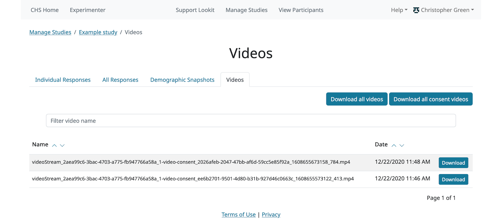

.. _study_fields:

##################################
Setting study fields
##################################

When creating or editing a study, you can set the value of the following fields. Below is more information about each:

=============================
Name
=============================

Participant-facing title of your study; must be <255 characters. Shoot for a short, catchy title; depending on how you advertise your study, you may want participants to be able to recognize and select it from the studies page. If you plan on running similar follow-up studies and want them to be easily distinguishable, avoid titles that encompass your entire research program like "Infant Language Study."

=============================
Image
=============================
Thumbnail image that will be displayed to participants on Lookit's studies page.  File must be an image-type, and please keep the file size reasonable (<1 MB). Sometimes your stimuli are a good basis for creating this image, or it can be something that conceptually represents your study or shows what it looks like to participate.

=============================
Short description
=============================

Describe what happens during your study here (1-3 sentences). This should give families a concrete idea of what they will be doing - e.g., reading a story together and answering questions, watching a short video, playing a game about numbers.

=============================
Purpose
============================= 
Explain the purpose of your study here (1-3 sentences). This should address what question this study answers AND why that is an interesting or important question, in layperson-friendly terms. Note: this tends to be harder than you'd think - it's not just you! Imagine all the time you spend getting comfortable explaining the point of a study in the lab (or training RAs on the same), distilled into this task. Plus you don't get to interact with the parent to gauge their interest level or familiarity first. Take your time and read this out loud as you work. Some things to check: Is it too specific - is a reasonable response "okay, you will find out whether X is true, but why does that matter?" Is it too general - could you write the same thing about a follow-up study you're planning or another study going on in your lab? 

=============================
Compensation
=============================
Provide a description of any compensation for participation, including when and how participants will receive it and any limitations or eligibility criteria (e.g., only one gift card per participant, being in age range for study, child being visible in consent video). Please see the `Terms of Use <https://lookit.mit.edu/termsofuse/>`_ for details on allowable compensation and restrictions. If this field is left blank (which is okay if you're not providing compensation beyond the joy of participation) it will not be displayed to participants.

=============================
Exit URL
=============================
Must enter a URL. After the participant has completed the study, they will be automatically redirected to the exit URL. Typically this is just `https://lookit.mit.edu/`

====================================
Participant eligibility description
====================================
Freeform participant-facing eligibility string, of the form 'For...' (e.g., 'For babies under 1 year old'). Make this readable so participants understand if their child can take part in the study.

This is **not** directly used to automatically check eligibility, so you can include criteria that may not yet be possible to check for automatically - e.g., this study is for girls whose favorite color is orange. 

Age limits specified here should be carefully considered with respect to the `minimum and maximum age cutoffs`_ which **are** used for automatic verification of eligibility. 

=============================
Criteria expression
=============================
Providing this expression allows you to specify more detailed eligibility criteria for your study than a single age range. When a parent selects a child to participate in a study, he or she will see a warning under any of the following conditions:

- The child is under the minimum age specified (see `minimum and maximum age cutoffs`_)
- The child is over the maximum age specified (see `minimum and maximum age cutoffs`_)
- The child is within the specified age range, but doesn't meet the eligibility criteria defined in this expression

Note that while a warning is displayed, ineligible participants are not actually prevented from participating; this is deliberate, to remove any motivation for a curious parent to fudge the details to see what the study is like.

You may want to use the criteria expression to specify additional eligibility criteria beyond an age range - for instance, if your study is for a special population like kids with ASD or bilingual kids. You do **not** need to specify your age range here in general; participant eligibility checks will require the child meet the `minimum and maximum age cutoffs`_ AND these critera.

Every child in the Lookit database has a number of fields associated with it, ranging from gestational age to languages spoken in the home, which can be used in determining eligibility. In the study edit and create views, you can formulate your criteria expression as a boolean expression with embedded relational expressions, using a domain specific query language. 

You can put together your expressions using the query fields below; the operators `AND`, `OR`, `NOT`, `<`, `<=`, `=`, `>`, and `>=`; and parentheses. If your expression is invalid you will see an error when you try to save your study.

----------------------------------
Query fields
----------------------------------

    +-----------------------------------------------------+-------------------+---------------------------------------------------------------------+---------------------------------------------------------+
    | Query Handle                                        | Value Type        | Examples                                                            | Notes                                                   |
    +=====================================================+===================+=====================================================================+=========================================================+
    | [`CONDITIONS <#characteristics-and-conditions>`_]   | N/A               | deaf, hearing_impairment, NOT multiple_birth                        | See below for full list of available options.           |
    +-----------------------------------------------------+-------------------+---------------------------------------------------------------------+---------------------------------------------------------+
    | speaks_[`LANGCODE <#language-codes>`_]              | N/A               | speaks_en, NOT speaks_ja, speaks_ru                                 | See below for full list of available options.           |
    +-----------------------------------------------------+-------------------+---------------------------------------------------------------------+---------------------------------------------------------+
    | gestational_age_in_weeks                            | integer or string | gestational_age_in_weeks <= 40, gestational_age_in_weeks = na       | Values are 23 through 40 and na                         |
    +-----------------------------------------------------+-------------------+---------------------------------------------------------------------+---------------------------------------------------------+
    | gender                                              | string            | gender = f, gender !=o                                              | Male (m), Female (f), Other (o), or Not Available (na). |
    +-----------------------------------------------------+-------------------+---------------------------------------------------------------------+---------------------------------------------------------+
    | age_in_days                                         | integer           | age_in_days <= 1095, age_in_days > 365                              |                                                         |
    +-----------------------------------------------------+-------------------+---------------------------------------------------------------------+---------------------------------------------------------+

-----------------------------
Criteria expression examples
-----------------------------

Deaf children only
    ``deaf``

Multiple-birth children who are either under 1 year old or over 3 years old
    ``multiple_birth AND (age_in_days >= 1095 OR age_in_days <= 365)``
    
Girls who are exposed to both English and Spanish
    ``gender = f AND speaks_en AND speaks_es``
    
Children born late preterm whose adjusted age is about 6 weeks
    ``(gestational_age_in_weeks = 34 AND (age_in_days >= 72 AND age_in_days < 102)) OR (gestational_age_in_weeks = 35 AND (age_in_days >= 65 AND age_in_days < 95)) OR (gestational_age_in_weeks = 36 AND (age_in_days >= 58 AND age_in_days < 88))`` 

--------------------------------
Characteristics and conditions
--------------------------------

    +------------------------+-----------------------------------------------+
    |      Query Handle      |           Condition/Characteristic            |
    +========================+===============================================+
    |autism_spectrum_disorder|Autism Spectrum Disorder                       |
    +------------------------+-----------------------------------------------+
    |deaf                    |Deaf                                           |
    +------------------------+-----------------------------------------------+
    |hearing_impairment      |Hearing Impairment                             |
    +------------------------+-----------------------------------------------+
    |dyslexia                |Dyslexia                                       |
    +------------------------+-----------------------------------------------+
    |multiple_birth          |Multiple Birth (twin, triplet, or higher order)|
    +------------------------+-----------------------------------------------+

--------------------------------
Language codes
--------------------------------

    +----+----------------------+
    |Code|       Language       |
    +====+======================+
    |en  |English               |
    +----+----------------------+
    |am  |Amharic               |
    +----+----------------------+
    |bn  |Bengali               |
    +----+----------------------+
    |bho |Bhojpuri              |
    +----+----------------------+
    |my  |Burmese               |
    +----+----------------------+
    |ceb |Cebuano               |
    +----+----------------------+
    |hne |Chhattisgarhi         |
    +----+----------------------+
    |nl  |Dutch                 |
    +----+----------------------+
    |egy |Egyptian Spoken Arabic|
    +----+----------------------+
    |fr  |French                |
    +----+----------------------+
    |gan |Gan                   |
    +----+----------------------+
    |de  |German                |
    +----+----------------------+
    |gu  |Gujarati              |
    +----+----------------------+
    |hak |Hakka                 |
    +----+----------------------+
    |ha  |Hausa                 |
    +----+----------------------+
    |hi  |Hindi                 |
    +----+----------------------+
    |ig  |Igbo                  |
    +----+----------------------+
    |id  |Indonesian            |
    +----+----------------------+
    |pes |Iranian Persian       |
    +----+----------------------+
    |it  |Italian               |
    +----+----------------------+
    |ja  |Japanese              |
    +----+----------------------+
    |jv  |Javanese              |
    +----+----------------------+
    |cjy |Jinyu                 |
    +----+----------------------+
    |kn  |Kannada               |
    +----+----------------------+
    |km  |Khmer                 |
    +----+----------------------+
    |ko  |Korean                |
    +----+----------------------+
    |mag |Magahi                |
    +----+----------------------+
    |mai |Maithili              |
    +----+----------------------+
    |ms  |Malay                 |
    +----+----------------------+
    |ml  |Malayalam             |
    +----+----------------------+
    |cmn |Mandarin              |
    +----+----------------------+
    |mr  |Marathi               |
    +----+----------------------+
    |nan |Min Nan               |
    +----+----------------------+
    |mor |Moroccan Spoken Arabic|
    +----+----------------------+
    |pbu |Northern Pashto       |
    +----+----------------------+
    |uzn |Northern Uzbek        |
    +----+----------------------+
    |or  |Odia                  |
    +----+----------------------+
    |pl  |Polish                |
    +----+----------------------+
    |pt  |Portuguese            |
    +----+----------------------+
    |ro  |Romanian              |
    +----+----------------------+
    |ru  |Russian               |
    +----+----------------------+
    |skr |Saraiki               |
    +----+----------------------+
    |sd  |Sindhi                |
    +----+----------------------+
    |so  |Somali                |
    +----+----------------------+
    |es  |Spanish               |
    +----+----------------------+
    |su  |Sunda                 |
    +----+----------------------+
    |tl  |Tagalog               |
    +----+----------------------+
    |ta  |Tamil                 |
    +----+----------------------+
    |te  |Telugu                |
    +----+----------------------+
    |th  |Thai                  |
    +----+----------------------+
    |tr  |Turkish               |
    +----+----------------------+
    |uk  |Ukrainian             |
    +----+----------------------+
    |ur  |Urdu                  |
    +----+----------------------+
    |vi  |Vietnamese            |
    +----+----------------------+
    |lah |Western Punjabi       |
    +----+----------------------+
    |wuu |Wu                    |
    +----+----------------------+
    |hsn |Xiang Chinese         |
    +----+----------------------+
    |yo  |Yoruba                |
    +----+----------------------+
    |yue |Yue                   |
    +----+----------------------+

================================
Minimum and maximum age cutoffs
================================
Integer fields specifying minimum/maximum ages of participants (inclusive). Eligibility is calculated based on the child's current age in days; this is compared to the minimum/maximum ages in days, calculated as 365*years + 30*months + days. Participants under the age range see a warning indicating that their data may not be used, and suggesting that they wait until they're in the age range. Participants over the age range just see a warning indicating that their data may not be used. Participants are never actually prevented from starting the study, to remove motivation for a curious parent to fudge the child's age. 

Note that these ages do **not** in all cases correspond exactly to the child's age in 'calendar months' or 'calendar years' (e.g., 'one month' if that month is February). In general, you want to avoid a situation where the parent thinks their child should be eligible based on the participant eligibility string (e.g., "my child is one month old, she was born February 3rd and it's March 4th!") but sees a warning when trying to participate. You can do this by narrowing the eligibility criteria in the freeform string and/or by expanding them in the cutoffs here. If one has to align better with your actual inclusion criteria, in general you want that to be the minimum/maximum age cutoffs.
  
=============================
Duration
=============================
Approximately how long does it take to do your study, start to finish? (Try it if you're not sure; include time to read the instructions.) You can give an estimate or range.

===============================
Researcher contact information
===============================
This should give the name of the PI for your study, and an email address where the PI or study staff can be reached with questions. Format: PIs Name (contact: youremail@lab.edu). This is displayed to participants on the study detail page before they choose to participate, as well as substituted into your consent form and exit survey, so in general the name needs to be the person who's listed as PI on your IRB protocol (although it may not need to be their personal email address). 
  
=============================
Discoverable
=============================
Do you want this study to be listed on the Lookit studies page when it's active? Check this box to list the study there. If the box is unchecked, the study will be 'non-discoverable' and participants will only be able to get to it by following a direct link with your study ID. This may be helpful if, for instance, you want to run a follow-up study (with in-lab on online participants) and want to send the link to a limited number of people, or if your inclusion criteria are very limited (e.g., a rare genetic disorder) and you want to recruit specifically without getting any random curious families stopping by. You may also occasionally set a study to non-discoverable temporarily so you can try it out as a participant without actually recruiting!

=============================
Build study
=============================
This needs to be a valid JSON block describing the different frames (pages) of your study, and the sequence. You can add these later under /exp/studies/<study_id>/edit/build/. For detailed information about specifying your study protocol, see `Building an Experiment`_.

=============================
Study type
=============================
The study type is the application you're using to enable participants to take a study. Right now, we just have one option, the `Ember Frame Player <https://github.com/lookit/ember-lookit-frameplayer>`_.  It's an ember app that can talk to our API. All the frames in the experiment are defined in Ember and there is an exp-player component that can cycle through these frames. For details, see `Editing study type`_

.. _`Building an Experiment`: researchers-create-experiment.html

.. _`Experiment data`: researchers-experiment-data.html

.. _`Setup for custom frame development`: frame-dev-setup.html

.. _`Setting study parameters`: researchers-set-study-fields.html

.. _`Editing study type`: researchers-using-platform.html#editing-study-type