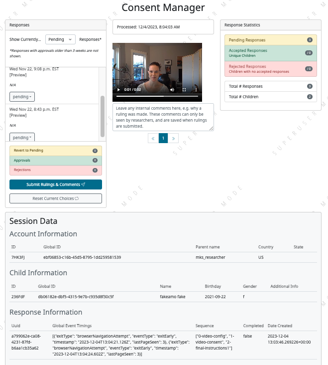

.. _spam_prevention:

Preventing spam
==============================

Participants attempting to 'game the system' have been a reality of (adult) remote
research for years.  Children Helping Science has remained relatively free of
this issue because of (a) the higher barrier for participation - only families with
children are invited to participate, and families have to 
create an account before starting a study and (b) the stronger verification methods
we use - studies that use webcam video to analyze the central data also document that
a family with a child of roughly the expected age is present. 

As our platform has grown, it has become a more attractive target for fake participants. 
The Children Helping Science strategy is that "totally fake participants" 
(e.g., someone who is participating in a child study without a child) should have 
a 0% success rate in receiving compensation. Importantly, even a low success rate 
(e.g., 5%) could encourage more fake participation, especially since the motivation 
for some people is not just profit but also just the challenge and satisfaction of
successfully hacking a system.

We know that there are some types of fraud that are harder to detect, 
but we should have a 100% success rate for things like an adult doing studies 
without having any child at all. Likewise, participants who are participating in 
bad faith (not just confused) by doing things like creating multiple accounts, 
using the same child to stand in for multiple 'siblings' of different ages, etc. 
should have near-zero success, because a vigilant researcher community that is 
alert to these cases will tend to result in discovering and preventing more subtle 
kinds of bad behavior.

We recognize that this policy will require some researchers to amend their IRB 
protocols. However, we are confident this is the right policy because of 
(a) the broad benefits to the Lookit/CHS community overall in reducing fake 
participants, and (b) the direct benefits to the studies that are otherwise open 
to lots of fake participants without implementing video verification. You 
will be the biggest beneficiary of making sure your own studies are not full of fake data!

The CHS philosophy on scammers and bad-faith participation in studies
----------------------------------------------------------------------

Monitoring for potential fraud on CHS is a tricky balance, between preventing 
scammers from finding a foothold and maintaining a central value of the 
platform - creating a welcoming environment for families of all kinds, including 
those who don't already know the norms for participating in studies, and who 
may have a wide variety of technical challenges. By the numbers, confused 
families are significantly more common than scammer participants.

As an open community resource, Children Helping Science depends on researchers 
to do their part to maintain the high quality of both participant experiences and
research quality that we have enjoyed together over the past several years. 

.. admonition:: Your responsibility
   
   As researchers using CHS, it is your responsibility to treat participating 
   families with respect and an assumption of good faith, *and* to maintain 
   lab practices that are alert to the possibility of scammers and prevent 
   giving payments to people who are participating in bad faith.

The staff of Children Helping Science is working hard to contain the impact of
fake participants, whose behavior is sometimes most evident over multiple studies 
across multiple labs. Doing this depends on researchers following the steps described
on the rest of this page. 

Video verification for paid studies
------------------------------------

Beginning in December 2023, studies are required to implement a visual check that study participants are 
acting in good faith (i.e. that a child of the correct age is present and the family is 
attempting to participate in the study as designed) prior to compensating them. This policy 
applies to both internal and external studies. 

This is being required because we have a small number of fraudulent participants who
make many accounts and try to get paid over and over again. Our participant pool is 
extremely high quality, with the vast majority representing real families who are truthful
about their information and working hard to participate to the best of their abilities.

*Keeping* it this way by keeping bad-faith participants out of your datasets is a shared 
responsibility, and studies that don't screen their participants teach the scammers 
that they can get paid by lying about their information on CHS!

The goal of this requirement is to ensure independent confirmation that the family is
being basically truthful about their children's information, beyond just whatever they 
chose to input when creating their account. If you can't or don't want to use the procedures 
described below, you are very welcome to propose another method for verifying good-faith
participation! Please ask any questions you might have about this `on Slack <https://forms.gle/WVapAncBwRPR7pLX9>`__.

Option 1: Don't pay participants
^^^^^^^^^^^^^^^^^^^^^^^^^^^^^^^^^^

Studies that don't provide monetary compensation to participants are exempt from 
this requirement. Many studies that offer a free 'thank you' such as a digital 
certificate or cute presentation of the child's data or video have been conducted 
successfully on CHS, so this is certainly an option to consider if your institution
has an absolute ban on collecting visual or other corroborating evidence about your
remote participants. 

Option 2: The standard Lookit video consent process
^^^^^^^^^^^^^^^^^^^^^^^^^^^^^^^^^^^^^^^^^^^^^^^^^^^^

The most straightforward way to meet this requirement, which the majority of studies
are currently using, is the Lookit video consent form, which captures 
webcam video of the parent/guardian stating that they agree to participate in the 
study. In your compensation description, you can state that you require the child to 
be visible in the consent video, or you can use other video data that you 
collect during the session. 

If you are running an external, asynchronous
study (Bring-your-own Study Link), the easiest way to meet 
this requirement is to prepare a 'hybrid' study that uses the Lookit experiment 
builder to present the consent form, and then redirects to your external study.  
`Here is an example study template <https://lookit.mit.edu/exp/studies/3067/>`__ 
that you can copy and use. There is also the option to record video of the 
entire session by using `the iframe method <https://lookit.readthedocs.io/projects/frameplayer/en/develop/components/exp-lookit-iframe/doc.html>`__
to display your experiment in the same tab, without leaving the Children Helping Science
platform. 

Note that you can use this video consent method in place of *or* in addition to another
consent process (e.g. if your institution requires documenting consent on a specific platform.)

Option 3: Live video confirmation via Zoom or similar
^^^^^^^^^^^^^^^^^^^^^^^^^^^^^^^^^^^^^^^^^^^^^^^^^^^^^^
For external, synchronous studies (Bring-your-own Meetings), the visual confirmation 
of the participating family and child during the video session satisfies this requirement.
As with all study types, you should be checking over the family's information for consistency
prior to releasing payment. 

If you are currently running an asynchronous study and don't want to use the video consent
process (Option 2), you could also arrange to have a quick zoom call with families before you release 
payment. For most lab workflows, it probably makes the most sense to first schedule the zoom call, and then
give the study link to participants who pass that check. Make sure to explain how this process will work
to families in the study information! 

Option 4: Propose something else
^^^^^^^^^^^^^^^^^^^^^^^^^^^^^^^^^

We understand that the procedures we describe here may not work for every study, or may
require you to request a modification from your IRB. We encourage you to think about how
to frame this requirement to your IRB, because it may well be considered a small or 
negligible change from their perspective. For example, you could continue to use 
whatever consent process you have for your study as being the official consent 
from your IRB's perspective, while *also* having them do the video consent frame 
on Lookit/CHS (thus, you are not changing what counts as consent for your study, 
you are merely implementing a platform-required fraud-prevention step before
they even get to your study and the consent your study uses).

If you discover that none of the above
options is workable for you, we encourage you to think creatively about how else you
could meet the requirement to verify that your participants are who they say they 
are (or consider Option 1, volunteer participants.) It may help to inform your 
IRB that other methods of identity verification (such as requiring a picture of a 
driver's license or a social media account) would constitute a *greater* risk to 
families, compared to short webcam video which does not reveal e.g. families'
full names or location information to the researcher. However, if something like the 
latter is what your IRB will approve, we're happy to talk about this option with you. 

Managing and reporting scam participants
-----------------------------------------

The compensation statement
^^^^^^^^^^^^^^^^^^^^^^^^^^^

The first tool in your toolkit for managing scammers is a clear statement of when 
and how participants will be compensated. 

Providing false information is a violation of our platform's Terms of Use, so you should
feel comfortable rejecting participation by people who are clearly not following the
rules. However, it can help well-meaning families know what to do, and discourage scammers, 
to explicitly include ground rules in your compensation statement, which you can then 
point out to participants if the need arises. In addition to basic parameters that 
aren't automatically screened (e.g.
"must be a middle or youngest sibling"), it is also wise to mention that
each child can only be paid once for participating, if this is true of your study.

Here is an example of a compensation statement with some of this language:

*After you participate, we'll email you a $5 Amazon gift code
within five days to thank you for your time (only one per child). To be eligible for compensation we ask that
you (1) provide a valid consent video (we will show you how!), (2) make sure your child 
is in the age range specified above and (3) ensure that your child is visible during 
the recorded videos. Your child does not need to finish the entire study in order to be 
eligible for compensation.*

Reviewing for consent vs. compensation
^^^^^^^^^^^^^^^^^^^^^^^^^^^^^^^^^^^^^^^^^^^^^^^^^^^^^^^^^^^^^

In most labs, there are several things you need to review about each session that 
comes in. Many items on a 'quality checklist' serve multiple functions (a video
with no child present is one that both you won't pay for, *and* won't include
in your analysis). It is important to make sure that your lab's workflow
is set up to avoid paying participants before you have a chance to check if 
they should be paid! Because you are required to pay your participants in a 
timely fashion, this means that you need to be prepared to conduct these 
quality checks quickly and accurately within your lab. 

The specific things you need to check for (including photos of some known
people who make many accounts to 'hit' especially brand new studies) will
change over time, in the eternal race between researchers trying to 
protect their studies and scammers trying to get fraudulent payments. We
don't want the scammers to know what we know, so information about *specific*
red flags is kept in `a separate document <https://docs.google.com/document/d/1cXCYmT-ddIKOQCaJFbBDc9e7wYfB01R0MFqyILAQBns/>`__
that you need to request access to. When you request access, you must include 
a message with enough information to prove you are a current CHS/Loookit researcher. 

It is your responsibility to ensure that everyone who issues payments for 
your studies has read this CHS/Lookit documentation along with any lab-specific 
procedures you use has to implement these suggestions. At a minimum, these procedures should:

- Distinguish between 'consents accepted' and 'participants to be paid' -  you will sometimes
  need to approve consents before you can see information that you use to detect scammers,
  so make sure that you don't use the consent queue as your only tool for tracking which
  participants to pay. 
- Detect potential scams (and respond as below) *before* communicating
  with those participants - any 'signs of life' are an encouragement to continue.
  If fraudulent participants contact you, messages should be saved
  but ignored. 
- Ensure coordination between lab members, including between different studies - 
  you must be able to detect if the same account is behaving oddly across sessions
  (the same child appearing under two different names) and across accounts (the same
  adult appearing under two different accounts.) 
- Ensure that potential scams are reported to a single responsible individual in your
  lab, and to CHS when necessary, as quickly as you can. 

Whether you are conducting an internal or external study, the CHS website saves information
that you can use to review participants and check for patterns that may indicate spam. 

**Consent manager:** Internal experiments and hybrid experiments that use the Lookit video consent frame
can use the Consent Manager to screen for potential signs of bad-faith participation. 

In addition to the video, we display information that may be helpful for identifying
cases that you need to look into further. For instance, this child's name is given
as 'fakeamo fake', which may indicate something is off! (This is an account that Melissa
uses for testing.)  This table also includes ID values for the user and child, which 
can be used e.g. to check against a list your lab maintains of known 'problem' users. In 
most cases you will want to use the global IDs (long strings) for monitoring and reporting
scammers, but remember that these values must be protected and should not be present in your
the versions of the datasets you use for analysis. 

See `the private document <https://docs.google.com/document/d/1cXCYmT-ddIKOQCaJFbBDc9e7wYfB01R0MFqyILAQBns/>`__ 
for further details on how you can use the information on the consent screen to detect scammers. 

**Response data:** All experiment types also make response data available that provides basic information about
each user, child, and session in your study.  Whether your study is internal or 
external, you should be using this information to confirm the details of each session, 
and if your study is external, you should compare the data you have from CHS and the
data you have from your own study site to check for inconsistencies. See :ref:`this page<researchers_experiment_data>` for
details on how to access and use this information - note that you will need to check a box in order
to download a version of the data with sensitive information like global IDs and names, so 
treat these datasets with caution and care! 

Reporting suspected scam participants
^^^^^^^^^^^^^^^^^^^^^^^^^^^^^^^^^^^^^^^

At least one researcher per experiment should be a member of the Slack channel we 
use for monitoring for scammers (currently #sept-2023-spam-sessions) - ask for access 
on the #researchers channel. You should use the spam channel to ask questions about
behavior you're concerned about, and to search past conversations to see if an issue
has come up before (e.g. "hats", "time zones".) This is also the *only* channel where
it is permitted to share personal information (names, ID strings). CHS staff will 
occasionally share information about specific problematic accounts that may have 
participated in your studies. This is the best way to learn from the community about 
their CHS-specific experiences with scammers!  

Use the following process to monitor and report potentially fraudulent participants:

#. Lab members in charge of confirming consent or paying participants should be 
   trained to immediately report any red flags to their project leader for review, 
   and to *delay paying that participant* until the issue is resolved. 
#. If you (project leader) are not sure whether this is a fraudulent versus just a 
   confused participant, *do not pay the participant yet*, and ask a question on the scam
   channel so we can help you to determine the next steps. 
#. If you are fairly certain about the fake participant/obvious eligibility violation (or if an admin asks you to do so) make
   a report using `this form <https://docs.google.com/forms/d/e/1FAIpQLSd_g32qCLgwjmYZs8zrllJtNRVHYtjXk6CNliRtM41UeAyZqQ/viewform?usp=sf_link>`__. 
   To help us process these more quickly, you should also post on the Slack channel to let 
   us know when you submit a report. 
#. *DO NOT compensate the participant* until an admin has had a chance to review your case(s). 
   Once you've heard back from an admin, you will know whether that participant has 
   been blocked from Lookit, whether they have concluded that the participant should 
   be compensated, or whether there is another outcome needed.
#. In your lab/research group, keep a running list of potentially problematic 
   red flags you find in your lab - when it's an individual or small group causing
   a problem, the same red flags will tend to repeat!
#. If you discover patterns of red flags that are not listed in the private "Rogues
   Gallery" document, share them with the community on the scam channel so we can all learn
   to block them more effectively.

Enforcement of scam prevention policies
^^^^^^^^^^^^^^^^^^^^^^^^^^^^^^^^^^^^^^^^^

Beginning in December 2023, we will be returning submitted studies that don't meet the 
payment verification requirements for revision. Existing studies that don't meet these criteria 
are also asked to pause data collection, and may be paused/retracted by CHS staff. 

In addition, we will be conducting "`white hat <https://en.wikipedia.org/wiki/White_hat_(computer_security)>`__"
exercises across Lookit/CHS. In other words, there will be 
a small amount of “fraudulent” activity on CHS arranged by the admins to test whether your 
studies are effectively detecting these attempts. If you catch one, you should report it exactly as
described above, including filling out `the form <https://docs.google.com/forms/d/e/1FAIpQLSd_g32qCLgwjmYZs8zrllJtNRVHYtjXk6CNliRtM41UeAyZqQ/viewform?usp=sf_link>`__
for scam participants. 

If you accidentally compensate a white hat attempts, we will of course return the compensation 
to you if reasonable (e.g., we can easily tell you to re-use a gift code you send; if you are doing 
something like mailing a children's book then everyone might agree it is nicer to just donate 
it to a local charity rather than mailing it back). More importantly, accidentally 
compensating a white hat attempt will require a description of how you will be changing your 
procedures to be more resistant to fraud in the future, with confirmation from your lab's PI 
that the plan is being implemented. Repeated compensation of white hat attempts may lead to 
the removal of your study from Lookit/CHS and the possibility that your lab may not be 
able to post new studies for a while.