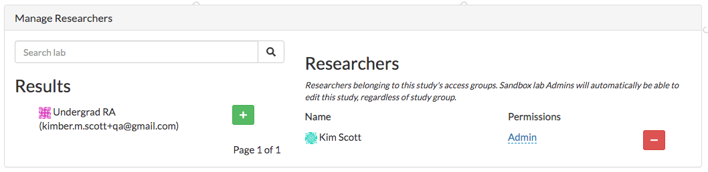
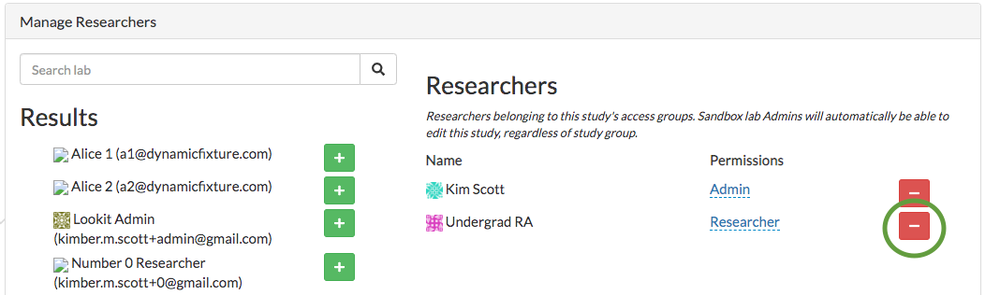

.. _study_permissions:

########################################################
Study permissions 
########################################################

The permissions granted to researchers are quite granular, so that you have fine control over who can do/see what. This is so that you can grant access to just the minimum functions someone needs in their role, without any unnecessary risk to participant personal data.

If you have permissions to manage study researchers, you will be able to add/remove researchers to your study and change their roles on the Study Detail page. 

-----------------------------------------
Study permissions
-----------------------------------------

Here are the specific permissions that govern what a researcher can see or do to study data. You will grant or restrict these permissions to other lab members by giving them roles on your study.

READ_STUDY_DETAILS
    Can preview the study; can see the study overview page where study researchers, logs, and status are shown; can see the study edit form where the protocol is (but not necessarily submit it!)
    
WRITE_STUDY_DETAILS
    Can make changes to the study using the edit study form - e.g., changing the protocol or age range. Note that if the study is already approved, making changes would automatically reject it; in this case, someone with WRITE_STUDY_DETAILS but not CHANGE_STUDY_STATUS would not be able to make changes.
    
CHANGE_STUDY_STATUS
    Can change the status of the study - starting or stopping data collection, submitting/retracting it for Lookit review, etc.
    
MANAGE_STUDY_RESEARCHERS
    Can add and remove other researchers in this lab to the various study groups, editing their permissions.
    
READ_STUDY_RESPONSE_DATA
    Can see and download actual participant data from this study.
    
READ_STUDY_PREVIEW_DATA
    Can see and download data from researchers who previewed this study.
    This is a separate permission because previewing the study and then seeing what data is 
    generated is critical for study design & analysis pipeline planning (e.g. “ok, so I
    did this, do the videos I expected to make show up? how will our script tell what color the 
    dax is on trial 4?“). It may also be a means of collecting feedback on the study 
    design from other researchers (they preview a study, you see their responses).
    
CODE_STUDY_CONSENT
    Can submit rulings about whether consent videos demonstrate valid informed consent, which determines which data is then available for download
    
CODE_STUDY_PREVIEW_CONSENT
    Can submit rulings about whether consent videos from preview data demonstrate valid informed consent. (They don’t really, but you might mock up the entire workflow from start to finish with preview data while planning your analyses and testing out your study.)
    
CONTACT_STUDY_PARTICIPANTS
    Can send email to participants via the Lookit platform. (This still does not grant direct access to participant email addresses.)
    
EDIT_STUDY_FEEDBACK
    Can create and edit feedback associated with participant responses, which is displayed to participants on the study history page.
    
CHANGE_STUDY_LAB
    Can change which lab this study is associated with. (Researchers not affiliated with the new lab are removed from the study upon changing.)
    
DELETE_ALL_PREVIEW_DATA
    Can use a button on the all responses page to delete existing preview data (generally useful in the process of developing a new study and testing it out repeatedly).

-----------------------------------------
Study roles
-----------------------------------------

Researchers can be assigned any of the following roles relative to a study. Here are the 
permissions that each denotes:

+----------------------------+---------+--------+-----------+---------------+------------+----------+-------+
|                            | Preview | Design |  Analysis | | Submission  | Researcher | Manager  | Admin |
|                            |         |        |           | | processor   |            |          |       |
+============================+=========+========+===========+===============+============+==========+=======+
| READ_STUDY_DETAILS         |  x      |   x    |     x     |     x         |    x       |   x      |  x    |
+----------------------------+---------+--------+-----------+---------------+------------+----------+-------+
| READ_STUDY_PREVIEW_DATA    |  x      |  x     |     x     |    x          |    x       |   x      |  x    |
+----------------------------+---------+--------+-----------+---------------+------------+----------+-------+
| CODE_STUDY_PREVIEW_CONSENT |  x      |  x     |     x     |      x        |     x      |  x       |   x   |
+----------------------------+---------+--------+-----------+---------------+------------+----------+-------+
| DELETE_ALL_PREVIEW_DATA    |         |   x    |     x     |        x      |      x     |     x    |   x   |
+----------------------------+---------+--------+-----------+---------------+------------+----------+-------+
| WRITE_STUDY_DETAILS        |         |   x    |           |               |            |    x     |   x   |
+----------------------------+---------+--------+-----------+---------------+------------+----------+-------+
| READ_STUDY_RESPONSE_DATA   |         |        |    x      |               |    x       |          |   x   |
+----------------------------+---------+--------+-----------+---------------+------------+----------+-------+
| CHANGE_STUDY_STATUS        |         |        |           |         x     |    x       |     x    |   x   |
+----------------------------+---------+--------+-----------+---------------+------------+----------+-------+
| CODE_STUDY_CONSENT         |         |        |           |         x     |    x       |          |   x   |
+----------------------------+---------+--------+-----------+---------------+------------+----------+-------+
| EDIT_STUDY_FEEDBACK        |         |        |           |         x     |    x       |          |   x   |  
+----------------------------+---------+--------+-----------+---------------+------------+----------+-------+
| CONTACT_STUDY_PARTICIPANTS |         |        |           |         x     |    x       |          |   x   |
+----------------------------+---------+--------+-----------+---------------+------------+----------+-------+
| CHANGE_STUDY_LAB           |         |        |           |               |            |          |   x   |
+----------------------------+---------+--------+-----------+---------------+------------+----------+-------+
| MANAGE_STUDY_RESEARCHERS   |         |        |           |               |            |    x     |   x   |
+----------------------------+---------+--------+-----------+---------------+------------+----------+-------+
    
Note that only the Admin, Researcher, and Analysis roles allow access to download the study response data. 

Here are some examples of cases where it would make sense to use each role:
    
Preview
    Someone in your lab that you might want to show the study design to for advice or feedback, or so they can clone it, but who is not involved otherwise.
    
Design
    The RA or programmer you’ve brought in to help you implement a study and make adjustments as needed, but not to handle actual data collection or analysis. They might not be on the IRB, and don't need to be since they have no access to participant data.
    
Analysis
    Someone working on video coding as a study progresses (but not coding consent) or doing analysis of the dataset afterwards - e.g. someone who asks to conduct some secondary analysis after getting on your IRB.
    
Submission processor
    An RA who’s handling day-to-day data collection: checking consent, writing to families to confirm consent if needed, sending gift cards, sending feedback, etc. They might start/pause the study based on how many kids are needed, if you run out of gift cards, etc. But they shouldn't be making changes to the protocol or description. 
    
Researcher
    An RA who’s handling day-to-day data collection AND possibly video coding or data analysis. They are still not responsible for making changes to the study or managing other people's access.
    
Manager
    A lab admin automatically gets this level of access for every lab study: they can do anything except access any participant data.
    
Admin
    A person primarily responsible for the study, who is trusted to manage access for others (e.g. RAs) and to make changes to the study protocol. Multiple students might be admins, or a student and PI. There always has to be at least one study admin.

        
---------------------------------
Adding researchers to your study
---------------------------------
Halfway down the study detail page, you can see the researchers that have been added to your study.
On the left, you can see researchers in this study's lab and search for a specific researcher. 

Click the green plus to add them to your study.  They are given study preview permissions by default; this allows them to see all study details and preview the study, but not change anything about the study or view any participant data.

------------------------------------------
Editing researcher permissions on a study
------------------------------------------
To edit a researcher, select read or admin permissions in the dropdown beside the researcher name and click the checkmark.  This will automatically give the researcher read or admin permissions.  There must be at least one study admin at all times.

.. image:: _static/img/editing_researcher_permissions.png
    :alt: Editing researcher permissions

---------------------------------
Deleting researcher permissions
---------------------------------
To remove a researcher from a study, click the red minus button beside the researcher's name.  This will automatically remove the user's study admin or study read permissions. There must be at least one study admin at all times, so it's possible that you won't be able to remove a researcher.

    
Remember that lab members and lab admins will still have some permissions to the study (see :ref:`Lab permissions<lab_permissions>`), although they are not able to access participant data without being explicitly added.