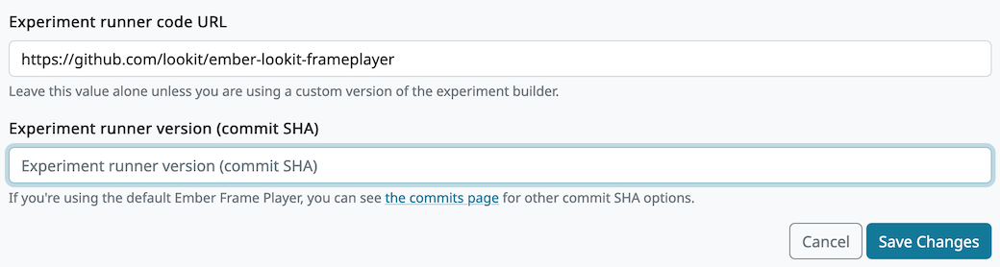
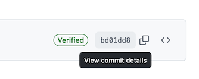
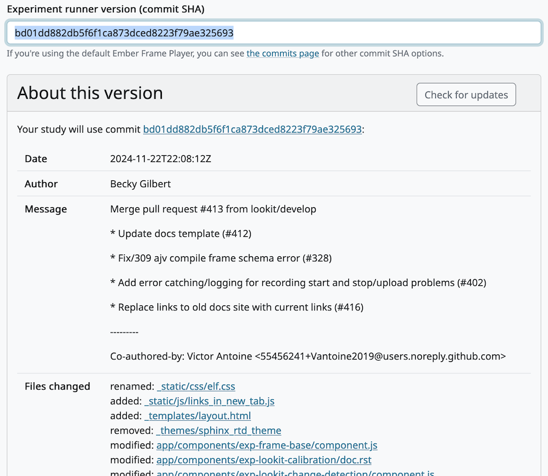

#############################################
Updating the frameplayer code for your study
#############################################

In the future, there may be changes in the Lookit frameplayer code that you want your study to use - for instance, a bug fix for an issue your participants are encountering or a new frame you want to use. (By default, your study keeps chugging along using exactly the same code, so that updates can't change how your study works without your knowledge.) Here's how you can update the code used:

1. Click "Edit study" on the study you want to update.

    
----------
    
2. Scroll down to the "Change Study Type and Dependencies" section. You should see a value in the ``last_known_player_sha`` field if you have built study dependencies before, like this:

    
If you want to know more about what code is currently being used, you can go to ``[player_repo_url]/commit/[last_known_player_sha]``. In the example above, that would be `<https://github.com/lookit/ember-lookit-frameplayer/commit/c4ee4a8b5c7921f9b6a4f027de84d7122ebfe1b8>`_. 

You can edit the ``player_repo_url`` to use a different repo entirely, like your own fork. The steps are the same regardless of which repo you're using, but pointing to your own code is more advanced. We'll focus here on just updating the version of the central Lookit code you're using.

----------

3. 

**Option 1**: You can delete the value in ``last_known_player_sha`` and leave it blank to use the default value, which is the most recent version of the Lookit frameplayer code.

**Option 2**: You can paste in the ID of the code version you want to use ("commit sha"). You can see what each new commit did and choose one by going to `<https://github.com/lookit/ember-lookit-frameplayer/commits/master>`_. Click the clipboard button (circled) to copy the commit sha.

.. image:: _static/img/update_code/commit_list.png
    :alt: List of commits to master

By default you will see only commits to the "master" branch of the frameplayer. If you want to use a particular feature branch, you can select it instead:

    
You can click on any commit for more detail about what was changed. From there you can also see the commit sha (circled).

    
Paste the commit sha you want to use into the study edit view:

----------
    
4. Click "Save". You will see a warning pop up if your study has already been approved, telling you it will be rejected automatically and require re-review. This is so that Lookit staff can review any new code you're using (in particular if you're using your own repo).

    

 
----------
 
5. Because the code you're using is different now, you will need to build preview dependencies before you can see the study preview again, and you will need to build dependencies before you can start your study again. Even if you are just updating to the latest version of the master branch, you should preview your study and make sure everything still works just how you want it to! Click "Build preview dependencies."

    
Once you get an email notification that preview dependencies are built, you will be able to click "See Preview" above.

----------

6. Once you are satisfied with your study preview, return to your main study page where you will probably see that its state is "rejected." Click "change state" and select "submit" to submit your study for re-approval. Once it is approved, you will be able to start data collection again. You will need to click "Build dependencies" and wait for that process to complete (about ten minutes) before you can start the study.

