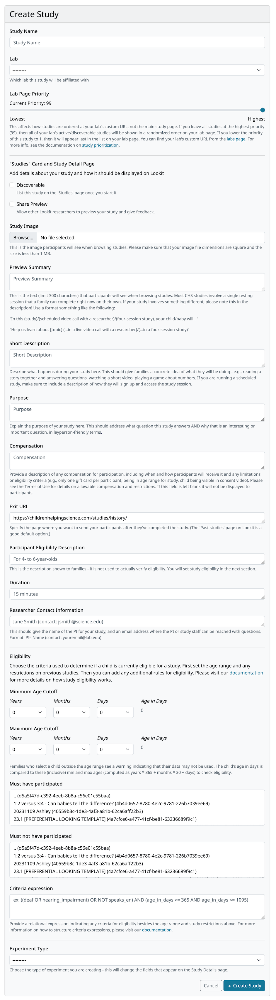
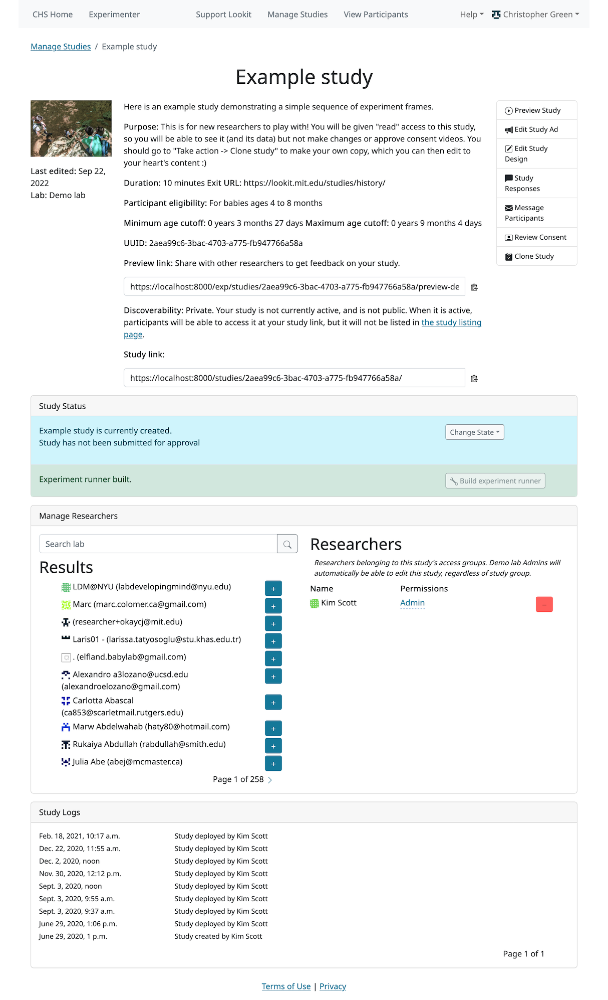
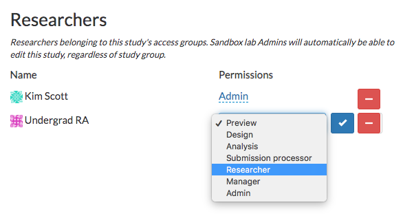
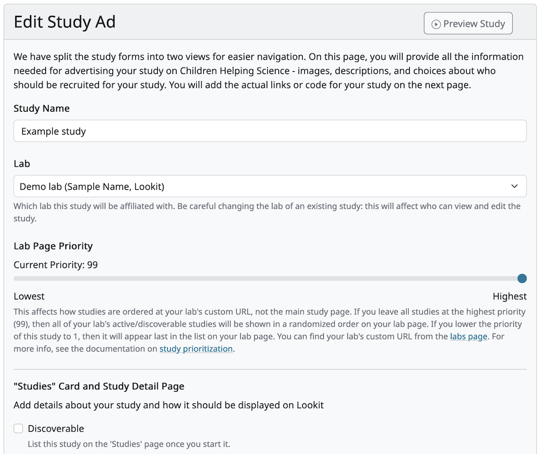

##################################
Using the experimenter interface
##################################

===========
Logging in
===========

Researchers should log into Experimenter via oauth through the Open Science Framework. Visit `<https://lookit.mit.edu/exp/>`_ to log in to the production server, or `<https://staging-lookit.cos.io/exp/>`_ to log in to the staging server, and click on 'Open Science Framework'. (Note: if running Lookit locally, you will instead need to authenticate as described in `Setup for custom frame development`_.)

.. image:: _static/img/login_to_exp.png
    :alt: Login to experimenter image

We use regular OSF accounts (you already have one if you have used OSF) for the production server, and staging OSF accounts (you probably don't have one yet) for the staging server. A staging OSF account is just an account on OSF's own staging server, where they try out changes ahead of deploying to production. 

If you don't have the appropriate type of OSF account yet, you can register to create one (use the 'Create Account' link on the screen shown below). Once you have an account, return to the Lookit experimenter login screen at `<https://lookit.mit.edu/exp/>`_ or `<https://staging-lookit.cos.io/exp/>`_, click 'Open Science Framework' again, and enter your credentials.

.. image:: _static/img/osf-login.png
    :alt: Enter your osf credentials
    :width: 300
    :align: center

If you have not previously logged in to Lookit (or Lookit staging), you should now see a message that 'Your request to join Experimenter has been submitted. You will receive a notification by email when this is completed.' like the image below. **Please tell us** once you have requested access so we can approve you promptly! New researchers require approval to access Lookit, which is easy (one of us clicking a button) but not automatic. 

.. image:: _static/img/dashboard.png
    :alt: Login to experimenter image

Otherwise, you will be now be logged into Experimenter.

Researcher accounts can also have children and demographic data, just like participants. If you would like to have a **separate** participant account on Lookit for testing and/or actual participation, use a different email address and sign up for an account using the 'Sign up' link on the home page.

====================
Managing Studies
====================
--------------------
Viewing study list
--------------------
To view all studies, navigate to /exp/studies/. (We will use this short format to indicate relative paths starting with the Lookit site you are using - e.g., https://lookit.mit.edu/exp/studies/ or https://staging-lookit.cos.io/exp/studies/).  A researcher must have been added to an organization to view this page.  From there, the researcher can only see studies they have permission to view.  Org admins and org reads can see all studies that belong to their organization.  If the user is a basic researcher, they can only view studies which they have created or to which they have been explicitly added.

You can filter studies by name or by keywords in the description. Additionally, you can sort on various study states like "Created" or "Submitted", or filter on your own studies by selecting "My Studies". You can also sort on study name, study end date, and study begin date.

.. image:: _static/img/study_list.png
    :alt: Viewing studies

--------------------
Creating a study
--------------------
To create a study, navigate to /exp/studies/create/. You'll need to provide the following information:

- **Name**: Participant-facing title of your study; must be <255 characters. Shoot for a short, catchy title; depending on how you advertise your study, you may want participants to be able to recognize and select it from the studies page. If you plan on running similar follow-up studies and want them to be easily distinguishable, avoid titles that encompass your entire research program like "Infant Language Study."

- **Image**: Thumbnail image that will be displayed to participants on Lookit's studies page.  File must be an image-type, and please keep the file size reasonable (<1 MB). Sometimes your stimuli are a good basis for creating this image, or it can be something that conceptually represents your study or shows what it looks like to participate.

- **Short description**: Describe what happens during your study here (1-3 sentences). This should give families a concrete idea of what they will be doing - e.g., reading a story together and answering questions, watching a short video, playing a game about numbers.

- **Purpose**: Explain the purpose of your study here (1-3 sentences). This should address what question this study answers AND why that is an interesting or important question, in layperson-friendly terms. Note: this tends to be harder than you'd think - it's not just you! Imagine all the time you spend getting comfortable explaining the point of a study in the lab (or training RAs on the same), distilled into this task. Plus you don't get to interact with the parent to gauge their interest level or familiarity first. Take your time and read this out loud as you work. Some things to check: Is it too specific - is a reasonable response "okay, you will find out whether X is true, but why does that matter?" Is it too general - could you write the same thing about a follow-up study you're planning or another study going on in your lab? 

- **Compensation**: Provide a description of any compensation for participation, including when and how participants will receive it and any limitations or eligibility criteria (e.g., only one gift card per participant, being in age range for study, child being visible in consent video). Please see the `Terms of Use <https://lookit.mit.edu/termsofuse/>`_ for details on allowable compensation and restrictions. If this field is left blank (which is okay if you're not providing compensation beyond the joy of participation) it will not be displayed to participants.

- **Exit URL**: Must enter a URL. After the participant has completed the study, they will be automatically redirected to the exit URL. Typically this is just `https://lookit.mit.edu/`

- **Participant Eligibility**: Freeform participant-facing eligibility string, of the form 'For...' (e.g., 'For babies under 1 year old'). This is **not** directly used to automatically check eligibility, so you can include criteria that may not yet be possible to check for automatically - e.g., this study is for girls whose favorite color is orange. Make this readable so participants understand if their child can take part in the study. Age limits specified here should be carefully considered with respect to the minimum/maximum age cutoffs (next) which **are** used for automatic verification of eligibility. 

- **Minimum/Maximum Age cutoffs**: Integer fields specifying minimum/maximum ages of participants (inclusive). Eligibility is calculated based on the child's current age in days; this is compared to the minimum/maximum ages in days, calculated as 365*years + 30*months + days. Participants under the age range see a warning indicating that their data may not be used, and suggesting that they wait until they're in the age range. Participants over the age range just see a warning indicating that their data may not be used. Participants are never actually prevented from starting the study, to remove motivation for a curious parent to fudge the child's age. 

  Note that these ages do **not** in all cases correspond exactly to the child's age in 'calendar months' or 'calendar years' (e.g., 'one month' if that month is February). In general, you want to avoid a situation where the parent thinks their child should be eligible based on the participant eligibility string (e.g., "my child is one month old, she was born February 3rd and it's March 4th!") but sees a warning when trying to participate. You can do this by narrowing the eligibility criteria in the freeform string and/or by expanding them in the cutoffs here. If one has to align better with your actual inclusion criteria, in general you want that to be the minimum/maximum age cutoffs.
  
- **Duration**: Approximately how long does it take to do your study, start to finish? (Try it if you're not sure; include time to read the instructions.) You can give an estimate or range.

- **Researcher contact information**: This should give the name of the PI for your study, and an email address where the PI or study staff can be reached with questions. Format: PIs Name (contact: youremail@lab.edu). This is displayed to participants on the study detail page before they choose to participate, as well as substituted into your consent form and exit survey, so in general the name needs to be the person who's listed as PI on your IRB protocol (although it may not need to be their personal email address). 
  
- **Discoverable**: Do you want this study to be listed on the Lookit studies page when it's active? Check this box to list the study there. If the box is unchecked, the study will be 'non-discoverable' and participants will only be able to get to it by following a direct link with your study ID. This may be helpful if, for instance, you want to run a follow-up study (with in-lab on online participants) and want to send the link to a limited number of people, or if your inclusion criteria are very limited (e.g., a rare genetic disorder) and you want to recruit specifically without getting any random curious families stopping by. You may also occasionally set a study to non-discoverable temporarily so you can try it out as a participant without actually recruiting!

- **Build Study** - This needs to be a valid JSON block describing the different frames (pages) of your study, and the sequence. You can add these later under localhost:8000/exp/studies/<study_id>/edit/build/. For detailed information about specifying your study protocol, see `Building an Experiment`_.

- **Study Type** - The study type is the application you're using to enable participants to take a study. Right now, we just have one option, the `Ember Frame Player <https://github.com/lookit/ember-lookit-frameplayer>`_.  It's an ember app that can talk to our API. All the frames in the experiment are defined in Ember and there is an exp-player component that can cycle through these frames. For details, see `Editing study type`_

--------------------
Study detail page
--------------------
To view a single study, click on it from the study list.  A researcher must have permission to view this study specifically.  Org admins and org reads can view all studies in their organization.  A basic researcher can only view this study if they have been
explicitly added as a study admin or study read. At the top, you see many of the study details that you entered when you created the study.  The UUID is also displayed; this is your study's unique identifier and is used in the direct link to the study. 

At the top right, you have options to edit the study, view responses, email participants, or clone the study. Cloning will create a copy of the study but add the logged in user as the creator. The clone will be moved back into "Created" status (e.g., if the current study is actively collecting data, the cloned study will not be - it will need to be approved before it can be started). Study logs of when the study changed state are at the bottom of the page.

The only things that can be edited from this page are the study status and researcher list.  The current study status is displayed, as well as a dropdown with the available states.  Only users that have permission to edit the study state can make these changes, meaning organization admins, or study admins.  The available states where you can move the study depend on what state is next in the sequence, as well as your current level of permissions.  For example, if a study's current state is "Created", that study
can only be "Submitted" for review, or "Archived", which removes the study from display.  Comments can only be left on the study if it is being rejected.  Only organization admins can approve or reject a study.

--------------
Study status
--------------

New studies must be submitted and approved by Lookit before they can be started. Once approved, researchers with study admin permissions can independently start/pause data collection at will; however, if any changes are made to the study it will be automatically rejected and will require re-approval. The study approval process is intended to give Lookit staff an opportunity to check that studies comply with the Terms of Use and to provide support if necessary. Researchers will receive email notifications when their study is approved or rejected.

The possible study states are:

    - *created*: Study has been initially created, but has not been submitted for approval
    - *submitted*: Study is submitted and awaiting approval by an organization admin
    - *approved*: Study has been approved by an organization admin to run on Lookit, but is not yet active
    - *rejected*: The study has been rejected by an organization admin.  The study should be edited before resubmitting.
    - *active*: Study is active and can be collecting data. If the study is also marked "Discoverable", the study will show up on Lookit's study list.
    - *paused*: Study is not actively collecting data or visible on Lookit
    - *deactivated*: Study is done collecting data
    - *archived*: Study has been archived and removed from search
    
---------------------------------
Adding researchers to your study
---------------------------------
Halfway down the study detail page, you can see the researchers that have study admin or study read permissions to your study. In the search box, you can look for an existing Lookit researcher (this must be someone who has already been added to your organization). 

.. image:: _static/img/adding_researchers.png
    :alt: Adding researcher to study

Click the green plus to add them to your study.  They are given study read permissions by default; this allows them to see all study details and participant data and to approve consent videos, but not to change study details, change study status (e.g. start/stop data collection), or add other researchers. 

If the researcher you are adding happens to also be an organization admin, they will have admin permissions on your study. These researchers that are also org admins are denoted by an asterisk, followed by the <name of your organization>-Admin.

.. image:: _static/img/adding_researchers2.png
    :alt: Adding researcher to study

------------------------------------------
Editing researcher permissions on a study
------------------------------------------
To edit a researcher, select read or admin permissions in the dropdown beside the researcher name and click the checkmark.  This will automatically give the researcher read or admin permissions.  There must be at least one study admin at all times.

---------------------------------
Deleting researcher permissions
---------------------------------
To remove a researcher from a study, click the red minus button beside the researcher's name.  This will automatically remove the user's study admin or study read permissions. There must be at least one study admin at all times, so it's possible that you won't be able to remove a researcher.

.. image:: _static/img/deleting_researchers.png
    :alt: Deleting researcher permissions

--------------------
Study edit page
--------------------
On the study edit page, you can update much of the metadata about the study. You can only view this page if you have permission to edit this particular study, meaning org admins or study admins. At the top of the page, you can edit fields like Name, and Description.  See Creating a Study for more details.

To edit fields, change the information and click Save Changes in the middle of the page.  If your study has already been approved, then the save button will be red.  Otherwise it will be green. If your study has already been approved, then editing key details will automatically put the study in a rejected state.  You must resubmit your
study and get it approved again by an organization admin to run the study on the Lookit platform.

At the bottom of the edit study page, you can make edits to your study's structure (the frames, or pages, in your experiment), and the sequence of those frames.  You can also make advanced edits to the commits we are using to build your study.

-------------------------
Editing study structure
-------------------------
For more information about how to specify what happens during your study, see `Building an Experiment`_.

To edit a study's structure, click 'Edit study' from the study detail page. You must be a study admin or org admin to view this page. From this 'study edit' page, you can edit the study's structure and the study type. The study structure specifies the frames (or pages) of your experiment, and also specifies the sequence.

.. image:: _static/img/build_study.png
    :alt: Built study

To edit the structure, click on the JSON block.  A JSON editor will appear.  Click on "Beautify" in the top right corner for better readability. Note that any invalid JSON will be shown via a little red X at the left of the relevant line! Once you are happy with your changes click 'Close'.  Then hit "Save" in the bottom right corner.
If your study has already been approved, then clicking "Save" will automatically reject the study. You will have to resubmit it for an organization admin to reapprove.

.. image:: _static/img/json_editor.png
    :alt: Edit JSON

To preview your study, click "Try Experiment". (You will need to build preview dependencies first if you haven't yet, or if you've changed the study type or which code to use.)

-------------------------
Editing study type
-------------------------
To edit a study's type, click 'Edit study' from the study detail page.

The study type is the application you're using to enable participants to take a study. Right now, we just have one option, the `Ember Frame Player <https://github.com/lookit/ember-lookit-frameplayer>`_.  It's an ember app that can talk to our API. All the frames in the experiment are defined in ember-lookit-frameplayer, and the exp-player component can cycle through these frames.

**If you don't want any customization and want to use the existing player and frames, just select the defaults.** These are advanced options! 

What does each field mean?

    - The ``player_repo_url`` is the repo where the frames and the player are stored.  This is the default player_repo_url: https://github.com/lookit/ember-lookit-frameplayer.  Advanced users may want to define their own custom frames for use with Lookit studies beyond those provided in the core library. (For more information about how to do this, see https://lookit.readthedocs.io/en/develop/developing-frames.html.) To use your own frame definitions, set the addons_repo_url to your own fork of the ember-lookit-frameplayer repo (e.g., https://github.com/yourname/ember-lookit-frameplayer instead of https://github.com/lookit/ember-lookit-frameplayer). You can then choose any commit SHA from your own repo.

    - The ``last_known_player_sha`` is the commit of the player repo to use. If you don't add this, it will point to the latest commit in the default branch. To browse commits available for the experiment player ember-lookit-frameplayer and see what might have changed, you can look through https://github.com/lookit/ember-lookit-frameplayer/commits/.

Leave the field ``last_known_player_sha`` blank to use the default - the latest versions of the experiment player and frames that Lookit provides. When you build dependencies, the commit SHAs (unique IDs) of the latest versions will be fetched and filled in, so that you will continue to use this version for your experiment unless you deliberately update.

**Important:** Whenever you update the code versions you are using, you will need to build dependencies again to preview and to activate your study. This build process creates a special environment just for your study using exactly the code you selected, so that your study will continue to run as you designed it. By storing builds on Google Cloud Storage,
pointing to specific commits, we can keep edits to frames from unintentionally breaking another study. You only need to build dependencies when you have changed the commit SHAs here - not when you update your study JSON or other data like the age range.

-----------------------------------
Viewing individual study responses
-----------------------------------
For information about interpreting study responses, see `Experiment data`_.

To view a study's response, navigate to your study and click 'View Responses,' then 'Individual responses'. You must have permission to view this study's responses, which means you must be an Organization Admin, Organization Read, or belong to the Study Admin or Study Read groups.

Responses only show up in this view once you have confirmed that the participant provided informed consent to participate using the Consent Manager. 

On the left, you have a list of participants that have responded to your study, with the response id, the study's completion status, and the date it was modified. When you click on a participant, the JSON of that participant's response is shown on the right.  You can
download the individual participant's JSON response by clicking "Download Individual Response JSON".  Alternatively, you can select CSV in the dropdown, and click "Download Individual Response CSV".

Beneath the CSV/JSON response data are any individual video attachments that are linked to that participant's response. Exception: if the participant selected the 'withdraw video' option in an exit-survey frame at the end of the study, all video except for the consent video is unavailable (and will be deleted from Lookit servers as well in 7 days). There is a potential rare edge case where you access video while the participant is still doing the study, and then they withdraw, so you should still verify that none of your participants have withdrawn video.

.. image:: _static/img/responses.png
    :alt: View responses

------------------------------
Viewing all study responses
------------------------------
To view all of the responses to a study with confirmed consent, click 'View Responses' from the study detail page and then click 'All Responses.' You must have permission to view this study's responses, which means you must be an Organization Admin, Organization Read, or belong to the Study Admin or Study Read groups.

By default, all study responses are displayed in JSON format.  To download as CSV, select CSV in the dropdown and download.  The study response data is supplemented with the study id, participant ids and nickname, and the associated child info.

.. image:: _static/img/all_responses.png
    :alt: View all responses

-------------------------------------------
Viewing demographics of study participants
-------------------------------------------
To view the demographics of participants that have responded to your study and have confirmed consent, click 'View Responses' from the study detail page and then click 'Demographic Snapshots.' You must have permission to view this study's responses, which means you must be an Organization Admin, Organization Read, or belong to the Study Admin or Study Read groups.

This list is generated by looping through all the responses to your study, and displaying the demographics of the associated participant.  If a participant has responded multiple times, the demographics will appear multiple times.  Demographic data was versioned, so the demographics associated with each
response will be the demographics that were current at the time the participant responded to the study.  You can download the demographics in JSON or CSV format.

.. image:: _static/img/demographics.png
    :alt: View all study demographics

----------------------------------------
Viewing all study videos
----------------------------------------
To view all video responses to your study from sessions with confirmed consent,click 'View Responses' from the study detail page and then click 'Attachments.'.
You can filter on video attachment name. The format of the video names is `videoStream_{study_uuid}_{order-frame_name}_{response_uuid}_{timestamp}_{randomDigits}.mp4`

Video attachments can be downloaded individually.  You also have the option of bulk downloading all consent videos for your study, or bulk downloading all responses.
The bulk download will take place asynchronously, so once the videos have been downloaded and put in a zip file, you will get an email telling you this is done.

===========================
Managing your Organization
===========================

Currently all researchers using Lookit are part of a single 'MIT' organization. The organization construct will eventually allow labs to manage access for their own students and RAs. For now, though, these instructions just apply to Lookit admins. 

-----------------------------------------
Adding researchers to your organization
-----------------------------------------

Navigate to `Manage Organization` https://lookit.mit.edu/exp/researchers/.  Only users with organization admin and organization read permissions can view other researchers in the org. 
The researchers displayed are researchers that currently belong to your organization, or researchers still needing approval.  Researchers awaiting approval have "No organization groups" listed as the permission.
Navigate to a researcher awaiting approval (only organization admins are permitted to do this).

.. image:: _static/img/researcher_list.png
    :alt: Researcher list image

Under permissions at the bottom of the researcher detail page, select `Researcher`, `Organization Read`, or `Organization Admin` from the dropdown, and click the check mark.  This will give
that researcher the associated permissions and add them to your organization. They will receive an email notification.

.. image:: _static/img/researcher_detail.png
    :alt: Researcher detail image

------------------------------------------------
Editing a researcher's organization permissions
------------------------------------------------
Navigate to a particular researcher's detail page https://lookit.mit.edu/exp/researchers/<researcher_id>.  Only organization admins can view this page. Under permissions at the bottom of the researcher detail page, select `Researcher`, `Organization Read`, or `Organization Admin` from the dropdown, and click the check mark.  This will modify
the researcher's permissions.

.. image:: _static/img/researcher_detail2.png
    :alt: Researcher detail image

------------------------------------------------
Deleting a researcher's organization permissions
------------------------------------------------
Navigate to `Manage Organization` https://lookit.mit.edu/exp/researchers/. Only users with organization admin and organization read permissions can view other researchers in the org.  Click "Remove" beside the
researcher you wish to delete, and then click "Remove" again in the confirmation modal.  The researcher will be marked as inactive and will no longer be permitted to login to Experimenter.

.. image:: _static/img/deleting_a_researcher.png
    :alt: Deleting a researcher

.. image:: _static/img/attachments.png
    :alt: View all study attachments

.. _`Building an Experiment`: researchers-create-experiment.html

.. _`Experiment data`: researchers-experiment-data.html

.. _`Setup for custom frame development`: frame-dev-setup.html