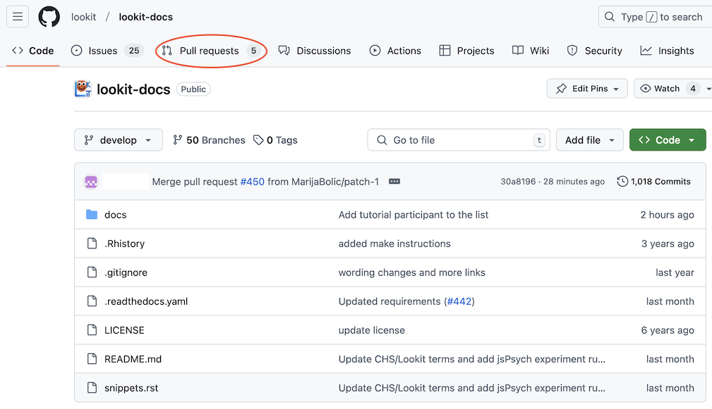
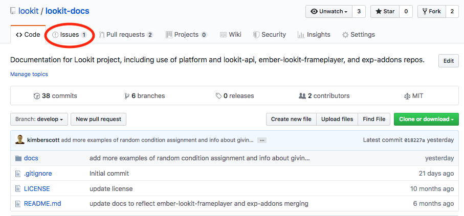
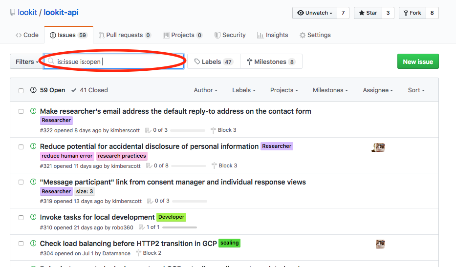
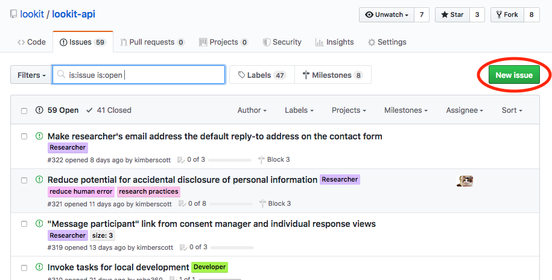
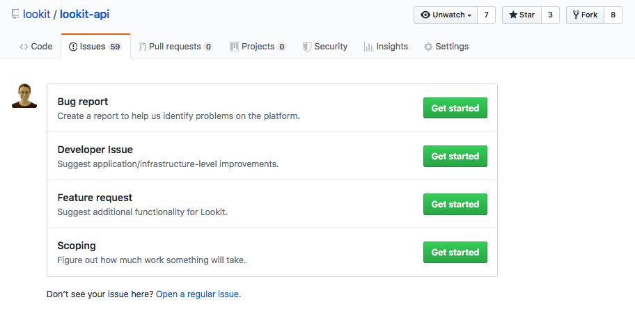
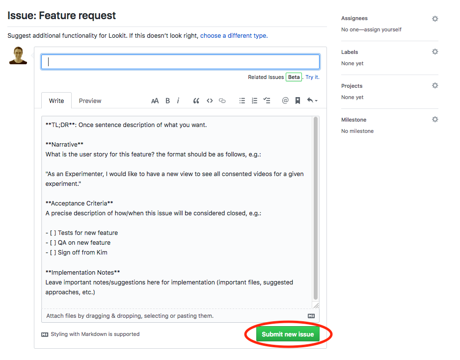
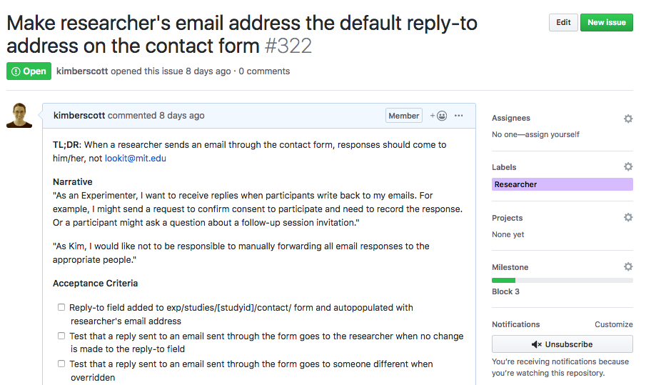

##################################
2. Contributing to the codebase
##################################

Lookit is an open-source project, meaning that the code is freely available and anyone can contribute. This includes the actual Lookit platform, the components used in studies, AND the documentation you're reading now. Community contributions and input are critical to the project!

In this section, you'll make your first "Pull request" (PR) to propose a change to the documentation [#]_. Your change will just be to add yourself to a list of tutorial participants. This way, you'll be comfortable making substantive changes whenever you're ready!

Later on in the tutorial, if you come across something confusing or you have an idea to improve the instructions or exercises, you can follow these same instructions to fix it. Although we recognize that most Lookit users will not be ready to contribute to the code that makes Lookit run, editing the documentation is something everyone can do! We need your help to keep it up-to-date and constantly improving!

.. _First PR: 

Making your first pull request (PR)
------------------------------------
All of the code that makes Lookit run is stored on GitHub, which makes it easy to keep track of changes over time and merge changes from many collaborators. There are several code repositories or "repos" that house different pieces of the project. Here we are going to walk through making a change to the documentation repo, `lookit-docs <https://github.com/lookit/lookit-docs>`_. Making a "pull request" or PR is a way to ask that your edits be incorporated into the main codebase. It's actually not too hard, and it's a great way to contribute! 

Don't worry about making a mistake and somehow messing up the documentation - you can't directly edit the "official" version of the files! There is always a review process before your changes are merged in. 

1. In a separate tab, go to https://github.com/lookit/lookit-docs and click "Fork" in the top right corner. You'll need to make an account on GitHub if you don't have one already. You only need to do this once - for future changes you can skip this step.

   .. image:: _static/img/tutorial/first_pr_fork.png
      :alt: Fork button on GitHub
    
2. From the page you are reading right now (or in the future, from whatever docs page you want to edit -- *not* from GitHub!), scroll up and click the "Edit on GitHub" button at the top right. For this first PR, you'll be editing the page you're reading right now (https://lookit.readthedocs.io/en/develop/tutorial-contributing.html)!

   .. image:: _static/img/tutorial/edit_on_github_button.png
      :alt: Edit on GitHub button at the top of this page

3. Clicking "Edit on GitHub" will bring you to a page like the one shown below. Click the pencil icon on this page to start editing the file. 

   .. image:: _static/img/tutorial/github_edit_button.png
      :alt: Edit button on GitHub

   You may see a message that submitting a change will write it to a new branch in your fork. That's ok!
 
   .. image:: _static/img/tutorial/new_branch_message.png
      :alt: New branch message on GitHub
    
4. Make your changes! For this PR, just add your name and institution to the list of tutorial participants. Click the "Preview changes" tab to make sure everything looks the way you want it to. You can go back and forth between the "Edit file" and "Preview changes" tabs as you make more involved changes.

   .. image:: _static/img/tutorial/preview_tab.png
      :alt: Preview changes and edit file tabs on GitHub

5. Scroll down to "Propose file change." Enter a short description of your change, and then click the green "Propose file change" button:

   .. image:: _static/img/tutorial/propose_file_change.png
      :alt: Propose file change section on GitHub
    
6. Click the green "Create pull request" button on the page that appears next:

   .. image:: _static/img/tutorial/create_pr.png
      :alt: Create pull request on GitHub

7. Hooray! You've created your first PR. You should now be at a page where it's been given a number:

   .. image:: _static/img/tutorial/pr_view.png
      :alt: PR view on GitHub

The PR will now be in a list for Lookit staff to review. You can return to this page to check on it; if you have allowed Github to send notifications via email (the default), you will also get an email about any activity. You can also see your PR in the list by going to https://github.com/lookit/lookit-docs and clicking on "Pull requests": 

This process is the easiest way to make a change to a particular file in the documentation. If you want to edit multiple files, add new files, and/or reorganize things, you will probably want to try out your changes locally before submitting your PR. You can learn more in the :ref:`section on Contributor Guidelines<Contributor Guidelines>`. You don't need to know how to do that for the purposes of this tutorial, though - just know it's *possible* to deal with multiple files at once.

List of tutorial participants
------------------------------

.. rst-class:: tutorial-participants

- Katie Nguyen (Univeristy of Maryland)
- Olivia Lowman (American University)
- Alexander Maksiaev (University of Virginia)
- Kim Scott (MIT)
- Ashley Thomas (MIT)
- James Dunlea (Columbia University)
- Katharine Scott (University of Wisconsin-Madison)
- Meltem Yucel (University of Virginia)
- Francis Yuen (University of British Columbia)
- Rachel Dudley (Central European University)
- Lisa Renaud (Northwestern University)
- Hannah Cho (University of Toronto)
- Trisha Katz (University of California-San Diego)
- Caren Walker (University of California-San Diego)
- Elizabeth Lapidow (UCSD)
- Hyesung Grace Hwang (University of Chicago)
- Marc Colomer (University of Chicago)
- Junyi Chu (MIT)
- Kanika Garg (GGSIPU)
- Maddie Pelz (MIT)
- Heather Kosakowski (MIT)
- Emily Neer (UCLA)
- Amalia Ionescu (UCLA)
- Katlyn Newman (UCSD)
- Virginia Rosenberger (MIT)
- Katarina Begus (Rutgers-Newark) 
- Clement Choi (University of British Columbia)
- William Adams (University of Bath)
- Théo Morfoisse (NYU)
- Noa (UCSB)
- Kelly Kendro (UC San Diego)
- Katherine Casey (American University)
- Eren Fukuda (University of Wisconsin-Madison)
- Bailey Immel (UW-Madison)
- Annie Harris (Harvard University Extension School)
- Shari Liu (Harvard)
- Brandon Woo (Harvard)
- Caitlin Fausey (University of Oregon)
- Kate Bee (University of Oregon)
- Jasmine Engen (University of Oregon)
- Ellie McLoughlin (University of Oregon)
- Allyson Kuznia (University of Oregon)
- Haley Weaver (University of Wisconsin-Madison)
- Annika Voss (UC Davis)
- Aaron Beckner (University of California, Davis)
- Amanda Rose Yuile (UIUC)
- Lisa Oakes (UC Davis)
- Gerwin Legaspi (University of British Columbia)
- Amanda Cramer (University of Texas at Austin)
- Rebecca Houston-Read (Harvard University)
- Nicki Zieber (University of Kansas)
- Brooke Diviak (New York University)
- Charles Murray (Stanford University)
- Jing Shen (University of Wisconsin-Madison)
- Stephanie Chang (Stanford University)
- Daniela Bencid (Colby College)
- Adena Schachner (University of California, San Diego)
- Samia Razvi (UT Dallas)
- Nicoke Cuneo (Haskins Laboratories)
- Kristine Hocker (MIT)
- Estelle Hervé (AMU)
- Isabel Nichoson (Wellesley College)
- Ginni Strehle (UT Dallas)
- Gala Stojnić (NYU)
- Mark Sheskin (Minerva University)
- Eylem Altuntas (MARCS at WSU)
- Catherine T Best (MARCS Institute, Western Sydney University, Australia)
- Xi Jia Zhou (Stanford)
- Brendan Hancock (Queen's University)
- Carlin Bannister (University of British Columbia)
- Allena McComas (University of California, San Diego)
- Talia Papa (University of British Columbia)
- Emily Marks (Uniersity of British Columbia)
- Toby Mintz (University of Southern California)
- Jazlyn Armendariz (California State University, Northridge)
- Melissa Santos (Stanford University)
- Karen Smith (University of Wisconsin-Madison)
- Katherine Archer (Rutgers University - Newark)
- Lillian Xu (University of Wisconsin-Madison)
- Ariel Starr (University of Washington)
- Taylor Petersen (University of Washington)
- Isabella Duan (Stanford University)
- Aarthi Popat (Stanford University)
- Jamie Jirout (University of Virginia)
- Cynthia Lukyanenko (George Mason University)
- Franchesca Quintero (University of California, Davis)
- Madison Buntrock (University of Maryland, College Park) 
- Katie Schuler (University of Pennsylvania)
- Emily Fourie (University of California, Davis)
- Sarra Al-Zayer (Cornell University)
- Mary Eng (Cornell University)
- Elizabeth Swanson (Stanford University)
- Peppy Winchel (University of Virginia)
- Kaitlin Lawler (University of Texas at Dallas)
- Shoronda Matthews (University of Virginia)
- Yi Lin (New York University)
- Ariel Mathis  (University of Pennsylvania)
- Sav Nijeboer (University of British Columbia
- Michelle Miller (University of Virginia)
- Iris Zhong (Smith College)
- Chijindu Ene (University of Virginia)
- Vanessa Mak (University of British Columbia)
- Sarvenaz Oloomi (University of British Columbia)
- Ania Alberski (University of Pennsylvania)
- Jenna Croteau (Smith College)
- Madison Chew (University of California, San Diego)
- Claudia Lam (University of British Columbia)
- Stephanie De Anda (University of Oregon)
- Mariam Habib (Rutgers University)
- Rosalva Mejia (University of California, Los Angeles)
- Jinyoung Jo (University of California, Los Angeles)
- Anika Brahmbhatt (Boston University)
- Hironori Katsuda (University of California, Los Angeles)
- Canaan Breiss (University of California, Los Angeles)
- Sarah Kang (University of California, San Diego)
- Megan Hoffman (University of California, San Diego)
- Sivan Barashy (University of California, San Diego)
- Stacee Santos (Boston College)
- Chippy Banarjee (Yale University)
- Alyssa Nguyen (University of Oregon)
- Erika Parisien (University of Oregon)
- Zoya Egiazaryan (University of California, Los Angeles)
- Sara Marshall (McMaster University)
- Sho Tsuji (The University of Tokyo)
- Catherine Bianco (Columbia University)
- Simran Mahajan (New York University)
- Valeria Hernández (New York University)
- Amanda Maniscalco (New York University)
- Alice Wang (Haskins Laboratories)
- Jamie Kang (University of Virginia)
- Andrea Stein (University of Wisconsin-Madison)
- Haykaz Mangardich (University of British Columbia)
- Justine Wang (University of California, San Diego)
- Kayla Good (Stanford University)
- Dimitri Prica (University of Barcelona)
- Victor Manea (University of California, San Diego)
- Candice Rubie (University of Waterloo)
- Abbey Ward (University of Oregon)
- Connor Cook (Wingate University)
- Erica Verde (University of California, Davis)
- Joseph Lang (Wingate University)
- Heather Morse (Wingate University)
- Carrie Watson (University of Southern California)
- Yiran Chen (University of Pennsylvania)
- Erica Wojcik (Skidmore College)
- Stacy Wang (University of British Columbia) 
- Grace Clark (New York University)
- Victor Antoine (École Normale Supérieure, Paris)
- Tiffany Widjaja (University of California, San Diego)
- Christopher J. Green (MIT)
- Jacob Guerrero (University of California, San Diego)
- Gal Raz (MIT)
- Angela Oku (University of California, San Diego)
- Hannah Ruebeck (MIT)
- Nina Griggs (University of British Columbia)
- Virginia Morley (New York University)
- Amy Krimm (University of Pennsylvania)
- Kayla Vo (University of British Columbia)
- Cynthia Gu (University of Pennsylvania)
- Tula Childs (University of San Francisco)
- Marianna Zhang (Stanford University)
- Maddy Paxson (University of Michigan)
- Gabriella Fetman (Yeshiva University)
- Anaum Rizvi (University of Texas at Dallas)
- Lasya Manne (University of Texas at Dallas)
- Isabel Musselman (Harvard)
- Mika Asaba (Stanford University)
- Lucie Wolters (University of Edinburgh)
- Mackenzie Fidelak (Stanford University)
- Irina Lepadatu (University of Oxford)
- Julian Bok (University of Wisconsin-Madison)
- Juliana Gerard (Ulster University)
- Krischanda Bemister (Ryerson University)
- Sarah der Nederlanden (University of Amsterdam)
- Pinar Aldan (Yale University)
- Sally Zhao (MIT)
- Michelle Hurst (University of Chicago)
- Emily Pardo (University of Chicago)
- Gabriel Bonamy (University of California, San Diego)
- Kayle Park (Duke University)
- Elizabeth Choi (Wellesley College)
- Asmita Mittal (MIT)
- Mathilda Kitzmann (Stanford)
- Jamie Park (University of California, San Diego)
- Kiley McKee (Northwestern University)
- Noelani Pence (University of Oregon)
- Anna Soderling (Duke University)
- Kaelin Kinney (University of Louisville)
- Gianna Zades (Harvard University)
- Karina Kling (University of Chicago)
- Sereniti Williams (Northwestern University) 
- Ian Chandler-Campbell (University of Texas at Dallas)
- Jena Miko (University of Oregon)
- Tiffany Doan (University of Toronto, Scarborough)
- Hanqi Chen (University of Toronto)
- Zoë Robertson (University of Virginia)
- Allie Liebmann (Yale)
- Haley Kragness (Bucknell University)
- Sofia Cordeiro (University of British Columbia)
- Rosie Aboody (Harvard & MIT)
- Emily Chan (University of Chicago)
- Noah Norman (Yale)
- Gillian Broome (New York University)
- Olivia Richards (University of Louisville)
- Anela Marat (University of Texas at Dallas)
- Preethi Sethuraman (University of Texas at Dallas)
- Alessandra Pintado-Urbanc (University of Pennsylvania)
- Ashley Turell (University of Wisconsin) 
- Milana Korobko (University of Pennsylvania)
- Vishwa Patel (Rutgers University)
- Nina Wang (University of Pennsylvania)
- Deena Weisberg (Villanova University)
- Isha Kere (University of Texas at Dallas)
- Victoria Fracalossi (American University)
- Niomi Friedlander (University of Minnesota)
- Sienna Radifera (MIT)
- Katelyn Hughes (University of Oregon)
- Jackson Mohr (University of Oregon)
- Lia Washington (MIT)
- Danielle Rothschild (Northwestern University)
- Aniya Sealey (University of Louisville)
- Natalie Masetti (Yale)
- Lizbeth Lozano (Yale University)
- Misha Becker (UNC Chapel Hill)
- Milosz Krzewinski (Loyola University Chicago)
- Isha R (University of Texas at Dallas)
- Yiyi Wang (University of Chicago)
- Norman Zeng (University of Toronto) 
- Molly Rathbun (University of Virginia)
- Marib Malik (University of Texas at Dallas)
- Ben Jacobs (Minerva)
- Paula Contreras Nino (MIT)
- Kristine Zheng (MIT)
- Jack Horgen (MIT)
- Teddy Schoenfeld (MIT)
- Riya Sapkal (New York University)
- Megan Eberts (MIT)
- Rita Zambrano (MIT)
- Nikki Elliott (MIT)
- Ariel Fuchs (MIT)
- Adani Abutto (Stanford)
- Ethan Sitzes (University of Chicago)
- Saideeka Jones (University of Wisconsin)
- Brian Leonard (MIT)
- Shine Seon (Northwestern University)
- Hannah Kramer (University of Wisconsin)
- Sascha Krause (University of Wisconsin - Madison)
- Nalinda Wanikpun (NYU)
- Christina Moutsiana (University of Westminster)
- Gissell Duran (New York University)
- Arisha Kashif (Sabanci University)
- Mariyam Azmat (Sabanci University)
- Jocelyn Chow (NYU)
- Anuj Jain (New York University)
- Tanvi Patel (NYU)
- Esra Turhal (Marmara University)
- Brian Leahy (MIT)
- Jada Beal (East Tennessee State University)
- Balthazar Lauzon (Ulster University)
- Anabel Almonte (NYU)

Checking for and creating issues on Github
-------------------------------------------

What if you notice a problem while using Lookit, or something unclear in the documentation, but it's not something you know how to fix? Or what if you find yourself wishing there were a particular feature that would make your research easier? 

To track bug reports and feature requests, we use GitHub **issues**. You can see issues by clicking on the "Issues" tab in the appropriate repository or "repo":

- `lookit-api <https://github.com/lookit/lookit-api>`_ is the repo for the Lookit site: issues with anything to do with participant login or data, how current and past studies are displayed to participants, how you view data and manage your studies

- `ember-lookit-frameplayer <https://github.com/lookit/ember-lookit-frameplayer>`_ is the repo for the experiment components themselves: issues with how particular frames behave, frames you'd find useful, counterbalancing/condition assignment, etc.

- `lookit-docs <https://github.com/lookit/lookit-docs>`_ is the repo for the documentation: anything about the docs you're reading now!

To request a feature or report a bug, first search the existing issues to see if your idea is already there.

If so, comment on it or add a thumbs-up reaction so Lookit staff know there's more interest! If not, click the green "New issue" button at the top right.

    
You will need to select an issue type. Choose the type that's closest to what you want to describe - probably "bug report" or "feature request":
    

If you had to select an issue type, you'll now have a template to fill in with information. If you're not using a template, try to give a clear one-sentence summary of the problem or requested feature/change, followed by any details needed to reproduce the problem or understand the proposed change. Then click the green "Submit new issue" button to create your issue. 

    
Your issue will now have a number assigned to it and will be listed in the issue list you looked at earlier:

    
Lookit staff may respond to ask for further information, schedule it for future development, and/or wait for community feedback about the idea to gauge demand.

Exercises
----------

1. Suppose you would like to be able to download a file with scrambled or random data of the same form as your actual data, so that you could get your analysis scripts working without contaminating your real dataset. Which GitHub repo should you create an issue in?

   .. raw:: html

    

        
Click for answer

        
lookit-api; this is functionality to do with the researcher interface.

    

2. Suppose you would like to be able to provide a study in the appropriate language for a given participant. Is there a Github issue in the lookit-api repo that addresses this?

   .. raw:: html

    

        
Click for answer

        
Yes, <a href="https://github.com/lookit/lookit-api/issues/181" target="_blank">#181</a>. You can find it by going to https://github.com/lookit/lookit-api/issues/ and searching for "language."

    

.. [#] This section, and the excellent idea to make "your first PR" an early and required step, is based on the `OpenAPS documentation <https://openaps.readthedocs.io/en/latest/docs/While%20You%20Wait%20For%20Gear/loops-in-progress.html>`_. Go help with their docs too. What? You didn't realize this tutorial was secretly just a way to get developmental psychologists working on open-source artificial pancreas systems?
