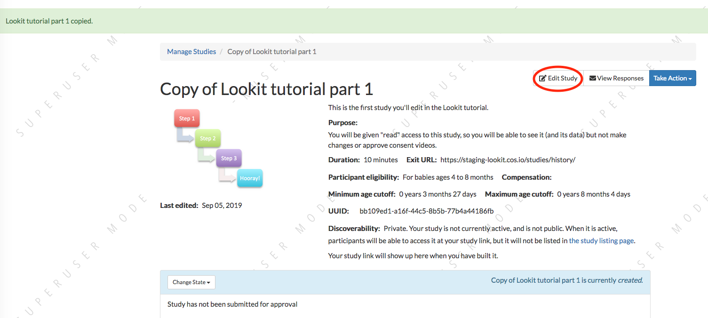
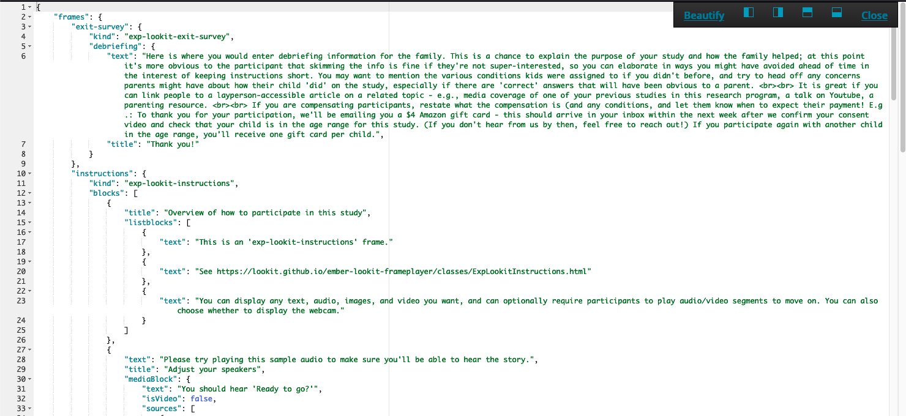

##################################
Setting up your first study
##################################

In this section, you will be creating your first study on Lookit. You will learn how to find and use experiment components, specify your protocol, and test out and troubleshoot your study. 

Step 1: Clone the 'Lookit tutorial part 1' study
-------------------------------------------------

To get started, log in to the Lookit staging server as an experimenter. (Go to `<https://staging-lookit.cos.io/exp/>`_ to log in - bookmark this link if you haven't already.)

You should see a few studies you automatically have access to, including one called "Lookit tutorial part 1". Click on that to open up the study detail page:

.. image:: _static/img/tutorial/tutorial_select_study.png
    :alt: Lookit tutorial part 1 study listing

You should see something like this:


    
At the top right, go to "Take Action" and click "Clone Study":

.. image:: _static/img/tutorial/tutorial_study_clone.png
    :alt: Clone study button on study detail page
    
You will be taken directly to the "clone" or "copy" of your study, which will be named something like "Lookit tutorial part 1 copy." You should see something like this:


    
Click "edit study" in the top right (circled above) and you'll see the following:


Each of these fields is described HERE. For now, we'll just change the name of the study and the thumbnail image that's displayed to participants. Rename your study to "[Your name]'s awesome tutorial study" and upload a different thumbnail image:

.. image:: _static/img/tutorial/study_edit_name.png
    :alt: Study edit view - changing name and image

Then click "Save Changes" down below:

.. image:: _static/img/tutorial/study_edit_save.png
    :alt: Study edit save button

After saving, click the name of your study to return to the study detail view:

.. image:: _static/img/tutorial/return_to_study_detail.png
    :alt: Link back to study detail view

You should see your changes reflected, like this:


Congratulations! You've created and edited your first study.

Step 2: Preview your study (and learn a bit about JSON on the way)
-------------------------------------------------------------------

You may have noticed that below your thumbnail and basic study info, there's a section about the "status" of your study. This section is where you will submit your study for approval by Lookit staff when it's ready, and start and stop data collection. 

This section also shows whether your study "dependencies" are "built" yet. You should see a bar like this:

.. image:: _static/img/tutorial/dependencies_not_built.png
    :alt: Dependency status area
    
Click the "Build Preview Dependencies" button. You should see a notification at the top of the screen like this:


What are these "dependencies"? When you create a study on Lookit, you specify what types of pages or "frames" to use, and provide parameters for each - for example you supply the text for an instructions page, videos or images to show in a preferential looking trial, audio and images for a storybook page, and so on. The Lookit frame player interprets this information and turns it into an interactive study families can participate in. There's code behind the scenes, which you don't have to deal with, to handle that interpretation and to make each page "go" (saying what each button should do and what data to collect, arranging and starting/stopping video, etc.) Rather than all studies sharing that code, each study gets its own siloed little environment called a Docker image where it will run. 

When you click "Build dependencies" or "build preview dependencies," you are creating that Docker image (for your actual study or for previewing your study, respectively) and installing all the necessary code on it - the Lookit frameplayer and the other libraries it depends on. This way, as we continue expanding the Lookit frameplayer code, your study will continue to run exactly as you initially designed and tested it, unless you choose to update what code your study uses and build dependencies again - for instance to take advantage of a new feature or a bug fix. You also have the advanced option of telling Lookit to use your own code instead of the standard Lookit code - for instance if your work needs a very specialized type of test trial that you want to write your own frame for.

It will probably take about 10 minutes to build dependencies so you can preview your study (you can wait for the email or refresh the page to see if it's done yet). 

While you're waiting, go read :ref:`section on the JSON format<JSON Overview>`, which will be helpful for the next step. 

Exercises
~~~~~~~~~~~~

Here are several things that are almost, but not quite, valid JSON objects. Copy and paste each of them into `jsonlint <http://jsonlint.com/>`_, then fix the problem until you see a 
"valid JSON" message when you click "Validate."

1. 

.. code:: json

   {
       "species": "cat",
       "lives_left": 7
       "enemies": ["dog", "laser", "spider"]
   }
 
.. raw:: html
 
    <details style="margin-left:50px;">
        <summary>Click for hint</summary>
        <p>There's a comma missing!</p>
    </details>
   
2.

.. code:: json

   {
       "species": "human",
       "age_class": "toddler",
       "favorites": {
            "words": ["uh-oh," "doggie," "ball," "hi"],
            "foods": ["cumin seeds, but not in a food, only plain", "bananas, but only in the grocery store, not after"]
       }
   }

.. raw:: html
    
    <details style="margin-left:50px;">
        <summary>Click for hint</summary>
        <p>There are commas INSIDE the favorite words.</p>
    </details>
   
3. 

.. code:: json

   {
       "species": "human",
       "role": "parent",
       "mood": "loving",
       "mood": "exhausted"
   }

.. raw:: html
  
    <details style="margin-left:50px;">
        <summary>Click for hint</summary>
        <p>That may be accurate, but JSON would like the keys to be unique. Try making mood into a list, or change the second one to energy_level or something.</p>
    </details>

4. 

.. code:: json

   {
       "species": "human",
       "age_class"; 'child',
       "is_adorable": True
   }
 
.. raw:: html
 
    <details style="margin-left:50px;">
        <summary>Click for hint</summary>
        <p>There are several things to fix here - if you changed something and got a different error message, you're probably on the right track! Work down the list of requirements for JSON from the overview, and note that the "true" value is all lowercase.</p>
    </details>

OK, congrats on learning all about JSON! Your study should be ready to preview by now. You should have an email in your inbox from "lookit+staging" about this, and if you refresh the page you're on, you should see something like this:

.. image:: _static/img/tutorial/preview_built.png
    :alt: Preview built status display
    
Click on "Edit Study" at the top of the page, then scroll down and click the (newly not disabled) blue "See Preview" button:

.. image:: _static/img/tutorial/preview_button.png
    :alt: Preview button
    
Now you can proceed through the study as a participant. It's a rough, abbreviated  implementation of one condition from `Schulz, Bonawitz, and Griffiths (2007) <http://dx.doi.org/10.1037/0012-1649.43.5.1124>`_ - you'll read through a storybook about Bunny, who sometimes gets a tummyache, and eventually answer a question about what makes her tummy hurt. At the end, you'll see a pop-up box showing all the data (besides video) that would have been collected during your session, although because you're previewing, the video isn't actually stored. 

.. admonition:: Note

   The video from previews DOES go to the Lookit server at the moment, although it isn't hooked up to the experimenter interface yet. We don't do anything with it, but it's in principle possible for a staff member here to end up seeing it while debugging something- so please wear clothes while testing, don't sit in front of your really cool poster of your social security number, etc.


Step 3: Get comfortable making changes to how your study works
---------------------------------------------------------------

The "meat" of your study is in the "Study JSON", which you can change from the Edit Study view. Scroll down and click on the text here:

.. image:: _static/img/tutorial/click_to_edit_json.png
    :alt: JSON as shown on study edit view
    
This opens up an editor. It will show a scary amount of text like this:

.. image:: _static/img/tutorial/ugly_json.png
    :alt: Unformatted JSON

Click the "Beautify" button to format it nicely:



This whole thing is a JSON document, like we learned about while you were waiting for your preview dependencies to build. Using the triangles on the left may help you to explore and understand its structure better. Try collapsing headers by clicking those triangles until you can see this overall structure:


There are two high-level keys: ``frames`` and ``sequence``. The ``sequence`` list says what frames should be in your study, in what order. The ``frames`` object is like a dictionary where the Lookit frameplayer will go to understand what each frame in the sequence should be like. Notice that each of the strings in the ``sequence`` is itself a key in ``frames``. For instance, the sequence starts with ``video-config``. We can expand the ``video-config`` key in ``frames`` to see more about that frame:

.. image:: _static/img/tutorial/video_config_expanded.png
    :alt: Formatted JSON collapsed into high level keys with one frame expanded

Making a change to the sequence
~~~~~~~~~~~~~~~~~~~~~~~~~~~~~~~

Let's change the ``sequence``` to see how it affects the study. In the editor, move ``"instructions"`` to the start of the ``sequence`` list. It should end up looking like this:

.. code-block:: none

   "sequence": [
      "instructions",
      "video-config",
      "video-consent",
      "storybook-causal",
      "exit-survey"
   ]
    
Now click "Close" at the top right to exit the editor:

.. image:: _static/img/tutorial/click_to_close.png
    :alt: Where to click to close editor

This will return you to the Edit Study page, but your changes aren't saved yet. Scroll down to the very end of your JSON and click "Save Changes":

.. image:: _static/img/tutorial/click_to_save_json.png
    :alt: Where to click to save JSON

You should see a message at the top like the following. (If not, click on your JSON again and resolve any problems that are preventing it from saving.)

.. image:: _static/img/tutorial/changes_saved.png
    :alt: Changes saved message
    
Now scroll down and you can preview your edited study by clicking on the blue "Preview" button again:

.. image:: _static/img/tutorial/preview_button.png
    :alt: Preview button

This time, you should be right at the instructions, instead of starting with the video configuration frame! When you click "Preview" you should go right away to a page like this:


That's because we moved the "instructions" frame to the start of our sequence. If you want to make changes to a particular frame, sticking it at the beginning of your sequence can make it easier to rapidly view your changes as you make them.

Making a change to an individual frame
~~~~~~~~~~~~~~~~~~~~~~~~~~~~~~~~~~~~~~

While we have that instructions page "front and center," let's edit the text so it looks more like real instructions for the study! 

From the Edit Study page, click on your study JSON to open up the editor again. Click "Beautify" to make it easier to read. Find the section that defines the "instructions" frame (starting on line 10).

.. admonition:: Tip

   In addition to using the triangles at the right to expand/collapse sections of your JSON document, you can double-click on a bracket or curly brace to highlight everything up until the matching one.
   
Here's what it looks like now. You don't need to understand everything going on here - just note that the text you saw in the preview is defined here! The "webcamBlocks" value at the bottom has the text you see under the webcam. The "blocks" value is a list of two sections. The first one is (or should be) a little overview of instructions for the study. The second just has participants check that their speakers are on and volume is ok.

.. code-block:: none

   "instructions": {
        "kind": "exp-lookit-instructions",
        "blocks": [
            {
                "title": "Overview of how to participate in this study",
                "listblocks": [
                    {
                        "text": "This is an 'exp-lookit-instructions' frame."
                    },
                    {
                        "text": "See https://lookit.github.io/ember-lookit-frameplayer/classes/ExpLookitInstructions.html"
                    },
                    {
                        "text": "You can display any text, audio, images, and video you want, and can optionally require participants to play audio/video segments to move on. You can also choose whether to display the webcam."
                    }
                ]
            },
            {
                "text": "Please try playing this sample audio to make sure you'll be able to hear the story.",
                "title": "Adjust your speakers",
                "mediaBlock": {
                    "text": "You should hear 'Ready to go?'",
                    "isVideo": false,
                    "sources": [
                        {
                            "src": "https://s3.amazonaws.com/lookitcontents/exp-physics-final/audio/ready.mp3",
                            "type": "audio/mp3"
                        },
                        {
                            "src": "https://s3.amazonaws.com/lookitcontents/exp-physics-final/audio/ready.ogg",
                            "type": "audio/ogg"
                        }
                    ],
                    "mustPlay": true,
                    "warningText": "Please try playing the sample audio."
                }
            }
        ],
        "showWebcam": true,
        "webcamBlocks": [
            {
                "title": "Make sure we can see you",
                "listblocks": [
                    {
                        "text": "Take a look at your webcam view above. Get comfy, and adjust your own position or the computer as needed so both you and your child are visible."
                    },
                    {
                        "text": "This isn't a Skype call - no one in the lab can see you - but the recorded video of your participation will be sent to the lab to help with data analysis. It's helpful for us to be able to see if your child was pointing or looking confused, for example."
                    }
                ]
            }
        ],
        "nextButtonText": "Next"
    },

First, let's flesh out the "overview of how to participate" section by replacing the text with more appropriate instruction text like this:

.. code-block:: none

            {
                "title": "Overview of how to participate in this study",
                "listblocks": [
                    {
                        "text": "You and your child will listen to a simple illustrated audiobook together."
                    },
                    {
                        "text": "There are 16 pages altogether, and one question at the end for your child."
                    },
                    {
                        "text": "While you listen to the story together, you can help talk to your child to keep him or her engaged - but please don't talk about WHY you think Bunny has a tummyache! We're interested in how your child figures that out on his or her own, and won't be able to use data from children if their parents influenced their answers. (But there are really, truly no wrong answers!)"
                    }
                ]
            },
            
Next, let's help guide families through this frame by adding numbers to the sections. (In a real study you might also consider breaking up a page like this into three shorter pages!)

* Find the line ``"title": "Overview of how to participate in this study",`` and change that to ``"title": "1. Overview of how to participate in this study",``

* Find the line ``"title": "Adjust your speakers",`` and change that to ``"title": "2. Adjust your speakers",``

* Find the line ``"title": "Make sure we can see you",,`` and change that to ``"title": "3. Make sure we can see you",``

Click "Close" in the top right corner of the editor, and then scroll down and click "Save Changes." (Make sure you see the message at the top that changes were saved successfully - fix any problems with the JSON if not!) Now click "Preview" again to see your new and improved instructions page!

Put the instructions back in order
~~~~~~~~~~~~~~~~~~~~~~~~~~~~~~~~~~

Now that we've made our changes to the instructions frame, let's put it back where it belongs, after the video configuration and consent frames.

Open the JSON editor and find the ``sequence`` way at the end. Right not it should still look like this:

.. code-block:: none

   "sequence": [
      "instructions",
      "video-config",
      "video-consent",
      "storybook-causal",
      "exit-survey"
   ]
   
Move ``"instructions"`` back so it looks like:

.. code-block:: none

   "sequence": [
      "video-config",
      "video-consent",
      "instructions",
      "storybook-causal",
      "exit-survey"
   ]
   
Close, save changes, and preview it again. After proceeding through video configuration and video consent, you should see your new and improved instructions. 

Using the Javascript console in your browser to learn more about any problems
~~~~~~~~~~~~~~~~~~~~~~~~~~~~~~~~~~~~~~~~~~~~~~~~~~~~~~~~~~~~~~~~~~~~~~~~~~~~~

One of the most powerful tools you have available to troubleshoot any problems as you set up your study is called the "web console" or "Javascript console" in your web browser. 

Click to preview your study, and from that browser window/tab, let's get your web console open so we can see what's going on.

**If you're using Firefox**: Click the "hamburger menu" (three horizontal lines) in the top right corner of your browser and click "Web Developer" (yep, that's you now!):

.. image:: _static/img/tutorial/firefox_web_developer.png
    :alt: Firefox hamburger menu
    
Click "Web Console":

.. image:: _static/img/tutorial/firefox_dev_menu.png
    :alt: Firefox web developer menu

And you should see something like this:


**If you're using Chrome**: Click the three dots in the upper right corner, then "More Tools," then "Developer Tools":


You should see something like this:

.. image:: _static/img/tutorial/chrome_console.png
    :alt: Chrome console example

.. admonition:: Browser-dependent behavior

   Webcam access functionality, external resource loading, or other features may work slightly differently across web browsers, especially as they are updated over time. It is always worth previewing your studies in both Firefox and Chrome, which are the browsers Lookit currently officially supports. For your own privacy, we strongly recommend not using Chrome more than you have to. (We also recommend flossing and having Easter egg hunts as a year-round activity, but these are getting further from our domain.)
   
.. admonition:: Advanced developer tool features
   
   In both Firefox and Chrome, you have access to a bunch of different tools beyond this basic web console, and you have lots of options for filtering out certain events, where to display the console (e.g. separate window vs. bottom vs. side), etc. - we're just going to cover the basics here!

Now that you've gotten your web console open, you'll see a bunch of information in it. This is generally of most interest if something is going wrong and you're not sure what. You can see events that are being logged as you proceed through the study as well as any errors. Some of these errors are ok to ignore - e.g. here are a few current ones due to known but harmless bugs:

* On staging there is a known bug that the fontawesome library doesn't load properly (but it does on "production" - the real Lookit site) - so you may see some errors that a resource failed to load properly, like this:


    
* You may also see an error when **previewing** about a "notFound" error about ``child:TEST_CHILD_DISREGARD`` - that's just because of the way we're handling preview vs. real participation, and doesn't actually cause trouble.

Leave your preview tab open, and return to the browser tab where you have the "Edit Study " page open. Let's deliberately introduce a problem in our study JSON and see what we can learn from the preview. Try adding something to the "sequence" without defining it in "frames," like this:

.. code-block:: none

   "sequence": [
      "video-config",
      "new-and-exciting-page",
      "video-consent",
      "instructions",
      "storybook-causal",
      "exit-survey"
   ]
   
Close, save changes, and then return to your preview tab and refresh it. You'll see a totally blank page, which would be very confusing if you didn't know what had gone wrong! But if you look down at the web console, you should see an error like this:

.. image:: _static/img/tutorial/sequence_error.png
    :alt: Example sequence error

This explains that the problem is that the Lookit frameplayer can't make sense of your study JSON, because it doesn't have a "definition" available in the "frames" value for the frame "new-and-exciting-page" that you added to your sequence.

Return to the study edit page and open up the JSON editor again. Remove that "new-and-exciting-page" from your "sequence" and let's cause another problem instead. Scroll to the section of the ``frames`` object where we give parameters for the consent frame: 

.. code-block:: none

   "video-consent": {
        "kind": "exp-lookit-video-consent",
        "PIName": "Lookit Tutorial Participant",
        "PIContact": "Jane Smith at (123) 456-7890",
        "datause": "We are interested in how your child uses statistical evidence to figure out the cause of an event. A research assistant will watch your video and mark down your child's answer to the question at the end of the story, and as well as other information such as interactions between you and your child during the story.",
        "payment": "After you finish the study, we will email you a $5 BabyStore gift card within approximately three days. To be eligible for the gift card your child must be in the age range for this study, you need to submit a valid consent statement, and we need to see that there is a child with you. But we will send a gift card even if you do not finish the whole study or we are not able to use your child's data! There are no other direct benefits to you or your child from participating, but we hope you will enjoy the experience.",
        "purpose": "This study is about how children use statistical information to adjust their beliefs about cause and effect.",
        "procedures": "In this study you child will view a digital 'storybook' about Bunny, who sometimes gets a tummyache. Each day Bunny eats different foods and does different activities, and we hear whether she gets a tummyache. Sometimes, Bunny feels scared because of show-and-tell. We are interested in how the pattern of evidence influences your child's beliefs about what causes Bunny's tummyache. We will ask you (the parent) to avoid discussing why Bunny has a tummyache until the end of the study. There are no anticipated risks associated with participating.",
        "institution": "Science University"
    },
    
Try deleting one of these lines, like ``"PIContact": "Jane Smith at (123) 456-7890",``. Close, save, and refresh your preview. Once you get to the consent page, you should see an error like this complaining about the missing parameter:

.. image:: _static/img/tutorial/sequence_error.png
    :alt: Example missing parameter error
    
Note that this doesn't stop the frame from working at all (that bit of text is just missing from the consent form if you look carefully) - but this sort of error can be a useful clue in more complicated situations!

Go ahead and put back that "PIContact" field, and let's move on to adding some finishing touches to our study.

Adding another storybook page
~~~~~~~~~~~~~~~~~~~~~~~~~~~~~

You may have noticed when you tried out the study that the ending was a little abrupt: a question for the child, and then boom! we're out in the exit survey. Let's add one last storybook frame to wrap things up - and reassure kids that Bunny ends up doing just fine at show-and-tell!

Open the JSON editor again. Inside the ``frames`` object, find the ``storybook-causal`` frame definiton. It should look something like this (with the long ``frameList`` collapsed):

.. image:: _static/img/tutorial/storybook_causal_json.png
    :alt: Storybook JSON displayed
    
This is a frame "group" that actually bundles together a list of frames, adding some ``commonFrameProperties`` to each one. You don't have to understand that yet! For now, let's take a look inside the ``frameList`` where the list of storybook pages is. Each element of this list is an object with ``images`` and ``audioSources`` - here's what it looks like collapsing most of those list elements:

.. image:: _static/img/tutorial/list_of_pages.png
    :alt: Storybook pages JSON
    
We're just going to add one more page to the end. Within the ``frameList`` list, after the last object, add a comma and then the following:

.. code-block:: none

   {
        "images": [
            {
                "id": "storybookIllustration",
                "src": "bunnyend01.png",
                "top": "0",
                "left": "10",
                "width": "80"
            }
        ],
        "audioSources": [
            {
                "audioId": "voiceover",
                "sources": "bunnyend01"
            }
        ]
   }
   
Here we're providing the name of an image to use ("bunnyend01.png") and audio to use ("bunnyend01") - if you're curious, the absolute paths to these resources are built using the ``baseDir`` provided to all frames in the list.

Close, save, and refresh your preview. Now after the question, you should see and hear a friendly wrap-up to this thrilling story.

Using the frame documentation to learn more about frame-specific options
~~~~~~~~~~~~~~~~~~~~~~~~~~~~~~~~~~~~~~~~~~~~~~~~~~~~~~~~~~~~~~~~~~~~~~~~

Each frame you define on Lookit has to have a property called ``kind`` which says what kind of frame it is. If you look through your study JSON, you'll see that

* the ``exit-survey`` frame has kind ``exp-lookit-exit-survey``
* the ``instructions`` frame has kind ``exp-lookit-instructions``
* the ``video-config`` frame has kind ``exp-video-config``
* the ``video-consent`` frame has kind ``exp-lookit-video-consent``
* the ``storybook-causal`` frame has kind ``group`` (this is a special kind of frame, documented `here <https://lookit.readthedocs.io/en/develop/researchers-create-experiment.html#frame-groups>`_.)
* the frames **within** the ``storybook-causal`` frame have kind ``exp-lookit-story-page`` (this is added to each frame in the ``frameList`` as part of the ``commonFrameProperties``)

In addition to this tutorial and the information in this documentation about how to set up a study on Lookit, there is detailed information available about each of the "frames" you can use in your Lookit study. At `<https://lookit.github.io/ember-lookit-frameplayer/>`_ you can browse the options and learn about options for customizing each type of frame.

Let's take a look at the ``exp-lookit-story-page`` documentation to see what options we have. Find it on the left sidebar and click on it. Here's what you'll see:

.. image:: _static/img/tutorial/frame_doc.png
    :alt: Annotated frame documentation page
    
Each single-frame documentation page has these same sections you can use to learn more about how to customize it, what data it collects, and so on. Click on "Properties" to see all the properties we can add to the frame definition in our JSON. There are a lot of properties - you can uncheck "Inherited" at the top of the page to show only the ones specific to this frame, not all the properties that are available on all Lookit frames or on all frames making use of certain "mixins" that add common functionality.

You'll see that the main things we can set are "audioSources," "autoProceed," "doRecording," "durationSeconds," "images," "parentTextBlock," and "showProgressBar." Each one includes an explanation of what it does and what format its value needs to be in.

Let's try changing the value of "autoProceed" on all our storybook pages. To do that we can change it within the "commonFrameProperties" in our study JSON:

.. code-block:: none

   "commonFrameProperties": {
        "kind": "exp-lookit-story-page",
        "baseDir": "https://www.mit.edu/~kimscott/bunnystimuli/",
        "audioTypes": [
            "mp3",
            "ogg"
        ],
        "autoProceed": true, <-- change this from false to true!
        "doRecording": false,
        "parentTextBlock": {
            "css": {
                "font-size": "1.5em"
            },
            "emph": true,
            "text": "Please help keep your child's attention, but don't talk with him or her about WHY Bunny might be getting a tummyache yet! Feel free to replay the audio if your child was distracted.",
            "title": "For parents"
        }
   }
   
Save and refresh your preview, and see how the study works now. Instead of clicking on "next" to proceed after each storybook page, the study should automatically proceed to the next page! That's probably not what we actually want, so we can change it back after trying it out.

Counterbalance the test question
~~~~~~~~~~~~~~~~~~~~~~~~~~~~~~~~~

You may have noticed that we're asking children why Bunny has a tummyache - because of X or because of Y? But if kids tend to say X, we won't know if that's because they believe it's X or because they tend to go with the first option mentioned.

Let's set up to counterbalance the question that's asked! Again, at this point you don't need to understand all the details, let's just walk through what we'd do.

We're going to change our "storybook-causal" frame into what's called a randomizer frame, instead of just a group of frames. Find this section and make the changes indicated below:

.. code-block:: none

   "storybook-causal": {
        "kind": "group", <-- change this to "choice"
        "sampler": "random-parameter-set", <-- add this line! 
        "frameList": [ 
            ... <--  almost everything in here can stay the same
            {
                "images": [
                    {
                        "id": "leftA",
                        "src": "bunnya01.png", <-- but change this to "QUESTION_IMAGE"
                        "top": "0",
                        "left": "10",
                        "width": "80"
                    }
                ],
                "audioSources": [
                    {
                        "audioId": "firstAudio",
                        "sources": "bunnya01" <-- and change this to "QUESTION_AUDIO"
                    }
                ]
            },
            ...
        ],
        "commonFrameProperties": { <-- everything in here can stay the same
            ...
        },
        "parameterSets": [ <-- add this section!
           {
               "QUESTION_IMAGE": "bunnya01.png",
               "QUESTION_AUDIO": "bunnya01"
           },
           {
               "QUESTION_IMAGE": "bunnyb01.png",
               "QUESTION_AUDIO": "bunnyb01"
           }
       ]
   }
   
Now when you try out the study, about half the time you'll hear "was it because of eating a sandwich, or feeling scared?" and the other half of the time you'll hear "was it because of feeling scared, or eating a sandwich?" Don't worry about the details yet - the important thing is just to understand that this is a sort of thing you can do relatively easily.

Congratulations! You've just finished setting up your first study. You've made lots of small changes to the study JSON and looked at how they affect what happens, and by now you're probably comfortable making a change, saving it, and previewing the study again.
