.. _lookit-tutorial-first-study:

#########################################
1. Setting up your first Lookit study
#########################################

In this section, you will be creating your first CHS study using the Lookit experiment runner. You will learn how to find and use experiment components, specify your protocol, and test out and troubleshoot your study. 

.. admonition:: Who should do this section?

    This section is designed for researchers planning to build an **internal Lookit study**. If your first study will be written with jsPsych, then you can see the :ref:`jspsych tutorial <jspsych-tutorial-first-study>`. Or if your study involves a link to an experiment hosted somewhere else, skip to :ref:`part 4 of this tutorial <tutorial-manage-data>`.

Step 1: Clone the 'Lookit tutorial part 1' study
-------------------------------------------------

To get started, go to the `log in to CHS <https://childrenhelpingscience.com/login/>`_ with your researcher account. After logging in, you should be taken directly to the "Manage Studies" page. 

.. admonition:: Troubleshooting tips

    If you're having problems with the two-factor authentication (2FA) part of your log in, then please see the section on :ref:`Managing and Troubleshooting 2FA <managing_2fa>`.

    If you are able to log in but don't see the "Manage Studies" page, try clicking on the "Experimenter" button in the navigation menu at the top of the page. 

    If you don't see the "Experimenter" button at the top, then you might be logged in with a non-researcher (family) account. Make sure that you have a researcher account and are using that one to log in. See the :ref:`Registration and Login page <login>` for more information.

You should see a few studies you automatically have access to, including one called "Lookit tutorial part 1". Click on that to open up the study detail page:

.. image:: ../_static/img/tutorial/tutorial_select_study.png
    :alt: Lookit tutorial part 1 study listing

You should see something like this:

.. image:: ../_static/img/tutorial/tutorial_study_detail.png
    :alt: Tutorial study detail page
    
In the menu on the right, click "Clone Study":

    
You will be taken directly to the "Edit" page of your cloned study, which will be named "Copy of Lookit tutorial part 1." Each of these study edit fields is described :ref:`here <study fields>`. For now, we'll just change the name of the study and the thumbnail image that's displayed to participants. Rename your study to something like "[Your name]'s' tutorial study" and upload a different thumbnail image. Note that the new image must be a square (same height and width dimensions).

.. image:: ../_static/img/tutorial/study_edit_view.png
    :alt: Study edit view - changing name and image

Then click "Save Changes" down below:

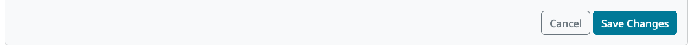

After saving, you will be taken to the "Edit Study Design" page, where you can edit the study protocol. We'll come back to this page later. For now, just click the name of your study in the breadcrumbs at the top to return to the study detail view:

.. image:: ../_static/img/tutorial/return_to_study_detail.png
    :alt: Link back to study detail view

You should see the study details for your tutorial study, with your modified name and image, like this:

.. image:: ../_static/img/tutorial/study_after_save.png
    :alt: Study detail view after changes

Congratulations! You've created and edited your first study.

Step 2: Preview your study (and learn a bit about JSON on the way)
-------------------------------------------------------------------

.. _Building study dependencies:

You may have noticed that below your thumbnail and basic study info, there's a section about the "status" of your study. This section is where you will submit your study for approval by CHS staff when it's ready, and start and stop data collection. This section also shows whether your "experiment runner" is "built" yet. It looks like this:

.. image:: ../_static/img/tutorial/dependencies_not_built.png
    :alt: Dependency status area
    
Click the "Build experiment runner" button. You should see a notification at the top of the screen telling you that your experiment runner is being built, and your "Study Status" box should now say "Building experiment runner".

What is this "experiment runner"? When you create a Lookit study, you specify the study protocol, which is the types of pages or "frames" to use and the parameters for each. For example, you supply the text for an instructions page, videos or images to show in a preferential looking trial, audio and images for a storybook page, and so on. The Lookit experiment runner, aka "frameplayer", interprets this information and turns it into an interactive study that families can participate in. There's code behind the scenes, which you don't have to deal with, to handle that interpretation and to make each page "go" (saying what each button should do and what data to collect, arranging and starting/stopping video, etc.) Rather than all studies sharing the same code, each study gets its own siloed little environment called a Docker image where it will run. 

When you click "Build experiment runner," you are creating that Docker image and installing all the necessary code on it - the Lookit frameplayer and the other libraries it depends on. This way, as we continue expanding the Lookit frameplayer code, your study will continue to run exactly as you initially designed and tested it. If and when you want to, you can choose to update what experiment runner code your study uses and build dependencies again - for instance, to take advantage of a new feature or a bug fix. You also have the advanced option of telling the CHS platform to use your own code instead of the standard Lookit experiment runner code - for instance if your work needs a very specialized type of test trial that you want to write your own frame for.

It will probably take about 10 minutes to build the experiment runner. You'll be notified via email when it's done, or you can refresh the study details page to see if the status has changed to "built".

While you're waiting, you can read our Lookit documentation :ref:`section on the JSON format<JSON Overview>`, which you will need for the next step. 

Exercises
~~~~~~~~~~~~

Here are several things that are almost, but not quite, valid JSON objects. Copy and paste each of them into `jsonlint <http://jsonlint.com/>`_, then fix the problem until you see a 
"valid JSON" message when you click "Validate."

1.  

   .. code:: javascript

       {
           "species": "cat",
           "lives_left": 7
           "enemies": ["dog", "laser", "spider"]
       }
 
   .. raw:: html
 
    

        
Click for hint

        
There's a comma missing!

    

   
2.  

   .. code:: javascript

       {
           "species": "human",
           "age_class": "toddler",
           "favorites": {
                "words": ["uh-oh," "doggie," "ball," "hi"],
                "foods": ["cumin seeds, but not in a food, only plain", "bananas, but only in the grocery store, not after"]
           }
       }

   .. raw:: html
    
    

        
Click for hint

        
There are commas INSIDE the favorite words.

    

   
3.  

   .. code:: javascript

           {
               "species": "human",
               "role": "parent",
               "mood": "loving",
               "mood": "exhausted"
           }

   .. raw:: html
  
    

        
Click for hint

        
That may be accurate, but JSON would like the keys to be unique. Try making mood into a list, or change the second one to energy_level or something.

    

4.   

   .. code:: javascript

       {
           "species": "human",
           "age_class"; 'child',
           "is_adorable": True
       }
 
   .. raw:: html
 
    

        
Click for hint

        
There are several things to fix here - if you changed something and got a different error message, you're probably on the right track! Work down the list of requirements for JSON from the overview, and note that the "true" value is all lowercase.

    

OK, congrats on learning all about JSON! Your experiment runner should be built by now, which means that your study should be ready to preview. You should have an email in your inbox from CHS about this, and if you refresh your study details page, you should see something like this:

    
Now that your experiment runner has been built, you can click on "Preview study" near the top of the page:

    
This will take you to the same sort of page that participants see when they click on a study at childrenhelpingscience.com/studies, except that you will see a button that says "Preview now!" instead of "Participate now!". You will need to register at least one child and respond to the demographic survey (you don't need to respond to all questions, or use real information). Then you will be able to click "Preview now" to proceed through the study as a participant. It's a rough, abbreviated  implementation of one condition from `Schulz, Bonawitz, and Griffiths (2007) <http://dx.doi.org/10.1037/0012-1649.43.5.1124>`_ - you'll read through a storybook about Bunny, who sometimes gets a tummyache, and eventually answer a question about what makes her tummy hurt.

.. admonition:: Video is collected during previews! 

   Like other data, videos are only accessible to the researchers who have appropriate permissions. That does include a few CHS staff in addition to researchers working on your study. We don't do anything with the video and are very unlikely to even see it, but it *is* in principle possible - so please wear clothes while testing, don't sit in front of your really cool poster of your social security number, etc. Or cover your webcam. 

Step 3: Make changes to how your study works
---------------------------------------------------------------

The "meat" of your Lookit study is in the "study protocol". From your study details page, click the "Edit Study Design" button:

And then find the "Protocol configuration" box:

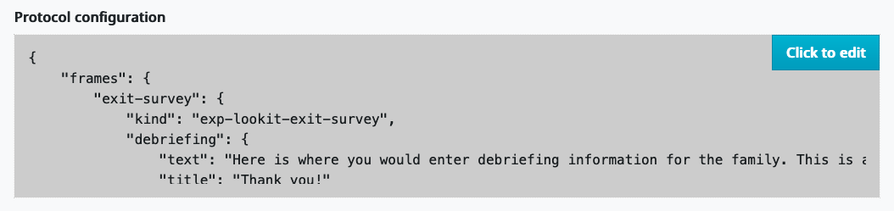
    
This opens up a larger editor so that you can view and edit study protocol. This editor has a "Beautify" button, which will help fix your indentation, and a "Close" button, which brings you back to the "Edit Study Design" page so that you can save your changes.

.. image:: ../_static/img/tutorial/pretty_json.png
    :alt: Formatted JSON

This whole "protocol" is a JSON document, like we learned about while you were waiting for your preview dependencies to build. Using the triangles on the left may help you to explore and understand its structure better. Try collapsing headers by clicking those triangles until you can see this overall structure:

.. image:: ../_static/img/tutorial/collapsed.png
    :alt: Formatted JSON collapsed into high level keys

There are two high-level keys: ``frames`` and ``sequence``. The ``sequence`` list says what frames should be in your study, in what order. The ``frames`` object is like a dictionary where the Lookit frameplayer will go to understand what each frame in the sequence should be like. The order of objects inside ``frames`` doesn't matter.

Notice that each of the strings in the ``sequence`` is itself a key in ``frames``. This is because the experiment runner will go through the values in the ``sequence``, and for each one, look up its definition inside ``frames``. This means that any string in the ``sequence`` list MUST be defined in the ``frames``.

The sequence starts with ``video-config``. We can expand the ``video-config`` key in ``frames`` to see more about that frame:

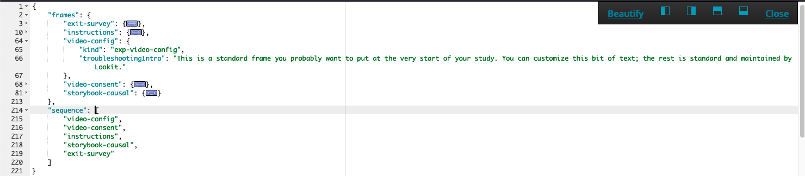

There are just two parameters in the "video-config" frame: "kind" and "troubleshootingIntro". Each frame has a parameter called "kind", which tells the experiment runner which type of frame it should use (``exp-video-config`` in this case). The "troubleshootingIntro" parameter controls some optional troubleshooting text on the video configuration page. 

In general, there are some parameters that are available in all Lookit frames, and many others that are specific to each frame type. We'll come back to this topic later, but you can go to the "Lookit Ember Frameplayer" documentation site if you'd like to see the :ref:`parameters available in all frames <elf:base frame>`, or you can click on the specific frames to see the list of parameters for that frame, e.g. :ref:`exp-video-config <elf:exp-video-config>`.

Making a change to the sequence
~~~~~~~~~~~~~~~~~~~~~~~~~~~~~~~~~

Let's change the ``sequence`` to see how it affects the study. In the editor, move ``"instructions"`` to the start of the ``sequence`` list. It should end up looking like this:

.. code-block:: none

   "sequence": [
      "instructions",
      "video-config",
      "video-consent",
      "storybook-causal",
      "exit-survey"
   ]
    
Now click "Close" at the top right to exit the editor:

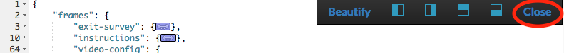

This will take you back to the "Edit Study Design" page, but your changes aren't saved yet. Scroll down and click "Save Changes":

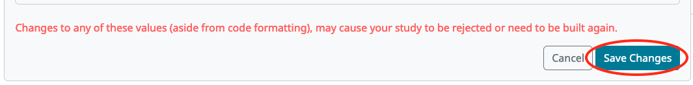

After your study design is saved, you will be taken back to the study details page. Now you can preview your edited study by clicking the "Preview" button again:

This time, the study should start with instructions instead the video configuration frame:

.. image:: ../_static/img/tutorial/instructions_page.png
    :alt: Instructions frame

That's because we moved the "instructions" frame to the start of our sequence. If you want to make changes to a particular frame, sticking it at the beginning of your sequence can make it easier to rapidly view your changes as you make them.

.. admonition:: Speed up the process a bit

   You may want to copy or bookmark the URL you're at when you start your study. That's the URL to preview this study with the child you selected. You can refresh this page to see your updated preview right away, without having to click through the study detail page to "Preview Study", select a child, and "Preview now!". 

Making a change to an individual frame
~~~~~~~~~~~~~~~~~~~~~~~~~~~~~~~~~~~~~~~~

While we have that instructions page "front and center," let's edit the text so it looks more like real instructions for the study! 

From the "Edit Study Design" page, click on your study protocol box to open up the editor again. Find the section that defines the "instructions" frame (starting on line 10).

.. admonition:: Tip

   In addition to using the triangles at the right to expand/collapse sections of your protocol, you can double-click on a bracket or curly brace to highlight everything up until the matching one.
   
Here's what it looks like now. You don't need to understand everything going on here - just note that the text you saw in the preview is defined here! The "webcamBlocks" value at the bottom has the text you see under the webcam. The "blocks" value is a list of two sections. The first one is (or should be) a little overview of instructions for the study. The second just has participants check that their speakers are on and volume is ok.

.. code-block:: none

   "instructions": {
        "kind": "exp-lookit-instructions",
        "blocks": [
            {
                "title": "Overview of how to participate in this study",
                "listblocks": [
                    {
                        "text": "This is an 'exp-lookit-instructions' frame."
                    },
                    {
                        "text": "See https://lookit.readthedocs.io/projects/frameplayer/en/latest/components/exp-lookit-instructions/doc.html"
                    },
                    {
                        "text": "You can display any text, audio, images, and video you want, and can optionally require participants to play audio/video segments to move on. You can also choose whether to display the webcam."
                    }
                ]
            },
            {
                "text": "Please try playing this sample audio to make sure you'll be able to hear the story.",
                "title": "Adjust your speakers",
                "mediaBlock": {
                    "text": "You should hear 'Ready to go?'",
                    "isVideo": false,
                    "sources": [
                        {
                            "src": "https://s3.amazonaws.com/lookitcontents/exp-physics-final/audio/ready.mp3",
                            "type": "audio/mp3"
                        },
                        {
                            "src": "https://s3.amazonaws.com/lookitcontents/exp-physics-final/audio/ready.ogg",
                            "type": "audio/ogg"
                        }
                    ],
                    "mustPlay": true,
                    "warningText": "Please try playing the sample audio."
                }
            }
        ],
        "showWebcam": true,
        "webcamBlocks": [
            {
                "title": "Make sure we can see you",
                "listblocks": [
                    {
                        "text": "Take a look at your webcam view above. Get comfy, and adjust your own position or the computer as needed so both you and your child are visible."
                    },
                    {
                        "text": "This isn't a Skype call - no one in the lab can see you - but the recorded video of your participation will be sent to the lab to help with data analysis. It's helpful for us to be able to see if your child was pointing or looking confused, for example."
                    }
                ]
            }
        ],
        "nextButtonText": "Next"
    },

First, let's flesh out the "overview of how to participate" section by replacing the text with more appropriate instruction text. Inside the "instructions" frame, find the parameter called "blocks" - this is an array (list) of objects, and each object defines a block of text. Let's change the first object inside "blocks" so that it looks like this:

.. code-block:: none

            {
                "title": "Overview of how to participate in this study",
                "listblocks": [
                    {
                        "text": "You and your child will listen to a simple illustrated audiobook together."
                    },
                    {
                        "text": "There are 16 pages altogether, and one question at the end for your child."
                    },
                    {
                        "text": "While you listen to the story together, you can help talk to your child to keep him or her engaged - but please don't talk about WHY you think Bunny has a tummyache! We're interested in how your child figures that out on his or her own, and won't be able to use data from children if their parents influenced their answers. (But there are really, truly no wrong answers!)"
                    }
                ]
            },
            
Next, let's help guide families through this frame by adding numbers to the section titles. (In a real study you might also consider breaking up a page like this into three shorter pages!)

* Find the line ``"title": "Overview of how to participate in this study",`` and change that to ``"title": "1. Overview of how to participate in this study",``

* Find the line ``"title": "Adjust your speakers",`` and change that to ``"title": "2. Adjust your speakers",``

* Find the line ``"title": "Make sure we can see you",,`` and change that to ``"title": "3. Make sure we can see you",``

Click "Close" in the top right corner of the editor, and then scroll down and click "Save Changes." Now click "Preview study" again to see your new and improved instructions page!

Put the instructions back in order
~~~~~~~~~~~~~~~~~~~~~~~~~~~~~~~~~~

Now that we've made our changes to the instructions frame, let's put it back where it belongs, after the video configuration and consent frames.

Open the protocol editor and find the ``sequence`` at the bottom. Right now it should still look like this:

.. code-block:: none

   "sequence": [
      "instructions",
      "video-config",
      "video-consent",
      "storybook-causal",
      "exit-survey"
   ]
   
Move ``"instructions"`` so that it is placed after "video-consent", like this:

.. code-block:: none

   "sequence": [
      "video-config",
      "video-consent",
      "instructions",
      "storybook-causal",
      "exit-survey"
   ]
   
Close the editor, click "Save changes", and preview it again. After proceeding through video configuration and video consent, you should see your new and improved instructions. 

.. _browser-console:  

Using the Javascript console in your browser to learn more about any problems
~~~~~~~~~~~~~~~~~~~~~~~~~~~~~~~~~~~~~~~~~~~~~~~~~~~~~~~~~~~~~~~~~~~~~~~~~~~~~

One of the most powerful tools you have available to troubleshoot any problems as you set up your study is called the "web console" or "Javascript console" in your web browser. This is part of the browser's larger set of "Developer tools". 

Click to preview your study, and from that browser window/tab, let's get your web console open so we can see what's going on.

**In Firefox**: Click the "hamburger menu" (three horizontal lines) in the top right corner of your browser and click "More tools":

    
Click "Web Developer Tools":

And you should see something like this:

.. image:: ../_static/img/tutorial/firefox_console.png
    :alt: Firefox console example

**In Chrome**: Click the three dots in the upper right corner, then "More Tools," then "Developer Tools":

.. image:: ../_static/img/tutorial/chrome_dev_tools_menu.png
    :alt: Chrome developer tools menu

You should see something like this:

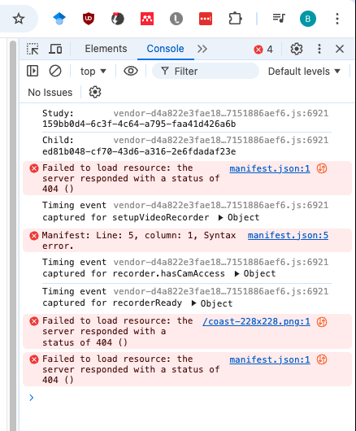

.. admonition:: Browser-dependent behavior

   Webcam access functionality, external resource loading, or other features may work slightly differently across web browsers, especially as they are updated over time. It is always worth previewing your studies in both Firefox and Chrome, which are the browsers CHS currently officially supports. For your own privacy, we strongly recommend not using Chrome more than you have to. (We also recommend flossing and having Easter egg hunts as a year-round activity, but these are getting further from our domain.)
   
.. admonition:: Advanced developer tool features
   
   In both Firefox and Chrome, you have access to a bunch of different tools beyond this basic web console, and you have lots of options for filtering out certain events, where to display the console (e.g. separate window vs. bottom vs. side), etc. - we're just going to cover the basics here!

Now that you've gotten your web console open, you'll see a bunch of information in it as you go through your study. This is generally of most interest if something is going wrong and you're not sure what. You can see events that are being logged as you proceed through the study as well as any errors. You'll see some warnings and errors that you can ignore, like these:

* Uncaught TypeError: a.fn.popover is undefined
* This page uses the non standard property "zoom"
* Layout was forced before the page was fully loaded
* GET 404 errors for apple-touch-icon, favicon, manifest.json
* InstallTrigger is deprecated and will be removed in the future.
* downloadable font: Glyph bbox was incorrect 

Leave your preview tab open, and return to the browser tab where you have the "Edit Study Design" page open. Let's deliberately introduce a problem in our study JSON and see what we can learn from the preview. Try adding something to the "sequence" without defining it in "frames," like this:

.. code-block:: none

   "sequence": [
      "video-config",
      "new-and-exciting-page",
      "video-consent",
      "instructions",
      "storybook-causal",
      "exit-survey"
   ]
   
Close, save changes, and then return to your preview tab and refresh it. You'll see a totally blank page, which would be very confusing if you didn't know what had gone wrong! But if you look down at the web console, you should see an error like this:

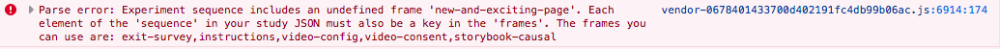

This explains that the problem is that the Lookit frameplayer can't make sense of your study JSON, because it doesn't have a "definition" available in the "frames" value for the frame "new-and-exciting-page" that you added to your sequence.

Return to the study edit page and open up the JSON editor again. Remove that "new-and-exciting-page" from your "sequence" and let's cause another problem instead. Scroll to the section of the ``frames`` object where we give parameters for the "storybook-causal" frame. Let's put a typo in the "baseDir" URL, which is the URL used to load all of the audio and images in the storybook portion of the study. This parameter can be found inside ``storybook-casual``, then under ``commonFrameProperties``. Change it to something like "https\://www.mit.edu/~kimscott/bunnystimuliTYPO/": 

.. code-block:: none

    "storybook-causal": {
        "kind": "group",
        "frameList": [
            ... lots of objects clipped to save space ...
        ],
        "commonFrameProperties": {
            "kind": "exp-lookit-images-audio",
            "baseDir": "https://www.mit.edu/~kimscott/bunnystimuliTYPO/",

To make this easier to test, let's also move the storybook portion of the experiment sequence, so that we can see it without having to go through the consent etc.

.. code-block:: none

    "sequence": [
        "storybook-causal",
        "video-consent",
        "video-config",
        "instructions",
        "exit-survey"
    ]

Close, save, and refresh your preview. You should see an error about being unable to load an image or audio file. The error will be in red, and it might just say "GET" with the link, or it might say something about being unable to load the file.

**Firefox**:

**Chrome**:

Let's get everything working again. Go back to your study protocol, fix the typo in the "baseDir" parameter so that the value is "https\://www.mit.edu/~kimscott/bunnystimuli/" and move the "storybook-causal" frame back to where it was in the ``sequence``, after "instructions" and before "exit-survey".

Adding another storybook page
~~~~~~~~~~~~~~~~~~~~~~~~~~~~~

You may have noticed when you tried out the study that the ending was a little abrupt: a question for the child, and then boom! we're out in the exit survey. Let's add one last storybook frame to wrap things up - and reassure kids that Bunny ends up doing just fine at show-and-tell!

Open the protocol JSON editor again. Inside the ``frames`` object, find the ``storybook-causal`` frame definiton. It should look something like this (with the long ``frameList`` collapsed):

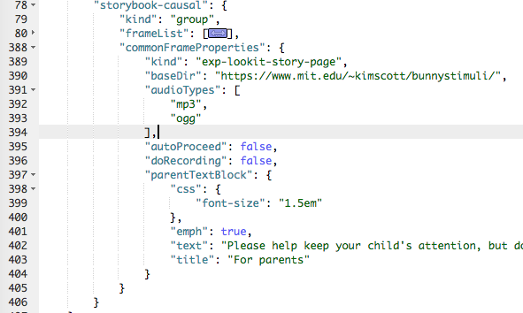
    
This is a frame "group" that actually bundles together a list of frames, adding some ``commonFrameProperties`` to each one. You don't have to understand that yet! For now, let's take a look inside the ``frameList`` where the list of storybook pages is. Each element of this list is an object with ``images`` and ``audioSources`` - here's what it looks like collapsing most of those list elements:

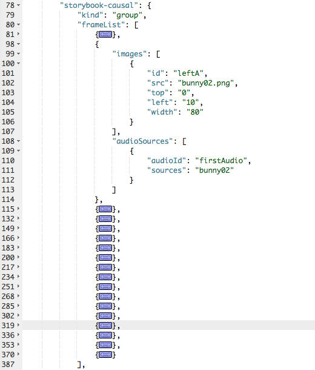
    
We're just going to add one more page to the end. Within the ``frameList`` list, after the last object, add a comma and then the following:

.. code-block:: none

   {
        "images": [
            {
                "id": "storybookIllustration",
                "src": "bunnyend01.png",
                "top": "0",
                "left": "10",
                "width": "80"
            }
        ],
        "audioSources": [
            {
                "audioId": "voiceover",
                "sources": "bunnyend01"
            }
        ]
   }
   
Here we're providing the name of an image to use ("bunnyend01.png") and audio to use ("bunnyend01") - if you're curious, the absolute paths to these resources are built using the ``baseDir`` provided to all frames in the list.

Close, save, and refresh your preview. Now after the question, you should see and hear a friendly wrap-up to this thrilling story.

Using the frame documentation to learn more about frame-specific options
~~~~~~~~~~~~~~~~~~~~~~~~~~~~~~~~~~~~~~~~~~~~~~~~~~~~~~~~~~~~~~~~~~~~~~~~

Each frame you define on Lookit has to have a property called ``kind`` which says what kind of frame it is. If you look through your study protocol, you'll see that

* the ``exit-survey`` frame has kind ``exp-lookit-exit-survey``
* the ``instructions`` frame has kind ``exp-lookit-instructions``
* the ``video-config`` frame has kind ``exp-video-config``
* the ``video-consent`` frame has kind ``exp-lookit-video-consent``
* the ``storybook-causal`` frame has kind ``group`` (this is a special kind of frame, documented :ref:`here <elf:frame groups>`)
* the frames **within** the ``storybook-causal`` frame have kind ``exp-lookit-images-audio`` (this is added to each frame in the ``frameList`` as part of the ``commonFrameProperties``)

In addition to this tutorial and the information in this documentation about how to set up a Lookit study on CHS, there is detailed information available about each of the "frames" you can use in your Lookit study. In the :ref:`experiment runner docs <elf:index>` you can browse the options and learn about options for customizing each type of frame.

Let's take a look at the ``exp-lookit-images-audio`` documentation to see what options we have. Find it on the left sidebar and click on it. Here's what you'll see:

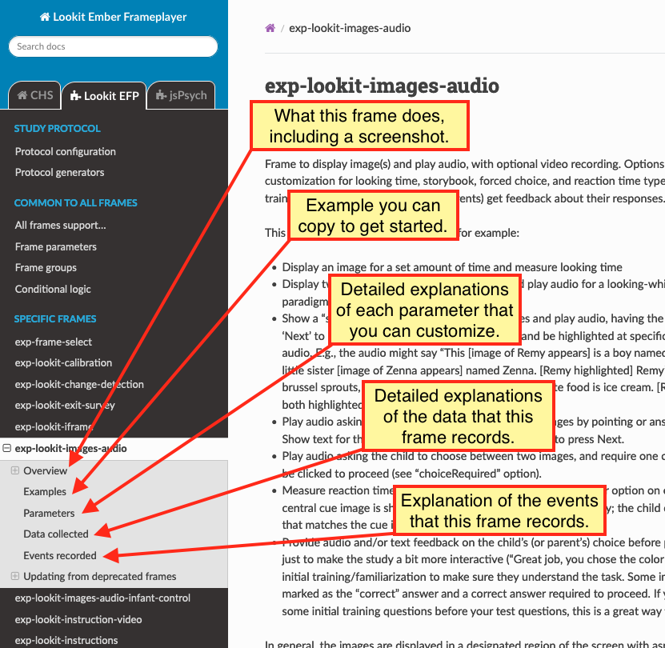
    
Each frame documentation page has the same sections you can use to learn more about how to customize it, what data it collects, and so on. Near the top under "What it looks like", you can see a screenshot of the frame (or a collection of example screenshots). Under "Example" you'll find an example that you can generally copy and paste to get started:

    
The final three sections are "Parameters," "Data collected," and "Events recorded." 

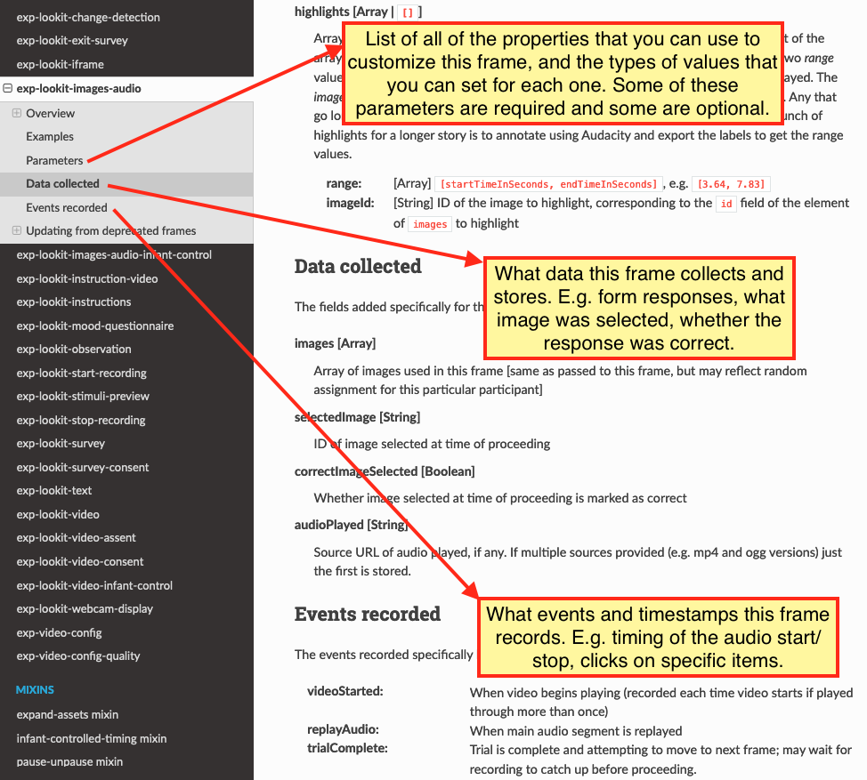

Click on "Parameters" to see all the properties we can add to the frame definition in our protocol. You'll see that some of the things we can set are "audio," "autoProceed," "doRecording," "durationSeconds," "images," "parentTextBlock," and "showProgressBar." Each one includes an explanation of what it does and what format its value needs to be in.

Let's try changing the value of "autoProceed" on all our storybook pages. To do that we can change it within the "commonFrameProperties" in our study protocol:

.. code-block:: none

   "commonFrameProperties": {
        "kind": "exp-lookit-images-audio",
        "baseDir": "https://www.mit.edu/~kimscott/bunnystimuli/",
        "audioTypes": [
            "mp3",
            "ogg"
        ],
        "autoProceed": true, <-- change this from false to true!
        "doRecording": false,
        "parentTextBlock": {
            "css": {
                "font-size": "1.5em"
            },
            "text": "Please help keep your child's attention, but don't talk with him or her about WHY Bunny might be getting a tummyache yet! Feel free to replay the audio if your child was distracted.",
            "title": "For parents"
        }
   }
   
Save and refresh your preview, and see how the study works now. Instead of clicking on "next" to proceed after each storybook page, the study should automatically proceed to the next page! That's probably not what we actually want, so we can change it back after trying it out.

Counterbalance the test question
~~~~~~~~~~~~~~~~~~~~~~~~~~~~~~~~~

You may have noticed that we're asking children why Bunny has a tummyache - because of X or because of Y? But if kids tend to say X, we won't know if that's because they believe it's X or because they tend to go with the first option mentioned.

Let's set up to counterbalance the question that's asked! Again, at this point you don't need to understand all the details, let's just walk through what we'd do.

We're going to change our "storybook-causal" frame into what's called a randomizer frame, instead of just a group of frames. Find this section and make the changes indicated below:

.. code-block:: none

   "storybook-causal": {
        "kind": "group", <-- change this to "choice"
        "sampler": "random-parameter-set", <-- add this line! 
        "frameList": [ 
            ... <--  almost everything in here can stay the same
            {
                "audio": "bunnya01", <-- but change this to "QUESTION_AUDIO"
                "images": [
                    {
                        "id": "storybookIllustration",
                        "src": "bunnya01.png", <-- and change this to "QUESTION_IMAGE"
                        "top": 0,
                        "left": 10,
                        "width": 80
                    }
                ],
                "doRecording": true
            },
             ...
             ],
             "commonFrameProperties": { <-- everything in here can stay the same
             ...
 },
            "parameterSets": [ <-- add this section!
            {
                "QUESTION_AUDIO": "bunnya01",
                "QUESTION_IMAGE": "bunnya01.png"
            },
            {
                "QUESTION_AUDIO": "bunnyb01",
                "QUESTION_IMAGE": "bunnyb01.png"
            }
        ]
   }
   
Now when you try out the study, about half the time you'll hear "was it because of eating a sandwich, or feeling scared?" and the other half of the time you'll hear "was it because of feeling scared, or eating a sandwich?" Don't worry about the details yet - the important thing is just to understand that this is a sort of thing you can do relatively easily.

Congratulations! You've just finished setting up your first study. You've made lots of small changes to the study protocol and looked at how they affect what happens, and by now you're probably comfortable making a change, saving it, and previewing the study again.
