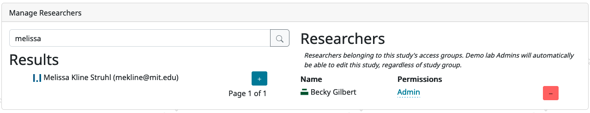
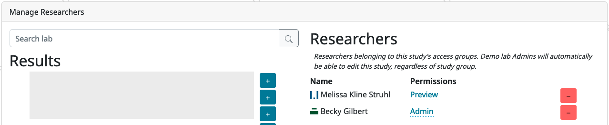

.. _tutorial-manage-data:

#############################################
4. Managing study data
#############################################

Now that you have a good handle on how to set up the study protocol you want, it's time to look at how to manage your study: controlling who has access to what, starting and stopping data collection, reviewing and downloading your data, and contacting your participants. 

A note for external studies: Much of this information applies to your studies as well! External studies do not have consent management or study data for you to download, but you do have demographic snapshot data for each participant/session. Managing data access, downloading, and communicating with participants works the same across all study types. 

Managing access to your study: add a collaborator
-------------------------------------------------

Rarely will you be working completely alone! Usually you will want multiple people to have access to any particular study: you may have a few people working together to get the protocol just right, as well as several RAs checking consent and sending feedback to participants. 

We very strongly recommend this model rather than sharing credentials for a lab-wide account. This way, each individual can get permissions on just the studies they actually need access to - not everything your lab has ever done. When temporary staff like undergrad RAs move on, you can just remove them from the study, instead of distributing a new password to everyone remaining in the lab. Plus, there is logging built into CHS that keeps track of things like who did what when - including who approved consent recordings - that may be useful to you.

Try it out! Add another person to your tutorial study. On the study page in the Experimenter interface, scroll down to "Manage Researchers":

.. image:: _static/img/tutorial/manage_researchers.png
    :alt: Manage researchers section
    
In the search box, type in the first few letters of someone you want to add, and press Enter. Click the green "+" button to add them to your study:

    
They will show up on the right with "Preview" permissions initially:

This means they can see your study in the Experimenter interface, but not see any participant data or make any changes. You can click on "preview" for a drop-down menu to give them different permissions if you want. (:ref:`See this section<study_permissions>` for much more detailed information about the different roles available. ) Or you can click the red "-" button to remove them again.

Great! Now you know how to give someone else access to your study so you can collaborate.

Updating the code your study uses
---------------------------------

Another thing you'll probably need to do eventually is set your study to use an updated version of the underlying Lookit frameplayer code. 

Remember when we had to "build an experiment runner" so we could preview the study? ( :ref:`You can review that here.<Building study dependencies>`) That build process took the version of the frameplayer code we specified and bundled it up into a little container for our study to run in. That container includes all the information Lookit needs about what frames are available to use and how they work.

As you fine-tune your study, you will be making lots of edits to your study protocol, saying exactly what stimuli each frame should use, in what order, etc. But the study protocol is still interpreted by that same application. If at some point you want to take advantage of bug fixes, video recording improvements, new frames that have been added to the standard Lookit code, etc., you'll need to tell Lookit to use the new version and build a fresh experiment runner.

One way to think about your current experiment runner is as a Lego set; it has certain types of building blocks that allow you to customize your project with the pieces you have available. But Lego is always making new blocks with interesting shapes and new affordances. If you want access to building blocks beyond what you had in your original set, you can get access to the new and improved set of blocks by rebuilding your experiment runner.

Try it out now! Follow the directions in :ref:`Updating the frameplayer code for your study<updating-frameplayer-code>` to update your tutorial study to use the most recent version of the Lookit frameplayer. 

By design, updating the code shouldn't break anything that currently works - you shouldn't need to change your study protocol! However, it is important to always preview your study after any update to double check, and report any problems you run into.

Understanding previewing vs. participating in a study
--------------------------------------------------------------------

So far, we have tried out our studies via the "preview study" button on the study edit page. There are only a few differences between previewing and actually participating in a study:

- When you preview a study, there is an "is_preview" field of the data collected that's set to true - otherwise it's false. Data collected from previewing is marked when you view consent videos or individual responses, and this field is available in the all-response downloads.

- Only CHS researchers with appropriate permissions can preview the study. (Either the researcher needs to have read permissions for the study, or the study needs to be set to have a shared preview - then any researcher can access it.) Anyone with a child registered on CHS can participate in a study.

Other than that, the experience is exactly the same, by design - so that you know exactly how your study will work. You see the same messages about whether your child is eligible, customization based on the child or past responses works the same way, and you use the same experiment runner.

Going live!: the study approval process and starting data collection
--------------------------------------------------------------------

If you just want other researchers to be able to preview your study to give feedback, you can set "shared preview" to true and then share the preview link on Slack. 

But what about when you actually want to start data collection? 

At that point, you will "submit" your study for approval by CHS staff. We won't practice this piece, but so you know what to expect, you can look through the 
:ref:`information about submitting your study <study status>`.

.. admonition:: Why the manual approval process?

   From a participant's standpoint, Children Helping Science is a unified platform, even though there are studies from a variety of research labs. This is great for participant recruitment! But it also means we're all sharing a reputation. Someone else's study that upsets or (without adequate precautions) deceives children, that baffles parents, or that just doesn't work will affect how interested families are in your study, too. Based on our early experience with researchers using CHS, we strongly expect that a quick review will catch substantive issues often enough to be worth putting everyone through. If you are making changes to an existing study, review is either not required (if only changing certain fields like the age range/eligibility criteria) or is very quick.

Create some data to play with (Internal studies)
--------------------------------------------------------

Because we don't want to clog up the production server with fake responses from researchers trying out CHS, we'll do this section on the staging server, which is a separate sandbox environment that looks a lot like CHS but doesn't have any real participant data. This is also where we try out new features before deploying them to production. 

Go ahead and create an experimenter account on the staging server following the :ref:`login directions <staging server>`. If you did the first part of the tutorial, you'll already have a participant account on the staging server - use a different email address for your staging experimenter account.

First, let's actually participate in another study! Go to the **staging** server studies page, `<https://babieshelpingscience.com/studies/>`_, and select the study "Apples to oranges." This is a short study just to demo the data collection process. You can participate using your experimenter account; you may need to make a child profile and/or fill out a demographic survey before participating. Proceed all the way through this study!

Now switch back to the Experimenter interface. Note: you can toggle between the participant-facing and "Experimenter" (researcher-facing) sections of the Children Helping Science website at any time via the top navbar if you are logged in as an experimenter:

.. image:: _static/img/tutorial/lookit_view.png
    :alt: Participant-facing Apples and Oranges detail page
    
.. image:: _static/img/tutorial/exp_view.png
    :alt: Researcher-facing studies view
    
Get access to the "Apples to Oranges" study
-------------------------------------------------

You are able to **see** the "Apples to Oranges" study listed on the Experimenter site on babieshelpingscience.com because you automatically get read-only permissions for studies within the Demo lab. However, you can't automatically see any participant data! (This is on purpose - it's not possible to grant lab-wide permissions to actual data, you have to actively add people to individual studies.)

Post in the Slack #tutorial channel and we'll add you as a researcher so you can see everything! Then, at the top of the "Apples to oranges" page, click on "View responses":

.. image:: _static/img/tutorial/view_responses.png
    :alt: View responses link
    
This will take you to a view where you can code for informed consent, view individual responses, or download response data, demographic data, and videos.

Checking for informed consent and giving feedback
-------------------------------------------------

The first page you see when you click "View Responses" is called the Consent Manager, and it should look something like this - with your own consent video (and maybe some others) displayed.

.. image:: _static/img/tutorial/consent_manager.png
    :alt: The consent manager view
    
As data comes in, your first step will always be to check whether the parent provided informed consent. You do that here in the consent manager, which by default shows you the "pending" consent videos for review. In the left column, you'll click on each session to bring up the associated consent video at the center. You can use the dropdown menu to decide whether to "accept" (mark this as valid consent) or "reject" (mark as invalid consent) each video. If you want to add any notes about the consent video, you can record comments in the text box beneath the video - for instance, you might note that there was a technical problem with the video, but you contacted the parent to confirm consent.

For now, just mark your own video that you just made as "Accepted." Then click "Submit Rulings & Comments". This saves your consent coding to the CHS server. (In case it matters to your IRB: A record of which logged-in user made each consent determination and when is also stored.) 

In the Consent Manager, you can now use the top drop-down menu to view currently "accepted" responses, and you should be able to see your own video there:

.. image:: _static/img/tutorial/accepted_responses.png
    :alt: Accepted responses in consent manager
    
If you needed to, you could still change the ruling about this consent video, in case you made a mistake.

You may notice that, compared with before, there's now more information displayed beneath your video when you select your consent video and scroll down! That's because, once you mark it as having valid consent, all the session data becomes available to you.

Click the "individual responses" tab to take a look at the data that's been collected on this study in some more detail:

.. image:: _static/img/tutorial/individual_responses.png
    :alt: Individual responses view
    
The top response in the table will probably be your own response that you accepted just now. With that row selected, you'll see a JSON version of data collected during the session displayed and a list of videos collected during the session. If you scroll to the bottom of the JSON data, you'll see information about the most recent consent ruling and the child who participated, so you can check who this is.

There's also a box where you can provide feedback to the participant. This feedback gets displayed on the participant's "past studies" page and is a good place to leave a short but personal thank-you message that shows a human has seen and appreciates their videos. Try it out! Leave a feedback message on your own video.

.. image:: _static/img/tutorial/feedback.png
    :alt: Feedback box

Then go back to the participant-facing site, and find that feedback under "Studies" -> "Your past studies."

.. admonition:: For more practice

   Want to play around with this a little more? See what happens if you go back and reject your consent video. Go the consent manager, display accepted consent videos, and reject yours. Now go back to individual responses. Your response is gone! Why is that, and how would you get it back?

Downloading response data & videos
------------------------------------

The consent manager and "individual responses" views can be helpful to get an idea of how data collection is going, but to code your videos and analyze your data you will want to download files that you can work with using your software of choice. 

To download all videos, you can go to the "videos" tab and click "download all videos." A zip file will be bundled up for you to download, and you will receive a link by email in a few minutes. Try it out, and take a look at some of the video collected!

.. image:: _static/img/tutorial/download_videos.png
    :alt: Video download
    
Note that on this page you can also filter for specific parts of the filename, including the frame name and response ID. 

Videos are named ``videoStream_<study ID>_<frameIndex>-<frame ID>_<response ID>_<timestamp>_<random digits>.mp4``, so you can use the response ID to match videos to other response data even if you only have the filename. The response data will also contain video IDs in the ``expData`` for any frames that recorded video.

Under "All responses," you can download JSON or CSV files with data about all responses from this study. :ref:`You can learn more about these options here.<Response download options>`

    
Analyzing the data collected is, in general, outside the scope of this tutorial as it will vary substantially by lab/project - although we hope that you will share your scripts and processes for analyzing CHS data to help other researchers! The exercises below can be solved by manual inspection of the CSV (or JSON) data, although you are also welcome to set up a script in your language of choice to get a head start on real data processing.

Exercises
~~~~~~~~~~

1. How many researchers said they preferred oranges? How many said they preferred apples?

2. What fraction of researchers gave different answers on the actual test question vs. the survey?

Downloading demographic data 
----------------------------

Under 'demographic snapshots', you can also download demographic survey responses from the accounts associated with children who participated in your study (once consent is approved). For each response, you will see demographic survey data for that participant at the time of participation. 

Exercises
~~~~~~~~~~

1. What fraction of responses are from researchers in urban locations?

2. What fraction of children who responded at least once live in homes with at least 10 books?

.. _contacting_participants:

Contacting participants
-----------------------------

You may need to contact participants for a variety of reasons: for instance, to let them know it's time to complete another session of a longitudinal study, to ask for clarification about a problem they reported, or to announce that the results of your study have been published!

You can contact participants in a particular study using the "Message Participants" link at the top of your study, found here under "Take Action":

.. image:: _static/img/tutorial/message_participants_link.png
    :alt: Message participants link
    
That will take you to a page link this where you can see and download previous emails (left side) or compose new emails (right side). This interface is in progress with work planned to make it easier to use, but it's functional! 

.. admonition:: Where are the email addresses?

   You may notice that although you can message participants, you're not being provided with their actual email addresses. We apologize for the inconvenience this causes in implementing some custom workflows, and can discuss providing email permissions with individual labs if necessary. However, obscuring email addresses is deliberate: it allows us to programmatically enforce participants' email selections (so that they don't receive email types they don't want), protects against accidental disclosure, and ensures you have a central record of all communication. Again, this is a matter of sharing a reputation!
   
The first thing you will do when you send an email is select the "Message Type". These line up with the email types participants can opt to receive: notifications that it's time for another session of a longitudinal study; notifications that a new study is available for them to participate in; updates about this study (like that results are available); and clarifying questions about their responses.

Next, you specify the recipient(s). You can do this by searching for the appropriate **account** ID. Finally, you write your message subject and body, and hit send! Let's try it out with a few example scenarios.

Contact a participant about a consent video issue
~~~~~~~~~~~~~~~~~~~~~~~~~~~~~~~~~~~~~~~~~~~~~~~~~~~~~~~~~~~~~~~~~~~

First, let's imagine that there was an issue with your consent video and you needed to confirm that it was ok to use data from the session. 

In one browser tab, open up the consent manager view for the "Apples to Oranges" study, and find your consent video. Scroll down to the information about the session. You should see a "Participant information" section, separate from "Child information." Copy the (hashed) ID for the participant.

.. image:: _static/img/tutorial/participant_id.png
    :alt: Participant ID
    
In another browser tab, open up the "Message participants" view for the same study. Choose the message type "response questions" since this is a clarifying question about the response. Under "recipients," deselect all and then paste the participant ID into the box. That should bring up exactly one potential recipient (which is you!) - click to add it.

Write a subject and body for your email explaining the problem and asking whether it's ok to use data from this session. (See :ref:`day-to-day study operation <confirm_consent>` for details about what you might say!)

Go ahead and send your email, and make sure you receive it!

Contact a participant with a gift card code
~~~~~~~~~~~~~~~~~~~~~~~~~~~~~~~~~~~~~~~~~~~~~~~~~~~~~~~~~~~~~~~~~~~

Second, let's imagine that you're compensating participants with gift cards. (You'll want to take a look at the Terms of Use and :ref:`compensation info here <compensation>` as you make more detailed plans, but essentially, for now researchers are responsible for handling any compensation by messaging participants.)

Instead of the consent manager, switch over to "individual responses" and find your response again. Copy the participant ID from the response JSON:

.. image:: _static/img/tutorial/id_in_json.png
    :alt: Participant ID in response JSON

Returning to your "message participants" tab, let's create another email. This time, you can actually select the "transactional email" option, which allows you to reach even people who have opted out of email; this is because you sending the compensation is the completion of a "transaction" they agreed to. You will see a warning which is ok:

    
Like before, paste in your ID, write your message, send it, and make sure you receive it. (Don't actually send yourself a gift card. Unless you really want to.)

Congratulations! We've covered all the basic functionality you'll need to manage your studies. Finally, we'll wrap up by briefly noting some of the advanced features you might want to use later and revisiting :ref:`Github issues<github_issues>` now that you may have some feature requests or bug reports.
