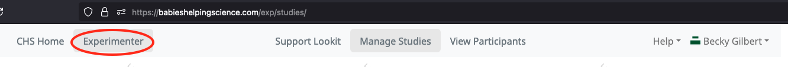
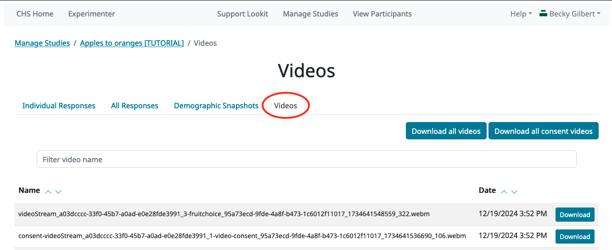

#############################################
Managing study data
#############################################

Now that you have a good handle on how to set up the study protocol you want, it's time to look at how to manage your study: controlling who has access to what, starting and stopping data collection, reviewing and downloading your data, and contacting your participants. 

Managing access to your study: add a collaborator
-------------------------------------------------

Rarely will you be working completely alone! Usually you will want multiple people to have access to any particular study: you may have a few people working together to get the protocol just right, as well as several RAs checking consent and sending feedback to participants. 

Especially once you're working on the production server (lookit.mit.edu rather than staging-lookit), we very strongly recommend this model rather than sharing credentials for a lab-wide OSF account. This way, each individual can get permissions on just the studies they actually need access to - not everything your lab has ever done. When temporary staff like undergrad RAs move on, you can just remove them from the study, instead of distributing a new password to everyone remaining in the lab. Plus, there is logging built into Lookit that keeps track of things like who did what when - including who approved consent recordings - that may be useful to you.

Try it out! Add another person to your tutorial study. On the study page in the Experimenter interface, scroll down to "Manage Researchers":

    
In the search box, type in the first few letters of someone you want to add, and press Enter. (If you don't know anyone else using Lookit, you can add Lookit staff Kim or Rico to your study!) Click the green "+" button to add them to your study:

.. image:: _static/img/tutorial/add_researcher.png
    :alt: Adding a researcher
    
They will show up on the right with "Read" permissions initially:

.. image:: _static/img/tutorial/new_researcher_with_read_access.png
    :alt: Researcher shows up on right with read access

This means they can see your study in the Experimenter interface, view associated participant and session data, and approve/reject consent videos. You can click on "Read" for a drop-down menu to give them different permissions if you want. "Admin" permissions let someone also start/stop data collection, change the study protocol or other details, and manage other researchers' access to the study. Or you can click the red "-" button to remove them again.

Great! Now you know how to give someone else access to your study so you can collaborate.

Updating the code your study uses
---------------------------------

Another thing you'll probably need to do eventually is set your study to use an updated version of the underlying frameplayer code. 

Remember when we had to "build preview dependencies" so we could preview the study? ( :ref:`You can review that here.<Building study dependencies>`) That build process took the version of the frameplayer code we specified and bundled it up into a little container for our study to run in. That container includes all the information Lookit needs about what frames are available to use and how they work.

As you fine-tune your study, you will be making lots of edits to your study JSON, saying exactly what stimuli each frame should use, in what order, etc. But the study JSON is still interpreted in that same "container." If at some point you want to take advantage of bug fixes, video recording improvements, new frames that have been added to the standard Lookit code, etc., you'll need to update that underlying code and make a fresh container by building dependencies again. 

(How do you think about this split in roles between the code and your JSON? Do you have a good analogy for this? Please make a PR to the docs!)

Try it out now! Follow the directions in :ref:`Updating the frameplayer code for your study<updating-frameplayer-code>` to update your tutorial study to use the most recent version of the Lookit code. 

By design, updating the code shouldn't break anything that currently works - you shouldn't need to change your JSON! However, it is important to always preview your study after any update to double check, and report any problems you run into.

Understanding previewing vs. participating in a study
--------------------------------------------------------------------

So far, we have tried out our studies via the "preview" button on the study edit page. There are several differences between previewing and actually participating in a study:

- When you participated in a study, the data collected (video and conditions/events/responses) is stored and will be available under "view responses" on the experimenter interface. Data from previewing is not stored!

- When you preview a study, the data collected is displayed in a pop-up window at the end of the study. When you participate, this data is not displayed.

- When you participate in a study, the frame player has access to information about the particular child who's participating - their name, birthday, previous session history for this study, etc. This information may be used to customize the experience - for instance, skipping a child assent frame for young children, or rotating through tasks in a longitudinal study.

- Only Lookit researchers with appropriate permissions can preview the study. Anyone with a child registered on Lookit can participate in a study.

- Preview and participation use different Docker containers, so you'll need to click "build dependencies" even if you have already built preview dependencies.

Going live!: the study approval process and starting data collection
--------------------------------------------------------------------

So how can you participate in your study, and let others do the same? The first step is to "submit" your study for approval by Lookit staff. Go to your first tutorial study and find the "change state" dropdown:

Go ahead and "submit" your study. This puts it into a queue for review by Lookit staff. 

.. admonition:: Why the manual approval process?

   From a participant's standpoint, Lookit is a unified platform, even though there are studies from a variety of research labs. This is great for participant recruitment! But it also means we're all sharing a reputation. Someone else's study that upsets or (without adequate precautions) deceives children, that baffles parents, or that just doesn't work will affect how interested families are in your study, too. Based on our early experience with researchers using Lookit, we strongly expect that a quick review will catch substantive issues often enough to be worth putting everyone through. If you are making changes to an existing study, review is either not required (if only changing certain fields like the age range/eligibility criteria) or is very quick.
   
You should also go ahead and click "Build Dependencies" so your study is ready to start once it's approved.

Within a few days you will get an email saying your study was approved. (At some point you will have the power to approve your own studies on the staging server!) At that point, you'll be able to come back and "start" your study, like this:

.. image:: _static/img/tutorial/study_start.png
    :alt: Change state dropdown menu with start

Starting and pausing data collection can be done instantly at any time after approval. 

What does "starting" your study do? If your study is set as "discoverable" (one of the checkboxes under "edit study"), starting will add your study to the set of studies displayed at `<https://staging-lookit.cos.io/studies/>`_, and anyone (including you) will be able to participate in it from there. If your study is set as non-discoverable, anyone will be able to participate via a direct link (shown on your study page in the experimenter interface). This is useful for studies intended for a very specific population, for instance if you're doing an online follow-up to an in-person study: you can email the direct link to families, without worrying about screening out other families on Lookit.
 
When you get the email, come back and try starting your study to see how it gets displayed to participants. For now, let's move on and work with an already-approved study!

Create some data to play with
--------------------------------

First, let's actually participate in another study! Go to `<https://staging-lookit.cos.io/studies/>`_ and select the study "Apples to oranges." This is a short study just to demo the data collection process. You may need to create a child profile and/or fill out a demographic survey before participating. Proceed all the way through this study!

Now switch back to the Experimenter interface. Note: you can toggle between Lookit (the participant-facing section) and Experimenter (the researcher-facing section) at any time via the top navbar if you are logged in as an experimenter:

.. image:: _static/img/tutorial/lookit_view.png
    :alt: Participant-facing Apples and Oranges detail page
    

    
At the top of the "Apples to oranges" page, click on "View responses":

.. image:: _static/img/tutorial/view_responses.png
    :alt: View responses link
    
This will take you to a view where you can code for informed consent, view individual responses, or download response data, demographic data, and videos.

Checking for informed consent and giving feedback
-------------------------------------------------

The first page you see when you click "View Responses" is called the Consent Manager, and it should look something like this - with your own consent video (and maybe some others) displayed.

.. image:: _static/img/tutorial/consent_manager.png
    :alt: The consent manager view
    
As data comes in, your first step will always be to check whether the parent provided informed consent. You do that here in the consent manager, which by default shows you the "pending" consent videos for review. In the left column, you'll click on each session to bring up the associated consent video at the center. You can use the dropdown menu to decide whether to "accept" (mark this as valid consent) or "reject" (mark as invalid consent) each video. If you want to add any notes about the consent video, you can record comments in the text box beneath the video - for instance, you might note that there was a technical problem with the video, but you contacted the parent to confirm consent.

For now, just mark your own video that you just made as "Accepted." Then click "Submit Rulings & Comments". This saves your consent coding to the Lookit server. (In case it matters to your IRB: A record of which logged-in user made each consent determination and when is also stored.) 

In the Consent Manager, you can now use the top drop-down menu to view currently "accepted" responses, and you should be able to see your own video there:

.. image:: _static/img/tutorial/accepted_responses.png
    :alt: Accepted responses in consent manager
    
If you needed to, you could still change the ruling about this consent video, in case you made a mistake.

You may notice that, compared with before, there's now more information displayed beneath your video when you select your consent video and scroll down! That's because, once you mark it as having valid consent, all the session data becomes available to you.

Click the "individual responses" tab to take a look at the data that's been collected on this study in some more detail:

.. image:: _static/img/tutorial/individual_responses.png
    :alt: Individual responses view
    
The top response in the table will probably be your own response that you accepted just now. With that row selected, you'll see a JSON version of data collected during the session displayed and a list of videos collected during the session. If you scroll to the bottom of the JSON data, you'll see information about the most recent consent ruling and the child who participated, so you can check who this is.

There's also a box where you can provide feedback to the participant. This feedback gets displayed on the participant's "past studies" page and is a good place to leave a short but personal thank-you message that shows a human has seen and appreciates their videos. Try it out! Leave a feedback message on your own video.

.. image:: _static/img/tutorial/feedback.png
    :alt: Feedback box

Then go back to the participant-facing site, and find that feedback under "Studies" -> "Your past studies."

.. admonition:: For more practice

   Want to play around with this a little more? See what happens if you go back and reject your consent video. Go the consent manager, display accepted consent videos, and reject yours. Now go back to individual responses. Your response is gone! Why is that, and how would you get it back?

Downloading response data & videos
------------------------------------

The consent manager and "individual responses" views can be helpful to get an idea of how data collection is going, but to code your videos and analyze your data you will want to download files that you can work with using your software of choice. 

To download all videos, you can go to the "attachments" tab and click "download all attachments." A zip file will be bundled up for you to download, and you will receive a link by email in a few minutes. Try it out, and take a look at some of the video collected!

    
Note that on this page you can also filter for specific parts of the filename, including the frame name and response ID. 

Videos are named ``videoStream_<study ID>_<frameIndex>-<frame ID>_<response ID>_<timestamp>_<random digits>.mp4``, so you can use the response ID to match videos to other response data even if you only have the filename. The response data will also contain video IDs in the ``expData`` for any frames that recorded video.

Under "All responses," you can download a JSON or CSV file with data about each session. 

.. image:: _static/img/tutorial/download_all_data.png
    :alt: All responses view
    
An overview of how to interpret this data is :ref:`available in the documentation.<Interpreting session data>`
    
Analyzing the data collected is, in general, outside the scope of this tutorial as it will vary substantially by lab/project and because improvements are coming to the data download process - although we hope that you will share your scripts and processes for analyzing Lookit data to help other researchers! The exercises below can be solved by manual inspection of the JSON or CSV data, although you are also welcome to set up a script in your language of choice to get a head start on real data processing.

Exercises
~~~~~~~~~~

1. How many researchers said they preferred oranges? How many said they preferred apples?

2. What fraction of researchers gave different answers on the actual test question vs. the survey?

Downloading demographic data 
----------------------------

Under 'demographic snapshots', you can also download demographic survey responses from the accounts associated with children who participated in your study (once consent is approved). For each response, you will see demographic survey data for that participant at the time of participation. 

Exercises
~~~~~~~~~~

1. What fraction of responses are from researchers in urban locations?

2. What fraction of children who responded at least once live in homes with at least 10 books?

Contacting participants [WIP]
-----------------------------

Contact a participant about a consent video issue (from consent)_
~~~~~~~~~~~~~~~~~~~~~~~~~~~~~~~~~~~~~~~~~~~~~~~~~~~~~~~~~~~~~~~~~~~

Contact a participant with a gift card code (from ind responses)
~~~~~~~~~~~~~~~~~~~~~~~~~~~~~~~~~~~~~~~~~~~~~~~~~~~~~~~~~~~~~~~~~~~

