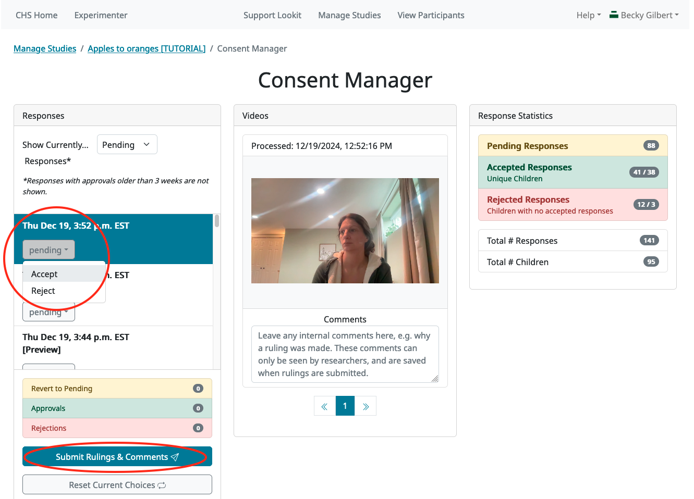

.. _tutorial-manage-data:

#############################################
4. Managing study data
#############################################

Now that you have a good handle on how to set up the study protocol you want, it's time to look at how to manage your study and data:

* Controlling other researchers' access to your study and data
* Starting and stopping data collection
* Reviewing and downloading your data
* Contacting your participants

.. admonition:: Who should do this section?
    
    Everyone! This information applies to both Lookit and jsPsych internal studies, and much of it applies to external studies as well. External studies do not have consent management or study data, but they do have demographic snapshot data for each participant/session. Managing data access, downloading, and communicating with participants works the same across all study types.

Managing access to your study: add a collaborator
-------------------------------------------------

Rarely will you be working completely alone! Usually you will want multiple people to have access to any particular study: you may have a few people working together to get the protocol just right, as well as several RAs checking consent and sending feedback to participants. 

We very strongly recommend this model rather than sharing credentials for a lab-wide account. This way, each individual can get permissions on just the studies they actually need access to - not everything your lab has ever done. When temporary staff like undergrad RAs move on, you can just remove them from the study, instead of distributing a new password to everyone remaining in the lab. Plus, there is logging built into CHS that keeps track of things like who did what when - including who approved consent recordings - that may be useful to you.

Try it out! Add another person to your tutorial study. On the study page in the Experimenter interface, scroll down to "Manage Researchers":

.. image:: _static/img/tutorial/manage_researchers.png
    :alt: Manage researchers section
    
(In the screenshot above, some researcher email addresses have been obscured for privacy.)

In the search box, type in the name or email of a researcher you want to add, and press Enter to search. Click the "+" button next to the researcher's name/email to add them to your study:

.. image:: _static/img/tutorial/add_researcher.png
    :alt: Adding a researcher
    
After the researcher has been added to your study, they will show up on the right with "Preview" permissions initially:

.. image:: _static/img/tutorial/new_researcher_with_read_access.png
    :alt: Researcher shows up on right with read access

This means they can see your study in the Experimenter interface, but they cannot see any participant data or make any changes. You can click on "Preview" for a drop-down menu to give them different permissions if you want. See the :ref:`Study Permissions section<study_permissions>` for much more detailed information about the different roles available. Or you can click the red "-" button to remove them again.

Great! Now you know how to give someone else access to your study so you can collaborate.

Updating the code your study uses (Lookit studies only)
--------------------------------------------------------

If you're running a CHS study that uses the Lookit experiment runner, then another thing you'll probably need to do eventually is set your study to use an updated version of the underlying Lookit frameplayer code. 

Remember when we had to "build an experiment runner" so we could preview the study? ( :ref:`You can review that here.<Building study dependencies>`) That build process took the version of the frameplayer code we specified and bundled it up into a little container for our study to run in. That container includes all the information Lookit needs about what frames are available to use and how they work.

As you fine-tune your study, you will be making lots of edits to your study protocol, saying exactly what stimuli each frame should use, in what order, etc. But the study protocol is still interpreted by that same application, which is the experiment runner. We are always updating the Lookit experiment runner with new versions to fix bugs, improve video recording, add new frames/parameters, etc. However, we do not automatically update your study's experiment runner for you, because we want your experiment to always run exactly how you expect it to. So if at some point you want to take advantage of the :ref:`Lookit experiment runner updates <runner-releases>`, you'll need to tell Lookit to use the new version and build a fresh experiment runner.

One way to think about your current experiment runner is as a Lego set; it has certain types of building blocks that allow you to customize your project with the pieces you have available. But Lego is always making new blocks with interesting shapes and new affordances. If you want access to building blocks beyond what you had in your original set, you can get access to the new and improved set of blocks by rebuilding your experiment runner.

Try it out now! Follow the directions in :ref:`Updating the frameplayer code for your study<updating-frameplayer-code>` to update your tutorial study to use the most recent version of the Lookit frameplayer. 

By design, updating the code shouldn't break anything that currently works - you shouldn't need to change your study protocol! However, **it is important to always preview your study after updating your experiment runner** to double check that everything works as you expect. If you do run into any problems, please let us know by posting in the tech_support channel on Slack or creating a :ref:`Github issue <github_issues>`.

Understanding previewing vs. participating in a study
--------------------------------------------------------------------

So far, we have tried out our studies via the "preview study" button on the study edit page. There are only a few differences between previewing and actually participating in a study:

- When you preview a study, there is an "is_preview" field of the data collected that's set to "true", otherwise it's "false". Data collected from previewing is marked when you view consent videos or individual responses, and this field is available in the all-response downloads.

- Only CHS researchers with appropriate permissions can preview the study: either (1) the researcher has "preview" :ref:`permissions for the study <study_permissions>`, or (2) the :ref:`study is set to have a shared preview <share_preview>`, in which case any researcher account can preview it.

Other than that, the experience is exactly the same, by design - so that you know exactly how your study will work. You see the same messages about whether your child is eligible, customization based on the child or past responses works the same way, and you use the same experiment runner.

Going live! The study approval process and starting data collection
--------------------------------------------------------------------

If you just want other researchers to be able to preview your study to give feedback, you can go to "Edit Study Ad" and check your study's :ref:`"share preview" box <share_preview>`, and then share the preview link on Slack.

But what about when you actually want to start data collection?

At that point, you will "submit" your study for approval by CHS staff. We won't practice this piece, but so you know what to expect, you can look through the 
:ref:`information about submitting your study <study status>`.

.. admonition:: Why the manual approval process?

   From a participant's standpoint, Children Helping Science is a unified platform, even though there are studies from a variety of research labs. This is great for participant recruitment! But it also means we're all sharing a reputation. Someone else's study that upsets or (without adequate precautions) deceives children, that baffles parents, or that just doesn't work will affect how interested families are in your study, too. Based on our early experience with researchers using CHS, we strongly expect that a quick review will catch substantive issues often enough to be worth putting everyone through. If you are making changes to an existing study, review is either not required (if only changing certain fields like the age range/eligibility criteria) or is very quick.

Create some data to play with (Internal studies)
--------------------------------------------------------

Because we don't want to clog up the production server with fake responses from researchers trying out CHS, we'll do this section on the staging server, which is a separate sandbox environment that looks a lot like CHS but doesn't have any real participant data. This is also where we try out new features before deploying them to production. 

The accounts on the real (production) CHS website and the staging website are completely separate, so you will need to create another researcher account on the staging server following the :ref:`login directions <staging server>`. If you did the first part of the tutorial, you'll already have a participant account on the staging server - use a different email address for your staging researcher account.

First, let's actually participate in another study! Go to the `staging server <https://babieshelpingscience.com/>`__ and log in with your researcher account. Then go to the `studies page <https://babieshelpingscience.com/studies/>`__, and select the study "Apples to oranges [TUTORIAL]". This is a short study just to demo the data collection process. You can participate using your researcher account; you may need to make a child profile and/or fill out a demographic survey before participating. Proceed all the way through this study!

Now switch back to the Experimenter interface. Note: when you are logged in as a researcher, you can toggle between the participant-facing and "Experimenter" (researcher-facing) sections of the Children Helping Science website at any time via the top navbar:

Click "CHS Home" to access the family-facing pages, such as the public "Studies" page:

    
Click "Experimenter" to access the researcher-only pages, such as the researcher "Manage Studies" page:

.. image:: _static/img/tutorial/exp_view.png
    :alt: Researcher-facing studies view
    
Get access to the "Apples to Oranges" study
-------------------------------------------------

When you go to the `Experimenter "Manage Studies" page on the staging site <https://babieshelpingscience.com/exp/studies/>`__, you are able to **see** the "Apples to oranges" study because you automatically get read-only permissions for studies within the Demo lab. However, you can't automatically see any participant data! (This is on purpose - it's not possible to grant lab-wide permissions to actual data, you have to actively add people to individual studies.) When you click on the "Apples to oranges" study from the "Manage Studies" page, you will see the study detail page, but with a limited set of buttons on the right:

**In the Slack #tutorial channel, post a request for access to the "Apples to oranges" study and we'll add you as a researcher**. Once you've been added as a researcher on this study, you will see see the "Message Participants" and "Review Consent" buttons in the menu:

Now you can code for informed consent, view individual responses, and download response data, demographic data, and videos. (You still will not see the "Edit Study Ad" and "Edit Study Design" buttons, because those are for study admins only).

Checking for informed consent and giving feedback
-------------------------------------------------

From the study details page, click the "Review Consent" button in the set of buttons on the right. 

.. image:: _static/img/tutorial/review_consent_button.png
    :alt: The review consent button

This takes you to the Consent Manager page. As data comes in, your first step will always be to check whether the parent provided informed consent. You do that here in the Consent Manager, which by default shows you the "pending" consent videos for review. In the left column, you'll click on each session to bring up the associated consent video(s) at the center and additional information at the bottom of the page. You can use the dropdown menu to decide whether to "accept" (mark this as valid consent) or "reject" (mark as invalid consent) each video. If you want to add any notes about the consent video, you can record comments in the text box beneath the video. For instance, you might note that there was a technical problem with the video, but you contacted the parent to confirm consent for this session (and mention where to find the parent's email that confirms consent).

For now, just mark your own video that you just made as "Accepted." Then click "Submit Rulings & Comments". This saves your consent coding to the CHS server. (In case it matters to your IRB: this also creates a record of which logged-in researcher made each consent determination and when.) 

Now if you use the drop-down menu at the top of the "Responses" column to view currently "accepted" responses, and you should be able to see your own video there:

    
If there was a mistake about the consent ruling for a video, you can always change it again and click "Submit Rulings & Comments" to save your changes.

Individual responses
-------------------------------------------------

Once you mark a response as having valid consent, all the data from that session becomes available to you in the Responses pages. Go back to the "Apples to oranges" study detail page and click on the "Study responses" button:

This will take you to the "All Responses" page. You will see some other tabs toward the top of the page - click the "Individual Responses" tab to take a look at the individual session data that's been collected on this study in some more detail:

On the Individual Responses page, you will see a table where each row represents a single response session. The top (most recent) response will be selected automatically when the page loads. You can click on other rows to view and download information about each response.

Your own response will probably be the top one. To check, with the top row selected, find the "**Response details**" box, and look at the "Parent name" and "Child name" values. This "Response details" box contains various other IDs and some key information taken from the exit survey. Try clicking on other rows in the table to see how the response details change.

.. image:: _static/img/tutorial/individual_responses.png
    :alt: Individual responses view

The "**Download response**" box allows you to download the data from the selected response in JSON or CSV format.

The "**Videos**" box allows you to view and download any videos associated with the selected response.

There's also a "**Feedback**" box where you can leave new feedback to the participant and any view existing feedback about this session. The feedback gets displayed to that specific participant on their "Past Studies" page. It's a good place to leave a short but personal thank-you message that shows a human has seen and appreciates their videos. Try it out! Leave a feedback message on your own video.

After you create a feedback comment for a response session, you will be able to view and add/edit your feedback comments on this same page.

Go back to the participant-facing site ("CHS Home" button) and find your study history ("My Past Studies" button). You should see the "Apples to oranges" study information, and below that, a "Study Responses" heading with all of the study sessions you've done for that study. This is where families will be able to see your feedback on their session, along with their own videos and other information.

.. admonition:: For more practice

   Want to play around with this a little more? See what happens if you go back and reject your consent video. Go the consent manager, display accepted consent videos, and reject yours. Now go back to individual responses. Your response is gone! Why is that, and how would you get it back?

Downloading response data & videos
------------------------------------

The Individual Responses page can be helpful to get an idea of how data collection is going. But to code your videos and analyze your data you will want to download all of your files easily and in a format that you can work with using your software of choice.

To download all of your (non-video) response data, go to the "**All responses**" tab (this is the page that loads when you click "Study Responses" from your study details page). Here you can download JSON or CSV files with data about all responses from this study. :ref:`You can learn more about these options here.<Response download options>`

.. image:: _static/img/tutorial/all_responses.png
    :alt: All responses view

To download all videos, after clicking "Study Responses" on your study details page, find the "**Videos**" tab, and click "Download all videos". A zip file will be bundled up for you to download, and you will receive a link by email in a few minutes. Try it out, and take a look at some of the video collected!

.. image:: _static/img/tutorial/download_videos.png
    :alt: Video download button
    
Note that on this page you can also download all *consent* videos and/or individual video files. The individual files can be filtered for specific parts of the filename, including the frame name and response ID.

Videos are named ``videoStream_<study ID>_<frameIndex>-<frame ID>_<response ID>_<timestamp>_<random digits>.webm``, so you can use the response ID to match videos to other response data even if you only have the filename. The response data will also contain video IDs in the ``expData`` for any frames that recorded video.

Analyzing the data collected is, in general, outside the scope of this tutorial as it will vary substantially by lab/project - although we hope that you will share your scripts and processes for analyzing CHS data to help other researchers! The exercises below can be solved by manual inspection of the CSV (or JSON) data, although you are also welcome to set up a script in your language of choice to get a head start on real data processing.

Exercises
~~~~~~~~~~

1. How many researchers said they preferred oranges? How many said they preferred apples?

2. What fraction of researchers gave different answers on the actual test question vs. the survey?

Downloading demographic data 
----------------------------

In the "Study Response" pages, there is a tab called "**Demographic Snapshots**" where you can download demographic survey responses from the accounts associated with children who participated in your study (once consent is approved). For each response, you will see demographic survey data for that participant at the time of participation. 

Exercises
~~~~~~~~~~

1. What fraction of responses are from researchers in urban locations?

2. What fraction of children who responded at least once live in homes with at least 10 books?

.. _tutorial_contacting_participants:

Sending messages to participants
----------------------------------

You may need to contact participants using the :ref:`CHS messaging interface <contacting_participants>` for providing compensation or a variety of other reasons. From your main study details page, find the "Message Participants" button on the right-hand side. That will take you to a page where you can see previous messages (left side) and compose new messages (right side). The first thing you will do when you send an email is select the "Message Type". These line up with the email types participants can opt to receive - click on each of the five buttons to see a description of the message type.

Next, you specify the recipient(s). You can do this by searching for the appropriate **Parent name** or **Parent ID**. This is the shorter hashed ID that is unique to each study, which you can find in the "Response Details" section of the :ref:`Individual Responses page <individual_responses>`, or in the response data ("participant": "hashed_id" in JSON files; "participant__hashed_id" in CSV files). 

Finally, you write your message subject and body, and hit send! Let's try it out with a few example scenarios.

Contact a participant about a consent video issue
~~~~~~~~~~~~~~~~~~~~~~~~~~~~~~~~~~~~~~~~~~~~~~~~~~~~~~~~~~~~~~~~~~~

First, let's imagine that there was an issue with your consent video and you needed to confirm that it was ok to use data from the session. 

In one browser tab, open up the Consent Manager page for the "Apples to Oranges" study, and find your consent video. Scroll down to the information about the session. You should see an "Account Information" section. In that box you will find the shorter (hashed) Parent ID - copy this value.

    
In another browser tab, open up the "Message Participants" page for the same study. Choose the message type for "response questions" (4th button) since this is a clarifying question about the response. Under "Recipients", paste the Parent ID into the box. That should bring up exactly one potential recipient, which is you! Click the ID to add it to the recipients list. 

.. admonition:: Why is a recipient name/ID grayed-out?

    You may find that some participants appear under "Recipients" but their names are grayed-out and cannot be selected. This means that the participant has opted out of the type of message you are sending. The only message type that can be sent to any participant is the "transactional" type, which must ONLY be used for providing compensation or completing other "transactions".

Write a subject and body for your email explaining the problem and asking whether it's ok to use data from this session. (See :ref:`day-to-day study operation <confirm_consent>` for suggestions about what you might say!)

Go ahead and send your message. You should receive the message as an email.

Finally, on the Consent Manager page, approve your own consent video so that you can access your response data in the next step. See the :ref:`Consent Manager documentation <coding-consent>` for more information on how to approve your consent.

Contact a participant with a gift card code
~~~~~~~~~~~~~~~~~~~~~~~~~~~~~~~~~~~~~~~~~~~~~~~~~~~~~~~~~~~~~~~~~~~

Second, let's imagine that you're compensating participants with gift cards. (You'll want to take a look at the Terms of Use and :ref:`compensation info here <compensation>` as you make more detailed plans, but essentially, for now researchers are responsible for handling any compensation by messaging participants.)

From your study details page, click the "Study Responses" button from the menu on the right, then click on the "Individual Responses" tab. Find your response again. Copy the Parent ID from the "Response details" box:

.. image:: _static/img/tutorial/response_parent_id.png
    :alt: Parent ID in the Response Details box

This same Parent ID can be found in the response data. If you download the data as a JSON file, it's under "participant": "hashed_id", and if you download the data as a CSV file, it's called "participant__hashed_id".

Returning to the "Contact Participants" page, let's create another email. This time, you can select the "transactional" button (yellow), which allows you to reach even people who have opted out of email; this is because you sending the compensation is the completion of a "transaction" they agreed to. You will see a warning when you select this option, reminding you that this option is ONLY for completing a transaction.
    
Like before, paste in your ID, write your message, send it, and make sure you receive it. (Don't actually send yourself a gift card. Unless you really want to.)

.. image:: _static/img/tutorial/transactional.png
    :alt: Transactional email

Congratulations! We've covered all the basic functionality you'll need to manage your studies. Finally, we'll wrap up by briefly noting some of the advanced features you might want to use later and revisiting :ref:`Github issues<github_issues>` now that you may have some feature requests or bug reports.
