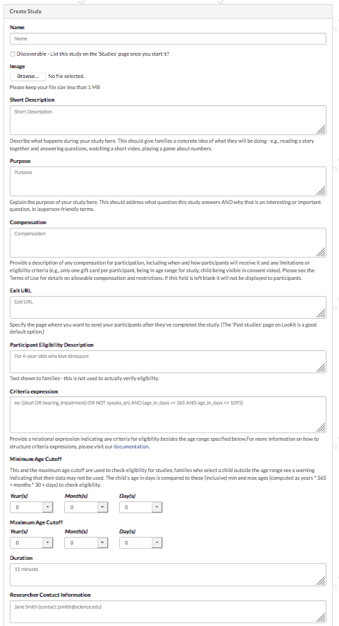

#####################################################
4. Building 'intermodal matching' from the ground up
#####################################################

Now that you've gotten your feet wet and are comfortable using Lookit's experimenter interface to modify your study protocol configuration, it's time to take a closer look at how to build your own study. 

In this section, you'll build an example of a functional infant study "from the ground up," adding frames one at a time.

There's a fair amount of copying, pasting, and looking at the result in this section. Please bear with us - once you complete the tutorial, you'll be ready to set up your own study!

Introduction: intermodal matching study
---------------------------------------

Imagine you're looking to replicate the finding that infants can detect which moving face "goes with" a speech stream, an ability known as intermodal matching. In your study, babies will watch several short videos of two women's faces - one face on the left and one on the right. Both women are talking, but babies only hear the audio from one of them in each clip. (There are four trials, and who's talking is counterbalanced - babies either hear left, right, right, left audio or right, left, left, right audio.) 

You plan to code the video collected on Lookit for preferential looking - whether the child is looking to the left of the screen, right of the screen, or away. Because you are eventually hoping to develop a measure that can be used to detect individual differences linked to social development, you are also including a short survey on parenting beliefs.

.. admonition:: This is a real study that was run on Lookit!

   The study stimuli and protocol have been generously shared by Halie Olson and Rebecca Saxe for use as an example. Slight modifications have been made for teaching purposes.

Creating the study and filling out study fields
-----------------------------------------------

This time, instead of copying an existing study, we're going to create our own from scratch so that we see every field. Go to `<https://lookit-staging.mit.edu/exp/studies/>`_ and click the green "Create Study" button at top right:

    
This will bring you to a screen with a bunch of fields to fill out:

In a separate tab, open up the documentation about these fields for fuller explanations of what each one should contain: :ref:`study_fields`. Below is the study-specific information you'll need to fill out each field.

Name
  Enter "Look and Listen" here - or another name for the study if you have a cute or catchy idea! 
  
Discoverable
  Check the box so that when you submit your study to post on the staging server, it will show up to participants on the Studies page
  
Share preview
  Check the box so other researchers can preview your study without being added as collaborators
  
Image
  You can download a screenshot of the stimuli to use `here <http://www.mit.edu/~kimscott/intermodal/img/intermodal_thumbnail.png>`_.

Short Description
  Here's an example description of what happens during this study - you can copy or edit it. "Your child will watch several short videos of two people saying nonsense syllables. The sound will match just one of the people. We want to see which face your baby chooses to look at!"

Purpose
  Here's a draft of a description of the purpose of the study, but it's very general - it could apply to a lot of related studies. Edit it so that it explains the specific question this study asks and why the answer matters - without getting too technical. "Babies can learn language by seeing, hearing, and feeling. We want to better understand how babies pay attention to what they see and hear when people are speaking to them."

Compensation
  Here's the actual compensation description that was used - you can copy it: "After you participate, we'll email you a $4 Amazon gift card as a thank-you. (One gift card per child; child must be in the age range for the study.)"

Exit URL
  After the study let's send families to their study history, where they can see their videos right away! Use "https://lookit.mit.edu/studies/history/"

Participant Eligibility Description
  "For babies ages 4-18 months"

Criteria expression
  This study focuses on children born at or near full term: require that the child was born at 37+ weeks gestation. (Refer to the documentation to see how, and to learn about what other types of eligibility criteria you can set up here!)

Minimum Age Cutoff
  3 months, 29 days (this equals 119 days, which is the youngest that a "4 month old" by the calendar can be. This avoids confusing parents who see a warning when trying to participate with their just-turned-four-month-old born in February)

Maximum Age Cutoff
  1 year, 7 months, 4 days (this is a generous cutoff, again to avoid confusion from parents of kids who aren't quite 19 months old yet)

Duration
  "5 minutes" (you can also test this )

Researcher Contact Information
  Enter "<Your Name> (contact: <your email and/or phone number>)"

Protocol configuration
  Leave this blank for now

Experiment runner type
  Choose the default and leave ``Experiment runner version (commit SHA)`` blank.

Click the green "Create study" button at the bottom of the form to save all your work! You've got all the study metadata set... now all that's left is to write your study protocol.

Adding each frame
-----------------

Now we're going to build out the study protocol configuration, one piece at a time. Here's the basic outline of this study. It follows a basic pattern you can also see described here: :ref:`typical_study_schema`.

1. A "setup" frame to guide the family through getting their webcam set up
2. A video consent frame where the parent makes a verbal statement of informed consent
3. An intro frame giving the parent an overview of what will happen during the study
4. A stimuli preview frame, giving parents the option to review stimuli ahead of time
5. Some instructions about what to do during the study
6. Test trials where babies will see videos that show two women talking (one on either side of the screen) but only the audio from one speaker
7. A short survey about parenting beliefs
8. A standard "exit survey" where parents select a video privacy level

1. Setup
~~~~~~~~~

We'll start with a standard setup frame called "exp-video-config". You can see a sample of what it looks like `here <https://lookit.github.io/ember-lookit-frameplayer/classes/Exp-video-config.html>`_. 

Underneath the screenshot, you'll see an example of defining this frame in your study protocol:

.. image:: _static/img/tutorial/exp_video_config.png
    :alt: Exp-video-config frame docs
    
Copy the definition of the "video-config" frame (``"video-config": { ... }``, as shown highlighted above), and open up your study's protocol editor. Paste this into the "frames" value, like this:

.. image:: _static/img/tutorial/video_config_added_to_frames.png
    :alt: Adding the video-config example to frames
    
You will need to delete the line breaks in the "troubleshootingIntro" value for this to be proper JSON. Edit the text as well, so it references your own lab and an appropriate contact method!

That defines a frame that's now available for us to use. In order to actually use it, add it to your "sequence" as well:

    
.. admonition:: The key for your frame can be whatever you want

   There's nothing magical about the "video-config" key given to this frame - you can change it to whatever you want, as long as they key in ``frames`` matches what you call it in ``sequence``. 
   
Close the editor, save your protocol, and preview your study. Make sure to click "build experimenter builder" if you have not already done so; you will be emailed when it is built and then you can preview your study. You should see the setup frame, looking just like the screenshot in the docs.

2. Consent
~~~~~~~~~~~

Now that your participants have their webcam set up, the very first thing you need to do - before starting any study procedures - is collect informed consent. Consent frames are treated somewhat specially: you will only see any data from participants who get through your consent page, and videos collected on the consent page will be available for you to review and confirm before you can access the remaining data from the corresponding sessions.

Unless you receive specific permission from Lookit, you'll be asked to use the standard video consent (and/or assent) frames to keep the experience for participants consistent.

This study is for babies, so we don't need to collect child assent, just parental consent. Go to the frame docs and select 'exp-lookit-video-consent' on the sidebar. Just like you did for the setup frame, copy the sample frame definition (``"video-consent": {...}``) and add it to your study protocol frames and sequence, like this:

Note that you will need to add commas between the previous and new items in both "frames" and "sequence", as circled above.

Save and preview again. Now when you click "Next" from the video config page, you'll see a consent page. The sample text is pretty silly, though! Change each of the following fields to more appropriate text for this study, substituting in your own information for the things shown in ``<brackets like this>``. For more information on what each of these fields is, you can click on the property names in the frame documentation as shown below:

PIName
  "<Your Name>"
  
datause
  "We are primarily interested in your child's looking behavior. A research assistant will watch your video to measure the precise amount of time looking at the screen."
  
payment
  "You will be emailed a $4 Amazon gift card for participating in this study, no matter what your child does during the experiment, as long as your child is in the age range of our study and has not participated in our study in the past 30 days."
            
purpose
  "The purpose of this study is to better understand how much infants at different ages prefer to look at talking faces that are synchronized with what they hear compared to talking faces that are not synchronized with what they hear."
  
PIContact
  "<Your Name> at <your email> or <your phone number>"
            
procedures
  "For this study, your child will watch short videos (about 20 seconds long). For each video, there will be two faces on the screen that may be speaking nonsense syllables – something like “La mu ba.” The audio of the nonsense syllables matching only one of the two faces will be played. We are curious which face your baby prefers to look at – the one matching the audio or the one that doesn’t match the audio. We ask that you close your eyes or hold your baby over your shoulder during this experiment so that your behavior doesn’t influence where your baby looks. Before each video, you will hear a chime while an image moves on the screen to get your baby’s attention. You may then hear about 20 seconds of the nonsense syllables while the faces appear on the screen. The entire experiment should take less than 5 minutes. You may be asked to fill out a short survey at the end of the experiment. We do not anticipate any risks associated with this study."

template
  "consent_002"

institution
  "<your institution>"

gdpr
  false
            
research_rights_statement
  "You are not waiving any legal claims, rights or remedies because of your participation in this research study.  If you feel you have been treated unfairly, or you have questions regarding your rights as a research subject, you may contact <your IRB information>."

Save your protocol and take another look at the preview. Congratulations! You've got the start of your study set up, with a valid consent form that lets the family record a statement of informed consent.

3. Intro
~~~~~~~~~

Here we'll use a simple text frame just to give parents an overview about what's going to be happening in the study. 

Go to the frame documentation, and select the "exp-lookit-text" frame. Just like before, add the example to your study protocol, putting the frame definition for "study-intro" in your "frames" object and adding "study-intro" to your "sequence" list.

For convenience, this time, let's put "study-intro" FIRST in the sequence, so that when we preview our study it's easy for us to see the changes we make to customize the text on this frame:

Save your protocol and go ahead and preview your study. You should see a simple text frame first. Let's change the ``blocks`` value to show an appropriate overview for this study: copy and paste the section below to replace the existing ``"blocks": [...]`` piece:

.. code:: json

   "blocks": [
        {
            "emph": true,
            "text": "Important: your child does not need to be with you until the videos begin. First, let's go over what will happen!",
            "title": "Overview of the 'Look and Listen' study"
        },
        {
            "text": "During this study, your baby will watch videos of talking faces while we record where he or she chooses to look."
        },
        {
            "text": "You’ll have a chance to preview the videos ahead of time. After reading the instructions you’ll start the experiment when you and your baby are ready."
        },
        {
            "text": "The video section will take about 3 minutes."
        },
        {
            "text": "After the videos, you will answer a few final questions. Then you're all done!"
        }
    ],

Save and preview again to see your changes. 

4. Stimulus preview
~~~~~~~~~~~~~~~~~~~

Especially if you need parents blind to stimuli and so you ask them to turn around or close their eyes, it's generally best practice to offer them an opportunity to preview any images, audio, or video that their child will be shown during the study. This lets them check that they don't think anything is objectionable or inappropriate for their child - e.g., interactions they find to be violent, or images of something that might interact with a child's phobia. From a practical standpoint, it also greatly decreases the temptation to "peek" at the stimuli during the study out of curiosity or concern.

We'll use the frame type "exp-lookit-stimuli-preview" here to offer parents the opportunity to preview stimuli, and record while they preview if so. You can look up the properties they accept in the frame documentation, but since you're already getting the hang of using the frame documentation to start from an example, this time you can just copy and paste the following definition into ``frames``:

.. code:: json

   "video-preview": {
        "kind": "exp-lookit-stimuli-preview",
        "stimuli": [
            {
                "caption": "For each trial, there will be two women on the screen speaking nonsense syllables. Only the audio for one of the videos will be played at a time. Here's an example.",
                "video": "INSERT_EXAMPLE_VIDEONAME_HERE"
            }
        ],
        "baseDir": "https://www.mit.edu/~kimscott/intermodal/",
        "videoTypes": [
            "webm",
            "mp4"
        ],
        "blocks": [
            {
                "text": "During the videos, we'll ask that you hold your child over your shoulder like this, so that you're facing away from the screen.",
                "image": {
                    "alt": "Father holding child looking over his shoulder",
                    "src": "INSERT_SRC_URL_HERE"
                }
            },
            {
                "text": "The reason we ask this is that your child is learning from you all the time. Even if he or she can't see where you're looking, you may unconsciously shift towards one side or the other and influence your child's attention. We want to make sure we're measuring your child's preferences, not yours!"
            },
            {
                "text": "If you'd like to see an example of a video your child will be shown, you can take a look ahead of time now. It's important that you watch the video without your child, so that the videos will still be new to them."
            }
        ],
        "skipButtonText": "Skip preview",
        "previewButtonText": "Preview a video (my child can't see the screen)",
        "showPreviousButton": true
    },

There are a few stimuli above that you'll need to insert. You can see all the stimuli you might need for this study at `<https://www.mit.edu/~kimscott/intermodal/>`_. 

* For the example video, where it says ``"INSERT_EXAMPLE_VIDEONAME_HERE"``, take a look in the mp4 directory to find an example video (any example with sound is fine). You only need to give the filename without extension, like "abba1", because we're already telling the exp-lookit-stimuli-preview frame to use a "base directory" for this study and expect certain video types. You can learn more here: :ref:`stim_directory_structure`.

* For the image of the father holding his child over his shoulder, take a look in the img directory, and insert the full path ("https://www.mit.edu/~kimscott/...") to the file you want to use.

Then make sure to also add "video-preview" to your ``sequence``. You can put this at the start of the sequence to make it easy to see right away. Save and take a look at the preview!

5. Instructions
~~~~~~~~~~~~~~~

Almost done with the preparations! We're just going to give particpants one more frame with directions so these are fresh in their minds. This time we'll use an exp-lookit-instructions frame, which allows showing a fairly flexible combination of text, audio, video, and the user's own webcam. Here's a starting point for the frame to add:

.. code:: json

   "final-instructions": {
        "kind": "exp-lookit-instructions",
        "blocks": [
            {
                "text": "The video section will take about 3 minutes to complete. After that, you will be able to select a level of privacy for your data."
            },
            {
                "title": "Study overview",
                "listblocks": [
                    {
                        "text": "To get your baby's attention, first they will see a moving shape and hear a chime. "
                    },
                    {
                        "text": "Then your baby will watch four videos, each about 20 seconds long."
                    }
                ]
            },
            {
                "title": "During the videos",
                "listblocks": [
                    {
                        "text": "Please face away from the screen, holding your infant so they can look over your shoulder. Please don't look at the videos yourself--we may not be able to use your infant’s data in that case.",
                        "image": {
                            "alt": "Father holding child looking over his shoulder",
                            "src": "https://s3.amazonaws.com/lookitcontents/exp-physics/OverShoulder.jpg"
                        }
                    },
                    {
                        "text": "Don’t worry if your baby isn’t looking at the screen the entire time! Please just try to keep them facing the screen so they can look if they want to."
                    }
                ]
            },
            {
                "title": "Pausing and stopping",
                "listblocks": [
                    {
                        "text": "If your child gets fussy or distracted, or you need to attend to something else for a moment, you can pause the study by pressing the space bar."
                    },
                    {
                        "text": "If you need to end the study early, try closing the window or tab and you should see an 'exit' option pop up. You’ll be prompted to note any technical problems you might be experiencing and to select a privacy level for your videos."
                    }
                ]
            },
            {
                "text": "Please turn the volume up so it's easy to hear but still comfortable.",
                "title": "Test your audio",
                "mediaBlock": {
                    "text": "You should hear 'Ready to go?'",
                    "isVideo": false,
                    "sources": [
                        {
                            "src": "MP3_SOURCE_HERE",
                            "type": "audio/mp3"
                        },
                        {
                            "src": "OGG_SOURCE_HERE",
                            "type": "audio/ogg"
                        }
                    ],
                    "mustPlay": true,
                    "warningText": "Please try playing the sample audio."
                }
            }
        ],
        "nextButtonText": "Start the videos! \n (You'll have a moment to turn around.)"
    }

The snippet above sets up several sections ("blocks") with bulleted lists of information. (For a real study you might also consider splitting this frame into several frames - a study overview, "during the videos" directions, pausing and stopping, and the audio test. More things to click through, but less text on the page.)

As in the preview, there are some stimuli you need to add! Browse the audio files `here <http://www.mit.edu/~kimscott/intermodal/>`_ to find an mp3 and ogg version of a "ready to go!" audio clip that you can use to have parents test their audio. Insert the full paths where it says "MP3_SOURCE_HERE" and "OGG_SOURCE_HERE". Why multiple versions of the same files? This helps make sure that the media will work across various computer setups.

Once you've added this frame to your ``frames`` and to your ``sequence``, check out how it looks. Note that because you've set ``mustPlay`` to ``true`` in the block about testing your audio, you can't proceed to the next frame until you've played it! This is to make sure that participants don't start the video section without their sound on. If they do, (a) the study won't work because the baby needs to be able to hear the sound, and (b) they're going to be very confused because they won't hear the audio instructions that tell them what's going on, when it's time to turn back around, etc.
    
6. Test trial(s)
~~~~~~~~~~~~~~~~

Finally, the meat of the study! Right now, we're just going to set up a single test trial to see how it works. Once we have a complete mockup of the study, we'll add the counterbalancing and the rest of the trials. 

For this study, we're going to use the fairly flexible "exp-lookit-video" frame, which proceeds through optional "announcement," "intro", "calibration," and "test" phases. Please skim the `frame documentation <https://lookit.github.io/ember-lookit-frameplayer/classes/Exp-lookit-video.html>`_ now for an overview of how it works. 

Copy and paste the following frame to your ``frames``  (removing the comments that look like ``<-- TEXT HERE ``) and then add "example-test-trial" to your ``sequence``. Because this frame is shown full-screen, you should put it after at least one other frame to test it out (e.g., after your instructions frame) rather than making it the first frame. This is because your web browser won't let something go full-screen unless you take an action to trigger that (like pressing the "next" button).

.. code:: json

   "example-test-trial": 
      {
            "kind": "exp-lookit-video",
            "baseDir": "https://www.mit.edu/~kimscott/intermodal/",
            "testCount": 1, <-- PLAY THROUGH THE TEST VIDEO ONE TIME
            "audioTypes": [
                "ogg",
                "mp3"
            ],
            "pauseAudio": "<INSERT HERE>", <-- INSERT THE NAME (NO EXTENSION) OF AUDIO TO PLAY UPON PAUSING THE STUDY HERE
            "videoTypes": [
                "webm",
                "mp4"
            ],
            "attnSources": "<INSERT HERE>", <-- INSERT THE NAME OF THE VIDEO TO SHOW DURING THE ANNOUNCEMENT PHASE HERE
            "introSources": [], <-- LEAVE THIS AS AN EMPTY LIST - WE DON'T NEED AN INTRO
            "musicSources": [], <-- LEAVE THIS AS AN EMPTY LIST - WE DON'T NEED MUSIC
            "unpauseAudio": "<INSERT HERE>", <-- INSERT THE NAME OF AUDIO TO PLAY WHEN THE STUDY IS UN-PAUSED
            "announceLength": 3, <-- THIS IS HOW MANY SECONDS TO MAKE THE ANNOUNCEMENT PHASE
            "calibrationLength": 2000, <-- THIS IS HOW LONG TO MAKE EACH CALIBRATION BLOCK
            "calibrationPositions": [ <-- THIS IS THE LIST OF PLACES THE CALIBRATION VIDEO WILL BE SHOWN, IN ORDER
                "left",
                "right",
                "left",
                "right",
                "center"
            ],
            "calibrationAudioSources": "<INSERT HERE>", <-- INSERT THE AUDIO TO PLAY DURING CALIBRATION
            "calibrationVideoSources": "<INSERT HERE>", <-- INSERT THE CALIBRATION VIDEO TO USE
            "sources": "abba1", <-- TEST VIDEO OF TWO WOMEN TALKING
            "altSources": "baab1", <-- WHAT VIDEO TO USE IF THE STUDY GETS PAUSED DURING TEST AND THIS TRIAL IS RE-STARTED
            "audioSources": "video_1_HO_intro", <-- WHAT AUDIO TO PLAY AS AN ANNOUNCEMENT
     }
    
Again, you will need to browse the `available audio and video files <http://www.mit.edu/~kimscott/intermodal/>`_ to select appropriate stimuli to insert where indicated above.

.. admonition:: Planning your audio instructions

   You want your audio instructions to be as concise as possible, but still friendly and complete. Figuring out all the different audio files you need is often a lesson in just how much communication you take for granted in the lab!
   
Save your protocol and take a look at what happens. You should see three phases: a spinning ball with some audio instructions; a "calibration" section where an attention-grabber pops back and forth on the screen (so that your coders will be able to verify they can see the child looking back and forth), and then a test video where two women are talking but we can only hear one of them.
    
7. Survey
~~~~~~~~~

After the test trials, you plan to include the Early Parenting Attitudes Questionairre (See Hembacher & Frank, https://psyarxiv.com/hxk3d/). It's a bit long, so for the purposes of this tutorial we're just going to include a few questions from it. Copy and paste the following frame into ``frames``, and add "epaq-survey" to your ``sequence`` - you know the drill. This uses the "exp-lookit-survey" frame type. 

.. code:: json

   "epaq-survey": {
        "kind": "exp-lookit-survey",
        "formSchema": {
            "schema": {
                "type": "object",
                "title": "This is an optional survey that will take a few minutes to complete. Please indicate how much you agree with the following statements using a 0-6 scale with 0 being 'I do not agree' and 6 being 'strongly agree.'",
                "properties": {
                    "Q1": {
                        "enum": [
                            "0 (Do not agree)",
                            "1",
                            "2",
                            "3",
                            "4",
                            "5",
                            "6 (Strongly agree)"
                        ],
                        "title": "Children should be comforted when they are scared or unhappy.",
                        "required": false
                    },
                    "Q2": {
                        "enum": [
                            "0 (Do not agree)",
                            "1",
                            "2",
                            "3",
                            "4",
                            "5",
                            "6 (Strongly agree)"
                        ],
                        "title": "It’s important for parents to help children learn to deal with their emotions.",
                        "required": false
                    }

                }
            },
            "options": {
                "fields": {
                    "Q1": {
                        "type": "radio",
                        "removeDefaultNone": true
                    },
                    "Q2": {
                        "type": "radio",
                        "removeDefaultNone": true
                    }
                }
            }
        }
      }
        
Save your protocol and take a look at the preview. You should see a simple form with two questions and some intro text, and (since nothing's required) you should be able to proceed even if you don't answer the questions. 
        
You don't need to understand all the syntax above - but even if it looks pretty opaque, you can probably see the basic structure. There are two questions Q1 and Q2 defined in "properties," with some corresponding additional information under "options." Each one has some actual question text (the "title"), some options from 0 to 6, and will be shown as radio buttons. 

Go ahead and try adding the next question (call it "Q3"): 

"Parents should pay attention to what their child likes and dislikes." 

It will have the same format and possible answers as the others. You can copy and paste the information about "Q2" under both "properties" and "options" and just edit it!
    
8. Exit survey
~~~~~~~~~~~~~~

Finally, to wrap up our study we need to include an "exp-lookit-exit-survey" frame. (This is required of all Lookit studies to keep the experience for parents fairly consistent.) This is where parents have an option to choose how you may share their video, if at all, and to give you some feedback if they want to. It's also where you'll provide some "debriefing" information, just like you might when chatting with the family after they came into the lab. There are more guidelines about what your debriefing should contain under :ref:`the sample study outline <debriefing-info>`. 

You guessed it - copy and paste the frame below into ``frames`` in your protocol, and add "exit-survey" to your ``sequence``. Put the frames in your ``sequence`` in order and try out the entire study! 

.. code:: json

   "exit-survey": {
            "kind": "exp-lookit-exit-survey",
            "debriefing": {
                "text": "You and your baby are helping us to better understand how the preference for visual/auditory synchrony in speech develops over the first 18 months of life. Babies vary in the amount of time they choose to look at the 'synchronized' speaker compared to the 'unsynchronized' speaker - there's no right or wrong preference! We are interested in how much babies' preferences differ at various ages. If you'd like, you can even participate with your baby again next month!\n\nTo thank you for your participation, we'll be emailing you a $4 Amazon gift card - this should arrive in your inbox within the next week after we confirm your consent video and check that your child is in the age range for this study. (If you don't hear from us by then, feel free to reach out!) If you participate again with another child in the age range, you'll receive one gift card per child. You will also receive another gift card if you participate again with this child if it has been at least one month since the last time this child participated.",
                "title": "Thank you for participating in our study!"
            }
        }
        
Finally, pretend that your baby has fussed out partway through, and try pressing ctrl-X or F1 during the study. You should see a dialogue appear and if you choose to leave the study, you'll be taken to the last frame - which is now, appropriately, your exit survey. Hooray!

Set up counterbalancing
-----------------------

Your plan for this study is actually to have four test trials. Either the audio will come from the left speaker, right speaker, right speaker, left speaker; or it will come from right speaker, left speaker, left speaker, right speaker.

To do this sort of counterbalancing, the simplest approach is to use a special class of frame called a "randomizer." At the time your study protocol is interpreted in order to display the study to your participant, the randomizer frame will make some (random) selections. There are a variety of randomizer frames available on Lookit, which you can browse `here <https://lookit.github.io/ember-lookit-frameplayer/modules/randomizers.html>`_. For our study, we will use the fairly general-purpose "random-parameter-set" randomizer, which you can read more about in those frame docs if you're curious. (There are also more walkthroughs in :ref:`random_parameter_set`.)

We will be providing the randomizer with three main things: a list of frames (``frameList``), a set of properties all the frames should share, just for convenience (``commonFrameProperties``), and a list of sets of parameters to substitute in (``parameterSets``)- the randomizer will choose one of these at the start of the study and do the substitution. 

Let's start with just a skeleton of our test trials frame:

.. code:: json

   "test-trials": {
        "kind": "choice",
        "sampler": "random-parameter-set",
        "frameList": [],
        "parameterSets": [],
        "commonFrameProperties": {}
    }

For each of the four test trials, we're going to want to use an exp-lookit-video frame with some of the same basic properties, so let's put those in ``commonFrameProperties``:

.. code:: json

   "commonFrameProperties": {
        "kind": "exp-lookit-video",
        "baseDir": "https://www.mit.edu/~kimscott/intermodal/",
        "testCount": 1,
        "audioTypes": [
            "ogg",
            "mp3"
        ],
        "pauseAudio": "pause_HO",
        "videoTypes": [
            "webm",
            "mp4"
        ],
        "attnSources": "attentiongrabber",
        "introSources": [],
        "musicSources": [],
        "unpauseAudio": "return_after_pause_HO",
        "announceLength": 3,
        "calibrationLength": 0,
        "calibrationPositions": [
            "left",
            "right",
            "left",
            "right",
            "center"
        ],
        "calibrationAudioSources": "chimes",
        "calibrationVideoSources": "attentiongrabber"
    }
    
Note that we set ``"calibrationLength": 0`` above. That's because we only want to do calibration on the first trial, so we'll use 0 as the default and just override it on the first trial.

Now let's expand that ``frameList``. The only things that vary each frame are going to be the actual test stimuli (``sources`` and ``altSources``) and the announcement audio. Here's what our frame list would look like for the left, right, right, left condition. Notice that we add one more frame at the very end where we skip the test trial entirely, and don't do recording - we just use that to do an announcement phase where we tell the parent they're all done and can turn back around!

.. code:: json

   "frameList": [
        {
            "sources": "abba1",
            "altSources": "baab1",
            "audioSources": "video_1_HO_intro",
            "calibrationLength": 2000
        },
        {
            "sources": "abba2",
            "altSources": "baab2",
            "audioSources": "video_02_HO"
        },
        {
            "sources": "abba3",
            "altSources": "baab3",
            "audioSources": "video_03_HO"
        },
        {
            "sources": "abba4",
            "altSources": "baab4",
            "audioSources": "video_04_HO"
        },
        {
            "sources": [],
            "altSources": [],
            "doRecording": false,
            "audioSources": "all_done_HO"
        }
    ]
    
That's great, but it hard-codes in the stimuli for this counterbalancing condition. Actually, sometimes we want to use "abba[N]" as the primary videos (and "baab[N]" as the backup in case the parent pauses during the test), and other times we want to use "baab[N]" as the primary videos. That's just what this randomizer is for! We'll stick in placeholders for the sources/altSources like this:

.. code:: json

   "frameList": [
        {
            "sources": "VIDEO1",
            "altSources": "ALTVIDEO1",
            "audioSources": "video_1_HO_intro",
            "calibrationLength": 2000
        },
        {
            "sources": "VIDEO2",
            "altSources": "ALTVIDEO2",
            "audioSources": "video_02_HO"
        },
        {
            "sources": "VIDEO3",
            "altSources": "ALTVIDEO3",
            "audioSources": "video_03_HO"
        },
        {
            "sources": "VIDEO4",
            "altSources": "ALTVIDEO4",
            "audioSources": "video_04_HO"
        },
        {
            "sources": [],
            "altSources": [],
            "doRecording": false,
            "audioSources": "all_done_HO",
            "calibrationLength": 0
        }
    ]
    
Then we also need to define the ``parameterSets``, which will let us define values for ``VIDEO1``, ``VIDEO2``, etc. The ``parameterSets`` value is a list of sets; each set should define all the values we need for one condition:

.. code:: json

   "parameterSets": [
        {
            "VIDEO1": "abba1",
            "VIDEO2": "abba2",
            "VIDEO3": "abba3",
            "VIDEO4": "abba4",
            "ALTVIDEO1": "baab1",
            "ALTVIDEO2": "baab2",
            "ALTVIDEO3": "baab3",
            "ALTVIDEO4": "baab4"
        },
        {
            "VIDEO1": "baab1",
            "VIDEO2": "baab2",
            "VIDEO3": "baab3",
            "VIDEO4": "baab4",
            "ALTVIDEO1": "abba1",
            "ALTVIDEO2": "abba2",
            "ALTVIDEO3": "abba3",
            "ALTVIDEO4": "abba4"
        }
    ]
    
By default, half of kids will be assigned to the first set, and half to the second. That's what we want here, so we don't need to do anything more. But if you wanted to assign more kids to one condition (for instance, because you had enough data from one condition) or assign kids to conditions based on their ages, you could also provide a ``parameterSetWeights`` property for this randomizer. 

Putting it all together, you should now have a test-trials randomizer frame with ``frameList``, ``parameterSets``, and ``commonFrameProperties`` defined. Give it a try - a few times! Sometimes you should see one condition, and sometimes the other. (If you really want to see how a particular parameterSet works, that's another reason to provide the ``parameterSetWeights`` - e.g., you could set that to ``[1, 0]`` to only use the first set.)

About creating and hosting your stimuli
----------------------------------------

In this example, you used stimuli already posted for you at `<www.mit.edu/~kimscott/intermodal/>`. When you create your own studies, note that you'll in general need to create and host your own stimuli. Because researchers' needs here will vary substantially, stimulus creation and hosting is outside the scope of this tutorial. However, resources are available under :ref:`stim_prep`.

About communicating with parents
---------------------------------

One of the biggest challenges we have observed for researchers transitioning to running studies online isn't technical: it's the difference in communication medium. Instead of talking with parents face-to-face--answering the questions they bring up and tuning your explanations based on how they respond--you now have to anticipate the wide variety of ways people might be confused or concerned. And you're communicating, generally using text, with sleep-deprived parents at home who are holding squirming infants on their laps (and perhaps trying to keep siblings occupied too). 

It is HARD, for instance, to write a few-sentence "elevator pitch" for your study that really explains - in an accessible way! - what your question is and why it's interesting. For most scientists, this is substantially harder than regular scientific writing. 

It's also very hard to condense text instructions into something concise, non-condescending, and complete. (The examples above aren't perfect!) You may realize there's more than you thought to explain about how to do your study (e.g. how to avoid biasing the child), and that you want to add some training trials with feedback, video instructions, or more detailed audio instructions. 

So this is a general note of caution: yes, in some respects it's easy to "throw a study up on Lookit." (Or at least we're trying to make it easy!) But it will likely take you longer than you expect to go from "We know exactly how we want our study to work" to "We're up and running," in large part because of these sorts of details. And it is absolutely worth putting in the time to come up with a study protocol that doesn't just "work" but is clear and easy to follow for parents - not least because we're all sharing the same subject pool and reputation as a fun place to do studies. 

Using the documentation to learn about more advanced features
--------------------------------------------------------------

We hope that working through some examples has been helpful, but the Lookit documentation goes beyond just the tutorial! You can explore using the sidebar on the left to view detailed guides to preparing your study (including advanced topics not covered in this tutorial), managing your data, and developing your own custom frames. We recommend using the search function within the documentation, which ensures your results come only from the current, up-to-date version of the docs, rather than any archived older versions that might pop up on Google.

