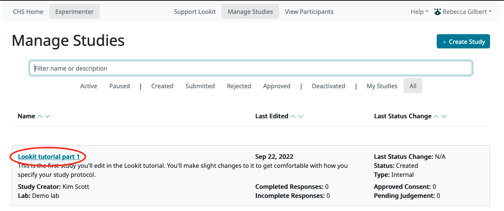
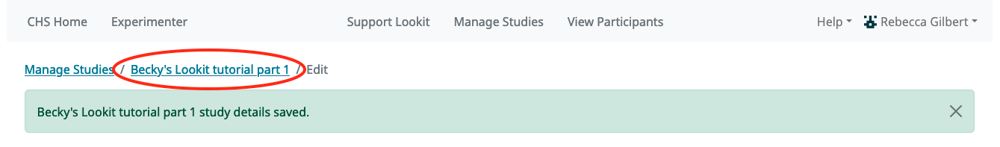
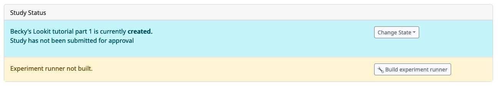

##################################
Setting up your first study
##################################

In this section, you will be creating your first study on Lookit. You will learn how to find and use experiment components, specify your protocol, and test out and troubleshoot your study. 

Step 1: Clone the 'Tutorial part 1' study
------------------------------------------

To get started, log in to the Lookit staging server as an experimenter. (Go to `<https://staging-lookit.cos.io/exp/>`_ to log in - bookmark this link if you haven't already.)

You should see a few studies you automatically have access to, including one called "Lookit tutorial part 1". Click on that to open up the study detail page:

You should see something like this:

.. image:: _static/img/tutorial/tutorial_study_detail.png
    :alt: Tutorial study detail page
    
At the top right, go to "Take Action" and click "Clone Study":

.. image:: _static/img/tutorial/tutorial_study_clone.png
    :alt: Clone study button on study detail page
    
You will be taken directly to the "clone" or "copy" of your study, which will be named something like "Lookit tutorial part 1 copy." You should see something like this:

.. image:: _static/img/tutorial/tutorial_cloned_study.png
    :alt: Initial view of cloned tutorial study
    
Click "edit study" in the top right (circled above) and you'll see the following:

.. image:: _static/img/tutorial/study_edit_view.png
    :alt: Study edit view

Each of these fields is described HERE. For now, we'll just change the name of the study and the thumbnail image that's displayed to participants. Rename your study to "[Your name]'s awesome tutorial study" and upload a different thumbnail image:

.. image:: _static/img/tutorial/study_edit_name.png
    :alt: Study edit view - changing name and image

Then click "Save Changes" down below:

.. image:: _static/img/tutorial/study_edit_save.png
    :alt: Study edit save button

After saving, click the name of your study to return to the study detail view:

You should see your changes reflected, like this:

.. image:: _static/img/tutorial/study_after_save.png
    :alt: Study detail view after changes

Congratulations! You've created and edited your first study.

Step 2: Preview your study (and learn a bit about JSON on the way)
-------------------------------------------------------------------

You may have noticed that below your thumbnail and basic study info, there's a section about the "status" of your study. This section is where you will submit your study for approval by Lookit staff when it's ready, and start and stop data collection. 

This section also shows whether your study "dependencies" are "built" yet. You should see a bar like this:

    
Click the "Build Preview Dependencies" button. You should see a notification at the top of the screen like this:

.. image:: _static/img/tutorial/scheduled_for_preview.png
    :alt: Scheduled for build notification

What are these "dependencies"? When you create a study on Lookit, you specify what types of pages or "frames" to use, and provide parameters for each - for example you supply the text for an instructions page, videos or images to show in a preferential looking trial, audio and images for a storybook page, and so on. The Lookit frame player interprets this information and turns it into an interactive study families can participate in. There's code behind the scenes, which you don't have to deal with, to handle that interpretation and to make each page "go" (saying what each button should do and what data to collect, arranging and starting/stopping video, etc.) Rather than all studies sharing that code, each study gets its own siloed little environment called a Docker image where it will run. 

When you click "Build dependencies" or "build preview dependencies," you are creating that Docker image (for your actual study or for previewing your study, respectively) and installing all the necessary code on it - the Lookit frameplayer and the other libraries it depends on. This way, as we continue expanding the Lookit frameplayer code, your study will continue to run exactly as you initially designed and tested it, unless you choose to update what code your study uses and build dependencies again - for instance to take advantage of a new feature or a bug fix. You also have the advanced option of telling Lookit to use your own code instead of the standard Lookit code - for instance if your work needs a very specialized type of test trial that you want to write your own frame for.

It will probably take about 10 minutes to build dependencies so you can preview your study (you can wait for the email or refresh the page to see if it's done yet). 

While you're waiting, go read :ref:`section on the JSON format<JSON Overview>`, which will be helpful for the next step. 

Exercises
~~~~~~~~~~~~

Here are several things that are almost, but not quite, valid JSON objects. Copy and paste each of them into `jsonlint <http://jsonlint.com/>`_, then fix the problem until you see a 
"valid JSON" message when you click "Validate."

1. 

.. code:: json

   {
       "species": "cat",
       "lives_left": 7
       "enemies": ["dog", "laser", "spider"]
   }
   
    

        
Click for hint

        
There's a comma missing!

    

   
2.

.. code:: json

   {
       "species": "human",
       "age_class": "toddler",
       "favorites": {
            "words": ["uh-oh," "doggie," "ball," "hi"],
            "foods": ["cumin seeds, but not in a food, only plain", "bananas, but only in the grocery store, not after"]
       }
   }
   
    

        
Click for hint

        
There are commas INSIDE the favorite words.

    

   
3. 

.. code:: json

   {
       "species": "human",
       "role": "parent",
       "mood": "loving",
       "mood": "exhausted"
   }
   
    

        
Click for hint

        
That may be accurate, but JSON would like the keys to be unique. Try making mood into a list, or change the second one to energy_level or something.

    

4. 

.. code:: json

   {
       "species": "human",
       "age_class"; 'child',
       "is_adorable": True
   }
   
    

        
Click for hint

        
There are several things to fix here - if you changed something and got a different error message, you're probably on the right track! Work down the list of requirements for JSON from the overview, and note that the "true" value is all lowercase.

    

OK, congrats on learning all about JSON! Your study should be ready to preview by now. You should have an email in your inbox from "lookit+staging" about this, and if you refresh the page you're on, you should see something like this:

.. image:: _static/img/tutorial/preview_built.png
    :alt: Preview built status display
    
Click on "Edit Study" at the top of the page, then scroll down and click the (newly not disabled) blue "See Preview" button:

.. image:: _static/img/tutorial/preview_button.png
    :alt: Preview button
    
Now you can proceed through the study as a participant. At the end, you'll see a pop-up box showing all the data (besides video) that would have been collected during your session, although because you're previewing, the video isn't actually stored. (Note: the video from previews DOES go to the Lookit server at the moment, although it isn't hooked up to the experimenter interface yet. We don't do anything with it, but it's in principle possible for a staff member here to end up seeing it while debugging something- so please wear clothes while testing, don't sit in front of your really cool poster of your social security number, etc.)

Step 3: Get comfortable making changes to how your study works
---------------------------------------------------------------

1. Reorder the sequence & preview again to see

2. Change text in the intro frame

3. Add another frame

4. Using developer tools in your browser: “Break” the sequence, put something there you haven’t defined - see the error message
        
        
Step 4: Learn to use this documentation
----------------------------------------

Intro/explanation that tutorial isn't everything (but docs are...); use search within docs; 
A few exercises (straightforward questions to answer by using docs) w/ click-to-reveal answers & screenshots
    
    
PART 2 - separate out

[Exercises - guided progress through creating a particular study]
    Substituting in different stimuli
    Making 6 test trial frames instead of 1
    Adding survey questions
    Adding an observation frame
    Counterbalancing/condition assignment
    Conditional dependence
    
Communicating with parents (instructions, debriefing, etc.)
    Too much text (instructions): pare it down or spread it out
    Debriefing (uninformative)
    Overview (too technical)
    Make this section a Google form and collect answers?
    
Updating the code used (try it out)

